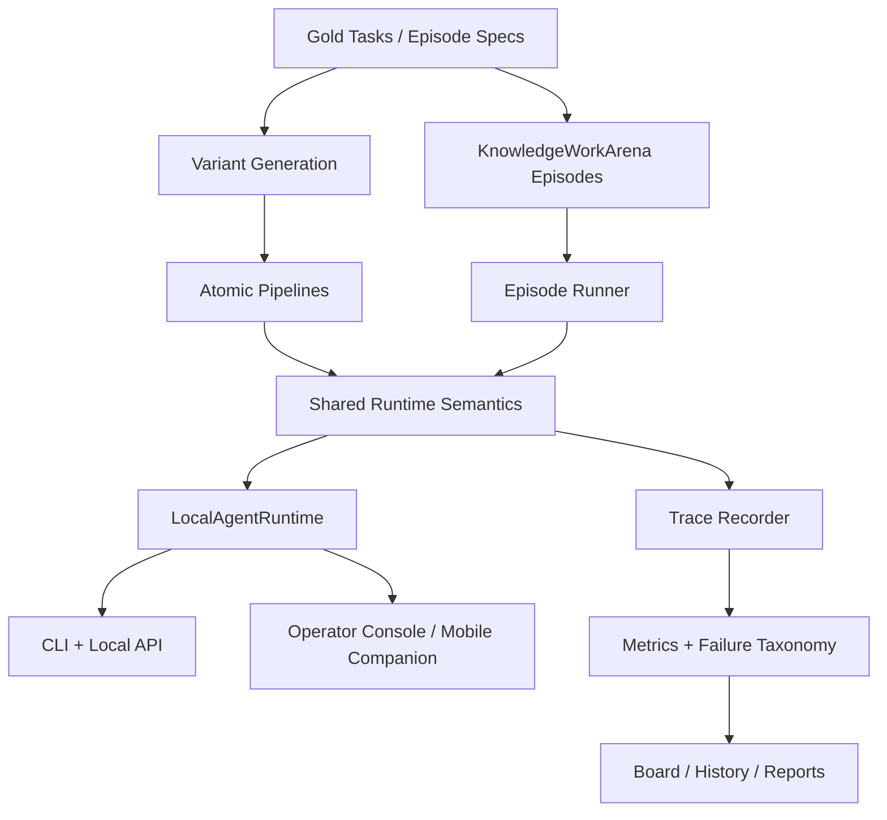
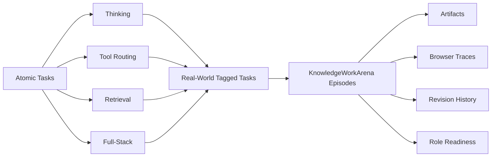
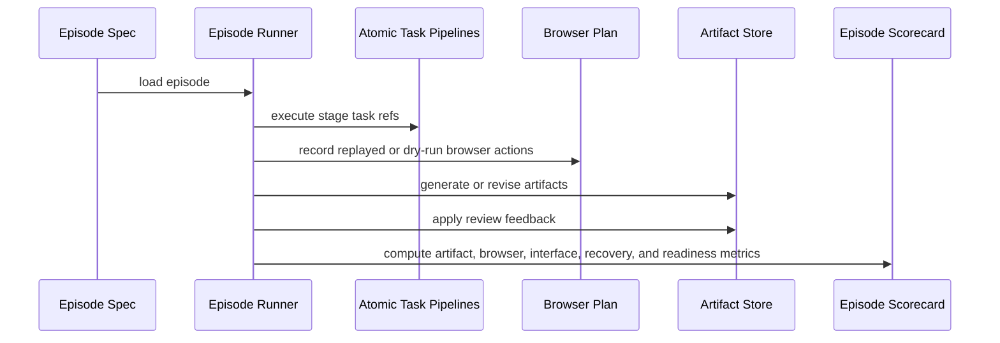

# gemma4-capability-map

`gemma4-capability-map` is a local-first benchmark and agent harness for Gemma-native systems.

The repo started as a white-box capability map for Gemma 4, FunctionGemma, and EmbeddingGemma across reasoning, tool use, retrieval, and efficiency drift. It has since grown into two tightly-linked products:

- a benchmark stack for measuring local full-stack agent behavior
- a local runtime and product harness for actually running those agent stacks on a laptop

The benchmark and the harness now share one substrate. That is deliberate. If a stack only looks strong inside a benchmark harness but falls apart inside a usable runtime, the benchmark is overstating reality. If the product feels good but cannot be measured cleanly, the product story is weak.

The repo is designed to answer two practical questions:

> When should an open local agent be one model, and when should it be a stack?

> What does it actually take to make Gemma usable as a real local agent rather than merely decent in chat?

## Why This Exists

Most open-model evaluation still stops at one of these layers:

- benchmark accuracy
- tool-call formatting
- retrieval quality
- browser automation
- polished task demos

This repo tries to connect them.

It measures:

- reasoning under language, stale-context, and efficiency drift
- tool routing under schema changes, validator feedback, and conflicting instructions
- retrieval under evidence ranking, long-context pressure, and answer-surface checks
- full-stack execution under deterministic task environments
- role-shaped knowledge work under artifacts, browser steps, approvals, revisions, and escalation constraints
- harnessability across `function_call`, CLI, and API tool families
- direction-following across tools, resumes, revisions, and contradictory instructions

The core idea is that **final success is not enough**. Moonie separates:

- `strict_interface`
  - did the system follow the task and tool contract cleanly?
- `recovered_execution`
  - did it still complete the work correctly after recoverable drift?
- `artifact_quality`
  - is the actual memo, form, deck, sheet, or packet good?
- `browser_workflow`
  - did it handle browser state and gatekeeping correctly?
- `real_world_readiness`
  - would a person actually accept the result?

The second core idea is that **runtime posture is part of capability research**. HF, HF-service, MLX, and `llama.cpp` are not deployment footnotes. They change measured local behavior.

## Current Status

The current repo state is:

- `91` gold atomic tasks
- `396` explicit factorized atomic variants
- `16` real-world-tagged atomic tasks
- `30` atomic `visual_tool_orchestration` tasks in the current gold corpus
- `32` replayable `KnowledgeWorkArena` episodes in the generated corpus
- `26` live `KnowledgeWorkArena` episodes in the generated corpus
- a shared local runtime with persistent sessions, approvals, artifacts, and event traces
- a local CLI and local HTTP API over that runtime
- experimental runtime-posture support for Gemma `31B` `GGUF` / `llama.cpp`
- benchmark-backed desktop and mobile shell surfaces over the same runtime contract

The current source-of-truth comparison surface is the aligned exploratory `32 / 26` matrix:

- [`results/history/knowledge_work_board_latest.csv`](results/history/knowledge_work_board_latest.csv)
- aligned batch:
  - [`results/knowledge_work_matrix/20260413Taligned_controller_burden_patch_v2_knowledge_work_alignment_32_26`](results/knowledge_work_matrix/20260413Taligned_controller_burden_patch_v2_knowledge_work_alignment_32_26)

Important distinction:

- the generated corpora are now `91 / 396 / 32 / 26`
- the board-backed aligned full-lane comparison now exists for:
  - `oracle_gemma4_e2b`
  - `hf_gemma4_e2b_specialists_cpu`
  - `mlx_qwen3_8b_reasoner_only`
  - `mlx_gemma4_e2b_reasoner_only`
- those four rows now run on the same aligned exploratory `32 / 26` surface
- the direct in-process Gemma reasoner-only control remains useful, but still sits on the older reproduced `26 / 20` surface
- the older canonical oracle lane pointers under `results/knowledge_work/replayable_core` and `results/knowledge_work/live_web_stress` are still valuable stable seeded references, but they are not the widest board-backed comparison surface anymore

Current canonical pointers:

- real-world autonomy matrix:
  - [`results/alpha_matrix/20260409T210500Z_alpha_real_world`](results/alpha_matrix/20260409T210500Z_alpha_real_world)
- canonical replayable KWA lane:
  - [`results/knowledge_work/replayable_core/summary.json`](results/knowledge_work/replayable_core/summary.json)
- canonical live KWA lane:
  - [`results/knowledge_work/live_web_stress/summary.json`](results/knowledge_work/live_web_stress/summary.json)
- canonical visual replayable lane:
  - [`results/visual_tool_orchestration/replayable_core/summary.json`](results/visual_tool_orchestration/replayable_core/summary.json)
- canonical visual live lane:
  - [`results/visual_tool_orchestration/live_web_stress/summary.json`](results/visual_tool_orchestration/live_web_stress/summary.json)
- board source of truth:
  - [`results/history/knowledge_work_board_latest.csv`](results/history/knowledge_work_board_latest.csv)
- external benchmark context:
  - [`results/history/knowledge_work_external_benchmarks.csv`](results/history/knowledge_work_external_benchmarks.csv)
- history exports:
  - [`results/history`](results/history)

Two current repo-wide claims are now defensible:

1. We materially improved Gemma 4 as a full-stack local agent on Moonie without changing model weights.
2. Top-line parity is not enough. Same readiness score can hide very different controller dependence.

## Local Agent Harness

The repo is no longer only a benchmark runner. It now has an explicit local product substrate:

- `LocalAgentRuntime`
  - persistent sessions
  - project/workflow identity
  - tool orchestration
  - approval hold/resume flow
  - event timelines
  - artifact and revision persistence
- `moonie-agent`
  - CLI for profiles, workflows, sessions, runs, approvals, and event inspection
- `moonie-agent-api`
  - local HTTP API for thin desktop and mobile clients
- Streamlit surfaces
  - `operator_console`
  - `mobile_companion`
  - benchmark board, episode explorer, and trace explorer views

The benchmark and product layers are intentionally coupled:

- benchmark-specific code owns tasks, replay, scoring, and corpora
- product surfaces own session launch, review, approval, and artifact inspection
- runtime changes are supposed to be validated against benchmark slices that exercise the same behavior

This matters for the current research questions. The repo is explicitly trying to measure the gap between:

- a model that is decent in chat
- a model that is usable as a real local agent with projects, tools, approvals, resumes, and artifacts

### Published External Benchmark Context

Moonie now carries a separate external benchmark context layer for published non-Moonie scores, for example:

- GPT-5.4 official rows from OpenAI
- Gemini 3.1 Pro official rows from Google DeepMind

This layer is intentionally separate from Moonie-reproduced runs.

- [`results/history/knowledge_work_board_latest.csv`](results/history/knowledge_work_board_latest.csv)
  - Moonie-reproduced runs on Moonie’s own harness
- [`results/history/knowledge_work_external_benchmarks.csv`](results/history/knowledge_work_external_benchmarks.csv)
  - published external scores from official sources

This distinction is part of the repo’s methodology:

- valid:
  - “we improved Gemma 4 materially on Moonie”
  - “our current Gemma rows can be contextualized against published frontier results elsewhere”
- not valid:
  - merging unrelated public scores into one fake same-harness leaderboard

Community posts and discourse now feed a separate hypothesis layer:

- [`configs/community_signals.yaml`](configs/community_signals.yaml)

They are useful inputs, not evidence.

### Packaged Workflow Families

The first product-facing workflow families are deliberately bounded and benchmark-backed:

- local file and document revision
- visual review and follow-up refinement
- browser and approval-gated work
- artifact generation across `.docx`, `.pptx`, and `.xlsx`

Current examples:

- `executive_stale_brief_packet`
- `executive_visual_dashboard_review`
- `jobs_visual_form_hold`
- `finance_billing_patch_hold`
- `finance_visual_invoice_review`

These are not claims of open-ended autonomy. They are controlled, inspectable local workflows that sit on top of the same runtime and scoring assumptions as the benchmark.

## Surface Design Direction

The repo now also has a deliberate product design direction rather than generic benchmark UI.

### One Design Family, Two Expressions

Desktop and mobile are supposed to feel like the same system, but not the same layout copied twice.

Desktop expression:

- dark
- terminal-native
- low-chrome
- split-pane
- operational and precise

Mobile expression:

- lighter
- calmer
- card-based
- touch-first
- companion-like

Shared identity:

- restrained visual language
- rounded geometry
- clear hierarchy
- quiet but polished motion
- strong status treatment
- delight through legibility, not decorative excess

### Desktop Priorities

The desktop shell is the main operator console in this phase.

- left rail for sessions, projects, filters, and recent work
- center pane for conversation and task execution
- right pane for traces, approvals, diffs, artifacts, and metrics
- keyboard-first interaction
- stable streaming
- clear blocked and approval states
- easy resumption after interruption

### Mobile Priorities

The iOS surface is a companion in this phase, not a full orchestration workstation.

- fast scan of active work
- approve / deny / respond flows
- artifact preview
- lightweight session continuation
- clear review and blocked states
- no attempt to cram dense trace analysis into a phone layout

## System Overview



### Architecture Families

- `monolith`
  - Gemma handles planning, routing, retrieval, and answer synthesis
- `hybrid`
  - EmbeddingGemma retrieves while Gemma plans and answers
- `modular`
  - EmbeddingGemma retrieves
  - FunctionGemma proposes tool calls
  - Gemma handles multi-step planning and synthesis
- `runtime-posture`
  - the same nominal stack is tested under different backends such as HF in-process, HF service, MLX, and eventually `llama.cpp`

### Benchmark Layers



## Research Questions

The repo is now organized around nine linked questions:

1. **How robust is Gemma 4 reasoning under drift?**
   Language drift, stale context, long histories, schema changes, and efficiency constraints.
2. **Where do interface failures show up before raw reasoning failures?**
   Wrong tool, wrong argument, stale referent, malformed retry, bad repair.
3. **When does a specialist stack beat a monolithic stack?**
   Modularity helps when the problem is interface discipline, not just hard answers.
4. **How much does local runtime posture change measured capability?**
   HF, HF-service, MLX, and `llama.cpp` are experiments, not plumbing details.
5. **Can a local agent orchestrate visual tools instead of just answering multimodal questions?**
   The repo tests tool choice, referent carryover, refinement, and final answer quality.
6. **What separates recovered completion from production-safe work?**
   `strict_interface` and `recovered_execution` are not the same thing.
7. **What separates a task-completing agent from a role-ready agent?**
   Artifacts, browser behavior, revisions, escalation judgment, memory retention, and human-time ratio.
8. **What makes a local model harnessable as an agent rather than merely usable as a chatbot?**
   Projects, resumes, approvals, instruction continuity, and workflow stability.
9. **What breaks first in direction-following and tool use, and which controller changes actually fix it?**
   Tool-family choice, argument fidelity, follow-on steps, stop behavior, and latest-instruction preservation.

## Benchmark Surface

### Atomic Tracks

| Track | What it tests | Typical failures |
| --- | --- | --- |
| `thinking` | text + screenshot reasoning, thinking on/off, context pressure | overflow, truncation, answer mismatch |
| `tool_routing` | tool choice, arguments, schema drift, validator retries | wrong tool, malformed call, bad retry |
| `retrieval` | evidence ranking, retrieve-vs-stuffing, long context | retrieval miss, answer-surface miss |
| `full_stack` | bounded multi-step execution in deterministic environments | interface miss, recovered completion, final-state mismatch |
| `visual_tool_orchestration` | iterative visual specialist use | stale referent, wrong refinement, wrong readback |

### Stress Axes

| Stressor | Examples |
| --- | --- |
| `language` | translation, code-switching, paraphrase |
| `schema` | renamed fields, enum traps, distractor tools |
| `context` | stale instructions, long history, irrelevant prior outputs |
| `efficiency` | smaller embeddings, context budgets, quantization-like pressure |
| `workflow` | approval holds, resume flows, revision loops |

### Real-World Metrics

The real-world layer adds job-shaped metadata and outcome checks such as:

- `state_integrity_score`
- `collateral_damage_free`
- `intervention_free_success`
- `real_world_readiness_score`
- `human_time_ratio`

### KnowledgeWorkArena Score Layers

KnowledgeWorkArena scorecards break episode quality into:

- `artifact_quality_score`
  - how good the actual deliverable is
- `browser_workflow_score`
  - how well the agent handled the browser state machine
- `strict_interface_score`
  - whether it obeyed the task and tool contract cleanly
- `recovered_execution_score`
  - whether it still got to the correct end state after recoverable drift
- `revision_responsiveness`
  - whether it obeyed later feedback rather than clinging to stale work
- `memory_retention_score`
  - whether it preserved critical earlier context correctly
- `escalation_correctness`
  - whether it clarified, deferred, escalated, or stopped correctly
- `role_readiness_score`
  - whether the overall work would actually be acceptable

Moonie also now exports planner-gap metrics:

- `controller_repair_avg`
  - average number of controller-level plan or argument repairs
- `controller_fallback_avg`
  - average number of times the harness had to replace the plan
- `argument_repair_avg`
  - average argument-only repair count
- `intent_override_avg`
  - average number of explicit priority/intention overrides
- `raw_planning_clean_rate_avg`
  - share of stages that did not need controller help

These metrics are central to the current Gemma story. Same readiness score does not mean same raw planning quality.

### Harnessability And Direction-Following

Moonie now carries explicit harnessability and direction-following cuts.

Harnessability covers:

- approval-hold and approval-resume correctness
- session continuity
- project memory carryover
- artifact revision continuity
- role-readiness under multi-turn work

Direction-following covers:

- latest-instruction preservation
- stale-instruction override
- contradictory instruction handling
- instruction retention across resume
- revision after feedback

### Tool-Use Taxonomy

Current first-class tool families:

- `function_call`
- `cli`
- `api`

Current intents tracked across tasks and traces:

- `inspect`
- `read`
- `write`
- `patch`
- `search`
- `execute`
- `approve`
- `revise`

The current broader research claim is not just “Gemma can call tools.” It is whether Gemma can:

- choose the right tool family
- form the right arguments
- keep the latest human instruction
- repair cleanly when near-miss errors happen
- stop safely instead of over-acting

## KnowledgeWorkArena

`KnowledgeWorkArena` is the repo’s role-shaped realism layer.

It is built for replayable, inspectable knowledge-work episodes with:

- stage goals
- seeded workspaces
- browser plans with validation and approval gates
- artifact generation
- revision rounds
- memory updates
- role-level scoring

### Role Families

- `executive_assistant`
- `job_application_ops`
- `finance`

### Lanes

- `replayable_core`
  - mirrored workspaces and deterministic side effects
  - scoreable and reproducible
  - where contract and repair analysis is strongest
- `live_web_stress`
  - current public-web browsing
  - sandbox or dry-run only
  - reported separately from canonical seeded claims

### Episode Flow



### Current Canonical KnowledgeWorkArena Results

The stable canonical oracle pointers still reflect the last full seeded rerun on the older `24 / 18` surface:

Replayable core:

- [`results/knowledge_work/replayable_core/summary.json`](results/knowledge_work/replayable_core/summary.json)
- `runs = 24`
- `artifact_quality_avg = 0.9866`
- `browser_workflow_avg = 0.9910`
- `strict_interface_avg = 1.0`
- `recovered_execution_avg = 1.0`
- `real_world_readiness_avg = 0.9510`
- `escalation_correctness_avg = 1.0`

Live-web stress:

- [`results/knowledge_work/live_web_stress/summary.json`](results/knowledge_work/live_web_stress/summary.json)
- `runs = 18`
- `artifact_quality_avg = 0.9822`
- `browser_workflow_avg = 1.0`
- `strict_interface_avg = 1.0`
- `recovered_execution_avg = 1.0`
- `real_world_readiness_avg = 0.9630`
- `escalation_correctness_avg = 1.0`

Why keep these older canonical pointers around?

- they are stable seeded references
- they remain useful for reproducible oracle sanity checks
- they separate “stable canonical seeded lane” from “widest current comparison surface”

The widest comparison surface is now the aligned exploratory `32 / 26` board-backed matrix described below.

### Visual Tool Orchestration

The repo also has a first-class multimodal-tool benchmark, `visual_tool_orchestration`.

It measures whether a controller can:

- choose the right visual tool
- preserve the latest `selection_id` or `region_id`
- refine rather than restart
- read back the right region
- land the correct final answer

Current canonical visual results:

- replayable:
  - [`results/visual_tool_orchestration/replayable_core/summary.json`](results/visual_tool_orchestration/replayable_core/summary.json)
  - `runs = 11`
  - `success_rate = 1.0`
  - `strict_interface_rate = 1.0`
  - `recovered_execution_rate = 1.0`
- live:
  - [`results/visual_tool_orchestration/live_web_stress/summary.json`](results/visual_tool_orchestration/live_web_stress/summary.json)
  - `runs = 7`
  - `success_rate = 1.0`
  - `strict_interface_rate = 1.0`
  - `recovered_execution_rate = 1.0`

This track is also wired into bounded KWA episodes, which is why visual follow-on repairs show up in the current controller-burden story.

### Current Local Comparison Surface

The current board-backed headline comparison is the aligned exploratory `32 / 26` surface:

- batch:
  - [`results/knowledge_work_matrix/20260413Taligned_controller_burden_patch_v2_knowledge_work_alignment_32_26`](results/knowledge_work_matrix/20260413Taligned_controller_burden_patch_v2_knowledge_work_alignment_32_26)
- board source of truth:
  - [`results/history/knowledge_work_board_latest.csv`](results/history/knowledge_work_board_latest.csv)

Current same-surface rows:

| System | Replayable readiness | Live readiness | Replayable controller repair | Replayable controller fallback | Replayable clean rate |
| --- | --- | --- | --- | --- | --- |
| `oracle_gemma4_e2b` | `0.976853125` | `0.9791653846153847` | `0.578125` | `0.0` | `0.8395875` |
| `hf_gemma4_e2b_specialists_cpu` | `0.976853125` | `0.9791653846153847` | `0.71875` | `0.28125` | `0.46875` |
| `mlx_qwen3_8b_reasoner_only` | `0.976853125` | `0.9791653846153847` | `0.0` | `0.0` | `1.0` |
| `mlx_gemma4_e2b_reasoner_only` | `0.976853125` | `0.9791653846153847` | `0.0` | `0.0` | `1.0` |

Plain-English interpretation:

- all four rows now land at the same top-line readiness tier on this aligned surface
- the HF Gemma specialist stack still needs materially more controller help to get there
- the MLX rows are currently planner-clean and controller-clean
- the interesting remaining difference is no longer top-line readiness
- it is how much harness help Gemma still needs under the HF specialist path after the old visual follow-on repair families were removed

The direct in-process Gemma control remains important, but it is still on the older reproduced `26 / 20` surface:

- replayable:
  - [`results/knowledge_work/model_backed_hf_inprocess_reasoner_full_replayable_v1/summary.json`](results/knowledge_work/model_backed_hf_inprocess_reasoner_full_replayable_v1/summary.json)
  - `strict_interface_avg = 0.9038461538461539`
  - `recovered_execution_avg = 0.8846153846153846`
  - `real_world_readiness_avg = 0.9392653846153846`
- live:
  - [`results/knowledge_work/model_backed_hf_inprocess_reasoner_full_live_v1/summary.json`](results/knowledge_work/model_backed_hf_inprocess_reasoner_full_live_v1/summary.json)
  - `strict_interface_avg = 0.875`
  - `recovered_execution_avg = 0.85`
  - `real_world_readiness_avg = 0.9347899999999999`

That older control row is still what makes the Gemma-improvement claim meaningful. The gains are not just relabeling.

### Honest Claim Boundary

The repo can now honestly claim:

- we improved Gemma 4 materially with controller, runtime, and specialist-stack work
- we made Gemma a better full-stack local agent on Moonie without changing model weights
- on the aligned exploratory `32 / 26` surface, oracle, HF Gemma specialists, MLX Qwen, and MLX Gemma all reach the same top-line replayable and live readiness tier
- same readiness score does **not** mean same raw planning quality
- HF Gemma specialists still rely on materially more controller repair and fallback than the clean MLX rows

The repo cannot honestly claim yet:

- that Gemma broadly beats Qwen families beyond the reproduced `Qwen3 8B MLX` row
- that Gemma beats frontier closed models on unrelated public benchmarks
- that the Gemma `31B` `GGUF` posture is already reproduced locally

The Gemma `31B` `GGUF` / `llama.cpp` path is implemented, but still blocked by missing local model availability:

- `GEMMA4_31B_GGUF_PATH` is unset
- there is no local Gemma `31B` `GGUF` artifact under `/Users/cheickdiakite/models`

## What We Have Learned So Far

Moonie now supports several nontrivial conclusions.

### 1. Interface failures show up before reasoning failures

Across the benchmark, the first real failures are often:

- wrong tool family
- wrong argument
- stale referent
- malformed retry
- bad repair

The repo repeatedly surfaced those before “the model cannot reason at all.”

### 2. Recovered execution and strict correctness are not the same thing

This is one of the core methodological lessons of the project.

- `strict_interface = 1.0`
  - the system followed the contract cleanly
- `recovered_execution = 1.0`
  - the system still got to the right end state

Those can diverge. Real deployments care about that divergence.

### 3. Top-line parity can hide controller dependence

This is the strongest current same-surface finding.

On the aligned `32 / 26` surface, HF Gemma specialists, MLX Qwen, MLX Gemma, and oracle all land at the same readiness tier.

But HF Gemma specialists do not get there the same way:

- replayable `controller_repair_avg`: `0.71875`
- replayable `controller_fallback_avg`: `0.28125`
- replayable `raw_planning_clean_rate_avg`: `0.46875`
- live `controller_repair_avg`: `0.8076923076923077`
- live `controller_fallback_avg`: `0.23076923076923078`

The clean MLX rows stay at:

- `controller_repair_avg = 0.0`
- `controller_fallback_avg = 0.0`
- `raw_planning_clean_rate_avg = 1.0`

That is real research signal, not benchmark noise.

### 4. Controller burden is reducible by controller design, not only by model change

The latest focused replayable ablation packet is the clearest example:

- packet:
  - [`results/knowledge_work_matrix/20260413Tresearch_ablation_focus_v4_knowledge_work_ablation_packet_knowledge_work_ablation_packet`](results/knowledge_work_matrix/20260413Tresearch_ablation_focus_v4_knowledge_work_ablation_packet_knowledge_work_ablation_packet)
- baseline readiness stayed flat at:
  - `0.9627777777777777`
- but planner/controller burden dropped materially

Packet-level helper ranking:

- baseline:
  - `0.9627777777777777`
- `no_controller_repair`:
  - `0.6551777777777779`
- `no_controller_fallback`:
  - `0.8182333333333333`
- `no_visual_rescue`:
  - `0.9627777777777777`

Plain English:

- repair is still doing essential work on this slice
- fallback is still doing essential work
- visual rescue is not what is carrying this packet

The most useful controller result from the latest packet rerun is this:

- `feedback_prior:refine_selection` dropped from `16` to `0`
- `feedback_prior:read_region_text` dropped from `10` to `0`
- packet readiness stayed unchanged
- baseline packet `controller_repair_avg` dropped from `2.3333333333333335` to `0.8888888888888888`
- `controller_fallback_planner` remained at `8`

That is the kind of change that actually counts as learning.

### 5. Runtime posture changes benchmark truth

HF, HF-service, MLX, and `llama.cpp` do not behave interchangeably on local Apple Silicon.

Moonie now shows three distinct things at once:

- HF Gemma specialists can reach strong readiness, but still lean on the controller
- MLX Qwen can stay planner-clean and controller-clean on the same surface
- MLX Gemma can now also stay planner-clean and controller-clean on that same surface

Runtime posture is not a deployment detail. It changes the measured system.

### 6. Some supposed model failures were really benchmark-contract failures

The repo already found and fixed several false-negative seams where the grading or follow-on contract was wrong, not the underlying behavior.

Examples include:

- grounded visual readback rescue
- ambiguity-aware clarify fallback on executive-assistant judgment tasks
- stricter visual count scoring so lucky prose does not mask a wrong tool trace

Benchmark engineering is part of capability research.

### 7. Tool use and direction following are still the real local-agent bottlenecks

The current pressure points are not generic “smartness.” They are:

- latest-instruction preservation
- clarify vs defer judgment
- follow-on visual refinement
- approval-safe stop behavior
- CLI/API tool-family choice

Moonie now measures those explicitly rather than hiding them inside vague pass/fail rows.

## Current Real-World Snapshot

The current canonical real-world autonomy snapshot is:

- [`results/alpha_matrix/20260409T210500Z_alpha_real_world`](results/alpha_matrix/20260409T210500Z_alpha_real_world)

Headline shape from that run:

| Experiment | Result | Plain-English read |
| --- | --- | --- |
| `hf_e2b_real_world_thinking_variants` | `0.0` success | escalation judgment is still weak |
| `hf_e2b_real_world_retrieval_variants` | `0.875` success | retrieval is strong; misses are mostly answer-surface issues |
| `hf_e2b_real_world_routing_variants` | `0.5` success | routing and refusal handling are still brittle |
| `hf_e2b_real_world_full_stack_variants` | `0.75` strict / `1.0` recovered | bounded execution can recover, but strict correctness still matters |

That is still a good summary of the repo’s real-world posture:

- bounded execution is ahead of true autonomy
- retrieval is ahead of escalation judgment
- recovered completion is ahead of strict operational trustworthiness

## Local Runtime Model

The benchmark supports multiple runtime backends because backend behavior materially affects local research loops.

### Backends

- `oracle`
  - deterministic scaffold and validation
- `heuristic`
  - lightweight local approximations for some specialist paths
- `hf`
  - direct in-process Hugging Face runtime
- `hf_service`
  - reusable service-backed HF reasoner process for repeated matrix runs
- `mlx`
  - Apple Silicon local path when MLX runtime health is good
- `llama_cpp`
  - experimental Gemma `31B` `GGUF` posture path

### Recommended Local Workflow

1. Run backend preflight:

```bash
uv run python scripts/preflight_backends.py
```

2. Validate the benchmark contract with deterministic or oracle-backed runs:

```bash
uv run python scripts/run_eval.py --pipeline monolith --backend oracle --limit 12
```

3. Probe local model backends directly:

```bash
uv sync --extra dev --extra hf --extra mlx
uv run python scripts/smoke_hf_backend.py --backend hf --model google/gemma-4-E2B-it --device mps --skip-image
```

4. Use `hf_service` for repeated HF matrix experiments:

```bash
uv run python scripts/hf_reasoner_service.py start --model google/gemma-4-E2B-it --device mps
uv run python scripts/run_alpha_matrix.py --config configs/alpha_real_world_matrix.yaml
```

5. Use explicit matrix configs for aligned or research runs:

```bash
uv run python scripts/run_knowledge_work_matrix.py --config configs/knowledge_work_matrix_alignment_32_26.yaml
uv run python scripts/run_knowledge_work_ablation_packet.py --lane replayable_core --bundle-system-id hf_gemma4_e2b_specialists_cpu
```

### Local Paths and Offline Mode

Optional credentials can live in `.env.local` or `.env`. The repo auto-loads those files on import and does not override values already exported in the shell.

```bash
cp .env.example .env.local
```

The runtime also supports explicit local model paths:

```bash
GEMMA4_E2B_PATH=/absolute/path/to/gemma-4-E2B-it
GEMMA4_E4B_PATH=/absolute/path/to/gemma-4-E4B-it
GEMMA4_31B_GGUF_PATH=/absolute/path/to/gemma-4-31b-it.gguf
FUNCTIONGEMMA_PATH=/absolute/path/to/functiongemma-270m-it
EMBEDDINGGEMMA_PATH=/absolute/path/to/embeddinggemma-300m
QWEN3_8B_PATH=/absolute/path/to/Qwen3-8B
QWEN3_8B_MLX_PATH=/absolute/path/to/Qwen3-8B-MLX-4bit
GEMMA4_OFFLINE=1
```

Additional model-root discovery is also supported through:

- `LOCAL_MODEL_ROOT`
- `MODEL_ROOT`
- `GEMMA_MODEL_ROOT`
- `GEMMA4_MODEL_ROOT`

Important current runtime fact:

- Gemma `31B` `GGUF` support exists in the registry and runtime
- there is still no reproduced local row because the actual local artifact is missing on this machine

## Quickstart

Create the environment:

```bash
uv sync --extra dev --extra hf --extra mlx
```

Generate the atomic benchmark data:

```bash
uv run python scripts/make_gold.py
uv run python scripts/make_variants.py
```

Generate the current KWA corpus:

```bash
uv run python scripts/make_knowledge_work_arena.py
```

Run a deterministic smoke:

```bash
uv run python scripts/run_eval.py --pipeline monolith --backend oracle --limit 12
```

Launch the Streamlit benchmark and product surfaces:

```bash
uv run streamlit run src/gemma4_capability_map/app/streamlit_app.py
```

Launch the local CLI:

```bash
uv run moonie-agent profiles
uv run moonie-agent workflows
uv run moonie-agent run --workflow-id executive_visual_dashboard_review --system-id oracle_gemma4_e2b
```

Launch the local API:

```bash
uv run moonie-agent-api --host 127.0.0.1 --port 8765
```

The Streamlit app now includes both benchmark and product surfaces. Use the `Surface` selector to switch between:

- `operator_console`
- `mobile_companion`
- `knowledge_work_board`
- `knowledge_work_episodes`
- `task_traces`

## Common Workflows

### Local agent harness

List profiles:

```bash
uv run moonie-agent profiles
```

List packaged workflows:

```bash
uv run moonie-agent workflows
```

Run a benchmark-backed workflow synchronously:

```bash
uv run moonie-agent run \
  --workflow-id executive_visual_dashboard_review \
  --system-id oracle_gemma4_e2b \
  --lane replayable_core
```

Run an approval-sensitive workflow in the background:

```bash
uv run moonie-agent run \
  --workflow-id finance_visual_invoice_review \
  --system-id hf_gemma4_e2b_specialists_cpu \
  --lane replayable_core \
  --background
```

Inspect or resolve sessions:

```bash
uv run moonie-agent sessions
uv run moonie-agent show <session_id>
uv run moonie-agent events <session_id>
uv run moonie-agent approve <session_id> --note "Looks good."
```

### Atomic benchmark

Run a drift matrix:

```bash
uv run python scripts/run_alpha_matrix.py --config configs/alpha_drift_matrix.yaml
```

Run the specialist-backed matrix:

```bash
uv run python scripts/run_alpha_matrix.py --config configs/alpha_specialist_matrix.yaml
```

Run the real-world autonomy matrix:

```bash
uv run python scripts/run_alpha_matrix.py --config configs/alpha_real_world_matrix.yaml
```

Refresh atomic benchmark history:

```bash
uv run python scripts/build_history_report.py
```

### KnowledgeWorkArena

Generate seeded episodes:

```bash
uv run python scripts/make_knowledge_work_arena.py
```

Run canonical replayable oracle:

```bash
uv run python scripts/run_knowledge_work_arena.py --lane replayable_core --backend oracle
```

Run canonical live oracle:

```bash
uv run python scripts/run_knowledge_work_arena.py --lane live_web_stress --backend oracle
```

Run the current aligned comparison surface:

```bash
uv run python scripts/run_knowledge_work_matrix.py --config configs/knowledge_work_matrix_alignment_32_26.yaml
```

Run the focused replayable ablation packet:

```bash
uv run python scripts/run_knowledge_work_ablation_packet.py \
  --lane replayable_core \
  --bundle-system-id hf_gemma4_e2b_specialists_cpu \
  --system-id hf_gemma4_e2b_specialists_cpu \
  --system-id hf_gemma4_e2b_specialists_cpu_no_controller_repair \
  --system-id hf_gemma4_e2b_specialists_cpu_no_controller_fallback \
  --system-id hf_gemma4_e2b_specialists_cpu_no_visual_rescue
```

Refresh KWA history:

```bash
uv run python scripts/build_knowledge_work_history.py
```

## Repository Layout

```text
configs/                              matrix and runtime configs
configs/packaged_workflows.yaml
configs/community_signals.yaml
data/gold/                           atomic benchmark tasks
data/knowledge_work/                 episode specs, workspace seeds, artifact goldens
docs/                                methodology, design docs, continuity, research notes
results/alpha_matrix/                atomic benchmark run groups
results/knowledge_work/              canonical KnowledgeWorkArena outputs
results/knowledge_work_matrix/       exploratory and aligned matrix batches
results/history/                     longitudinal reports, board exports, canonical pointers
results/runtime/                     local runtime sessions, traces, approvals, artifacts
scripts/                             generators, runners, probes, report builders
src/gemma4_capability_map/api/       local API
src/gemma4_capability_map/runtime/   local runtime substrate
src/gemma4_capability_map/app/       Streamlit surfaces
src/gemma4_capability_map/           benchmark runtime, metrics, pipelines, UI
tests/                               regression and schema coverage
```

## Reporting and History

Useful methodology and state entrypoints:

- methodology:
  - [`docs/methodology.md`](docs/methodology.md)
- KnowledgeWorkArena design:
  - [`docs/knowledge-work-arena.md`](docs/knowledge-work-arena.md)
- continuity root:
  - [`docs/continuity/README.md`](docs/continuity/README.md)
- current benchmark state:
  - [`docs/continuity/current-state.md`](docs/continuity/current-state.md)
- next-step queue:
  - [`docs/continuity/next-steps.md`](docs/continuity/next-steps.md)
- session handoff:
  - [`docs/continuity/session-handoff.md`](docs/continuity/session-handoff.md)
- research log:
  - [`docs/research-log.md`](docs/research-log.md)

Useful benchmark exports:

- atomic benchmark history:
  - [`results/history/history_report.md`](results/history/history_report.md)
- KWA history:
  - [`results/history/knowledge_work_history.md`](results/history/knowledge_work_history.md)
- board source of truth:
  - [`results/history/knowledge_work_board_latest.csv`](results/history/knowledge_work_board_latest.csv)
- external benchmark context:
  - [`results/history/knowledge_work_external_benchmarks.csv`](results/history/knowledge_work_external_benchmarks.csv)

Useful runtime and product entrypoints:

- packaged workflows:
  - [`configs/packaged_workflows.yaml`](configs/packaged_workflows.yaml)
- runtime core:
  - [`src/gemma4_capability_map/runtime/core.py`](src/gemma4_capability_map/runtime/core.py)
- CLI:
  - [`src/gemma4_capability_map/runtime/cli.py`](src/gemma4_capability_map/runtime/cli.py)
- local API:
  - [`src/gemma4_capability_map/api/app.py`](src/gemma4_capability_map/api/app.py)
- Streamlit router:
  - [`src/gemma4_capability_map/app/streamlit_app.py`](src/gemma4_capability_map/app/streamlit_app.py)

## Roadmap

### Near term

- reduce HF Gemma specialist controller dependence further without losing the current aligned readiness tier
- target the dominant remaining note families:
  - `controller_fallback_planner`
  - `repaired_arguments:extract_layout`
  - `intent_prior:record_or_update`
  - `intent_prior:inspect_or_lookup`
- keep hardening tool-family choice and direction-following seams
- keep product surfaces benchmark-backed and aligned with runtime semantics
- install the local Gemma `31B` `GGUF` artifact and run the first real `llama.cpp` posture row

### Medium term

- add a specialist-backed MLX Gemma row if the current MLX posture remains attractive
- widen non-Gemma local comparator coverage beyond the current `Qwen3 8B MLX` row
- deepen artifact graders from strong structural checks into richer layout and field validation
- keep pushing harder realism where current rows are now clean
- grow the board into a more publishable public-facing reporting surface

### Long term

- make `KnowledgeWorkArena` the main role-readiness layer for local agent research
- publish tighter architecture and runtime-posture comparisons on the same benchmark surface
- extend the runtime and product harness into a more complete local work platform
- test whether local open stacks can sustain revision-heavy, memory-bearing, approval-aware work over longer horizons

## Limitations

- large-model local performance is hardware-sensitive
- live-web stress remains secondary to replayable-core for claims that require reproducibility
- current artifact grading is much stronger than naive string matching, but it is still not a full native Office or browser runtime
- some canonical snapshots are runtime-specific to this Apple Silicon setup
- the desktop and mobile shells are still thin alpha product surfaces over the laptop runtime
- packaged workflows are bounded benchmark-backed flows, not claims of unbounded autonomy
- the current reproduced non-Gemma comparator coverage is still narrow
- the current MLX Gemma row is reasoner-only, not yet a specialist-backed MLX stack
- the Gemma `31B` `GGUF` posture path is implemented but still blocked by missing local artifact availability

## References

- [Gemma 4 launch](https://blog.google/innovation-and-ai/technology/developers-tools/gemma-4/)
- [Thinking mode](https://ai.google.dev/gemma/docs/capabilities/thinking)
- [Function calling](https://ai.google.dev/gemma/docs/capabilities/function-calling)
- [FunctionGemma](https://ai.google.dev/gemma/docs/functiongemma)
- [EmbeddingGemma](https://ai.google.dev/gemma/docs/embeddinggemma)
- [TurboQuant](https://research.google/blog/turboquant-redefining-ai-efficiency-with-extreme-compression/)
