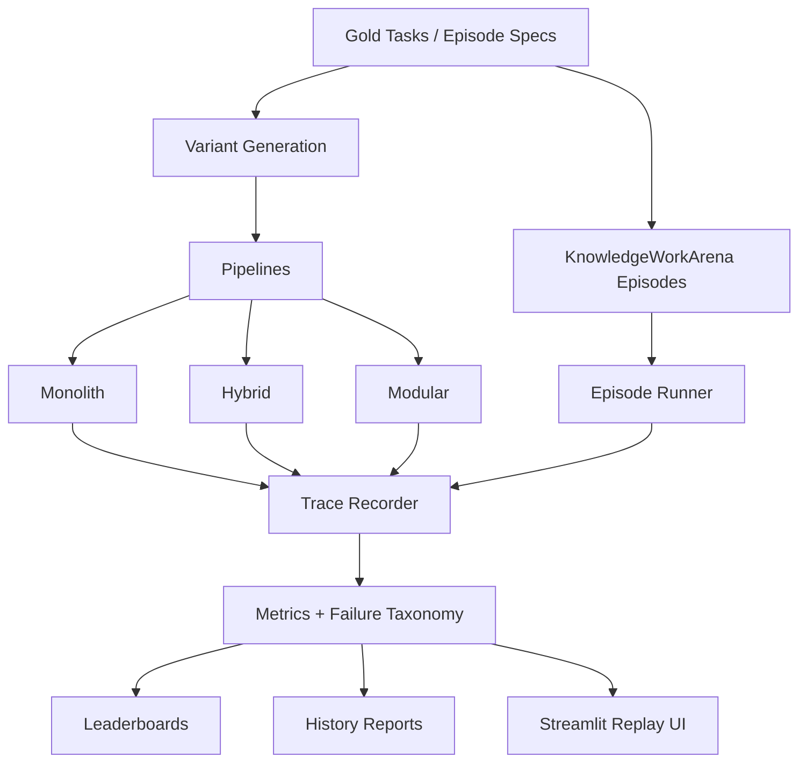
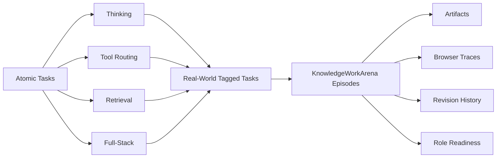
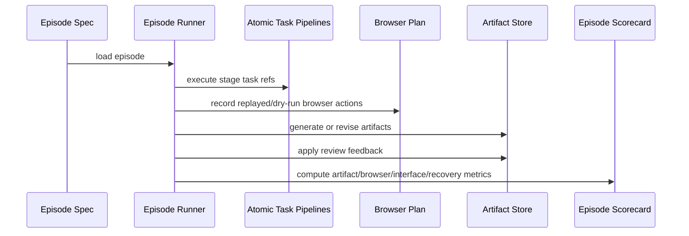

# gemma4-capability-map

`gemma4-capability-map` is a local-first, white-box benchmark for Gemma-native agent systems.

It started as an architecture benchmark for reasoning, tool use, retrieval, and efficiency drift across Gemma 4, FunctionGemma, and EmbeddingGemma. It now also includes **KnowledgeWorkArena**, a role-based benchmark layer for job-shaped autonomy episodes such as executive assistant workflows, job-application operations, and finance work.

The repo is designed to answer a practical question:

> When should an open agent be one model, and when should it be a stack?

And a harder one:

> Can a local agent actually do bounded human knowledge work, or does it only look competent in demos?

## Why This Exists

Most open-model evaluations stop at one of these layers:

- benchmark accuracy
- tool-call formatting
- retrieval quality
- browser automation
- polished task demos

This repo tries to connect them.

It measures:

- reasoning under language, context, and efficiency drift
- tool routing under schema changes and validator feedback
- retrieval under evidence ranking and long-context pressure
- full-stack execution under deterministic task environments
- role-shaped work under artifact, browser, revision, and escalation constraints

The core idea is that **final success is not enough**. The benchmark separates:

- strict interface correctness
- recovered execution
- artifact quality
- browser workflow quality
- real-world readiness

## Current Status

This repository currently includes:

- `52` gold atomic tasks
- `232` explicit factorized variants
- `16` real-world-tagged tasks
- `15` `KnowledgeWorkArena` replayable-core episodes
- `9` `KnowledgeWorkArena` live-web stress episodes
- deterministic tool environments for files, calendar, repo, screenshot, and document tasks
- seeded browser state transitions with validation rules, blocked submissions, and approval gates
- native-ish artifact grading for formulas, slide sections, revision diffs, and application-packet consistency
- adapter-ready runtimes for Gemma 4, FunctionGemma, EmbeddingGemma, HF service mode, and MLX

Current canonical snapshots:

- real-world autonomy matrix: [`results/alpha_matrix/20260409T210500Z_alpha_real_world`](results/alpha_matrix/20260409T210500Z_alpha_real_world)
- KnowledgeWorkArena replayable core: [`results/knowledge_work/replayable_core/summary.json`](results/knowledge_work/replayable_core/summary.json)
- KnowledgeWorkArena live-web stress: [`results/knowledge_work/live_web_stress/summary.json`](results/knowledge_work/live_web_stress/summary.json)
- benchmark history: [`results/history`](results/history)

## System Overview



### Architecture Families

- `monolith`
  - Gemma 4 plans, routes, retrieves, and answers
- `hybrid`
  - EmbeddingGemma retrieves; Gemma 4 plans, routes, and answers
- `modular`
  - EmbeddingGemma retrieves; FunctionGemma proposes single-step or parallel tool calls; Gemma 4 handles multi-step planning and final synthesis

### Benchmark Layers



## Research Questions

The repo is organized around five research questions:

1. How robust is Gemma 4 reasoning under drift?
2. Where do interface failures appear before raw reasoning failures?
3. When does a modular stack beat a monolithic stack?
4. How much does local runtime posture affect measured capability?
5. What separates a task-completing agent from a role-ready agent?

## Benchmark Surface

### Atomic Tracks

| Track | What it tests | Typical failures |
| --- | --- | --- |
| `thinking` | text + screenshot reasoning, thinking on/off | overflow, truncation, answer mismatch, multimodal miss |
| `tool_routing` | tool choice, argument correctness, schema drift, retries | wrong tool, arg mismatch, malformed call |
| `retrieval` | evidence ranking, retrieve-vs-stuffing, long context | retrieval miss, answer-language miss, citation miss |
| `full_stack` | bounded multi-step execution in deterministic envs | interface miss, recovered completion, final-state mismatch |

### Stress Axes

| Stressor | Examples |
| --- | --- |
| `language` | French translation, code-switching, paraphrase |
| `schema` | renamed fields, enum traps, distractor tools |
| `context` | stale instructions, long history, irrelevant prior outputs |
| `efficiency` | smaller embeddings, context budgets, quantization-like pressure |

### Real-World Metrics

The real-world layer adds task metadata and job-shaped scoring, including:

- `state_integrity_score`
- `collateral_damage_free`
- `intervention_free_success`
- `real_world_readiness_score`
- `human_time_ratio`

### KnowledgeWorkArena Score Layers

KnowledgeWorkArena adds a separate episode abstraction with its own scorecard:

- `artifact_quality_score`
- `browser_workflow_score`
- `strict_interface_score`
- `recovered_execution_score`
- `revision_responsiveness`
- `memory_retention_score`
- `escalation_correctness`
- `collateral_damage_free`
- `human_time_ratio`
- `role_readiness_score`

This is deliberate. The benchmark treats:

- “the agent got to the right end state”
- “the agent used tools correctly”
- “the work product is actually good”

as different claims.

## KnowledgeWorkArena

`KnowledgeWorkArena` is the repo’s role-based realism layer.

It is built for replayable, inspectable knowledge-work episodes with:

- stage goals
- seeded workspaces
- browser plans with validation and approval-gate state
- artifact generation
- revision rounds
- memory updates
- role-level scoring

### Role Families

- `executive_assistant`
- `job_application_ops`
- `finance`

### Lanes

- `replayable_core`
  - canonical lane
  - mirrored browser/workspace state
  - deterministic side effects
  - scoreable and reproducible
- `live_web_stress`
  - secondary realism lane
  - current public-web browsing
  - sandbox or dry-run only
  - reported separately from canonical claims

### Episode Flow



### Current Canonical KnowledgeWorkArena Results

Replayable core:

- [`results/knowledge_work/20260410T021825Z_replayable_core/summary.json`](results/knowledge_work/20260410T021825Z_replayable_core/summary.json)
- `artifact_quality_avg = 1.0`
- `browser_workflow_avg = 0.9955`
- `strict_interface_avg = 1.0`
- `recovered_execution_avg = 1.0`
- `real_world_readiness_avg = 0.9320`

Live-web stress:

- [`results/knowledge_work/20260410T021845Z_live_web_stress/summary.json`](results/knowledge_work/20260410T021845Z_live_web_stress/summary.json)
- `artifact_quality_avg = 1.0`
- `browser_workflow_avg = 1.0`
- `strict_interface_avg = 1.0`
- `recovered_execution_avg = 1.0`
- `real_world_readiness_avg = 0.9794`

The readiness difference is intentional. Replayable-core includes bounded operational drag like human-time ratio and escalation-aware work products, while live-web stress now also includes partial-progress hold episodes where the correct move is to stop at an approval gate rather than complete the workflow.

### First Model-Backed KnowledgeWorkArena Evidence

The first finished non-oracle `KnowledgeWorkArena` run on this machine is the executive hold pilot:

- [`results/knowledge_work/model_backed_hf_exec_hold/summary.json`](results/knowledge_work/model_backed_hf_exec_hold/summary.json)
- backend: `hf_service` reasoner on `google/gemma-4-E2B-it` with stable heuristic router/retriever support
- `artifact_quality_avg = 1.0`
- `browser_workflow_avg = 0.9836`
- `strict_interface_avg = 1.0`
- `recovered_execution_avg = 1.0`
- `real_world_readiness_avg = 0.9056`

There is also a stopped multi-episode artifact pilot at [`results/knowledge_work/model_backed_hf_reasoner_pilot/summary.json`](results/knowledge_work/model_backed_hf_reasoner_pilot/summary.json). It completed two real-file episodes cleanly before being interrupted to isolate a finished single-episode baseline:

- `kwa_jobs_tailored_packet`
- `kwa_finance_three_statement_model`
- partial average `real_world_readiness_avg = 0.9074`

The cold-start cost is currently material on this Apple Silicon machine. In the finished executive pilot, the `hf_service` reasoner spent about `345s` reaching ready state before episode execution began.

## What We Have Learned So Far

The repo already supports some nontrivial conclusions.

### 1. Interface failures show up before reasoning failures

The benchmark repeatedly surfaced schema drift, validator retries, truncation, and answer-surface mismatches before it surfaced “the model cannot reason at all.”

### 2. Retrieval and recovered execution can look strong while strict correctness remains weak

This mattered enough that the benchmark now always separates:

- strict interface correctness
- recovered execution
- real-world readiness

### 3. Thinking mode is not automatically a win

On this machine and benchmark slice, thinking-on often cost meaningful latency and sometimes hurt image-heavy slices through overflow or truncation. The benchmark treats “more thought tokens” as a measurable tradeoff, not a default upgrade.

### 4. Specialist stacks help most on interface-heavy surfaces

Real EmbeddingGemma retrieval stayed strong under drift. Real FunctionGemma routing became materially stronger only after schema-aware repair and intent priors were added. The lesson is that modularity helps when the failure mode is interface ambiguity, not just when the answer is hard.

### 5. Runtime posture changes benchmark truth

HF, HF service mode, and MLX do not behave interchangeably on local Apple Silicon. Cold import cost, service warmup, and backend health are part of the measured system, not incidental plumbing.

### 6. Domain-native grading matters

The benchmark got stronger when artifacts stopped being graded as generic blobs and started being graded as schedules, forms, decks, memos, and models.

That now includes:

- spreadsheet and model formula checks
- deck section structure and revision-diff checks
- application-packet field consistency checks
- browser validation and approval-gate transitions

## Current Real-World Snapshot

The current canonical real-world autonomy snapshot is:

- [`results/alpha_matrix/20260409T210500Z_alpha_real_world`](results/alpha_matrix/20260409T210500Z_alpha_real_world)

Headline results from that run:

| Experiment | Success | Key read |
| --- | --- | --- |
| `hf_e2b_real_world_thinking_variants` | `0.0` | escalation judgment is still weak |
| `hf_e2b_real_world_retrieval_variants` | `0.875` | retrieval strong; misses are mostly answer-surface issues |
| `hf_e2b_real_world_routing_variants` | `0.5` | billing/refusal routing remains a hard case |
| `hf_e2b_real_world_full_stack_variants` | `0.75` strict / `1.0` recovered | bounded execution can recover, but strict correctness still matters |

This is the shape of the repo’s research claim right now:

- bounded execution is ahead of true autonomy
- retrieval is ahead of escalation judgment
- recovered completion is ahead of strict operational trustworthiness

## Local Runtime Model

The benchmark supports multiple runtime backends because backend behavior materially affects local research loops.

### Backends

- `oracle`
  - deterministic scaffold/backend validation
- `heuristic`
  - lightweight local approximations for some specialist paths
- `hf`
  - direct Hugging Face runtime
- `hf_service`
  - reusable service-backed HF reasoner process for matrix runs
- `mlx`
  - Apple Silicon-focused local path when healthy

### Recommended Local Workflow

1. Run backend preflight:

```bash
uv run python scripts/preflight_backends.py
```

2. Use deterministic or oracle-backed runs to validate the benchmark itself:

```bash
uv run python scripts/run_eval.py --pipeline monolith --backend oracle --limit 12
```

3. Use `hf` or `mlx` for local model probes:

```bash
uv sync --extra dev --extra hf
uv run python scripts/smoke_hf_backend.py --backend hf --model google/gemma-4-E2B-it --device mps --skip-image
```

4. Use `hf_service` for repeated HF matrix experiments:

```bash
uv run python scripts/hf_reasoner_service.py start --model google/gemma-4-E2B-it --device mps
uv run python scripts/run_alpha_matrix.py --config configs/alpha_real_world_matrix.yaml
```

### Local Paths and Offline Mode

Optional local credentials can live in `.env.local` or `.env`. The repo auto-loads those files on import and does not override values already exported in your shell.

```bash
cp .env.example .env.local
```

You can also point the runtime at local model directories:

```bash
GEMMA4_E2B_PATH=/absolute/path/to/gemma-4-E2B-it
GEMMA4_E4B_PATH=/absolute/path/to/gemma-4-E4B-it
FUNCTIONGEMMA_PATH=/absolute/path/to/functiongemma-270m-it
EMBEDDINGGEMMA_PATH=/absolute/path/to/embeddinggemma-300m
GEMMA4_OFFLINE=1
```

## Quickstart

Create the environment:

```bash
uv sync --extra dev
```

Generate the atomic benchmark data:

```bash
uv run python scripts/make_gold.py
uv run python scripts/make_variants.py
```

Run a deterministic smoke:

```bash
uv run python scripts/run_eval.py --pipeline monolith --backend oracle --limit 12
```

Launch the replay UI:

```bash
uv run streamlit run src/gemma4_capability_map/app/streamlit_app.py
```

## Common Workflows

### Atomic benchmark

Run a targeted drift matrix:

```bash
uv run python scripts/run_alpha_matrix.py --config configs/alpha_drift_matrix.yaml
```

Run the specialist-backed matrix:

```bash
uv run python scripts/run_alpha_matrix.py --config configs/alpha_specialist_matrix.yaml
```

Run the real-world autonomy matrix:

```bash
uv run python scripts/run_alpha_matrix.py --config configs/alpha_real_world_matrix.yaml
```

Refresh benchmark history:

```bash
uv run python scripts/build_history_report.py
```

### KnowledgeWorkArena

Generate seeded episodes and fixtures:

```bash
uv run python scripts/make_knowledge_work_arena.py
```

Run replayable-core:

```bash
uv run python scripts/run_knowledge_work_arena.py --lane replayable_core --backend oracle
```

Run live-web stress:

```bash
uv run python scripts/run_knowledge_work_arena.py --lane live_web_stress --backend oracle
```

Refresh KnowledgeWorkArena history:

```bash
uv run python scripts/build_knowledge_work_history.py
```

Run a model-backed replayable-core pilot without replacing the canonical lane pointer:

```bash
uv run python scripts/run_knowledge_work_arena.py \
  --lane replayable_core \
  --backend hf_service \
  --router-backend heuristic \
  --retriever-backend heuristic \
  --reasoner google/gemma-4-E2B-it \
  --reasoner-device mps \
  --reasoner-max-new-tokens 96 \
  --episode-id kwa_exec_board_send_hold \
  --limit 1 \
  --output-dir results/knowledge_work/model_backed_hf_exec_hold \
  --no-update-latest
```

## Repository Layout

```text
configs/                     matrix and runtime configs
data/gold/                  atomic benchmark tasks
data/knowledge_work/        episode specs, workspace seeds, artifact goldens
docs/                       methodology, research notes, design docs
results/alpha_matrix/       benchmark run groups
results/knowledge_work/     canonical KnowledgeWorkArena outputs
results/history/            longitudinal reports and canonical pointers
scripts/                    generators, runners, probes, report builders
src/gemma4_capability_map/  benchmark runtime, metrics, pipelines, UI
tests/                      regression and schema coverage
```

## Reporting and History

This repo is designed to preserve research context, not just scores.

Useful reporting entrypoints:

- benchmark methodology: [`docs/methodology.md`](docs/methodology.md)
- KnowledgeWorkArena design: [`docs/knowledge-work-arena.md`](docs/knowledge-work-arena.md)
- continuity entrypoint: [`AGENT_CONTEXT.md`](AGENT_CONTEXT.md)
- continuity system: [`docs/continuity/README.md`](docs/continuity/README.md)
- current benchmark state: [`docs/continuity/current-state.md`](docs/continuity/current-state.md)
- curated key learnings: [`docs/continuity/key-learnings.md`](docs/continuity/key-learnings.md)
- next-step queue: [`docs/continuity/next-steps.md`](docs/continuity/next-steps.md)
- session handoff: [`docs/continuity/session-handoff.md`](docs/continuity/session-handoff.md)
- real-world autonomy notes: [`docs/real-world-benchmarking.md`](docs/real-world-benchmarking.md)
- research log: [`docs/research-log.md`](docs/research-log.md)
- benchmark history: [`results/history/history_report.md`](results/history/history_report.md)
- KnowledgeWorkArena history: [`results/history/knowledge_work_history.md`](results/history/knowledge_work_history.md)

## Roadmap

### Near term

- harden escalation / defer / refuse judgment
- push billing/refusal routing harder under real specialist backends
- expand multilingual answer-surface robustness
- deepen browser realism with validation-heavy dry-run flows and approval-blocked send paths

### Medium term

- move more artifact graders from markdown structure to native-ish domain checks
- expand KnowledgeWorkArena episodes across more job families
- strengthen replayable browser environments for application portals, spreadsheets, and slide workflows
- grow the real-world corpus beyond the current `16` tagged tasks

### Long term

- make KnowledgeWorkArena the primary role-readiness benchmark layer
- publish side-by-side architecture comparisons on task, role, and runtime axes
- add more live-web stress scenarios without sacrificing replayable-core rigor
- test whether local open stacks can sustain revision-heavy, memory-bearing, approval-aware work over longer horizons

## Limitations

- large-model local performance is hardware-sensitive
- live-web stress is deliberately secondary to replayable-core
- current artifact grading is much stronger than generic string matching, but still not a full native Office/browser runtime
- some canonical snapshots are runtime-specific to this Apple Silicon development setup

## References

- [Gemma 4 launch](https://blog.google/innovation-and-ai/technology/developers-tools/gemma-4/)
- [Thinking mode](https://ai.google.dev/gemma/docs/capabilities/thinking)
- [Function calling](https://ai.google.dev/gemma/docs/capabilities/function-calling)
- [FunctionGemma](https://ai.google.dev/gemma/docs/functiongemma)
- [EmbeddingGemma](https://ai.google.dev/gemma/docs/embeddinggemma)
- [TurboQuant](https://research.google/blog/turboquant-redefining-ai-efficiency-with-extreme-compression/)
