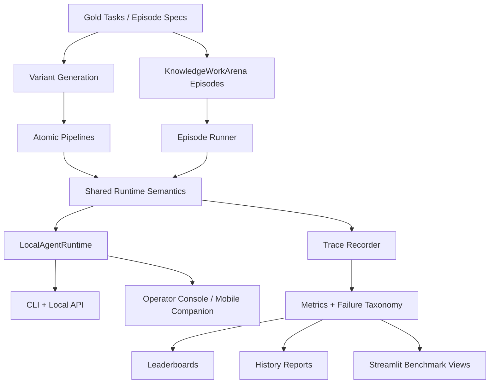
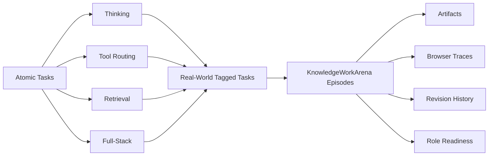
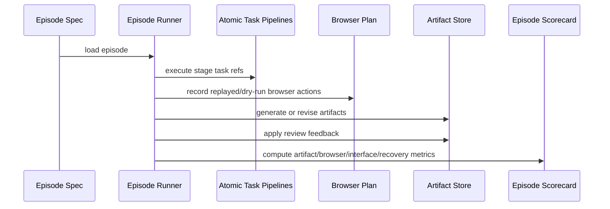

# gemma4-capability-map

`gemma4-capability-map` is a local-first benchmark and agent harness for Gemma-native systems.
It now also tracks harnessability and direction-following across `function_call`, CLI, and API tool families.

It started as an architecture benchmark for reasoning, tool use, retrieval, and efficiency drift across Gemma 4, FunctionGemma, and EmbeddingGemma. It now also includes **KnowledgeWorkArena**, a role-based benchmark layer for job-shaped autonomy episodes such as executive assistant workflows, job-application operations, and finance work.

The repo is designed to answer a practical question:

> When should an open agent be one model, and when should it be a stack?

And a harder one:

> Can a local agent actually do bounded human knowledge work, or does it only look competent in demos?

## Why This Exists

Most open-model evaluations stop at one of these layers:

- benchmark accuracy
- tool-call formatting
- retrieval quality
- browser automation
- polished task demos

This repo tries to connect them.

It measures:

- reasoning under language, context, and efficiency drift
- tool routing under schema changes and validator feedback
- retrieval under evidence ranking and long-context pressure
- full-stack execution under deterministic task environments
- role-shaped work under artifact, browser, revision, and escalation constraints

The core idea is that **final success is not enough**. The benchmark separates:

- strict interface correctness
- recovered execution
- artifact quality
- browser workflow quality
- real-world readiness

## Current Status

This repository currently includes:

- `84` gold atomic tasks
- `341` explicit factorized variants
- `16` real-world-tagged tasks
- `26` atomic `visual_tool_orchestration` tasks in the current gold corpus
- `29` `KnowledgeWorkArena` replayable-core episodes in the current generated corpus
- `23` `KnowledgeWorkArena` live-web stress episodes in the current generated corpus
- deterministic tool environments for files, calendar, repo, screenshot, and document tasks
- seeded browser state transitions with validation rules, blocked submissions, and approval gates
- seeded and local visual executor paths behind the same tool contract
- native-ish artifact grading for formulas, slide sections, revision diffs, and application-packet consistency
- adapter-ready runtimes for Gemma 4, FunctionGemma, EmbeddingGemma, HF service mode, and MLX
- a shared local agent runtime with persistent sessions, approval states, trace exports, and packaged workflows
- a first-class local CLI plus local HTTP API for launching and reviewing benchmark-backed workflows
- experimental runtime-posture support for Gemma 4 `31B` `GGUF` / `llama.cpp`
- transitional operator-console and mobile-companion Streamlit surfaces built on the same runtime contract

Current canonical snapshots:

- real-world autonomy matrix: [`results/alpha_matrix/20260409T210500Z_alpha_real_world`](results/alpha_matrix/20260409T210500Z_alpha_real_world)
- KnowledgeWorkArena replayable core: [`results/knowledge_work/replayable_core/summary.json`](results/knowledge_work/replayable_core/summary.json)
- KnowledgeWorkArena live-web stress: [`results/knowledge_work/live_web_stress/summary.json`](results/knowledge_work/live_web_stress/summary.json)
- visual tool orchestration replayable core: [`results/visual_tool_orchestration/replayable_core/summary.json`](results/visual_tool_orchestration/replayable_core/summary.json)
- visual tool orchestration live-web stress: [`results/visual_tool_orchestration/live_web_stress/summary.json`](results/visual_tool_orchestration/live_web_stress/summary.json)
- local comparison board: [`results/history/knowledge_work_board_latest.csv`](results/history/knowledge_work_board_latest.csv)
- published external benchmark context: [`results/history/knowledge_work_external_benchmarks.csv`](results/history/knowledge_work_external_benchmarks.csv)
- benchmark history: [`results/history`](results/history)

Important distinction:

- the generated corpora are now `84 / 341 / 29 / 23`
- the board-backed widened comparison surface now exists for:
  - `oracle_gemma4_e2b`
  - `hf_gemma4_e2b_specialists_cpu`
  - `mlx_qwen3_8b_reasoner_only`
- those rows now run on the widened `29 / 23` full-lane surface
- the direct Gemma reasoner-only control still sits on the earlier reproduced `26 / 20` surface
- the older canonical oracle lane pointers under `results/knowledge_work/replayable_core` and `results/knowledge_work/live_web_stress` still reflect the last full oracle rerun on the earlier `24 / 18` surface
- use [`results/history/knowledge_work_board_latest.csv`](results/history/knowledge_work_board_latest.csv) as the current source of truth for board-level comparison claims

## Local Agent Harness

The repo is no longer just a benchmark harness. It now has an explicit product substrate:

- `LocalAgentRuntime`
  - shared session model, tool orchestration, approval flow, trace persistence, and packaged workflow execution
- `moonie-agent`
  - CLI for profiles, workflows, sessions, runs, approvals, and event inspection
- `moonie-agent-api`
  - local HTTP API for thin desktop and mobile clients
- Streamlit surfaces
  - `operator_console`
  - `mobile_companion`
  - benchmark board / episode / trace explorer modes

The product and benchmark are meant to share one substrate:

- benchmark-specific code owns tasks, replay, scoring, and corpora
- product surfaces own session launch, review, approval, and artifact inspection
- runtime changes should be validated against the same benchmark slices that exercise them

### Published External Benchmark Context

The board now carries a separate external benchmark context layer for published non-Moonie scores, for example:

- GPT-5.4 official benchmark rows from OpenAI
- Gemini 3.1 Pro official benchmark rows from Google DeepMind

This layer is intentionally separate from Moonie-reproduced runs.

- `results/history/knowledge_work_board_latest.csv`
  - Moonie-reproduced runs on our own harness
- `results/history/knowledge_work_external_benchmarks.csv`
  - published external scores from official sources

This distinction matters. It is valid to say:

- we improved Gemma 4 materially on Moonie’s native benchmark
- our current Gemma harness can be contextualized against published frontier results on public benchmarks

It is not valid to merge those into one same-harness leaderboard unless Moonie has actually reproduced the external benchmark locally.

Community signals can shape the next experiment plan, but they stay hypotheses until Moonie reproduces them locally.

### Packaged Workflow Families

The first product-facing workflows are deliberately benchmark-backed and bounded:

- local file and document revision
- visual review and follow-up refinement
- browser and approval-gated work
- artifact generation across `.docx`, `.pptx`, and `.xlsx`

Current packaged workflow examples:

- `executive_stale_brief_packet`
- `executive_visual_dashboard_review`
- `jobs_visual_form_hold`
- `finance_billing_patch_hold`
- `finance_visual_invoice_review`

These are not meant to pretend the system already has open-ended general autonomy. The current product layer is a controlled harness over benchmark-proven workflows with inspectable traces, explicit approvals, and reproducible outputs.

## Surface Design Direction

The repo now also has an explicit UI/UX direction for the product surfaces.

### One Design Family, Two Expressions

Desktop and mobile should feel like the same system, but not the same layout copied twice.

Desktop expression:

- dark
- terminal-native
- low-chrome
- split-pane
- operational and precise

Mobile expression:

- lighter
- calmer
- card-based
- touch-first
- companion-like and elegant

Shared identity:

- restrained visual language
- rounded geometry
- strong hierarchy
- clear status treatment
- smooth but quiet motion
- delight through polish and legibility, not decorative excess

### Desktop Priorities

The desktop shell is the main operator console for this phase.

- left rail for sessions, projects, and filters
- center pane for conversation and task execution
- right pane for traces, diffs, approvals, artifacts, and metrics
- keyboard-first interaction
- stable streaming and easy resumption
- excellent diff and trace readability

### Mobile Priorities

The iOS surface is a companion, not a full orchestration workstation in this phase.

- quick scan of active work
- fast approve / deny / respond flows
- result and artifact preview
- lightweight session continuation
- no attempt to cram full desktop trace analysis onto a phone

## System Overview



### Architecture Families

- `monolith`
  - Gemma 4 plans, routes, retrieves, and answers
- `hybrid`
  - EmbeddingGemma retrieves; Gemma 4 plans, routes, and answers
- `modular`
  - EmbeddingGemma retrieves; FunctionGemma proposes single-step or parallel tool calls; Gemma 4 handles multi-step planning and final synthesis

### Benchmark Layers



## Research Questions

The repo is now organized around nine linked research questions:

1. **How robust is Gemma 4 reasoning under drift?**
   We test language drift, stale context, long-history pressure, schema changes, and efficiency constraints to see where reasoning quality actually degrades.
2. **Where do interface failures appear before raw reasoning failures?**
   A central claim of the repo is that many agent failures are contract failures first: wrong tool, wrong argument, stale referent, malformed retry, or bad repair.
3. **When does a specialist stack beat a monolithic stack?**
   We compare Gemma-only systems against stacks that add FunctionGemma, EmbeddingGemma, and visual executors, then measure where modularity helps and where it adds coordination risk.
4. **How much does local runtime posture change measured capability?**
   The same nominal model can behave differently under `hf_service`, direct in-process HF, device placement, and other local runtime choices. The benchmark treats runtime posture as part of the experiment, not a deployment footnote.
5. **Can a local agent orchestrate visual tools, not just answer multimodal questions?**
   The `visual_tool_orchestration` track measures whether the agent can choose a visual tool, preserve referents across turns, refine selections, and land the correct final answer under replayable and live conditions.
6. **What separates recovered task completion from production-safe work?**
   The benchmark explicitly separates `strict_interface` from `recovered_execution` to answer whether the agent succeeds cleanly or only gets there after repairs that would matter in a real deployment.
7. **What separates a task-completing agent from a role-ready agent?**
   `KnowledgeWorkArena` pushes beyond completion into artifact quality, browser behavior, revision responsiveness, escalation judgment, memory retention, and human-time ratio, so the question becomes: can the system do the work in a way a human role would actually accept?
8. **How does the same stack behave when it is exposed through different tool families?**
   The harnessability wave is about whether `function_call`, CLI, and API surfaces preserve direction-following, tool selection, and recovery discipline when the same capability stack is packaged differently.
9. **Which outside signals are evidence, and which are only hypotheses?**
   Community reports, vendor announcements, and published benchmark tables are useful input, but in this repo they stay hypotheses until reproduced locally.

## Benchmark Surface

### Atomic Tracks

| Track | What it tests | Typical failures |
| --- | --- | --- |
| `thinking` | text + screenshot reasoning, thinking on/off | overflow, truncation, answer mismatch, multimodal miss |
| `tool_routing` | tool choice, argument correctness, schema drift, retries | wrong tool, arg mismatch, malformed call |
| `retrieval` | evidence ranking, retrieve-vs-stuffing, long context | retrieval miss, answer-language miss, citation miss |
| `full_stack` | bounded multi-step execution in deterministic envs | interface miss, recovered completion, final-state mismatch |

### Stress Axes

| Stressor | Examples |
| --- | --- |
| `language` | French translation, code-switching, paraphrase |
| `schema` | renamed fields, enum traps, distractor tools |
| `context` | stale instructions, long history, irrelevant prior outputs |
| `efficiency` | smaller embeddings, context budgets, quantization-like pressure |

### Real-World Metrics

The real-world layer adds task metadata and job-shaped scoring, including:

- `state_integrity_score`
- `collateral_damage_free`
- `intervention_free_success`
- `real_world_readiness_score`
- `human_time_ratio`

### KnowledgeWorkArena Score Layers

KnowledgeWorkArena adds a separate episode abstraction with its own scorecard:

- `artifact_quality_score`
- `browser_workflow_score`
- `strict_interface_score`
- `recovered_execution_score`
- `revision_responsiveness`
- `memory_retention_score`
- `escalation_correctness`
- `collateral_damage_free`
- `human_time_ratio`
- `role_readiness_score`

This is deliberate. The benchmark treats:

- “the agent got to the right end state”
- “the agent used tools correctly”
- “the work product is actually good”

as different claims.

## KnowledgeWorkArena

`KnowledgeWorkArena` is the repo’s role-based realism layer.

It is built for replayable, inspectable knowledge-work episodes with:

- stage goals
- seeded workspaces
- browser plans with validation and approval-gate state
- artifact generation
- revision rounds
- memory updates
- role-level scoring

### Role Families

- `executive_assistant`
- `job_application_ops`
- `finance`

### Lanes

- `replayable_core`
  - canonical lane
  - mirrored browser/workspace state
  - deterministic side effects
  - scoreable and reproducible
- `live_web_stress`
  - secondary realism lane
  - current public-web browsing
  - sandbox or dry-run only
  - reported separately from canonical claims

### Episode Flow



### Current Canonical KnowledgeWorkArena Results

Replayable core:

- [`results/knowledge_work/replayable_core/summary.json`](results/knowledge_work/replayable_core/summary.json)
- `runs = 24`
- `artifact_quality_avg = 0.9866`
- `browser_workflow_avg = 0.9910`
- `strict_interface_avg = 1.0`
- `recovered_execution_avg = 1.0`
- `real_world_readiness_avg = 0.9510`
- `escalation_correctness_avg = 1.0`

Live-web stress:

- [`results/knowledge_work/live_web_stress/summary.json`](results/knowledge_work/live_web_stress/summary.json)
- `runs = 18`
- `artifact_quality_avg = 0.9822`
- `browser_workflow_avg = 1.0`
- `strict_interface_avg = 1.0`
- `recovered_execution_avg = 1.0`
- `real_world_readiness_avg = 0.9630`
- `escalation_correctness_avg = 1.0`

The readiness difference is intentional. Replayable-core includes bounded operational drag like human-time ratio and escalation-aware work products, while live-web stress now also includes partial-progress hold episodes where the correct move is to stop at an approval gate rather than complete the workflow.

### Visual Tool Orchestration

The repo now also includes an atomic multimodal-tool benchmark, `visual_tool_orchestration`, for local scene understanding with iterative specialist calls.

It tests whether a controller can:

- choose the right visual tool
- keep the latest `selection_id` or `region_id` across follow-up turns
- refine a selection instead of restarting extraction
- answer with the right filtered count, region, or text

Current canonical visual results:

- replayable:
  - [`results/visual_tool_orchestration/replayable_core/summary.json`](results/visual_tool_orchestration/replayable_core/summary.json)
  - `runs = 11`
  - `success_rate = 1.0`
  - `strict_interface_rate = 1.0`
  - `recovered_execution_rate = 1.0`
- live:
  - [`results/visual_tool_orchestration/live_web_stress/summary.json`](results/visual_tool_orchestration/live_web_stress/summary.json)
  - `runs = 7`
  - `success_rate = 1.0`
  - `strict_interface_rate = 1.0`
  - `recovered_execution_rate = 1.0`

This track is also wired into bounded KWA episodes, so visual referent carryover and policy-sensitive revision now show up inside job-shaped work rather than only in atomic tasks.

### Current Local Comparison Surface

The current board-backed comparison surface is now widened and mostly aligned:

- oracle, the headline Gemma specialist stack, and the first reproduced Qwen row all now exist on the same widened `29 / 23` full-lane surface
- the direct Gemma reasoner-only control is still useful, but it remains on the older `26 / 20` reproduced surface
- that means the strongest current claim is now a real widened local comparison across oracle, Gemma specialist, and Qwen on the same surface

The board source of truth is still [`results/history/knowledge_work_board_latest.csv`](results/history/knowledge_work_board_latest.csv).

The current local control is direct in-process Gemma 4 reasoner-only:

- replayable:
  - [`results/knowledge_work/model_backed_hf_inprocess_reasoner_full_replayable_v1/summary.json`](results/knowledge_work/model_backed_hf_inprocess_reasoner_full_replayable_v1/summary.json)
  - `runs = 26`
  - `strict_interface_avg = 0.9038461538461539`
  - `recovered_execution_avg = 0.8846153846153846`
  - `real_world_readiness_avg = 0.9392653846153846`
- live:
  - [`results/knowledge_work/model_backed_hf_inprocess_reasoner_full_live_v1/summary.json`](results/knowledge_work/model_backed_hf_inprocess_reasoner_full_live_v1/summary.json)
  - `runs = 20`
  - `strict_interface_avg = 0.875`
  - `recovered_execution_avg = 0.85`
  - `real_world_readiness_avg = 0.9347899999999999`

The current headline local Gemma stack is direct in-process Gemma 4 plus real specialists:

- replayable:
  - [`results/knowledge_work_matrix/20260412T190500Z_knowledge_work_full_lane_harnessability_core/hf_gemma4_e2b_specialists_cpu__replayable_core/summary.json`](results/knowledge_work_matrix/20260412T190500Z_knowledge_work_full_lane_harnessability_core/hf_gemma4_e2b_specialists_cpu__replayable_core/summary.json)
  - `runs = 29`
  - `artifact_quality_avg = 0.9689793103448276`
  - `strict_interface_avg = 1.0`
  - `recovered_execution_avg = 1.0`
  - `real_world_readiness_avg = 0.9774`
- live:
  - [`results/knowledge_work_matrix/20260412T221500Z_knowledge_work_publishable_core/hf_gemma4_e2b_specialists_cpu__live_web_stress/summary.json`](results/knowledge_work_matrix/20260412T221500Z_knowledge_work_publishable_core/hf_gemma4_e2b_specialists_cpu__live_web_stress/summary.json)
  - `runs = 23`
  - `artifact_quality_avg = 0.9633043478260869`
  - `strict_interface_avg = 1.0`
  - `recovered_execution_avg = 1.0`
  - `real_world_readiness_avg = 0.9798`

The widened oracle reference is now also in place:

- replayable:
  - [`results/knowledge_work_matrix/20260412T202500Z_knowledge_work_publishable_core/oracle_gemma4_e2b__replayable_core/summary.json`](results/knowledge_work_matrix/20260412T202500Z_knowledge_work_publishable_core/oracle_gemma4_e2b__replayable_core/summary.json)
  - `runs = 29`
  - `artifact_quality_avg = 0.9689793103448276`
  - `strict_interface_avg = 1.0`
  - `recovered_execution_avg = 1.0`
  - `real_world_readiness_avg = 0.9774`
- live:
  - [`results/knowledge_work_matrix/20260412T221500Z_knowledge_work_publishable_core/oracle_gemma4_e2b__live_web_stress/summary.json`](results/knowledge_work_matrix/20260412T221500Z_knowledge_work_publishable_core/oracle_gemma4_e2b__live_web_stress/summary.json)
  - `runs = 23`
  - `artifact_quality_avg = 0.9633043478260869`
  - `strict_interface_avg = 1.0`
  - `recovered_execution_avg = 1.0`
  - `real_world_readiness_avg = 0.9798`

The first real reproduced non-Gemma local comparator is now Qwen3 8B on the Apple-Silicon-native MLX path:

- replayable:
  - [`results/knowledge_work_matrix/20260412T213721Z_knowledge_work_full_lane_experimental/mlx_qwen3_8b_reasoner_only__replayable_core/summary.json`](results/knowledge_work_matrix/20260412T213721Z_knowledge_work_full_lane_experimental/mlx_qwen3_8b_reasoner_only__replayable_core/summary.json)
  - `runs = 29`
  - `artifact_quality_avg = 0.9689793103448276`
  - `strict_interface_avg = 1.0`
  - `recovered_execution_avg = 1.0`
  - `real_world_readiness_avg = 0.9774`
- live:
  - [`results/knowledge_work_matrix/20260412T213438Z_knowledge_work_full_lane_experimental/mlx_qwen3_8b_reasoner_only__live_web_stress/summary.json`](results/knowledge_work_matrix/20260412T213438Z_knowledge_work_full_lane_experimental/mlx_qwen3_8b_reasoner_only__live_web_stress/summary.json)
  - `runs = 23`
  - `artifact_quality_avg = 0.9633043478260869`
  - `strict_interface_avg = 1.0`
  - `recovered_execution_avg = 1.0`
  - `real_world_readiness_avg = 0.9798`

The experimental Gemma 4 `31B` `GGUF` / `llama.cpp` runtime-posture path is implemented, but it has not been reproduced locally yet because no local model or runtime is installed on this machine.

That is the current benchmark-quality result:

- we made Gemma 4 materially better as a local full-stack agent on our own harder benchmark surface
- the reasoner-only Gemma control remains materially weaker, so the gain is not trivial
- the headline local Gemma specialist row is now strict/recovered clean on the widened `29 / 23` full-lane surface
- the widened oracle row is also strict/recovered clean on that same surface
- the first same-surface reproduced Qwen row now exists on that same widened surface
- the reproduced Qwen MLX row now also matches oracle and the Gemma specialist stack on that same widened surface after the visual latest-filter/runtime fallback fixes

### Honest Claim Boundary

The repo can now honestly claim:

- we improved Gemma 4 materially with our own controller/runtime/specialist-stack learnings
- we made it a better full-stack local agent on our own benchmark
- we have a publishable local Gemma-improvement result on a harder widened `KnowledgeWorkArena` surface
- on the same local widened `29 / 23` board surface, Gemma 4 plus specialists and the reproduced local Qwen3 8B MLX row now both match the current oracle row
- the first reproduced Qwen row beats the direct in-process Gemma reasoner-only control on strict-interface, recovered-execution, and readiness metrics

The repo cannot honestly claim yet:

- that Gemma 4 beats Qwen 3.5 broadly, because the reproduced non-Gemma evidence currently covers `Qwen3 8B MLX` only
- that Gemma 4 beats frontier closed models on unrelated public benchmarks just because we now show external benchmark context rows

The next honest comparator step is no longer “close the Qwen gap” on this surface. It is to make the benchmark harder again, widen non-Gemma coverage beyond this single Qwen row, and add the experimental Gemma `31B` runtime-posture row.

## What We Have Learned So Far

The repo already supports some nontrivial conclusions.

### 1. Interface failures show up before reasoning failures

The benchmark repeatedly surfaced schema drift, validator retries, truncation, and answer-surface mismatches before it surfaced “the model cannot reason at all.”

### 2. Retrieval and recovered execution can look strong while strict correctness remains weak

This mattered enough that the benchmark now always separates:

- strict interface correctness
- recovered execution
- real-world readiness

### 3. Thinking mode is not automatically a win

On this machine and benchmark slice, thinking-on often cost meaningful latency and sometimes hurt image-heavy slices through overflow or truncation. The benchmark treats “more thought tokens” as a measurable tradeoff, not a default upgrade.

### 4. Specialist stacks help most on interface-heavy surfaces

Real EmbeddingGemma retrieval stayed strong under drift. Real FunctionGemma routing became materially stronger only after schema-aware repair and intent priors were added. The lesson is that modularity helps when the failure mode is interface ambiguity, not just when the answer is hard.

### 5. Runtime posture changes benchmark truth

HF, HF service mode, and MLX do not behave interchangeably on local Apple Silicon. Cold import cost, service warmup, and backend health are part of the measured system, not incidental plumbing.

### 6. Domain-native grading matters

The benchmark got stronger when artifacts stopped being graded as generic blobs and started being graded as schedules, forms, decks, memos, and models.

That now includes:

- spreadsheet and model formula checks
- deck section structure and revision-diff checks
- application-packet field consistency checks
- browser validation and approval-gate transitions
- visual referent carryover and stale-selection recovery

## Current Real-World Snapshot

The current canonical real-world autonomy snapshot is:

- [`results/alpha_matrix/20260409T210500Z_alpha_real_world`](results/alpha_matrix/20260409T210500Z_alpha_real_world)

Headline results from that run:

| Experiment | Success | Key read |
| --- | --- | --- |
| `hf_e2b_real_world_thinking_variants` | `0.0` | escalation judgment is still weak |
| `hf_e2b_real_world_retrieval_variants` | `0.875` | retrieval strong; misses are mostly answer-surface issues |
| `hf_e2b_real_world_routing_variants` | `0.5` | billing/refusal routing remains a hard case |
| `hf_e2b_real_world_full_stack_variants` | `0.75` strict / `1.0` recovered | bounded execution can recover, but strict correctness still matters |

This is the shape of the repo’s research claim right now:

- bounded execution is ahead of true autonomy
- retrieval is ahead of escalation judgment
- recovered completion is ahead of strict operational trustworthiness

## Local Runtime Model

The benchmark supports multiple runtime backends because backend behavior materially affects local research loops.

### Backends

- `oracle`
  - deterministic scaffold/backend validation
- `heuristic`
  - lightweight local approximations for some specialist paths
- `hf`
  - direct Hugging Face runtime
- `hf_service`
  - reusable service-backed HF reasoner process for matrix runs
- `mlx`
  - Apple Silicon-focused local path when healthy

### Recommended Local Workflow

1. Run backend preflight:

```bash
uv run python scripts/preflight_backends.py
```

2. Use deterministic or oracle-backed runs to validate the benchmark itself:

```bash
uv run python scripts/run_eval.py --pipeline monolith --backend oracle --limit 12
```

3. Use `hf` or `mlx` for local model probes:

```bash
uv sync --extra dev --extra hf
uv run python scripts/smoke_hf_backend.py --backend hf --model google/gemma-4-E2B-it --device mps --skip-image
```

4. Use `hf_service` for repeated HF matrix experiments:

```bash
uv run python scripts/hf_reasoner_service.py start --model google/gemma-4-E2B-it --device mps
uv run python scripts/run_alpha_matrix.py --config configs/alpha_real_world_matrix.yaml
```

### Local Paths and Offline Mode

Optional local credentials can live in `.env.local` or `.env`. The repo auto-loads those files on import and does not override values already exported in your shell.

```bash
cp .env.example .env.local
```

You can also point the runtime at local model directories:

```bash
GEMMA4_E2B_PATH=/absolute/path/to/gemma-4-E2B-it
GEMMA4_E4B_PATH=/absolute/path/to/gemma-4-E4B-it
FUNCTIONGEMMA_PATH=/absolute/path/to/functiongemma-270m-it
EMBEDDINGGEMMA_PATH=/absolute/path/to/embeddinggemma-300m
GEMMA4_OFFLINE=1
```

## Quickstart

Create the environment:

```bash
uv sync --extra dev
```

Generate the atomic benchmark data:

```bash
uv run python scripts/make_gold.py
uv run python scripts/make_variants.py
```

Run a deterministic smoke:

```bash
uv run python scripts/run_eval.py --pipeline monolith --backend oracle --limit 12
```

Launch the Streamlit console and benchmark UI:

```bash
uv run streamlit run src/gemma4_capability_map/app/streamlit_app.py
```

Launch the local agent CLI:

```bash
uv run moonie-agent profiles
uv run moonie-agent workflows
uv run moonie-agent run --workflow-id executive_visual_dashboard_review --system-id oracle_gemma4_e2b
```

Launch the local agent API:

```bash
uv run moonie-agent-api --host 127.0.0.1 --port 8765
```

The Streamlit app now includes product-style surfaces as well as benchmark explorers. Use the `Surface` selector to switch between:

- `operator_console`
- `mobile_companion`
- `knowledge_work_board`
- `knowledge_work_episodes`
- `task_traces`

## Common Workflows

### Local agent harness

List local runtime profiles:

```bash
uv run moonie-agent profiles
```

List packaged workflows:

```bash
uv run moonie-agent workflows
```

Run a review-free workflow synchronously:

```bash
uv run moonie-agent run \
  --workflow-id executive_visual_dashboard_review \
  --system-id oracle_gemma4_e2b \
  --lane replayable_core
```

Run an approval-sensitive workflow in the background:

```bash
uv run moonie-agent run \
  --workflow-id finance_visual_invoice_review \
  --system-id hf_service_gemma4_specialists_cpu \
  --lane replayable_core \
  --background
```

Inspect and resolve sessions:

```bash
uv run moonie-agent sessions
uv run moonie-agent show <session_id>
uv run moonie-agent events <session_id>
uv run moonie-agent approve <session_id> --note "Looks good."
```

### Atomic benchmark

Run a targeted drift matrix:

```bash
uv run python scripts/run_alpha_matrix.py --config configs/alpha_drift_matrix.yaml
```

Run the specialist-backed matrix:

```bash
uv run python scripts/run_alpha_matrix.py --config configs/alpha_specialist_matrix.yaml
```

Run the real-world autonomy matrix:

```bash
uv run python scripts/run_alpha_matrix.py --config configs/alpha_real_world_matrix.yaml
```

Refresh benchmark history:

```bash
uv run python scripts/build_history_report.py
```

### KnowledgeWorkArena

Generate seeded episodes and fixtures:

```bash
uv run python scripts/make_knowledge_work_arena.py
```

Run replayable-core:

```bash
uv run python scripts/run_knowledge_work_arena.py --lane replayable_core --backend oracle
```

Run live-web stress:

```bash
uv run python scripts/run_knowledge_work_arena.py --lane live_web_stress --backend oracle
```

Refresh KnowledgeWorkArena history:

```bash
uv run python scripts/build_knowledge_work_history.py
```

Run a model-backed replayable-core pilot without replacing the canonical lane pointer:

```bash
uv run python scripts/run_knowledge_work_arena.py \
  --lane replayable_core \
  --backend hf_service \
  --router-backend heuristic \
  --retriever-backend heuristic \
  --reasoner google/gemma-4-E2B-it \
  --reasoner-device mps \
  --reasoner-max-new-tokens 96 \
  --episode-id kwa_exec_board_send_hold \
  --limit 1 \
  --output-dir results/knowledge_work/model_backed_hf_exec_hold \
  --no-update-latest
```

## Repository Layout

```text
configs/                     matrix and runtime configs
configs/packaged_workflows.yaml
data/gold/                  atomic benchmark tasks
data/knowledge_work/        episode specs, workspace seeds, artifact goldens
docs/                       methodology, research notes, design docs
results/alpha_matrix/       benchmark run groups
results/knowledge_work/     canonical KnowledgeWorkArena outputs
results/history/            longitudinal reports and canonical pointers
results/runtime/            local runtime sessions, events, traces, artifacts
scripts/                    generators, runners, probes, report builders
src/gemma4_capability_map/api/
src/gemma4_capability_map/runtime/
src/gemma4_capability_map/app/
src/gemma4_capability_map/  benchmark runtime, metrics, pipelines, UI
tests/                      regression and schema coverage
```

## Reporting and History

This repo is designed to preserve research context, not just scores.

Useful reporting entrypoints:

- benchmark methodology: [`docs/methodology.md`](docs/methodology.md)
- KnowledgeWorkArena design: [`docs/knowledge-work-arena.md`](docs/knowledge-work-arena.md)
- continuity entrypoint: [`AGENT_CONTEXT.md`](AGENT_CONTEXT.md)
- continuity system: [`docs/continuity/README.md`](docs/continuity/README.md)
- current benchmark state: [`docs/continuity/current-state.md`](docs/continuity/current-state.md)
- curated key learnings: [`docs/continuity/key-learnings.md`](docs/continuity/key-learnings.md)
- next-step queue: [`docs/continuity/next-steps.md`](docs/continuity/next-steps.md)
- session handoff: [`docs/continuity/session-handoff.md`](docs/continuity/session-handoff.md)
- real-world autonomy notes: [`docs/real-world-benchmarking.md`](docs/real-world-benchmarking.md)
- research log: [`docs/research-log.md`](docs/research-log.md)
- benchmark history: [`results/history/history_report.md`](results/history/history_report.md)
- KnowledgeWorkArena history: [`results/history/knowledge_work_history.md`](results/history/knowledge_work_history.md)

Useful product/runtime entrypoints:

- packaged workflows: [`configs/packaged_workflows.yaml`](configs/packaged_workflows.yaml)
- runtime core: [`src/gemma4_capability_map/runtime/core.py`](src/gemma4_capability_map/runtime/core.py)
- CLI: [`src/gemma4_capability_map/runtime/cli.py`](src/gemma4_capability_map/runtime/cli.py)
- local API: [`src/gemma4_capability_map/api/app.py`](src/gemma4_capability_map/api/app.py)
- Streamlit app router: [`src/gemma4_capability_map/app/streamlit_app.py`](src/gemma4_capability_map/app/streamlit_app.py)

## Roadmap

### Near term

- harden the shared local runtime and keep benchmark execution aligned with it
- deepen revision responsiveness in artifact-heavy finance and jobs episodes
- expand the operator console, mobile companion, and board into a stronger shared product surface
- run more local/open-weight systems against the same full-lane `26 / 20` surface
- add the first real non-Gemma local comparator, with Qwen as the first target once a real local checkpoint is available on this machine

### Medium term

- turn the thin desktop and iOS shells into more complete product surfaces over the same local API
- move more artifact graders from native-ish structural checks to deeper cell/layout/field validation
- expand visual-tool orchestration with harder referent-carryover and ambiguous-filter tasks
- strengthen replayable browser environments for application portals, spreadsheets, and slide workflows
- grow the real-world corpus beyond the current `16` tagged tasks

### Long term

- make KnowledgeWorkArena the primary role-readiness benchmark layer
- publish side-by-side architecture comparisons on task, role, and runtime axes
- add more live-web stress scenarios without sacrificing replayable-core rigor
- test whether local open stacks can sustain revision-heavy, memory-bearing, approval-aware work over longer horizons

## Limitations

- large-model local performance is hardware-sensitive
- live-web stress is deliberately secondary to replayable-core
- current artifact grading is much stronger than generic string matching, but still not a full native Office/browser runtime
- some canonical snapshots are runtime-specific to this Apple Silicon development setup
- the current desktop and mobile surfaces are thin alpha shells over the laptop runtime, not fully independent apps yet
- packaged workflows are benchmark-backed bounded flows, not a claim of unbounded general-purpose local autonomy

## References

- [Gemma 4 launch](https://blog.google/innovation-and-ai/technology/developers-tools/gemma-4/)
- [Thinking mode](https://ai.google.dev/gemma/docs/capabilities/thinking)
- [Function calling](https://ai.google.dev/gemma/docs/capabilities/function-calling)
- [FunctionGemma](https://ai.google.dev/gemma/docs/functiongemma)
- [EmbeddingGemma](https://ai.google.dev/gemma/docs/embeddinggemma)
- [TurboQuant](https://research.google/blog/turboquant-redefining-ai-efficiency-with-extreme-compression/)
