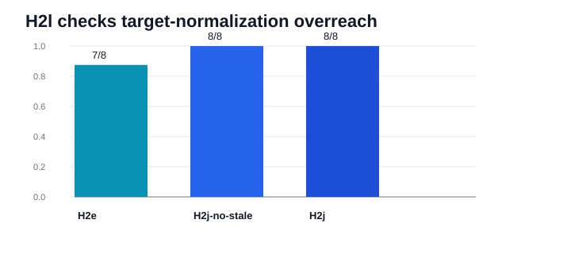

# H2l Target Normalization Overreach Synthesis

Generated: `2026-05-12T19:37:01.426061+00:00`

## Summary

H2l is a post-H2k overreach holdout for H2j target-query normalization. It asks whether the controller will over-strip requested targets when the value-bearing phrase or alias label is itself the target. On this 8-case packet, full H2j and H2j without the stale-selection gate both reach 8/8 strict and executor-equivalent, while H2e reaches 7/8 and misses one short-label regression guard. The single recorded H2j intervention repairs `critical chip` into `status badge`; no stale-selection intervention is recorded. This supports the current target-normalization scope, while leaving a harder less-direct H2m holdout as the next appropriate pressure test.

## Packet Rows

| profile_label | system_id | packet_dir | case_count | exact_success_count | exact_rate | executor_success_count | executor_rate |
| --- | --- | --- | --- | --- | --- | --- | --- |
| h2e_route_arbitration | mlx_gemma4_e2b_reasoner_only_no_tool_turn_directive_visual_role_catalog_route_arbitration_residual_exactness_visual_stale_selection_gate | results/tool_probe_replay_live/20260512T_h2l_target_normalization_overreach_h2e_execute_v1 | 8 | 7 | 0.875 | 7 | 0.875 |
| h2j_target_query_normalization_no_stale_gate | mlx_gemma4_e2b_reasoner_only_no_tool_turn_directive_visual_role_catalog_route_arbitration_residual_exactness_visual_target_query_normalization_no_stale_selection_gate | results/tool_probe_replay_live/20260512T_h2l_target_normalization_overreach_h2j_no_stale_gate_execute_v1 | 8 | 8 | 1.0 | 8 | 1.0 |
| h2j_target_query_normalization | mlx_gemma4_e2b_reasoner_only_no_tool_turn_directive_visual_role_catalog_route_arbitration_residual_exactness_visual_stale_selection_gate_visual_target_query_normalization | results/tool_probe_replay_live/20260512T_h2l_target_normalization_overreach_h2j_execute_v1 | 8 | 8 | 1.0 | 8 | 1.0 |

## Comparison Rows

| comparison_label | comparison_dir | shared_case_count | baseline_exact_rate | candidate_exact_rate | delta_exact_rate | baseline_executor_equivalence_rate | candidate_executor_equivalence_rate | delta_executor_equivalence_rate |
| --- | --- | --- | --- | --- | --- | --- | --- | --- |
| h2j_vs_h2e | results/tool_probe_replay_live_comparisons/20260512T_h2l_target_normalization_overreach_h2j_vs_h2e_v1 | 8 | 0.875 | 1.0 | 0.125 | 0.875 | 1.0 | 0.125 |
| h2j_vs_no_stale_gate | results/tool_probe_replay_live_comparisons/20260512T_h2l_target_normalization_overreach_h2j_vs_no_stale_gate_v1 | 8 | 1.0 | 1.0 | 0.0 | 1.0 | 1.0 | 0.0 |

## Family Rows

| family | case_count | expected_target_queries |
| --- | --- | --- |
| h2l_alias_is_target | 2 | error notice; result tile |
| h2l_h2k_regression_guard | 2 | status badge; mode field |
| h2l_value_bearing_target | 4 | result badge Blocked; state tag Closed; mode toggle Manual; priority badge Critical |

## Non-Exact Rows

| profile_label | case_id | family | failure_mode | executor_equivalence_match | expected_tool | expected_target_query | actual_tool | actual_target_query |
| --- | --- | --- | --- | --- | --- | --- | --- | --- |
| h2e_route_arbitration | h2l_status_badge_short_label_regression_guard | h2l_h2k_regression_guard | argument_mismatch | False | extract_layout | status badge | extract_layout | critical chip |

## Controller Intervention Rows

| profile_label | case_id | family | intervention_kind | from_tool | from_arguments | to_tool | to_arguments | prompt_state_label |
| --- | --- | --- | --- | --- | --- | --- | --- | --- |
| h2j_target_query_normalization_no_stale_gate | h2l_status_badge_short_label_regression_guard | h2l_h2k_regression_guard | visual_target_query_normalization | extract_layout | {"image_id":"img-h2l-status-badge-short","target_query":"critical chip"} | extract_layout | {"image_id":"img-h2l-status-badge-short","target_query":"status badge"} | status badge |
| h2j_target_query_normalization | h2l_status_badge_short_label_regression_guard | h2l_h2k_regression_guard | visual_target_query_normalization | extract_layout | {"image_id":"img-h2l-status-badge-short","target_query":"critical chip"} | extract_layout | {"image_id":"img-h2l-status-badge-short","target_query":"status badge"} | status badge |

## Findings

| finding_id | finding |
| --- | --- |
| h2l_overreach_holdout_passed | H2l does not expose target-query over-normalization in this replay-shaped holdout: H2j reaches 8/8 exact and executor-equivalent while preserving value-bearing and alias-is-target rows. |
| h2l_repairs_h2e_regression_guard | H2e reaches 7/8 exact and has 1 non-exact row, while H2j improves exact-rate by 0.125 and executor-equivalence by 0.125. |
| h2l_mechanism_is_target_normalization_not_stale_gate | Full H2j records 1 target-query-normalization intervention and 0 stale-selection interventions; the stale-gate-off ablation records 1 target-query-normalization intervention and 0 stale-selection interventions, tying full H2j with a 0.0 exact-rate delta. |
| next_holdout_should_reduce_prompt_directness | H2l is useful positive control evidence, but the next holdout should reduce direct target-is wording or add repeated seed variants before treating over-normalization as closed. |
