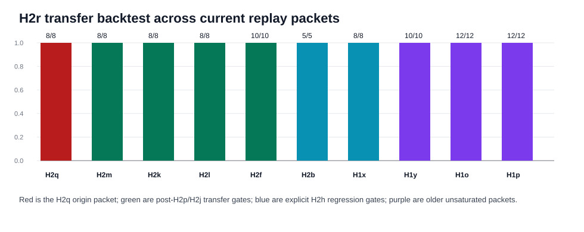

# H2r Transfer Backtest Synthesis

Generated: `2026-05-12T23:11:47.378855+00:00`

## Summary

H2r was introduced as a local repair for the H2q composition boundary. This synthesis asks the transfer question that H2h made unavoidable: does the local helper preserve older gates and harder adjacent packets, or does it trade one fixed slice for a new regression?

The answer on the current packet set is positive. H2r reaches `81 / 81` strict and `81 / 81` executor-equivalent across transfer packets. Including the H2q origin packet, it is `89 / 89` strict.

This should not be phrased as final global closure. It is transfer-positive on existing packets, including the explicit H2b/H1x regression gates, and it now justifies a fresh H2s holdout rather than more repair on the same H2q rows.

## Packet Rows

| profile_label | system_id | packet_dir | case_count | exact_success_count | exact_rate | executor_success_count | executor_rate |
| --- | --- | --- | --- | --- | --- | --- | --- |
| h2q_origin_h2r | mlx_gemma4_e2b_reasoner_only_no_tool_turn_directive_visual_role_catalog_route_arbitration_residual_exactness_visual_stale_selection_gate_visual_value_bearing_target_query_synthesis_visual_contextual_surface_alias_routing_visual_composed_route_gating | results/tool_probe_replay_live/20260512T_h2r_composed_route_gating_on_h2q_execute_v2 | 8 | 8 | 1.0 | 8 | 1.0 |
| h2m_transfer_h2r | mlx_gemma4_e2b_reasoner_only_no_tool_turn_directive_visual_role_catalog_route_arbitration_residual_exactness_visual_stale_selection_gate_visual_value_bearing_target_query_synthesis_visual_contextual_surface_alias_routing_visual_composed_route_gating | results/tool_probe_replay_live/20260512T_h2r_composed_route_gating_on_h2m_execute_v1 | 8 | 8 | 1.0 | 8 | 1.0 |
| h2k_transfer_h2r | mlx_gemma4_e2b_reasoner_only_no_tool_turn_directive_visual_role_catalog_route_arbitration_residual_exactness_visual_stale_selection_gate_visual_value_bearing_target_query_synthesis_visual_contextual_surface_alias_routing_visual_composed_route_gating | results/tool_probe_replay_live/20260512T_h2r_composed_route_gating_on_h2k_execute_v2 | 8 | 8 | 1.0 | 8 | 1.0 |
| h2l_transfer_h2r | mlx_gemma4_e2b_reasoner_only_no_tool_turn_directive_visual_role_catalog_route_arbitration_residual_exactness_visual_stale_selection_gate_visual_value_bearing_target_query_synthesis_visual_contextual_surface_alias_routing_visual_composed_route_gating | results/tool_probe_replay_live/20260512T_h2r_composed_route_gating_on_h2l_execute_v2 | 8 | 8 | 1.0 | 8 | 1.0 |
| h2f_transfer_h2r | mlx_gemma4_e2b_reasoner_only_no_tool_turn_directive_visual_role_catalog_route_arbitration_residual_exactness_visual_stale_selection_gate_visual_value_bearing_target_query_synthesis_visual_contextual_surface_alias_routing_visual_composed_route_gating | results/tool_probe_replay_live/20260512T_h2r_composed_route_gating_on_h2f_execute_v1 | 10 | 10 | 1.0 | 10 | 1.0 |
| h2b_regression_h2r | mlx_gemma4_e2b_reasoner_only_no_tool_turn_directive_visual_role_catalog_route_arbitration_residual_exactness_visual_stale_selection_gate_visual_value_bearing_target_query_synthesis_visual_contextual_surface_alias_routing_visual_composed_route_gating | results/tool_probe_replay_live/20260512T_h2r_composed_route_gating_on_h2b_execute_v1 | 5 | 5 | 1.0 | 5 | 1.0 |
| h1x_regression_h2r | mlx_gemma4_e2b_reasoner_only_no_tool_turn_directive_visual_role_catalog_route_arbitration_residual_exactness_visual_stale_selection_gate_visual_value_bearing_target_query_synthesis_visual_contextual_surface_alias_routing_visual_composed_route_gating | results/tool_probe_replay_live/20260512T_h2r_composed_route_gating_on_h1x_execute_v1 | 8 | 8 | 1.0 | 8 | 1.0 |
| h1y_transfer_h2r | mlx_gemma4_e2b_reasoner_only_no_tool_turn_directive_visual_role_catalog_route_arbitration_residual_exactness_visual_stale_selection_gate_visual_value_bearing_target_query_synthesis_visual_contextual_surface_alias_routing_visual_composed_route_gating | results/tool_probe_replay_live/20260512T_h2r_composed_route_gating_on_h1y_execute_v1 | 10 | 10 | 1.0 | 10 | 1.0 |
| h1o_transfer_h2r | mlx_gemma4_e2b_reasoner_only_no_tool_turn_directive_visual_role_catalog_route_arbitration_residual_exactness_visual_stale_selection_gate_visual_value_bearing_target_query_synthesis_visual_contextual_surface_alias_routing_visual_composed_route_gating | results/tool_probe_replay_live/20260512T_h2r_composed_route_gating_on_h1o_execute_v1 | 12 | 12 | 1.0 | 12 | 1.0 |
| h1p_transfer_h2r | mlx_gemma4_e2b_reasoner_only_no_tool_turn_directive_visual_role_catalog_route_arbitration_residual_exactness_visual_stale_selection_gate_visual_value_bearing_target_query_synthesis_visual_contextual_surface_alias_routing_visual_composed_route_gating | results/tool_probe_replay_live/20260512T_h2r_composed_route_gating_on_h1p_execute_v1 | 12 | 12 | 1.0 | 12 | 1.0 |

## Comparison Rows

| comparison_label | comparison_dir | shared_case_count | baseline_exact_rate | candidate_exact_rate | delta_exact_rate | baseline_executor_equivalence_rate | candidate_executor_equivalence_rate | delta_executor_equivalence_rate |
| --- | --- | --- | --- | --- | --- | --- | --- | --- |
| h2q_h2r_vs_h2p | results/tool_probe_replay_live_comparisons/20260512T_h2r_composed_route_gating_vs_h2p_on_h2q_v2 | 8 | 0.375 | 1.0 | 0.625 | 0.375 | 1.0 | 0.625 |
| h2m_h2r_vs_h2p | results/tool_probe_replay_live_comparisons/20260512T_h2r_composed_route_gating_vs_h2p_on_h2m_v1 | 8 | 1.0 | 1.0 | 0.0 | 1.0 | 1.0 | 0.0 |
| h2m_h2r_vs_h2o | results/tool_probe_replay_live_comparisons/20260512T_h2r_composed_route_gating_vs_h2o_on_h2m_v1 | 8 | 0.875 | 1.0 | 0.125 | 0.875 | 1.0 | 0.125 |
| h2k_h2r_vs_h2p | results/tool_probe_replay_live_comparisons/20260512T_h2r_composed_route_gating_vs_h2p_on_h2k_v2 | 8 | 1.0 | 1.0 | 0.0 | 1.0 | 1.0 | 0.0 |
| h2k_h2r_vs_h2o | results/tool_probe_replay_live_comparisons/20260512T_h2r_composed_route_gating_vs_h2o_on_h2k_v2 | 8 | 1.0 | 1.0 | 0.0 | 1.0 | 1.0 | 0.0 |
| h2l_h2r_vs_h2p | results/tool_probe_replay_live_comparisons/20260512T_h2r_composed_route_gating_vs_h2p_on_h2l_v2 | 8 | 1.0 | 1.0 | 0.0 | 1.0 | 1.0 | 0.0 |
| h2l_h2r_vs_h2o | results/tool_probe_replay_live_comparisons/20260512T_h2r_composed_route_gating_vs_h2o_on_h2l_v2 | 8 | 1.0 | 1.0 | 0.0 | 1.0 | 1.0 | 0.0 |
| h2f_h2r_vs_h2p | results/tool_probe_replay_live_comparisons/20260512T_h2r_composed_route_gating_vs_h2p_on_h2f_v1 | 10 | 1.0 | 1.0 | 0.0 | 1.0 | 1.0 | 0.0 |
| h2f_h2r_vs_h2o | results/tool_probe_replay_live_comparisons/20260512T_h2r_composed_route_gating_vs_h2o_on_h2f_v1 | 10 | 1.0 | 1.0 | 0.0 | 1.0 | 1.0 | 0.0 |
| h2f_h2r_vs_h2j | results/tool_probe_replay_live_comparisons/20260512T_h2r_composed_route_gating_vs_h2j_on_h2f_v1 | 10 | 1.0 | 1.0 | 0.0 | 1.0 | 1.0 | 0.0 |
| h2b_h2r_vs_h2j | results/tool_probe_replay_live_comparisons/20260512T_h2r_composed_route_gating_vs_h2j_on_h2b_v1 | 5 | 1.0 | 1.0 | 0.0 | 1.0 | 1.0 | 0.0 |
| h2b_h2r_vs_h2h | results/tool_probe_replay_live_comparisons/20260512T_h2r_composed_route_gating_vs_h2h_on_h2b_v1 | 5 | 0.6 | 1.0 | 0.4 | 0.6 | 1.0 | 0.4 |
| h1x_h2r_vs_h2j | results/tool_probe_replay_live_comparisons/20260512T_h2r_composed_route_gating_vs_h2j_on_h1x_v1 | 8 | 1.0 | 1.0 | 0.0 | 1.0 | 1.0 | 0.0 |
| h1x_h2r_vs_h2h | results/tool_probe_replay_live_comparisons/20260512T_h2r_composed_route_gating_vs_h2h_on_h1x_v1 | 8 | 0.75 | 1.0 | 0.25 | 0.75 | 1.0 | 0.25 |
| h1y_h2r_vs_h2a | results/tool_probe_replay_live_comparisons/20260512T_h2r_composed_route_gating_vs_h2a_on_h1y_v1 | 10 | 0.8 | 1.0 | 0.19999999999999996 | 0.8 | 1.0 | 0.19999999999999996 |
| h1y_h2r_vs_component_residual | results/tool_probe_replay_live_comparisons/20260512T_h2r_composed_route_gating_vs_component_residual_on_h1y_v1 | 10 | 0.7 | 1.0 | 0.30000000000000004 | 0.7 | 1.0 | 0.30000000000000004 |
| h1o_h2r_vs_h1s | results/tool_probe_replay_live_comparisons/20260512T_h2r_composed_route_gating_vs_h1s_on_h1o_v1 | 12 | 0.9166666666666666 | 1.0 | 0.08333333333333337 | 0.9166666666666666 | 1.0 | 0.08333333333333337 |
| h1o_h2r_vs_h2a | results/tool_probe_replay_live_comparisons/20260512T_h2r_composed_route_gating_vs_h2a_on_h1o_v1 | 12 | 0.8333333333333334 | 1.0 | 0.16666666666666663 | 1.0 | 1.0 | 0.0 |
| h1p_h2r_vs_h1s | results/tool_probe_replay_live_comparisons/20260512T_h2r_composed_route_gating_vs_h1s_on_h1p_v1 | 12 | 0.9166666666666666 | 1.0 | 0.08333333333333337 | 0.9166666666666666 | 1.0 | 0.08333333333333337 |
| h1p_h2r_vs_h2a | results/tool_probe_replay_live_comparisons/20260512T_h2r_composed_route_gating_vs_h2a_on_h1p_v1 | 12 | 0.8333333333333334 | 1.0 | 0.16666666666666663 | 0.8333333333333334 | 1.0 | 0.16666666666666663 |

## Family Rows

| profile_label | family | case_count | exact_success_count | exact_rate | executor_success_count | executor_rate |
| --- | --- | --- | --- | --- | --- | --- |
| h2q_origin_h2r | h2q_contextual_alias_decoy_overlap | 2 | 2 | 1.0 | 2 | 1.0 |
| h2q_origin_h2r | h2q_stale_surface_alias | 2 | 2 | 1.0 | 2 | 1.0 |
| h2q_origin_h2r | h2q_surface_alias_value_decoy | 2 | 2 | 1.0 | 2 | 1.0 |
| h2q_origin_h2r | h2q_value_bearing_stale_decoy | 2 | 2 | 1.0 | 2 | 1.0 |
| h2m_transfer_h2r | h2m_contextual_alias_is_target | 2 | 2 | 1.0 | 2 | 1.0 |
| h2m_transfer_h2r | h2m_h2k_regression_guard_less_direct | 2 | 2 | 1.0 | 2 | 1.0 |
| h2m_transfer_h2r | h2m_less_direct_value_bearing_target | 4 | 4 | 1.0 | 4 | 1.0 |
| h2k_transfer_h2r | h2k_before_reading_decoy | 2 | 2 | 1.0 | 2 | 1.0 |
| h2k_transfer_h2r | h2k_code_label_overlap | 2 | 2 | 1.0 | 2 | 1.0 |
| h2k_transfer_h2r | h2k_negated_same_component_decoy | 3 | 3 | 1.0 | 3 | 1.0 |
| h2k_transfer_h2r | h2k_transfer_regression_guard | 1 | 1 | 1.0 | 1 | 1.0 |
| h2l_transfer_h2r | h2l_alias_is_target | 2 | 2 | 1.0 | 2 | 1.0 |
| h2l_transfer_h2r | h2l_h2k_regression_guard | 2 | 2 | 1.0 | 2 | 1.0 |
| h2l_transfer_h2r | h2l_value_bearing_target | 4 | 4 | 1.0 | 4 | 1.0 |
| h2f_transfer_h2r | h2f_activation_panel_notice | 2 | 2 | 1.0 | 2 | 1.0 |
| h2f_transfer_h2r | h2f_route_code_label | 2 | 2 | 1.0 | 2 | 1.0 |
| h2f_transfer_h2r | h2f_route_component_class_transfer | 2 | 2 | 1.0 | 2 | 1.0 |
| h2f_transfer_h2r | h2f_route_nonstandard_class | 2 | 2 | 1.0 | 2 | 1.0 |
| h2f_transfer_h2r | h2f_route_stale_field | 2 | 2 | 1.0 | 2 | 1.0 |
| h2b_regression_h2r | h1o_code_negation_preservation | 2 | 2 | 1.0 | 2 | 1.0 |
| h2b_regression_h2r | h1p_component_value_compact | 1 | 1 | 1.0 | 1 | 1.0 |
| h2b_regression_h2r | h1p_component_value_surface | 1 | 1 | 1.0 | 1 | 1.0 |
| h2b_regression_h2r | visual_argument_transfer_component_value_pill | 1 | 1 | 1.0 | 1 | 1.0 |
| h1x_regression_h2r | h1x_oblique_activation_no_call | 2 | 2 | 1.0 | 2 | 1.0 |
| h1x_regression_h2r | h1x_oblique_nonstandard_class | 2 | 2 | 1.0 | 2 | 1.0 |
| h1x_regression_h2r | h1x_oblique_stale_field | 2 | 2 | 1.0 | 2 | 1.0 |
| h1x_regression_h2r | h1x_oblique_surface_value | 2 | 2 | 1.0 | 2 | 1.0 |
| h1y_transfer_h2r | h1y_activation_no_call | 1 | 1 | 1.0 | 1 | 1.0 |
| h1y_transfer_h2r | h1y_preserve_surface_value | 2 | 2 | 1.0 | 2 | 1.0 |
| h1y_transfer_h2r | h1y_route_code_label | 2 | 2 | 1.0 | 2 | 1.0 |
| h1y_transfer_h2r | h1y_route_nonstandard_class | 2 | 2 | 1.0 | 2 | 1.0 |
| h1y_transfer_h2r | h1y_route_stale_field | 3 | 3 | 1.0 | 3 | 1.0 |
| h1o_transfer_h2r | h1o_activation_no_call | 4 | 4 | 1.0 | 4 | 1.0 |
| h1o_transfer_h2r | h1o_code_negation_preservation | 4 | 4 | 1.0 | 4 | 1.0 |
| h1o_transfer_h2r | h1o_component_value_boundary | 4 | 4 | 1.0 | 4 | 1.0 |
| h1p_transfer_h2r | h1p_component_value_compact | 4 | 4 | 1.0 | 4 | 1.0 |
| h1p_transfer_h2r | h1p_component_value_stale_selection | 4 | 4 | 1.0 | 4 | 1.0 |
| h1p_transfer_h2r | h1p_component_value_surface | 4 | 4 | 1.0 | 4 | 1.0 |

## Non-Exact Rows

_None._

## Controller Intervention Rows

| profile_label | case_id | family | intervention_kind | from_tool | from_arguments | to_tool | to_arguments | prompt_state_label | value_bearing_label | display_value | surface_label | requested_label | requested_region_id | reason |
| --- | --- | --- | --- | --- | --- | --- | --- | --- | --- | --- | --- | --- | --- | --- |
| h2q_origin_h2r | h2q_result_tile_blocked_value_badge_decoy | h2q_surface_alias_value_decoy | visual_composed_route_gating | extract_layout | {"image_id":"img-h2q-result-tile-blocked","target_query":"result comment"} | extract_layout | {"image_id":"img-h2q-result-tile-blocked","target_query":"result tile"} |  |  |  |  | result tile | h2q-result-tile-blocked-13002 | requested_surface_over_deprioritized_decoy |
| h2q_origin_h2r | h2q_result_tile_blocked_value_badge_decoy | h2q_surface_alias_value_decoy | visual_target_query_normalization | extract_layout | {"image_id":"img-h2q-result-tile-blocked","target_query":"Blocked badge"} | extract_layout | {"image_id":"img-h2q-result-tile-blocked","target_query":"result comment"} | result comment |  |  |  |  |  |  |
| h2q_origin_h2r | h2q_state_panel_closed_value_tag_decoy | h2q_surface_alias_value_decoy | visual_contextual_surface_alias_routing | extract_layout | {"image_id":"img-h2q-state-panel-closed","target_query":"Closed"} | extract_layout | {"image_id":"img-h2q-state-panel-closed","target_query":"state panel"} |  |  | Closed | state panel |  |  | contextual_surface_alias_recoverable |
| h2q_origin_h2r | h2q_priority_badge_critical_stale_status_decoy | h2q_value_bearing_stale_decoy | visual_value_bearing_target_query_synthesis | extract_layout | {"image_id":"img-h2q-priority-badge-critical","target_query":"Critical priority badge"} | extract_layout | {"image_id":"img-h2q-priority-badge-critical","target_query":"priority badge Critical"} | priority badge | priority badge Critical |  |  |  |  | value_bearing_label_recoverable |
| h2q_origin_h2r | h2q_owner_field_amina_archived_owner_decoy | h2q_value_bearing_stale_decoy | visual_value_bearing_target_query_synthesis | extract_layout | {"image_id":"img-h2q-owner-field-amina","target_query":"owner field"} | extract_layout | {"image_id":"img-h2q-owner-field-amina","target_query":"owner field Amina"} | owner field | owner field Amina |  |  |  |  | value_bearing_label_recoverable |
| h2q_origin_h2r | h2q_owner_field_amina_archived_owner_decoy | h2q_value_bearing_stale_decoy | visual_stale_selection_gate | refine_selection | {"filter_query":"latest","selection_id":"amina"} | extract_layout | {"image_id":"img-h2q-owner-field-amina","target_query":"owner field"} |  |  |  |  |  |  |  |
| h2q_origin_h2r | h2q_archive_panel_error_notice_banner_decoy | h2q_contextual_alias_decoy_overlap | visual_composed_route_gating | extract_layout | {"image_id":"img-h2q-error-notice","target_query":"error banner"} | extract_layout | {"image_id":"img-h2q-error-notice","target_query":"error notice"} |  |  |  |  | error notice | h2q-error-notice-13042 | requested_surface_over_deprioritized_decoy |
| h2q_origin_h2r | h2q_archive_panel_error_notice_banner_decoy | h2q_contextual_alias_decoy_overlap | visual_target_query_normalization | extract_layout | {"image_id":"img-h2q-error-notice","target_query":"archived exception panel"} | extract_layout | {"image_id":"img-h2q-error-notice","target_query":"error banner"} | error banner |  |  |  |  |  |  |
| h2q_origin_h2r | h2q_mode_field_manual_switch_decoy | h2q_contextual_alias_decoy_overlap | visual_composed_route_gating | extract_layout | {"image_id":"img-h2q-mode-field","target_query":"mode switch"} | extract_layout | {"image_id":"img-h2q-mode-field","target_query":"mode field"} |  |  |  |  | mode field | h2q-mode-field-13052 | requested_surface_over_deprioritized_decoy |
| h2q_origin_h2r | h2q_mode_field_manual_switch_decoy | h2q_contextual_alias_decoy_overlap | visual_target_query_normalization | extract_layout | {"image_id":"img-h2q-mode-field","target_query":"mode field"} | extract_layout | {"image_id":"img-h2q-mode-field","target_query":"mode switch"} | mode switch |  |  |  |  |  |  |
| h2q_origin_h2r | h2q_result_tile_stale_selection_hint | h2q_stale_surface_alias | visual_composed_route_gating | refine_selection | {"filter_query":"Blocked","selection_id":"sel-archived-result-badge"} | extract_layout | {"image_id":"img-h2q-result-tile-stale-selection","target_query":"result tile"} |  |  |  |  | result tile | h2q-current-result-tile-13062 | stale_selection_to_requested_surface |
| h2q_origin_h2r | h2q_state_panel_stale_selection_hint | h2q_stale_surface_alias | visual_composed_route_gating | refine_selection | {"filter_query":"Closed","selection_id":"sel-archived-state-tag"} | extract_layout | {"image_id":"img-h2q-state-panel-stale-selection","target_query":"state panel"} |  |  |  |  | state panel | h2q-current-state-panel-13072 | stale_selection_to_requested_surface |
| h2m_transfer_h2r | h2m_result_badge_blocked_contextual_value | h2m_less_direct_value_bearing_target | visual_value_bearing_target_query_synthesis | extract_layout | {"image_id":"img-h2m-result-badge-blocked","target_query":"result chip"} | extract_layout | {"image_id":"img-h2m-result-badge-blocked","target_query":"result badge Blocked"} | result badge | result badge Blocked |  |  |  |  | value_bearing_label_recoverable |
| h2m_transfer_h2r | h2m_state_tag_closed_contextual_value | h2m_less_direct_value_bearing_target | visual_value_bearing_target_query_synthesis | extract_layout | {"image_id":"img-h2m-state-tag-closed","target_query":"Closed state tag"} | extract_layout | {"image_id":"img-h2m-state-tag-closed","target_query":"state tag Closed"} | state tag | state tag Closed |  |  |  |  | value_bearing_label_recoverable |
| h2m_transfer_h2r | h2m_mode_toggle_manual_contextual_value | h2m_less_direct_value_bearing_target | visual_value_bearing_target_query_synthesis | extract_layout | {"image_id":"img-h2m-mode-toggle-manual","target_query":"mode toggle"} | extract_layout | {"image_id":"img-h2m-mode-toggle-manual","target_query":"mode toggle Manual"} | mode toggle | mode toggle Manual |  |  |  |  | value_bearing_label_recoverable |
| h2m_transfer_h2r | h2m_priority_badge_critical_contextual_value | h2m_less_direct_value_bearing_target | visual_value_bearing_target_query_synthesis | extract_layout | {"image_id":"img-h2m-priority-badge-critical","target_query":"priority badge critical"} | extract_layout | {"image_id":"img-h2m-priority-badge-critical","target_query":"priority badge Critical"} | priority badge | priority badge Critical |  |  |  |  | value_bearing_label_recoverable |
| h2m_transfer_h2r | h2m_error_notice_contextual_alias | h2m_contextual_alias_is_target | visual_target_query_normalization | extract_layout | {"image_id":"img-h2m-error-notice","target_query":"archive panel"} | extract_layout | {"image_id":"img-h2m-error-notice","target_query":"error notice"} | error notice |  |  |  |  |  |  |
| h2m_transfer_h2r | h2m_result_tile_contextual_alias | h2m_contextual_alias_is_target | visual_contextual_surface_alias_routing | extract_layout | {"image_id":"img-h2m-result-tile","target_query":"Blocked"} | extract_layout | {"image_id":"img-h2m-result-tile","target_query":"result tile"} |  |  | Blocked | result tile |  |  | contextual_surface_alias_recoverable |
| h2m_transfer_h2r | h2m_mode_field_contextual_regression_guard | h2m_h2k_regression_guard_less_direct | visual_target_query_normalization | extract_layout | {"image_id":"img-h2m-mode-field-short","target_query":"mode switch"} | extract_layout | {"image_id":"img-h2m-mode-field-short","target_query":"mode field"} | mode field |  |  |  |  |  |  |
| h2k_transfer_h2r | h2k_mode_toggle_negated_consent_toggle_decoy | h2k_negated_same_component_decoy | visual_target_query_normalization | extract_layout | {"image_id":"img-h2k-mode-toggle","target_query":"mode toggle Manual"} | extract_layout | {"image_id":"img-h2k-mode-toggle","target_query":"mode toggle"} | mode toggle |  |  |  |  |  |  |
| h2k_transfer_h2r | h2k_result_badge_negated_result_tile_decoy | h2k_negated_same_component_decoy | visual_target_query_normalization | extract_layout | {"image_id":"img-h2k-result-badge","target_query":"result badge Blocked"} | extract_layout | {"image_id":"img-h2k-result-badge","target_query":"result badge"} | result badge |  |  |  |  |  |  |
| h2k_transfer_h2r | h2k_error_banner_archived_error_notice_decoy | h2k_transfer_regression_guard | visual_target_query_normalization | extract_layout | {"image_id":"img-h2k-error-banner","target_query":"error notice"} | extract_layout | {"image_id":"img-h2k-error-banner","target_query":"error banner"} | error banner |  |  |  |  |  |  |
| h2k_transfer_h2r | h2k_state_tag_before_reading_state_marker_decoy | h2k_before_reading_decoy | visual_target_query_normalization | extract_layout | {"image_id":"img-h2k-state-tag","target_query":"state tag Closed"} | extract_layout | {"image_id":"img-h2k-state-tag","target_query":"state tag"} | state tag |  |  |  |  |  |  |
| h2k_transfer_h2r | h2k_mode_field_before_reading_mode_switch_decoy | h2k_before_reading_decoy | visual_target_query_normalization | extract_layout | {"image_id":"img-h2k-mode-field","target_query":"mode toggle"} | extract_layout | {"image_id":"img-h2k-mode-field","target_query":"mode field"} | mode field |  |  |  |  |  |  |
| h2l_transfer_h2r | h2l_status_badge_short_label_regression_guard | h2l_h2k_regression_guard | visual_target_query_normalization | extract_layout | {"image_id":"img-h2l-status-badge-short","target_query":"critical chip"} | extract_layout | {"image_id":"img-h2l-status-badge-short","target_query":"status badge"} | status badge |  |  |  |  |  |  |
| h2f_transfer_h2r | h2f_result_tile_comment_value_decoy | h2f_route_component_class_transfer | visual_target_query_normalization | extract_layout | {"image_id":"img-h2f-result-tile","target_query":"Blocked"} | extract_layout | {"image_id":"img-h2f-result-tile","target_query":"result tile"} | result tile |  |  |  |  |  |  |
| h2f_transfer_h2r | h2f_resolution_badge_log_result_decoy | h2f_route_component_class_transfer | visual_target_query_normalization | extract_layout | {"image_id":"img-h2f-resolution-badge","target_query":"Deferred"} | extract_layout | {"image_id":"img-h2f-resolution-badge","target_query":"resolution badge"} | resolution badge |  |  |  |  |  |  |
| h2f_transfer_h2r | h2f_state_marker_history_value_decoy | h2f_route_nonstandard_class | visual_target_query_normalization | extract_layout | {"image_id":"img-h2f-state-marker","target_query":"lifecycle state marker"} | extract_layout | {"image_id":"img-h2f-state-marker","target_query":"state marker"} | state marker |  |  |  |  |  |  |
| h2f_transfer_h2r | h2f_mode_switch_note_value_decoy | h2f_route_nonstandard_class | visual_target_query_normalization | extract_layout | {"image_id":"img-h2f-mode-switch","target_query":"mode toggle"} | extract_layout | {"image_id":"img-h2f-mode-switch","target_query":"mode switch"} | mode switch |  |  |  |  |  |  |
| h2f_transfer_h2r | h2f_owner_field_previous_memo_decoy | h2f_route_stale_field | visual_stale_selection_gate | refine_selection | {"filter_query":"owner field","selection_id":"sel-h2f-owner-memo"} | extract_layout | {"image_id":"img-h2f-owner-field","target_query":"owner field"} |  |  |  |  |  |  |  |
| h2b_regression_h2r | component_value_result_pill_log_decoy | visual_argument_transfer_component_value_pill | visual_stale_selection_gate | refine_selection | {"filter_query":"approved","selection_id":null} | extract_layout | {"image_id":"img-component-result-pill","target_query":"result pill"} |  |  |  |  |  |  |  |
| h1x_regression_h2r | h1x_responsible_party_field_old_owner_memo_decoy | h1x_oblique_stale_field | visual_stale_selection_gate | refine_selection | {"filter_query":"responsible-party entry showing Iris","selection_id":"sel-owner-memo"} | extract_layout | {"image_id":"img-h1x-owner-field","target_query":"owner field"} |  |  |  |  |  |  |  |
| h1x_regression_h2r | h1x_workstream_owner_field_previous_summary_decoy | h1x_oblique_stale_field | visual_stale_selection_gate | refine_selection | {"filter_query":"owner","selection_id":"sel-workstream-summary"} | extract_layout | {"image_id":"img-h1x-workstream-owner","target_query":"owner field"} |  |  |  |  |  |  |  |
| h1y_transfer_h2r | h1y_responsible_party_field_old_owner_memo_decoy | h1y_route_stale_field | visual_stale_selection_gate | refine_selection | {"filter_query":"latest","selection_id":"sel-h1y-owner-memo"} | extract_layout | {"image_id":"img-h1y-owner-field","target_query":"owner field"} |  |  |  |  |  |  |  |
| h1y_transfer_h2r | h1y_escalation_contact_field_saved_summary_decoy | h1y_route_stale_field | visual_stale_selection_gate | refine_selection | {"filter_query":"latest","selection_id":"sel-h1y-contact-summary"} | extract_layout | {"image_id":"img-h1y-escalation-contact","target_query":"owner field"} |  |  |  |  |  |  |  |
| h1y_transfer_h2r | h1y_lifecycle_state_tag_audit_value_decoy | h1y_route_nonstandard_class | visual_target_query_normalization | extract_layout | {"image_id":"img-h1y-state-tag","target_query":"lifecycle state tag"} | extract_layout | {"image_id":"img-h1y-state-tag","target_query":"state tag"} | state tag |  |  |  |  |  |  |
| h1y_transfer_h2r | h1y_status_pill_summary_value_holdout | h1y_preserve_surface_value | visual_target_query_normalization | extract_layout | {"image_id":"img-h1y-status-pill","target_query":"Pending"} | extract_layout | {"image_id":"img-h1y-status-pill","target_query":"status pill"} | status pill |  |  |  |  |  |  |
| h1o_transfer_h2r | h1o_activation_warning_tile_no_call_decoy | h1o_activation_no_call | visual_target_query_normalization | extract_layout | {"image_id":"img-h1o-activation-warning-tile","target_query":"overdue"} | extract_layout | {"image_id":"img-h1o-activation-warning-tile","target_query":"warning tile"} | warning tile |  |  |  |  |  |  |

## Findings

| finding_id | finding |
| --- | --- |
| h2r_transfer_preserves_current_gates | H2r reaches 81/81 strict and 81/81 executor-equivalent across transfer packets, and 89/89 strict when the H2q origin packet is included. |
| h2r_avoids_h2h_regression_pattern | The explicit H2h regression guards are clean: H2r ties H2j/H2e on H2b and H1x while beating H2h by 0.4 exact-rate on H2b and 0.25 exact-rate on H1x. |
| h2r_closes_older_unsaturated_packets | Beyond preserving transfer gates, H2r closes older unsaturated packets: H1y improves by 0.19999999999999996 exact-rate versus H2a, H1o by 0.08333333333333337 versus H1s, and H1p by 0.08333333333333337 versus H1s. |
| h2r_controller_burden_is_sparse_on_transfer | Transfer success is not just composed-route rewriting everywhere. Aggregate intervention counts are {"visual_composed_route_gating": 5, "visual_contextual_surface_alias_routing": 2, "visual_stale_selection_gate": 7, "visual_target_query_normalization": 18, "visual_value_bearing_target_query_synthesis": 6}; several transfer packets saturate with zero new H2r-specific composed-route interventions. |
| h2r_next_requires_fresh_h2s | The current evidence supports H2r as transfer-positive on existing packets, but publication language should still require a fresh H2s composition holdout with unseen stale-selection and same-value surface decoys before calling the policy globally solved. |
