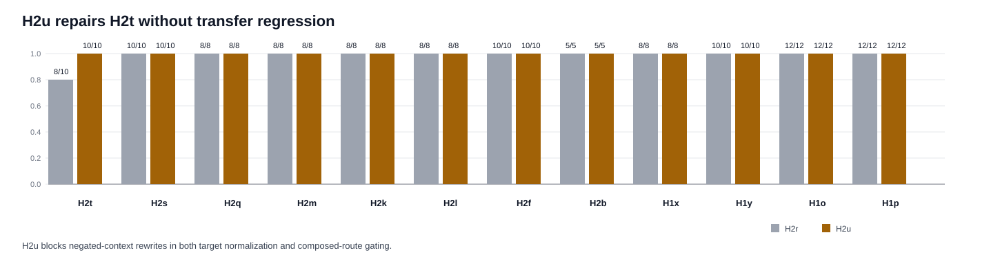

# H2u Negation Guard Synthesis

Generated: `2026-05-13T01:02:36.139762+00:00`

## Summary

H2u is the first repair after H2t exposed a controller-induced negation-scope regression. The repair is not a prompt rewrite: it adds a runtime guard that preserves exact current-surface targets when the candidate replacement is a note, caption, or old/prior contextual label.

On H2t, H2u reaches `10 / 10` strict and `10 / 10` executor-equivalent, improving `0.20` exact-rate over H2r. It fixes `2` H2t rows.

Transfer is clean on this wave: H2u preserves `26 / 26` strict exactness across H2s, H2q, and H2m, and all three H2r-vs-H2u comparisons have zero exact/executor-equivalence deltas. The guard fires on transfer `3` times without causing a miss.

The broader first-pass transfer backtest is also clean: H2u preserves `39 / 39` strict exactness across H2k, H2l, H2f, H2b, and H1x. Combined with the initial H2s/H2q/H2m transfer gate, the current broad transfer subtotal is `65 / 65` with zero aggregate exact-rate delta versus H2r.

## Packet Rows

| profile_label | system_id | packet_dir | case_count | exact_success_count | exact_rate | executor_success_count | executor_rate |
| --- | --- | --- | --- | --- | --- | --- | --- |
| h2t_h2r_composed_route_gating | mlx_gemma4_e2b_reasoner_only_no_tool_turn_directive_visual_role_catalog_route_arbitration_residual_exactness_visual_stale_selection_gate_visual_value_bearing_target_query_synthesis_visual_contextual_surface_alias_routing_visual_composed_route_gating | results/tool_probe_replay_live/20260512T_h2t_overreach_independence_h2r_execute_v1 | 10 | 8 | 0.8 | 8 | 0.8 |
| h2t_h2u_negation_guard | mlx_gemma4_e2b_reasoner_only_no_tool_turn_directive_visual_role_catalog_route_arbitration_residual_exactness_visual_stale_selection_gate_visual_value_bearing_target_query_synthesis_visual_contextual_surface_alias_routing_visual_composed_route_gating_visual_negation_guard | results/tool_probe_replay_live/20260513T_h2t_overreach_independence_h2u_execute_v2 | 10 | 10 | 1.0 | 10 | 1.0 |
| h2s_h2r_composed_route_gating | mlx_gemma4_e2b_reasoner_only_no_tool_turn_directive_visual_role_catalog_route_arbitration_residual_exactness_visual_stale_selection_gate_visual_value_bearing_target_query_synthesis_visual_contextual_surface_alias_routing_visual_composed_route_gating | results/tool_probe_replay_live/20260512T_h2s_fresh_composed_holdout_h2r_execute_v1 | 10 | 10 | 1.0 | 10 | 1.0 |
| h2s_h2u_negation_guard | mlx_gemma4_e2b_reasoner_only_no_tool_turn_directive_visual_role_catalog_route_arbitration_residual_exactness_visual_stale_selection_gate_visual_value_bearing_target_query_synthesis_visual_contextual_surface_alias_routing_visual_composed_route_gating_visual_negation_guard | results/tool_probe_replay_live/20260513T_h2u_negation_guard_on_h2s_execute_v1 | 10 | 10 | 1.0 | 10 | 1.0 |
| h2q_h2r_composed_route_gating | mlx_gemma4_e2b_reasoner_only_no_tool_turn_directive_visual_role_catalog_route_arbitration_residual_exactness_visual_stale_selection_gate_visual_value_bearing_target_query_synthesis_visual_contextual_surface_alias_routing_visual_composed_route_gating | results/tool_probe_replay_live/20260512T_h2r_composed_route_gating_on_h2q_execute_v2 | 8 | 8 | 1.0 | 8 | 1.0 |
| h2q_h2u_negation_guard | mlx_gemma4_e2b_reasoner_only_no_tool_turn_directive_visual_role_catalog_route_arbitration_residual_exactness_visual_stale_selection_gate_visual_value_bearing_target_query_synthesis_visual_contextual_surface_alias_routing_visual_composed_route_gating_visual_negation_guard | results/tool_probe_replay_live/20260513T_h2u_negation_guard_on_h2q_execute_v1 | 8 | 8 | 1.0 | 8 | 1.0 |
| h2m_h2r_composed_route_gating | mlx_gemma4_e2b_reasoner_only_no_tool_turn_directive_visual_role_catalog_route_arbitration_residual_exactness_visual_stale_selection_gate_visual_value_bearing_target_query_synthesis_visual_contextual_surface_alias_routing_visual_composed_route_gating | results/tool_probe_replay_live/20260512T_h2r_composed_route_gating_on_h2m_execute_v1 | 8 | 8 | 1.0 | 8 | 1.0 |
| h2m_h2u_negation_guard | mlx_gemma4_e2b_reasoner_only_no_tool_turn_directive_visual_role_catalog_route_arbitration_residual_exactness_visual_stale_selection_gate_visual_value_bearing_target_query_synthesis_visual_contextual_surface_alias_routing_visual_composed_route_gating_visual_negation_guard | results/tool_probe_replay_live/20260513T_h2u_negation_guard_on_h2m_execute_v1 | 8 | 8 | 1.0 | 8 | 1.0 |
| h2k_h2r_composed_route_gating | mlx_gemma4_e2b_reasoner_only_no_tool_turn_directive_visual_role_catalog_route_arbitration_residual_exactness_visual_stale_selection_gate_visual_value_bearing_target_query_synthesis_visual_contextual_surface_alias_routing_visual_composed_route_gating | results/tool_probe_replay_live/20260512T_h2r_composed_route_gating_on_h2k_execute_v2 | 8 | 8 | 1.0 | 8 | 1.0 |
| h2k_h2u_negation_guard | mlx_gemma4_e2b_reasoner_only_no_tool_turn_directive_visual_role_catalog_route_arbitration_residual_exactness_visual_stale_selection_gate_visual_value_bearing_target_query_synthesis_visual_contextual_surface_alias_routing_visual_composed_route_gating_visual_negation_guard | results/tool_probe_replay_live/20260513T_h2u_negation_guard_on_h2k_execute_v1 | 8 | 8 | 1.0 | 8 | 1.0 |
| h2l_h2r_composed_route_gating | mlx_gemma4_e2b_reasoner_only_no_tool_turn_directive_visual_role_catalog_route_arbitration_residual_exactness_visual_stale_selection_gate_visual_value_bearing_target_query_synthesis_visual_contextual_surface_alias_routing_visual_composed_route_gating | results/tool_probe_replay_live/20260512T_h2r_composed_route_gating_on_h2l_execute_v2 | 8 | 8 | 1.0 | 8 | 1.0 |
| h2l_h2u_negation_guard | mlx_gemma4_e2b_reasoner_only_no_tool_turn_directive_visual_role_catalog_route_arbitration_residual_exactness_visual_stale_selection_gate_visual_value_bearing_target_query_synthesis_visual_contextual_surface_alias_routing_visual_composed_route_gating_visual_negation_guard | results/tool_probe_replay_live/20260513T_h2u_negation_guard_on_h2l_execute_v1 | 8 | 8 | 1.0 | 8 | 1.0 |
| h2f_h2r_composed_route_gating | mlx_gemma4_e2b_reasoner_only_no_tool_turn_directive_visual_role_catalog_route_arbitration_residual_exactness_visual_stale_selection_gate_visual_value_bearing_target_query_synthesis_visual_contextual_surface_alias_routing_visual_composed_route_gating | results/tool_probe_replay_live/20260512T_h2r_composed_route_gating_on_h2f_execute_v1 | 10 | 10 | 1.0 | 10 | 1.0 |
| h2f_h2u_negation_guard | mlx_gemma4_e2b_reasoner_only_no_tool_turn_directive_visual_role_catalog_route_arbitration_residual_exactness_visual_stale_selection_gate_visual_value_bearing_target_query_synthesis_visual_contextual_surface_alias_routing_visual_composed_route_gating_visual_negation_guard | results/tool_probe_replay_live/20260513T_h2u_negation_guard_on_h2f_execute_v1 | 10 | 10 | 1.0 | 10 | 1.0 |
| h2b_h2r_composed_route_gating | mlx_gemma4_e2b_reasoner_only_no_tool_turn_directive_visual_role_catalog_route_arbitration_residual_exactness_visual_stale_selection_gate_visual_value_bearing_target_query_synthesis_visual_contextual_surface_alias_routing_visual_composed_route_gating | results/tool_probe_replay_live/20260512T_h2r_composed_route_gating_on_h2b_execute_v1 | 5 | 5 | 1.0 | 5 | 1.0 |
| h2b_h2u_negation_guard | mlx_gemma4_e2b_reasoner_only_no_tool_turn_directive_visual_role_catalog_route_arbitration_residual_exactness_visual_stale_selection_gate_visual_value_bearing_target_query_synthesis_visual_contextual_surface_alias_routing_visual_composed_route_gating_visual_negation_guard | results/tool_probe_replay_live/20260513T_h2u_negation_guard_on_h2b_execute_v1 | 5 | 5 | 1.0 | 5 | 1.0 |
| h1x_h2r_composed_route_gating | mlx_gemma4_e2b_reasoner_only_no_tool_turn_directive_visual_role_catalog_route_arbitration_residual_exactness_visual_stale_selection_gate_visual_value_bearing_target_query_synthesis_visual_contextual_surface_alias_routing_visual_composed_route_gating | results/tool_probe_replay_live/20260512T_h2r_composed_route_gating_on_h1x_execute_v1 | 8 | 8 | 1.0 | 8 | 1.0 |
| h1x_h2u_negation_guard | mlx_gemma4_e2b_reasoner_only_no_tool_turn_directive_visual_role_catalog_route_arbitration_residual_exactness_visual_stale_selection_gate_visual_value_bearing_target_query_synthesis_visual_contextual_surface_alias_routing_visual_composed_route_gating_visual_negation_guard | results/tool_probe_replay_live/20260513T_h2u_negation_guard_on_h1x_execute_v1 | 8 | 8 | 1.0 | 8 | 1.0 |

## Comparison Rows

| comparison_label | comparison_dir | shared_case_count | baseline_exact_rate | candidate_exact_rate | delta_exact_rate | baseline_executor_equivalence_rate | candidate_executor_equivalence_rate | delta_executor_equivalence_rate |
| --- | --- | --- | --- | --- | --- | --- | --- | --- |
| h2t_h2u_vs_h2r | results/tool_probe_replay_live_comparisons/20260513T_h2u_negation_guard_vs_h2r_on_h2t_v1 | 10 | 0.8 | 1.0 | 0.19999999999999996 | 0.8 | 1.0 | 0.19999999999999996 |
| h2s_h2u_vs_h2r | results/tool_probe_replay_live_comparisons/20260513T_h2u_negation_guard_vs_h2r_on_h2s_v1 | 10 | 1.0 | 1.0 | 0.0 | 1.0 | 1.0 | 0.0 |
| h2q_h2u_vs_h2r | results/tool_probe_replay_live_comparisons/20260513T_h2u_negation_guard_vs_h2r_on_h2q_v1 | 8 | 1.0 | 1.0 | 0.0 | 1.0 | 1.0 | 0.0 |
| h2m_h2u_vs_h2r | results/tool_probe_replay_live_comparisons/20260513T_h2u_negation_guard_vs_h2r_on_h2m_v1 | 8 | 1.0 | 1.0 | 0.0 | 1.0 | 1.0 | 0.0 |
| h2k_h2u_vs_h2r | results/tool_probe_replay_live_comparisons/20260513T_h2u_negation_guard_vs_h2r_on_h2k_v1 | 8 | 1.0 | 1.0 | 0.0 | 1.0 | 1.0 | 0.0 |
| h2l_h2u_vs_h2r | results/tool_probe_replay_live_comparisons/20260513T_h2u_negation_guard_vs_h2r_on_h2l_v1 | 8 | 1.0 | 1.0 | 0.0 | 1.0 | 1.0 | 0.0 |
| h2f_h2u_vs_h2r | results/tool_probe_replay_live_comparisons/20260513T_h2u_negation_guard_vs_h2r_on_h2f_v1 | 10 | 1.0 | 1.0 | 0.0 | 1.0 | 1.0 | 0.0 |
| h2b_h2u_vs_h2r | results/tool_probe_replay_live_comparisons/20260513T_h2u_negation_guard_vs_h2r_on_h2b_v1 | 5 | 1.0 | 1.0 | 0.0 | 1.0 | 1.0 | 0.0 |
| h1x_h2u_vs_h2r | results/tool_probe_replay_live_comparisons/20260513T_h2u_negation_guard_vs_h2r_on_h1x_v1 | 8 | 1.0 | 1.0 | 0.0 | 1.0 | 1.0 | 0.0 |

## Fixed Case Rows

| comparison_label | case_id | family | baseline_failure_mode | candidate_failure_mode | baseline_executor_equivalence_match | candidate_executor_equivalence_match |
| --- | --- | --- | --- | --- | --- | --- |
| h2t_h2u_vs_h2r | h2t_metric_panel_negation_scope_note | h2t_negation_scope_guard | argument_mismatch | exact | False | True |
| h2t_h2u_vs_h2r | h2t_summary_tile_negation_scope_caption | h2t_negation_scope_guard | argument_mismatch | exact | False | True |

## Blocked Guard Rows

| profile_label | slice | case_id | family | intervention_kind | from_tool | from_arguments | preserved_target_query | preserved_region_id | blocked_label | blocked_region_id | prompt_state_label | reason |
| --- | --- | --- | --- | --- | --- | --- | --- | --- | --- | --- | --- | --- |
| h2t_h2u_negation_guard | h2t | h2t_metric_panel_negation_scope_note | h2t_negation_scope_guard | visual_target_query_normalization_blocked | extract_layout | {"image_id":"img-h2t-metric-panel-negation-scope","target_query":"metric panel"} | metric panel | h2t-metric-panel-15051 | training note | h2t-training-note-15052 | training note | negation_scope_exact_layout_label |
| h2t_h2u_negation_guard | h2t | h2t_metric_panel_negation_scope_note | h2t_negation_scope_guard | visual_composed_route_gating_blocked | extract_layout | {"image_id":"img-h2t-metric-panel-negation-scope","target_query":"metric panel"} | metric panel | h2t-metric-panel-15051 | training note | h2t-training-note-15052 |  | negation_scope_exact_layout_label |
| h2t_h2u_negation_guard | h2t | h2t_summary_tile_negation_scope_caption | h2t_negation_scope_guard | visual_target_query_normalization_blocked | extract_layout | {"image_id":"img-h2t-summary-tile-negation-scope","target_query":"summary tile"} | summary tile | h2t-summary-tile-15061 | caption | h2t-caption-15062 | caption | negation_scope_exact_layout_label |
| h2t_h2u_negation_guard | h2t | h2t_summary_tile_negation_scope_caption | h2t_negation_scope_guard | visual_composed_route_gating_blocked | extract_layout | {"image_id":"img-h2t-summary-tile-negation-scope","target_query":"summary tile"} | summary tile | h2t-summary-tile-15061 | caption | h2t-caption-15062 |  | negation_scope_exact_layout_label |
| h2s_h2u_negation_guard | h2s | h2s_delivery_field_paused_toggle_switch_decoys | h2s_contextual_alias_decoy_overlap | visual_target_query_normalization_blocked | extract_layout | {"image_id":"img-h2s-delivery-field-paused","target_query":"delivery field"} | delivery field | h2s-delivery-field-14052 | paused toggle | h2s-paused-toggle-14051 | paused toggle | negation_scope_exact_layout_label |
| h2q_h2u_negation_guard | h2q | h2q_mode_field_manual_switch_decoy | h2q_contextual_alias_decoy_overlap | visual_target_query_normalization_blocked | extract_layout | {"image_id":"img-h2q-mode-field","target_query":"mode field"} | mode field | h2q-mode-field-13052 | mode switch | h2q-mode-switch-13053 | mode switch | negation_scope_exact_layout_label |
| h2k_h2u_negation_guard | h2k | h2k_alert_t47_archived_alert_s92_decoy | h2k_code_label_overlap | visual_composed_route_gating_blocked | extract_layout | {"image_id":"img-h2k-alert-t47","target_query":"alert t47"} | alert t47 | h2k-alert-t47-10072 | alert s92 | h2k-alert-s92-10071 |  | negation_scope_exact_layout_label |

## Non-Exact Rows

| profile_label | case_id | family | failure_mode | executor_equivalence_match | expected_tool | expected_target_query | actual_tool | actual_target_query |
| --- | --- | --- | --- | --- | --- | --- | --- | --- |
| h2t_h2r_composed_route_gating | h2t_metric_panel_negation_scope_note | h2t_negation_scope_guard | argument_mismatch | False | extract_layout | metric panel | extract_layout | training note |
| h2t_h2r_composed_route_gating | h2t_summary_tile_negation_scope_caption | h2t_negation_scope_guard | argument_mismatch | False | extract_layout | summary tile | extract_layout | caption |

## Findings

| finding_id | finding |
| --- | --- |
| h2u_repairs_h2t_negation_scope | H2u raises H2t from H2r's 8/10 strict to 10/10 strict, with delta 0.20 exact-rate and 0.20 executor-equivalence-rate. |
| h2u_fix_is_pipeline_ordered | The repaired H2t rows are h2t_metric_panel_negation_scope_note, h2t_summary_tile_negation_scope_caption. H2u records 4 H2t blocked-guard interventions, covering both target normalization and composed-route gating. |
| h2u_transfer_preserves_h2r | H2u preserves 26/26 strict exactness across H2s, H2q, and H2m, with zero exact-rate and executor-equivalence-rate deltas versus H2r on all three initial transfer checks. |
| h2u_first_pass_transfer_preserves_h2r | H2u also preserves 39/39 strict exactness across H2k, H2l, H2f, H2b, and H1x, bringing the current broad transfer subtotal to 65/65 exact with zero aggregate exact-rate delta versus H2r. |
| h2u_guard_fires_without_transfer_cost | H2u records 3 blocked transfer interventions outside H2t, but those rows remain exact. This suggests the guard is not merely inactive on transfer; it can fire conservatively without breaking prior wins. |
| h2u_no_remaining_non_exact_rows | Across the H2u packets summarized here, H2u has 0 non-exact rows. The next risk is broader transfer coverage rather than this local H2t/H2s/H2q/H2m slice. |
