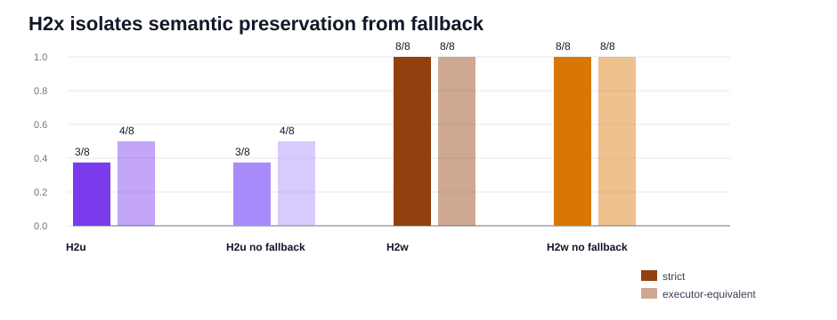

# H2x CLI Semantic Pressure Synthesis

Generated: `2026-05-17T20:57:01.612777+00:00`

## Summary

H2x is the first CLI-first semantic-pressure gate after the H2w transfer backtest. It deliberately mixes stale quoted negation, stale selection text, instructional negation, and genuine displayed negated values so top-line readiness cannot hide semantic target dependence.

H2u reaches `3 / 8` strict and `4 / 8` executor-equivalent. H2w reaches `8 / 8` on both metrics, a `0.625` exact-rate gain and `0.5` executor-equivalence gain.

The no-fallback controls are the key attribution result: H2u no-fallback is unchanged from H2u, and H2w no-fallback is unchanged from H2w. On this slice, controller fallback is not the causal helper; semantic target preservation and value-bearing target-query normalization are.

A packaged live workflow smoke for `executive_semantic_target_pressure` also ran through the Rich CLI operator, wrote only inside the ephemeral sandbox, recorded three policy blocks, and stopped at an approval gate. That makes H2x both replay-attributable and live-harness attributable.

## Packet Rows

| profile_label | system_id | packet_dir | case_count | exact_success_count | exact_rate | executor_success_count | executor_rate |
| --- | --- | --- | --- | --- | --- | --- | --- |
| h2x_h2u_negation_guard | mlx_gemma4_e2b_reasoner_only_no_tool_turn_directive_visual_role_catalog_route_arbitration_residual_exactness_visual_stale_selection_gate_visual_value_bearing_target_query_synthesis_visual_contextual_surface_alias_routing_visual_composed_route_gating_visual_negation_guard | results/tool_probe_replay_live/20260517T_h2x_cli_semantic_pressure_h2u_execute_v1 | 8 | 3 | 0.375 | 4 | 0.5 |
| h2x_h2u_no_controller_fallback | mlx_gemma4_e2b_reasoner_only_h2u_no_controller_fallback | results/tool_probe_replay_live/20260517T_h2x_cli_semantic_pressure_h2u_no_fallback_execute_v1 | 8 | 3 | 0.375 | 4 | 0.5 |
| h2x_h2w_semantic_target_preservation | mlx_gemma4_e2b_reasoner_only_no_tool_turn_directive_visual_role_catalog_route_arbitration_residual_exactness_visual_stale_selection_gate_visual_value_bearing_target_query_synthesis_visual_contextual_surface_alias_routing_visual_composed_route_gating_visual_negation_guard_visual_semantic_target_preservation | results/tool_probe_replay_live/20260517T_h2x_cli_semantic_pressure_h2w_execute_v1 | 8 | 8 | 1.0 | 8 | 1.0 |
| h2x_h2w_no_controller_fallback | mlx_gemma4_e2b_reasoner_only_h2w_no_controller_fallback | results/tool_probe_replay_live/20260517T_h2x_cli_semantic_pressure_h2w_no_fallback_execute_v1 | 8 | 8 | 1.0 | 8 | 1.0 |

## Comparison Rows

| comparison_label | comparison_dir | shared_case_count | baseline_exact_rate | candidate_exact_rate | delta_exact_rate | baseline_executor_equivalence_rate | candidate_executor_equivalence_rate | delta_executor_equivalence_rate |
| --- | --- | --- | --- | --- | --- | --- | --- | --- |
| h2x_h2w_vs_h2u | results/tool_probe_replay_live_comparisons/20260517T_h2x_cli_semantic_pressure_h2w_vs_h2u_v1 | 8 | 0.375 | 1.0 | 0.625 | 0.5 | 1.0 | 0.5 |
| h2x_h2u_no_fallback_vs_h2u | results/tool_probe_replay_live_comparisons/20260517T_h2x_cli_semantic_pressure_h2u_no_fallback_vs_h2u_v1 | 8 | 0.375 | 0.375 | 0.0 | 0.5 | 0.5 | 0.0 |
| h2x_h2w_no_fallback_vs_h2w | results/tool_probe_replay_live_comparisons/20260517T_h2x_cli_semantic_pressure_h2w_no_fallback_vs_h2w_v1 | 8 | 1.0 | 1.0 | 0.0 | 1.0 | 1.0 | 0.0 |

## Family Rows

| profile_label | family | case_count | exact_success_count | exact_rate | executor_success_count | executor_rate |
| --- | --- | --- | --- | --- | --- | --- |
| h2x_h2u_negation_guard | h2x_genuine_negated_target_value | 4 | 0 | 0.0 | 1 | 0.25 |
| h2x_h2u_negation_guard | h2x_instructional_negation_context | 1 | 1 | 1.0 | 1 | 1.0 |
| h2x_h2u_negation_guard | h2x_quoted_stale_negation_context | 2 | 2 | 1.0 | 2 | 1.0 |
| h2x_h2u_negation_guard | h2x_stale_selection_negation_context | 1 | 0 | 0.0 | 0 | 0.0 |
| h2x_h2u_no_controller_fallback | h2x_genuine_negated_target_value | 4 | 0 | 0.0 | 1 | 0.25 |
| h2x_h2u_no_controller_fallback | h2x_instructional_negation_context | 1 | 1 | 1.0 | 1 | 1.0 |
| h2x_h2u_no_controller_fallback | h2x_quoted_stale_negation_context | 2 | 2 | 1.0 | 2 | 1.0 |
| h2x_h2u_no_controller_fallback | h2x_stale_selection_negation_context | 1 | 0 | 0.0 | 0 | 0.0 |
| h2x_h2w_semantic_target_preservation | h2x_genuine_negated_target_value | 4 | 4 | 1.0 | 4 | 1.0 |
| h2x_h2w_semantic_target_preservation | h2x_instructional_negation_context | 1 | 1 | 1.0 | 1 | 1.0 |
| h2x_h2w_semantic_target_preservation | h2x_quoted_stale_negation_context | 2 | 2 | 1.0 | 2 | 1.0 |
| h2x_h2w_semantic_target_preservation | h2x_stale_selection_negation_context | 1 | 1 | 1.0 | 1 | 1.0 |
| h2x_h2w_no_controller_fallback | h2x_genuine_negated_target_value | 4 | 4 | 1.0 | 4 | 1.0 |
| h2x_h2w_no_controller_fallback | h2x_instructional_negation_context | 1 | 1 | 1.0 | 1 | 1.0 |
| h2x_h2w_no_controller_fallback | h2x_quoted_stale_negation_context | 2 | 2 | 1.0 | 2 | 1.0 |
| h2x_h2w_no_controller_fallback | h2x_stale_selection_negation_context | 1 | 1 | 1.0 | 1 | 1.0 |

## Non-Exact Rows

| profile_label | case_id | family | failure_mode | executor_equivalence_match | expected_tool | expected_target_query | actual_tool | actual_target_query |
| --- | --- | --- | --- | --- | --- | --- | --- | --- |
| h2x_h2u_negation_guard | h2x_risk_lane_stale_selection_not_lane | h2x_stale_selection_negation_context | wrong_tool | False | extract_layout | risk lane | refine_selection |  |
| h2x_h2u_negation_guard | h2x_not_ready_status_badge_value_before_component | h2x_genuine_negated_target_value | argument_mismatch | False | extract_layout | status badge not ready | extract_layout | not ready |
| h2x_h2u_negation_guard | h2x_not_applicable_reason_chip_value_before_component | h2x_genuine_negated_target_value | argument_mismatch | False | extract_layout | reason chip not applicable | extract_layout | not Applicable |
| h2x_h2u_negation_guard | h2x_not_approved_approval_toggle_value_before_component | h2x_genuine_negated_target_value | argument_mismatch | False | extract_layout | approval toggle not approved | extract_layout | not approved |
| h2x_h2u_negation_guard | h2x_not_blocked_result_tile_value_before_component | h2x_genuine_negated_target_value | executable_paraphrase | True | extract_layout | result tile not blocked | extract_layout | not blocked |
| h2x_h2u_no_controller_fallback | h2x_risk_lane_stale_selection_not_lane | h2x_stale_selection_negation_context | wrong_tool | False | extract_layout | risk lane | refine_selection |  |
| h2x_h2u_no_controller_fallback | h2x_not_ready_status_badge_value_before_component | h2x_genuine_negated_target_value | argument_mismatch | False | extract_layout | status badge not ready | extract_layout | not ready |
| h2x_h2u_no_controller_fallback | h2x_not_applicable_reason_chip_value_before_component | h2x_genuine_negated_target_value | argument_mismatch | False | extract_layout | reason chip not applicable | extract_layout | not Applicable |
| h2x_h2u_no_controller_fallback | h2x_not_approved_approval_toggle_value_before_component | h2x_genuine_negated_target_value | argument_mismatch | False | extract_layout | approval toggle not approved | extract_layout | not approved |
| h2x_h2u_no_controller_fallback | h2x_not_blocked_result_tile_value_before_component | h2x_genuine_negated_target_value | executable_paraphrase | True | extract_layout | result tile not blocked | extract_layout | not blocked |

## Controller Intervention Rows

| profile_label | case_id | family | intervention_kind | from_tool | from_arguments | to_tool | to_arguments | preserved_target_query | requested_label | requested_region_id | prompt_state_label | blocked_label | reason |
| --- | --- | --- | --- | --- | --- | --- | --- | --- | --- | --- | --- | --- | --- |
| h2x_h2u_negation_guard | h2x_status_badge_quoted_not_badge_note | h2x_quoted_stale_negation_context | visual_target_query_normalization_blocked | extract_layout | {"image_id":"img-h2x-status-badge-quote","target_query":"status badge"} |  | {} | status badge |  |  | review note | review note | negation_scope_exact_layout_label |
| h2x_h2u_negation_guard | h2x_status_badge_quoted_not_badge_note | h2x_quoted_stale_negation_context | visual_composed_route_gating_blocked | extract_layout | {"image_id":"img-h2x-status-badge-quote","target_query":"status badge"} |  | {} | status badge |  |  |  | review note | negation_scope_exact_layout_label |
| h2x_h2u_negation_guard | h2x_owner_field_do_not_use_memo | h2x_instructional_negation_context | visual_target_query_normalization | extract_layout | {"image_id":"img-h2x-owner-field-memo","target_query":"owner Nia"} | extract_layout | {"image_id":"img-h2x-owner-field-memo","target_query":"owner field"} |  |  |  | owner field |  |  |
| h2x_h2u_no_controller_fallback | h2x_status_badge_quoted_not_badge_note | h2x_quoted_stale_negation_context | visual_target_query_normalization_blocked | extract_layout | {"image_id":"img-h2x-status-badge-quote","target_query":"status badge"} |  | {} | status badge |  |  | review note | review note | negation_scope_exact_layout_label |
| h2x_h2u_no_controller_fallback | h2x_status_badge_quoted_not_badge_note | h2x_quoted_stale_negation_context | visual_composed_route_gating_blocked | extract_layout | {"image_id":"img-h2x-status-badge-quote","target_query":"status badge"} |  | {} | status badge |  |  |  | review note | negation_scope_exact_layout_label |
| h2x_h2u_no_controller_fallback | h2x_owner_field_do_not_use_memo | h2x_instructional_negation_context | visual_target_query_normalization | extract_layout | {"image_id":"img-h2x-owner-field-memo","target_query":"owner Nia"} | extract_layout | {"image_id":"img-h2x-owner-field-memo","target_query":"owner field"} |  |  |  | owner field |  |  |
| h2x_h2w_semantic_target_preservation | h2x_status_badge_quoted_not_badge_note | h2x_quoted_stale_negation_context | visual_semantic_target_preservation | extract_layout | {"image_id":"img-h2x-status-badge-quote","target_query":"status badge"} | extract_layout | {"image_id":"img-h2x-status-badge-quote","target_query":"status badge"} | status badge |  |  | status badge | review note | semantic_label_preserved_over_stale_context |
| h2x_h2w_semantic_target_preservation | h2x_status_badge_quoted_not_badge_note | h2x_quoted_stale_negation_context | visual_composed_route_gating_blocked | extract_layout | {"image_id":"img-h2x-status-badge-quote","target_query":"status badge"} |  | {} | status badge |  |  |  | review note | negation_scope_exact_layout_label |
| h2x_h2w_semantic_target_preservation | h2x_risk_lane_stale_selection_not_lane | h2x_stale_selection_negation_context | visual_composed_route_gating | refine_selection | {"filter_query":"High","selection_id":"sel-stale"} | extract_layout | {"image_id":"img-h2x-risk-lane-stale-selection","target_query":"risk lane"} |  | risk lane | h2x-risk-lane-17022 |  |  | stale_selection_to_requested_surface |
| h2x_h2w_semantic_target_preservation | h2x_owner_field_do_not_use_memo | h2x_instructional_negation_context | visual_target_query_normalization | extract_layout | {"image_id":"img-h2x-owner-field-memo","target_query":"owner Nia"} | extract_layout | {"image_id":"img-h2x-owner-field-memo","target_query":"owner field"} |  |  |  | owner field |  |  |
| h2x_h2w_semantic_target_preservation | h2x_not_ready_status_badge_value_before_component | h2x_genuine_negated_target_value | visual_target_query_normalization | extract_layout | {"image_id":"img-h2x-not-ready-status-badge","target_query":"not ready"} | extract_layout | {"image_id":"img-h2x-not-ready-status-badge","target_query":"status badge not ready"} |  |  |  | status badge not ready |  |  |
| h2x_h2w_semantic_target_preservation | h2x_not_applicable_reason_chip_value_before_component | h2x_genuine_negated_target_value | visual_target_query_normalization | extract_layout | {"image_id":"img-h2x-not-applicable-reason-chip","target_query":"not Applicable"} | extract_layout | {"image_id":"img-h2x-not-applicable-reason-chip","target_query":"reason chip not applicable"} |  |  |  | reason chip not applicable |  |  |
| h2x_h2w_semantic_target_preservation | h2x_not_approved_approval_toggle_value_before_component | h2x_genuine_negated_target_value | visual_target_query_normalization | extract_layout | {"image_id":"img-h2x-not-approved-toggle","target_query":"not approved"} | extract_layout | {"image_id":"img-h2x-not-approved-toggle","target_query":"approval toggle not approved"} |  |  |  | approval toggle not approved |  |  |
| h2x_h2w_semantic_target_preservation | h2x_not_blocked_result_tile_value_before_component | h2x_genuine_negated_target_value | visual_target_query_normalization | extract_layout | {"image_id":"img-h2x-not-blocked-result-tile","target_query":"not blocked"} | extract_layout | {"image_id":"img-h2x-not-blocked-result-tile","target_query":"result tile not blocked"} |  |  |  | result tile not blocked |  |  |
| h2x_h2w_no_controller_fallback | h2x_status_badge_quoted_not_badge_note | h2x_quoted_stale_negation_context | visual_semantic_target_preservation | extract_layout | {"image_id":"img-h2x-status-badge-quote","target_query":"status badge"} | extract_layout | {"image_id":"img-h2x-status-badge-quote","target_query":"status badge"} | status badge |  |  | status badge | review note | semantic_label_preserved_over_stale_context |
| h2x_h2w_no_controller_fallback | h2x_status_badge_quoted_not_badge_note | h2x_quoted_stale_negation_context | visual_composed_route_gating_blocked | extract_layout | {"image_id":"img-h2x-status-badge-quote","target_query":"status badge"} |  | {} | status badge |  |  |  | review note | negation_scope_exact_layout_label |
| h2x_h2w_no_controller_fallback | h2x_risk_lane_stale_selection_not_lane | h2x_stale_selection_negation_context | visual_composed_route_gating | refine_selection | {"filter_query":"High","selection_id":"sel-stale"} | extract_layout | {"image_id":"img-h2x-risk-lane-stale-selection","target_query":"risk lane"} |  | risk lane | h2x-risk-lane-17022 |  |  | stale_selection_to_requested_surface |
| h2x_h2w_no_controller_fallback | h2x_owner_field_do_not_use_memo | h2x_instructional_negation_context | visual_target_query_normalization | extract_layout | {"image_id":"img-h2x-owner-field-memo","target_query":"owner Nia"} | extract_layout | {"image_id":"img-h2x-owner-field-memo","target_query":"owner field"} |  |  |  | owner field |  |  |
| h2x_h2w_no_controller_fallback | h2x_not_ready_status_badge_value_before_component | h2x_genuine_negated_target_value | visual_target_query_normalization | extract_layout | {"image_id":"img-h2x-not-ready-status-badge","target_query":"not ready"} | extract_layout | {"image_id":"img-h2x-not-ready-status-badge","target_query":"status badge not ready"} |  |  |  | status badge not ready |  |  |
| h2x_h2w_no_controller_fallback | h2x_not_applicable_reason_chip_value_before_component | h2x_genuine_negated_target_value | visual_target_query_normalization | extract_layout | {"image_id":"img-h2x-not-applicable-reason-chip","target_query":"not Applicable"} | extract_layout | {"image_id":"img-h2x-not-applicable-reason-chip","target_query":"reason chip not applicable"} |  |  |  | reason chip not applicable |  |  |
| h2x_h2w_no_controller_fallback | h2x_not_approved_approval_toggle_value_before_component | h2x_genuine_negated_target_value | visual_target_query_normalization | extract_layout | {"image_id":"img-h2x-not-approved-toggle","target_query":"not approved"} | extract_layout | {"image_id":"img-h2x-not-approved-toggle","target_query":"approval toggle not approved"} |  |  |  | approval toggle not approved |  |  |
| h2x_h2w_no_controller_fallback | h2x_not_blocked_result_tile_value_before_component | h2x_genuine_negated_target_value | visual_target_query_normalization | extract_layout | {"image_id":"img-h2x-not-blocked-result-tile","target_query":"not blocked"} | extract_layout | {"image_id":"img-h2x-not-blocked-result-tile","target_query":"result tile not blocked"} |  |  |  | result tile not blocked |  |  |

## Fixed Case Rows

| comparison_label | case_id | family | baseline_failure_mode | candidate_failure_mode | baseline_executor_equivalence_match | candidate_executor_equivalence_match |
| --- | --- | --- | --- | --- | --- | --- |
| h2x_h2w_vs_h2u | h2x_not_applicable_reason_chip_value_before_component | h2x_genuine_negated_target_value | argument_mismatch | exact | False | True |
| h2x_h2w_vs_h2u | h2x_not_approved_approval_toggle_value_before_component | h2x_genuine_negated_target_value | argument_mismatch | exact | False | True |
| h2x_h2w_vs_h2u | h2x_not_blocked_result_tile_value_before_component | h2x_genuine_negated_target_value | executable_paraphrase | exact | True | True |
| h2x_h2w_vs_h2u | h2x_not_ready_status_badge_value_before_component | h2x_genuine_negated_target_value | argument_mismatch | exact | False | True |
| h2x_h2w_vs_h2u | h2x_risk_lane_stale_selection_not_lane | h2x_stale_selection_negation_context | wrong_tool | exact | False | True |

## Findings

| finding_id | finding |
| --- | --- |
| h2x_breaks_h2u_topline_saturation | H2x drops H2u to 3/8 strict and 4/8 executor-equivalent, exposing semantic target pressure hidden by earlier top-line saturation. |
| h2w_repairs_h2x_without_fallback | H2w reaches 8/8 strict and 8/8 executor-equivalent, with the no-fallback H2w profile also at 8/8. |
| semantic_preservation_is_causal_not_fallback | H2w vs H2u gains 0.625 exact and 0.5 executor-equivalence; fallback is not the causal helper on this slice because enabling controller fallback changes H2u by 0.0 exact and H2w by 0.0 exact. |
| h2x_mechanism_mix | H2w fixes 5 H2u strict misses and records 1 semantic-preservation, 5 value-bearing target-query normalization, and 1 composed-route interventions. |
| h2x_promotes_to_packaged_cli_gate | H2w is exact across H2x families (h2x_genuine_negated_target_value 4/4, h2x_instructional_negation_context 1/1, h2x_quoted_stale_negation_context 2/2, h2x_stale_selection_negation_context 1/1). The packaged live workflow smoke also reaches an approval gate in the sandbox, so the next research move is a larger packaged H1 slice rather than another same-shape replay repair. |
