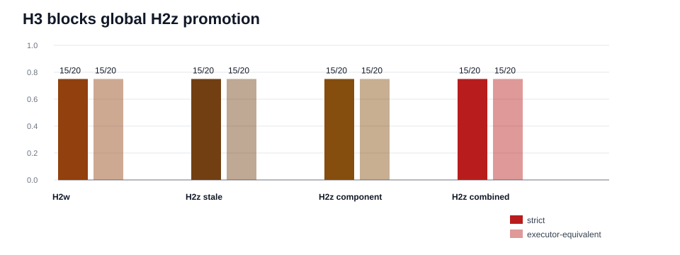

# H3 CLI Controller Holdout Synthesis

Generated: `2026-05-19T22:56:44.987330+00:00`

## Summary

H3 is the fresh holdout after H2z. It keeps the H2y/H2z ambiguity classes but changes workflow family, state layout order, stale-selection phrasing, label order, and negative-value vocabulary.

H2w: `15 / 20`. H2z stale-only: `15 / 20`. H2z component-only: `15 / 20`. H2z combined: `15 / 20`.

Decision: do not globally promote H2z yet. H3 shows the known-boundary helpers do not transfer to paraphrased stale-selection language or broader negative-value syntax without further controller work.

## Packet Rows

| profile_label | system_id | packet_dir | case_count | exact_success_count | exact_rate | executor_success_count | executor_rate |
| --- | --- | --- | --- | --- | --- | --- | --- |
| h3_h2w_semantic_target_preservation | mlx_gemma4_e2b_reasoner_only_no_tool_turn_directive_visual_role_catalog_route_arbitration_residual_exactness_visual_stale_selection_gate_visual_value_bearing_target_query_synthesis_visual_contextual_surface_alias_routing_visual_composed_route_gating_visual_negation_guard_visual_semantic_target_preservation | results/tool_probe_replay_live/20260519T_h3_cli_controller_holdout_h2w_execute_v1 | 20 | 15 | 0.75 | 15 | 0.75 |
| h3_h2z_stale_selection_negation_guard | mlx_gemma4_e2b_reasoner_only_h2z_stale_selection_negation_guard | results/tool_probe_replay_live/20260519T_h3_cli_controller_holdout_h2z_stale_negation_execute_v1 | 20 | 15 | 0.75 | 15 | 0.75 |
| h3_h2z_negated_component_target_preservation | mlx_gemma4_e2b_reasoner_only_h2z_negated_component_target_preservation | results/tool_probe_replay_live/20260519T_h3_cli_controller_holdout_h2z_negated_component_execute_v1 | 20 | 15 | 0.75 | 15 | 0.75 |
| h3_h2z_boundary_combined | mlx_gemma4_e2b_reasoner_only_h2z_boundary_combined | results/tool_probe_replay_live/20260519T_h3_cli_controller_holdout_h2z_combined_execute_v1 | 20 | 15 | 0.75 | 15 | 0.75 |

## Comparison Rows

| comparison_label | comparison_dir | shared_case_count | baseline_exact_rate | candidate_exact_rate | delta_exact_rate | baseline_executor_equivalence_rate | candidate_executor_equivalence_rate | delta_executor_equivalence_rate |
| --- | --- | --- | --- | --- | --- | --- | --- | --- |
| h3_h2z_stale_vs_h2w | results/tool_probe_replay_live_comparisons/20260519T_h3_cli_controller_holdout_h2z_stale_vs_h2w_v1 | 20 | 0.75 | 0.75 | 0.0 | 0.75 | 0.75 | 0.0 |
| h3_h2z_component_vs_h2w | results/tool_probe_replay_live_comparisons/20260519T_h3_cli_controller_holdout_h2z_component_vs_h2w_v1 | 20 | 0.75 | 0.75 | 0.0 | 0.75 | 0.75 | 0.0 |
| h3_h2z_combined_vs_h2w | results/tool_probe_replay_live_comparisons/20260519T_h3_cli_controller_holdout_h2z_combined_vs_h2w_v1 | 20 | 0.75 | 0.75 | 0.0 | 0.75 | 0.75 | 0.0 |
| h3_h2z_combined_vs_stale | results/tool_probe_replay_live_comparisons/20260519T_h3_cli_controller_holdout_h2z_combined_vs_stale_v1 | 20 | 0.75 | 0.75 | 0.0 | 0.75 | 0.75 | 0.0 |
| h3_h2z_combined_vs_component | results/tool_probe_replay_live_comparisons/20260519T_h3_cli_controller_holdout_h2z_combined_vs_component_v1 | 20 | 0.75 | 0.75 | 0.0 | 0.75 | 0.75 | 0.0 |

## Family Rows

| profile_label | family | case_count | exact_success_count | exact_rate | executor_success_count | executor_rate |
| --- | --- | --- | --- | --- | --- | --- |
| h3_h2w_semantic_target_preservation | h3_finance_stale_selection_paraphrase | 4 | 2 | 0.5 | 2 | 0.5 |
| h3_h2w_semantic_target_preservation | h3_mixed_workflow_instructional_negation | 4 | 4 | 1.0 | 4 | 1.0 |
| h3_h2w_semantic_target_preservation | h3_policy_label_order_inversion | 4 | 4 | 1.0 | 4 | 1.0 |
| h3_h2w_semantic_target_preservation | h3_research_stale_selection_paraphrase | 4 | 2 | 0.5 | 2 | 0.5 |
| h3_h2w_semantic_target_preservation | h3_support_negated_component_syntax | 4 | 3 | 0.75 | 3 | 0.75 |
| h3_h2z_stale_selection_negation_guard | h3_finance_stale_selection_paraphrase | 4 | 2 | 0.5 | 2 | 0.5 |
| h3_h2z_stale_selection_negation_guard | h3_mixed_workflow_instructional_negation | 4 | 4 | 1.0 | 4 | 1.0 |
| h3_h2z_stale_selection_negation_guard | h3_policy_label_order_inversion | 4 | 4 | 1.0 | 4 | 1.0 |
| h3_h2z_stale_selection_negation_guard | h3_research_stale_selection_paraphrase | 4 | 2 | 0.5 | 2 | 0.5 |
| h3_h2z_stale_selection_negation_guard | h3_support_negated_component_syntax | 4 | 3 | 0.75 | 3 | 0.75 |
| h3_h2z_negated_component_target_preservation | h3_finance_stale_selection_paraphrase | 4 | 2 | 0.5 | 2 | 0.5 |
| h3_h2z_negated_component_target_preservation | h3_mixed_workflow_instructional_negation | 4 | 4 | 1.0 | 4 | 1.0 |
| h3_h2z_negated_component_target_preservation | h3_policy_label_order_inversion | 4 | 4 | 1.0 | 4 | 1.0 |
| h3_h2z_negated_component_target_preservation | h3_research_stale_selection_paraphrase | 4 | 2 | 0.5 | 2 | 0.5 |
| h3_h2z_negated_component_target_preservation | h3_support_negated_component_syntax | 4 | 3 | 0.75 | 3 | 0.75 |
| h3_h2z_boundary_combined | h3_finance_stale_selection_paraphrase | 4 | 2 | 0.5 | 2 | 0.5 |
| h3_h2z_boundary_combined | h3_mixed_workflow_instructional_negation | 4 | 4 | 1.0 | 4 | 1.0 |
| h3_h2z_boundary_combined | h3_policy_label_order_inversion | 4 | 4 | 1.0 | 4 | 1.0 |
| h3_h2z_boundary_combined | h3_research_stale_selection_paraphrase | 4 | 2 | 0.5 | 2 | 0.5 |
| h3_h2z_boundary_combined | h3_support_negated_component_syntax | 4 | 3 | 0.75 | 3 | 0.75 |

## Non-Exact Rows

| profile_label | case_id | family | failure_mode | executor_equivalence_match | expected_tool | expected_target_query | actual_tool | actual_target_query |
| --- | --- | --- | --- | --- | --- | --- | --- | --- |
| h3_h2w_semantic_target_preservation | h3_finance_renewal_lane_retired_view | h3_finance_stale_selection_paraphrase | wrong_tool | False | extract_layout | renewal lane | refine_selection |  |
| h3_h2w_semantic_target_preservation | h3_finance_forecast_tile_leftover_evidence | h3_finance_stale_selection_paraphrase | wrong_tool | False | extract_layout | forecast tile | refine_selection |  |
| h3_h2w_semantic_target_preservation | h3_research_claim_panel_carryover_selection | h3_research_stale_selection_paraphrase | wrong_tool | False | extract_layout | claim panel | refine_selection |  |
| h3_h2w_semantic_target_preservation | h3_research_evidence_badge_retired_selection | h3_research_stale_selection_paraphrase | wrong_tool | False | extract_layout | evidence badge | refine_selection |  |
| h3_h2w_semantic_target_preservation | h3_support_inactive_alert_banner | h3_support_negated_component_syntax | argument_mismatch | False | extract_layout | alert banner inactive | extract_layout | alert inactive |
| h3_h2z_stale_selection_negation_guard | h3_finance_renewal_lane_retired_view | h3_finance_stale_selection_paraphrase | wrong_tool | False | extract_layout | renewal lane | refine_selection |  |
| h3_h2z_stale_selection_negation_guard | h3_finance_forecast_tile_leftover_evidence | h3_finance_stale_selection_paraphrase | wrong_tool | False | extract_layout | forecast tile | refine_selection |  |
| h3_h2z_stale_selection_negation_guard | h3_research_claim_panel_carryover_selection | h3_research_stale_selection_paraphrase | wrong_tool | False | extract_layout | claim panel | refine_selection |  |
| h3_h2z_stale_selection_negation_guard | h3_research_evidence_badge_retired_selection | h3_research_stale_selection_paraphrase | wrong_tool | False | extract_layout | evidence badge | refine_selection |  |
| h3_h2z_stale_selection_negation_guard | h3_support_inactive_alert_banner | h3_support_negated_component_syntax | argument_mismatch | False | extract_layout | alert banner inactive | extract_layout | alert inactive |
| h3_h2z_negated_component_target_preservation | h3_finance_renewal_lane_retired_view | h3_finance_stale_selection_paraphrase | wrong_tool | False | extract_layout | renewal lane | refine_selection |  |
| h3_h2z_negated_component_target_preservation | h3_finance_forecast_tile_leftover_evidence | h3_finance_stale_selection_paraphrase | wrong_tool | False | extract_layout | forecast tile | refine_selection |  |
| h3_h2z_negated_component_target_preservation | h3_research_claim_panel_carryover_selection | h3_research_stale_selection_paraphrase | wrong_tool | False | extract_layout | claim panel | refine_selection |  |
| h3_h2z_negated_component_target_preservation | h3_research_evidence_badge_retired_selection | h3_research_stale_selection_paraphrase | wrong_tool | False | extract_layout | evidence badge | refine_selection |  |
| h3_h2z_negated_component_target_preservation | h3_support_inactive_alert_banner | h3_support_negated_component_syntax | argument_mismatch | False | extract_layout | alert banner inactive | extract_layout | alert inactive |
| h3_h2z_boundary_combined | h3_finance_renewal_lane_retired_view | h3_finance_stale_selection_paraphrase | wrong_tool | False | extract_layout | renewal lane | refine_selection |  |
| h3_h2z_boundary_combined | h3_finance_forecast_tile_leftover_evidence | h3_finance_stale_selection_paraphrase | wrong_tool | False | extract_layout | forecast tile | refine_selection |  |
| h3_h2z_boundary_combined | h3_research_claim_panel_carryover_selection | h3_research_stale_selection_paraphrase | wrong_tool | False | extract_layout | claim panel | refine_selection |  |
| h3_h2z_boundary_combined | h3_research_evidence_badge_retired_selection | h3_research_stale_selection_paraphrase | wrong_tool | False | extract_layout | evidence badge | refine_selection |  |
| h3_h2z_boundary_combined | h3_support_inactive_alert_banner | h3_support_negated_component_syntax | argument_mismatch | False | extract_layout | alert banner inactive | extract_layout | alert inactive |

## Controller Intervention Rows

| profile_label | case_id | family | intervention_kind | from_tool | from_arguments | to_tool | to_arguments | preserved_target_query | requested_label | requested_region_id | prompt_state_label | blocked_label | reason |
| --- | --- | --- | --- | --- | --- | --- | --- | --- | --- | --- | --- | --- | --- |
| h3_h2w_semantic_target_preservation | h3_support_disabled_escalation_toggle | h3_support_negated_component_syntax | visual_target_query_normalization | extract_layout | {"image_id":"img-h3-support-disabled-toggle","target_query":"disabled toggle"} | extract_layout | {"image_id":"img-h3-support-disabled-toggle","target_query":"escalation toggle disabled"} |  |  |  | escalation toggle disabled |  |  |
| h3_h2w_semantic_target_preservation | h3_support_unresolved_ticket_badge | h3_support_negated_component_syntax | visual_target_query_normalization | extract_layout | {"image_id":"img-h3-support-unresolved-ticket-badge","target_query":"unresolved badge"} | extract_layout | {"image_id":"img-h3-support-unresolved-ticket-badge","target_query":"ticket badge unresolved"} |  |  |  | ticket badge unresolved |  |  |
| h3_h2w_semantic_target_preservation | h3_support_unassigned_owner_field | h3_support_negated_component_syntax | visual_target_query_normalization | extract_layout | {"image_id":"img-h3-support-unassigned-owner-field","target_query":"owner field"} | extract_layout | {"image_id":"img-h3-support-unassigned-owner-field","target_query":"owner field unassigned"} |  |  |  | owner field unassigned |  |  |
| h3_h2w_semantic_target_preservation | h3_policy_paused_state_pill_value_first | h3_policy_label_order_inversion | visual_target_query_normalization | extract_layout | {"image_id":"img-h3-policy-paused-state-pill","target_query":"paused state pill"} | extract_layout | {"image_id":"img-h3-policy-paused-state-pill","target_query":"state pill paused"} |  |  |  | state pill paused |  |  |
| h3_h2w_semantic_target_preservation | h3_policy_rejected_approval_chip_value_first | h3_policy_label_order_inversion | visual_target_query_normalization | extract_layout | {"image_id":"img-h3-policy-rejected-approval-chip","target_query":"rejected"} | extract_layout | {"image_id":"img-h3-policy-rejected-approval-chip","target_query":"approval chip rejected"} |  |  |  | approval chip rejected |  |  |
| h3_h2w_semantic_target_preservation | h3_policy_missing_evidence_field_value_first | h3_policy_label_order_inversion | visual_target_query_normalization | extract_layout | {"image_id":"img-h3-policy-missing-evidence-field","target_query":"missing"} | extract_layout | {"image_id":"img-h3-policy-missing-evidence-field","target_query":"evidence field missing"} |  |  |  | evidence field missing |  |  |
| h3_h2w_semantic_target_preservation | h3_policy_expired_policy_banner_value_first | h3_policy_label_order_inversion | visual_target_query_normalization | extract_layout | {"image_id":"img-h3-policy-expired-banner","target_query":"expired banner"} | extract_layout | {"image_id":"img-h3-policy-expired-banner","target_query":"policy banner expired"} |  |  |  | policy banner expired |  |  |
| h3_h2w_semantic_target_preservation | h3_legal_contract_risk_badge_note_decoy | h3_mixed_workflow_instructional_negation | visual_target_query_normalization | extract_layout | {"image_id":"img-h3-legal-contract-risk-badge","target_query":"risk badge"} | extract_layout | {"image_id":"img-h3-legal-contract-risk-badge","target_query":"contract risk badge"} |  |  |  | contract risk badge |  |  |
| h3_h2w_semantic_target_preservation | h3_recruiting_candidate_stage_tile_table_decoy | h3_mixed_workflow_instructional_negation | visual_target_query_normalization | extract_layout | {"image_id":"img-h3-recruiting-stage-tile","target_query":"stage tile"} | extract_layout | {"image_id":"img-h3-recruiting-stage-tile","target_query":"candidate stage tile"} |  |  |  | candidate stage tile |  |  |
| h3_h2w_semantic_target_preservation | h3_clinical_triage_priority_chip_memo_decoy | h3_mixed_workflow_instructional_negation | visual_semantic_target_preservation | extract_layout | {"image_id":"img-h3-clinical-priority-chip","target_query":"triage priority chip"} | extract_layout | {"image_id":"img-h3-clinical-priority-chip","target_query":"triage priority chip"} | triage priority chip |  |  | triage priority chip | priority memo | semantic_label_preserved_over_stale_context |
| h3_h2w_semantic_target_preservation | h3_ops_deployment_gate_panel_log_decoy | h3_mixed_workflow_instructional_negation | visual_target_query_normalization | extract_layout | {"image_id":"img-h3-ops-deployment-gate-panel","target_query":"gate log"} | extract_layout | {"image_id":"img-h3-ops-deployment-gate-panel","target_query":"deployment gate panel"} |  |  |  | deployment gate panel |  |  |
| h3_h2z_stale_selection_negation_guard | h3_support_disabled_escalation_toggle | h3_support_negated_component_syntax | visual_target_query_normalization | extract_layout | {"image_id":"img-h3-support-disabled-toggle","target_query":"disabled toggle"} | extract_layout | {"image_id":"img-h3-support-disabled-toggle","target_query":"escalation toggle disabled"} |  |  |  | escalation toggle disabled |  |  |
| h3_h2z_stale_selection_negation_guard | h3_support_unresolved_ticket_badge | h3_support_negated_component_syntax | visual_target_query_normalization | extract_layout | {"image_id":"img-h3-support-unresolved-ticket-badge","target_query":"unresolved badge"} | extract_layout | {"image_id":"img-h3-support-unresolved-ticket-badge","target_query":"ticket badge unresolved"} |  |  |  | ticket badge unresolved |  |  |
| h3_h2z_stale_selection_negation_guard | h3_support_unassigned_owner_field | h3_support_negated_component_syntax | visual_target_query_normalization | extract_layout | {"image_id":"img-h3-support-unassigned-owner-field","target_query":"owner field"} | extract_layout | {"image_id":"img-h3-support-unassigned-owner-field","target_query":"owner field unassigned"} |  |  |  | owner field unassigned |  |  |
| h3_h2z_stale_selection_negation_guard | h3_policy_paused_state_pill_value_first | h3_policy_label_order_inversion | visual_target_query_normalization | extract_layout | {"image_id":"img-h3-policy-paused-state-pill","target_query":"paused state pill"} | extract_layout | {"image_id":"img-h3-policy-paused-state-pill","target_query":"state pill paused"} |  |  |  | state pill paused |  |  |
| h3_h2z_stale_selection_negation_guard | h3_policy_rejected_approval_chip_value_first | h3_policy_label_order_inversion | visual_target_query_normalization | extract_layout | {"image_id":"img-h3-policy-rejected-approval-chip","target_query":"rejected"} | extract_layout | {"image_id":"img-h3-policy-rejected-approval-chip","target_query":"approval chip rejected"} |  |  |  | approval chip rejected |  |  |
| h3_h2z_stale_selection_negation_guard | h3_policy_missing_evidence_field_value_first | h3_policy_label_order_inversion | visual_target_query_normalization | extract_layout | {"image_id":"img-h3-policy-missing-evidence-field","target_query":"missing"} | extract_layout | {"image_id":"img-h3-policy-missing-evidence-field","target_query":"evidence field missing"} |  |  |  | evidence field missing |  |  |
| h3_h2z_stale_selection_negation_guard | h3_policy_expired_policy_banner_value_first | h3_policy_label_order_inversion | visual_target_query_normalization | extract_layout | {"image_id":"img-h3-policy-expired-banner","target_query":"expired banner"} | extract_layout | {"image_id":"img-h3-policy-expired-banner","target_query":"policy banner expired"} |  |  |  | policy banner expired |  |  |
| h3_h2z_stale_selection_negation_guard | h3_legal_contract_risk_badge_note_decoy | h3_mixed_workflow_instructional_negation | visual_target_query_normalization | extract_layout | {"image_id":"img-h3-legal-contract-risk-badge","target_query":"risk badge"} | extract_layout | {"image_id":"img-h3-legal-contract-risk-badge","target_query":"contract risk badge"} |  |  |  | contract risk badge |  |  |
| h3_h2z_stale_selection_negation_guard | h3_recruiting_candidate_stage_tile_table_decoy | h3_mixed_workflow_instructional_negation | visual_target_query_normalization | extract_layout | {"image_id":"img-h3-recruiting-stage-tile","target_query":"stage tile"} | extract_layout | {"image_id":"img-h3-recruiting-stage-tile","target_query":"candidate stage tile"} |  |  |  | candidate stage tile |  |  |
| h3_h2z_stale_selection_negation_guard | h3_clinical_triage_priority_chip_memo_decoy | h3_mixed_workflow_instructional_negation | visual_semantic_target_preservation | extract_layout | {"image_id":"img-h3-clinical-priority-chip","target_query":"triage priority chip"} | extract_layout | {"image_id":"img-h3-clinical-priority-chip","target_query":"triage priority chip"} | triage priority chip |  |  | triage priority chip | priority memo | semantic_label_preserved_over_stale_context |
| h3_h2z_stale_selection_negation_guard | h3_ops_deployment_gate_panel_log_decoy | h3_mixed_workflow_instructional_negation | visual_target_query_normalization | extract_layout | {"image_id":"img-h3-ops-deployment-gate-panel","target_query":"gate log"} | extract_layout | {"image_id":"img-h3-ops-deployment-gate-panel","target_query":"deployment gate panel"} |  |  |  | deployment gate panel |  |  |
| h3_h2z_negated_component_target_preservation | h3_support_disabled_escalation_toggle | h3_support_negated_component_syntax | visual_target_query_normalization | extract_layout | {"image_id":"img-h3-support-disabled-toggle","target_query":"disabled toggle"} | extract_layout | {"image_id":"img-h3-support-disabled-toggle","target_query":"escalation toggle disabled"} |  |  |  | escalation toggle disabled |  |  |
| h3_h2z_negated_component_target_preservation | h3_support_unresolved_ticket_badge | h3_support_negated_component_syntax | visual_target_query_normalization | extract_layout | {"image_id":"img-h3-support-unresolved-ticket-badge","target_query":"unresolved badge"} | extract_layout | {"image_id":"img-h3-support-unresolved-ticket-badge","target_query":"ticket badge unresolved"} |  |  |  | ticket badge unresolved |  |  |
| h3_h2z_negated_component_target_preservation | h3_support_unassigned_owner_field | h3_support_negated_component_syntax | visual_target_query_normalization | extract_layout | {"image_id":"img-h3-support-unassigned-owner-field","target_query":"owner field"} | extract_layout | {"image_id":"img-h3-support-unassigned-owner-field","target_query":"owner field unassigned"} |  |  |  | owner field unassigned |  |  |
| h3_h2z_negated_component_target_preservation | h3_policy_paused_state_pill_value_first | h3_policy_label_order_inversion | visual_target_query_normalization | extract_layout | {"image_id":"img-h3-policy-paused-state-pill","target_query":"paused state pill"} | extract_layout | {"image_id":"img-h3-policy-paused-state-pill","target_query":"state pill paused"} |  |  |  | state pill paused |  |  |
| h3_h2z_negated_component_target_preservation | h3_policy_rejected_approval_chip_value_first | h3_policy_label_order_inversion | visual_target_query_normalization | extract_layout | {"image_id":"img-h3-policy-rejected-approval-chip","target_query":"rejected"} | extract_layout | {"image_id":"img-h3-policy-rejected-approval-chip","target_query":"approval chip rejected"} |  |  |  | approval chip rejected |  |  |
| h3_h2z_negated_component_target_preservation | h3_policy_missing_evidence_field_value_first | h3_policy_label_order_inversion | visual_target_query_normalization | extract_layout | {"image_id":"img-h3-policy-missing-evidence-field","target_query":"missing"} | extract_layout | {"image_id":"img-h3-policy-missing-evidence-field","target_query":"evidence field missing"} |  |  |  | evidence field missing |  |  |
| h3_h2z_negated_component_target_preservation | h3_policy_expired_policy_banner_value_first | h3_policy_label_order_inversion | visual_target_query_normalization | extract_layout | {"image_id":"img-h3-policy-expired-banner","target_query":"expired banner"} | extract_layout | {"image_id":"img-h3-policy-expired-banner","target_query":"policy banner expired"} |  |  |  | policy banner expired |  |  |
| h3_h2z_negated_component_target_preservation | h3_legal_contract_risk_badge_note_decoy | h3_mixed_workflow_instructional_negation | visual_target_query_normalization | extract_layout | {"image_id":"img-h3-legal-contract-risk-badge","target_query":"risk badge"} | extract_layout | {"image_id":"img-h3-legal-contract-risk-badge","target_query":"contract risk badge"} |  |  |  | contract risk badge |  |  |
| h3_h2z_negated_component_target_preservation | h3_recruiting_candidate_stage_tile_table_decoy | h3_mixed_workflow_instructional_negation | visual_target_query_normalization | extract_layout | {"image_id":"img-h3-recruiting-stage-tile","target_query":"stage tile"} | extract_layout | {"image_id":"img-h3-recruiting-stage-tile","target_query":"candidate stage tile"} |  |  |  | candidate stage tile |  |  |
| h3_h2z_negated_component_target_preservation | h3_clinical_triage_priority_chip_memo_decoy | h3_mixed_workflow_instructional_negation | visual_semantic_target_preservation | extract_layout | {"image_id":"img-h3-clinical-priority-chip","target_query":"triage priority chip"} | extract_layout | {"image_id":"img-h3-clinical-priority-chip","target_query":"triage priority chip"} | triage priority chip |  |  | triage priority chip | priority memo | semantic_label_preserved_over_stale_context |
| h3_h2z_negated_component_target_preservation | h3_ops_deployment_gate_panel_log_decoy | h3_mixed_workflow_instructional_negation | visual_target_query_normalization | extract_layout | {"image_id":"img-h3-ops-deployment-gate-panel","target_query":"gate log"} | extract_layout | {"image_id":"img-h3-ops-deployment-gate-panel","target_query":"deployment gate panel"} |  |  |  | deployment gate panel |  |  |
| h3_h2z_boundary_combined | h3_support_disabled_escalation_toggle | h3_support_negated_component_syntax | visual_target_query_normalization | extract_layout | {"image_id":"img-h3-support-disabled-toggle","target_query":"disabled toggle"} | extract_layout | {"image_id":"img-h3-support-disabled-toggle","target_query":"escalation toggle disabled"} |  |  |  | escalation toggle disabled |  |  |
| h3_h2z_boundary_combined | h3_support_unresolved_ticket_badge | h3_support_negated_component_syntax | visual_target_query_normalization | extract_layout | {"image_id":"img-h3-support-unresolved-ticket-badge","target_query":"unresolved badge"} | extract_layout | {"image_id":"img-h3-support-unresolved-ticket-badge","target_query":"ticket badge unresolved"} |  |  |  | ticket badge unresolved |  |  |
| h3_h2z_boundary_combined | h3_support_unassigned_owner_field | h3_support_negated_component_syntax | visual_target_query_normalization | extract_layout | {"image_id":"img-h3-support-unassigned-owner-field","target_query":"owner field"} | extract_layout | {"image_id":"img-h3-support-unassigned-owner-field","target_query":"owner field unassigned"} |  |  |  | owner field unassigned |  |  |
| h3_h2z_boundary_combined | h3_policy_paused_state_pill_value_first | h3_policy_label_order_inversion | visual_target_query_normalization | extract_layout | {"image_id":"img-h3-policy-paused-state-pill","target_query":"paused state pill"} | extract_layout | {"image_id":"img-h3-policy-paused-state-pill","target_query":"state pill paused"} |  |  |  | state pill paused |  |  |
| h3_h2z_boundary_combined | h3_policy_rejected_approval_chip_value_first | h3_policy_label_order_inversion | visual_target_query_normalization | extract_layout | {"image_id":"img-h3-policy-rejected-approval-chip","target_query":"rejected"} | extract_layout | {"image_id":"img-h3-policy-rejected-approval-chip","target_query":"approval chip rejected"} |  |  |  | approval chip rejected |  |  |
| h3_h2z_boundary_combined | h3_policy_missing_evidence_field_value_first | h3_policy_label_order_inversion | visual_target_query_normalization | extract_layout | {"image_id":"img-h3-policy-missing-evidence-field","target_query":"missing"} | extract_layout | {"image_id":"img-h3-policy-missing-evidence-field","target_query":"evidence field missing"} |  |  |  | evidence field missing |  |  |
| h3_h2z_boundary_combined | h3_policy_expired_policy_banner_value_first | h3_policy_label_order_inversion | visual_target_query_normalization | extract_layout | {"image_id":"img-h3-policy-expired-banner","target_query":"expired banner"} | extract_layout | {"image_id":"img-h3-policy-expired-banner","target_query":"policy banner expired"} |  |  |  | policy banner expired |  |  |
| h3_h2z_boundary_combined | h3_legal_contract_risk_badge_note_decoy | h3_mixed_workflow_instructional_negation | visual_target_query_normalization | extract_layout | {"image_id":"img-h3-legal-contract-risk-badge","target_query":"risk badge"} | extract_layout | {"image_id":"img-h3-legal-contract-risk-badge","target_query":"contract risk badge"} |  |  |  | contract risk badge |  |  |
| h3_h2z_boundary_combined | h3_recruiting_candidate_stage_tile_table_decoy | h3_mixed_workflow_instructional_negation | visual_target_query_normalization | extract_layout | {"image_id":"img-h3-recruiting-stage-tile","target_query":"stage tile"} | extract_layout | {"image_id":"img-h3-recruiting-stage-tile","target_query":"candidate stage tile"} |  |  |  | candidate stage tile |  |  |
| h3_h2z_boundary_combined | h3_clinical_triage_priority_chip_memo_decoy | h3_mixed_workflow_instructional_negation | visual_semantic_target_preservation | extract_layout | {"image_id":"img-h3-clinical-priority-chip","target_query":"triage priority chip"} | extract_layout | {"image_id":"img-h3-clinical-priority-chip","target_query":"triage priority chip"} | triage priority chip |  |  | triage priority chip | priority memo | semantic_label_preserved_over_stale_context |
| h3_h2z_boundary_combined | h3_ops_deployment_gate_panel_log_decoy | h3_mixed_workflow_instructional_negation | visual_target_query_normalization | extract_layout | {"image_id":"img-h3-ops-deployment-gate-panel","target_query":"gate log"} | extract_layout | {"image_id":"img-h3-ops-deployment-gate-panel","target_query":"deployment gate panel"} |  |  |  | deployment gate panel |  |  |

## Fixed Case Rows

_None._

## Findings

| finding_id | finding |
| --- | --- |
| h3_breaks_h2z_global_promotion | H2w, H2z stale-only, H2z component-only, and H2z combined all reach 15/20 strict and executor-equivalent on H3. |
| h3_zero_delta_across_h2z_profiles | Combined-vs-H2w delta is 0.0 strict and 0.0 executor-equivalent; fixed cases vs H2w: 0. |
| h3_residual_mechanism_classes | The H2z combined residual is five cases: four stale-selection paraphrase rows and one broader negative-value syntax row (h3_finance_renewal_lane_retired_view, h3_finance_forecast_tile_leftover_evidence, h3_research_claim_panel_carryover_selection, h3_research_evidence_badge_retired_selection, h3_support_inactive_alert_banner). |
| h3_current_helpers_do_not_trigger_on_new_language | The H2z combined row records 0 stale-selection negation interventions and 0 negated-component preservation interventions on H3. |
| h3_next_controller_question | Stale-only reaches 15/20 and component-only reaches 15/20; the next repair must broaden stale-origin paraphrase detection and negative-value target preservation without regressing H2y/H2z. |
| h3_benchmark_value | H3 is a useful benchmark-quality slice because it breaks the solved H2z boundary using workflow-family variation rather than repeating the original H2y labels. |
