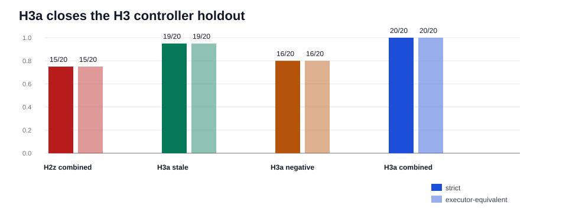

# H3a Controller Repair Synthesis

Generated: `2026-05-19T23:21:55.546631+00:00`

## Summary

H3a repairs the fresh H3 controller holdout with two separable helper extensions: stale-selection paraphrase detection and negative-value component target preservation.

H2z combined baseline: `15 / 20`. H3a stale-only: `19 / 20`. H3a negative-only: `16 / 20`. H3a combined: `20 / 20`.

Decision: H3a is the next candidate controller posture, but it still needs transfer regression before global promotion. The result is strong because fixed cases and intervention traces split cleanly across the two residual mechanism classes.

## Packet Rows

| profile_label | system_id | packet_dir | case_count | exact_success_count | exact_rate | executor_success_count | executor_rate |
| --- | --- | --- | --- | --- | --- | --- | --- |
| h3_h2z_boundary_combined | mlx_gemma4_e2b_reasoner_only_h2z_boundary_combined | results/tool_probe_replay_live/20260519T_h3_cli_controller_holdout_h2z_combined_execute_v1 | 20 | 15 | 0.75 | 15 | 0.75 |
| h3a_stale_selection_paraphrase_guard | mlx_gemma4_e2b_reasoner_only_h3a_stale_selection_paraphrase_guard | results/tool_probe_replay_live/20260519T_h3_cli_controller_holdout_h3a_stale_paraphrase_execute_v1 | 20 | 19 | 0.95 | 19 | 0.95 |
| h3a_negative_value_target_preservation | mlx_gemma4_e2b_reasoner_only_h3a_negative_value_target_preservation | results/tool_probe_replay_live/20260519T_h3_cli_controller_holdout_h3a_negative_value_execute_v1 | 20 | 16 | 0.8 | 16 | 0.8 |
| h3a_boundary_combined | mlx_gemma4_e2b_reasoner_only_h3a_boundary_combined | results/tool_probe_replay_live/20260519T_h3_cli_controller_holdout_h3a_combined_execute_v1 | 20 | 20 | 1.0 | 20 | 1.0 |

## Comparison Rows

| comparison_label | comparison_dir | shared_case_count | baseline_exact_rate | candidate_exact_rate | delta_exact_rate | baseline_executor_equivalence_rate | candidate_executor_equivalence_rate | delta_executor_equivalence_rate |
| --- | --- | --- | --- | --- | --- | --- | --- | --- |
| h3a_combined_vs_h2z_combined | results/tool_probe_replay_live_comparisons/20260519T_h3_cli_controller_holdout_h3a_combined_vs_h2z_combined_v1 | 20 | 0.75 | 1.0 | 0.25 | 0.75 | 1.0 | 0.25 |
| h3a_stale_vs_h2z_combined | results/tool_probe_replay_live_comparisons/20260519T_h3_cli_controller_holdout_h3a_stale_vs_h2z_combined_v1 | 20 | 0.75 | 0.95 | 0.19999999999999996 | 0.75 | 0.95 | 0.19999999999999996 |
| h3a_negative_vs_h2z_combined | results/tool_probe_replay_live_comparisons/20260519T_h3_cli_controller_holdout_h3a_negative_vs_h2z_combined_v1 | 20 | 0.75 | 0.8 | 0.050000000000000044 | 0.75 | 0.8 | 0.050000000000000044 |
| h3a_combined_vs_stale | results/tool_probe_replay_live_comparisons/20260519T_h3_cli_controller_holdout_h3a_combined_vs_stale_v1 | 20 | 0.95 | 1.0 | 0.050000000000000044 | 0.95 | 1.0 | 0.050000000000000044 |
| h3a_combined_vs_negative | results/tool_probe_replay_live_comparisons/20260519T_h3_cli_controller_holdout_h3a_combined_vs_negative_v1 | 20 | 0.8 | 1.0 | 0.19999999999999996 | 0.8 | 1.0 | 0.19999999999999996 |

## Family Rows

| profile_label | family | case_count | exact_success_count | exact_rate | executor_success_count | executor_rate |
| --- | --- | --- | --- | --- | --- | --- |
| h3_h2z_boundary_combined | h3_finance_stale_selection_paraphrase | 4 | 2 | 0.5 | 2 | 0.5 |
| h3_h2z_boundary_combined | h3_mixed_workflow_instructional_negation | 4 | 4 | 1.0 | 4 | 1.0 |
| h3_h2z_boundary_combined | h3_policy_label_order_inversion | 4 | 4 | 1.0 | 4 | 1.0 |
| h3_h2z_boundary_combined | h3_research_stale_selection_paraphrase | 4 | 2 | 0.5 | 2 | 0.5 |
| h3_h2z_boundary_combined | h3_support_negated_component_syntax | 4 | 3 | 0.75 | 3 | 0.75 |
| h3a_stale_selection_paraphrase_guard | h3_finance_stale_selection_paraphrase | 4 | 4 | 1.0 | 4 | 1.0 |
| h3a_stale_selection_paraphrase_guard | h3_mixed_workflow_instructional_negation | 4 | 4 | 1.0 | 4 | 1.0 |
| h3a_stale_selection_paraphrase_guard | h3_policy_label_order_inversion | 4 | 4 | 1.0 | 4 | 1.0 |
| h3a_stale_selection_paraphrase_guard | h3_research_stale_selection_paraphrase | 4 | 4 | 1.0 | 4 | 1.0 |
| h3a_stale_selection_paraphrase_guard | h3_support_negated_component_syntax | 4 | 3 | 0.75 | 3 | 0.75 |
| h3a_negative_value_target_preservation | h3_finance_stale_selection_paraphrase | 4 | 2 | 0.5 | 2 | 0.5 |
| h3a_negative_value_target_preservation | h3_mixed_workflow_instructional_negation | 4 | 4 | 1.0 | 4 | 1.0 |
| h3a_negative_value_target_preservation | h3_policy_label_order_inversion | 4 | 4 | 1.0 | 4 | 1.0 |
| h3a_negative_value_target_preservation | h3_research_stale_selection_paraphrase | 4 | 2 | 0.5 | 2 | 0.5 |
| h3a_negative_value_target_preservation | h3_support_negated_component_syntax | 4 | 4 | 1.0 | 4 | 1.0 |
| h3a_boundary_combined | h3_finance_stale_selection_paraphrase | 4 | 4 | 1.0 | 4 | 1.0 |
| h3a_boundary_combined | h3_mixed_workflow_instructional_negation | 4 | 4 | 1.0 | 4 | 1.0 |
| h3a_boundary_combined | h3_policy_label_order_inversion | 4 | 4 | 1.0 | 4 | 1.0 |
| h3a_boundary_combined | h3_research_stale_selection_paraphrase | 4 | 4 | 1.0 | 4 | 1.0 |
| h3a_boundary_combined | h3_support_negated_component_syntax | 4 | 4 | 1.0 | 4 | 1.0 |

## Non-Exact Rows

| profile_label | case_id | family | failure_mode | executor_equivalence_match | expected_tool | expected_target_query | actual_tool | actual_target_query |
| --- | --- | --- | --- | --- | --- | --- | --- | --- |
| h3_h2z_boundary_combined | h3_finance_renewal_lane_retired_view | h3_finance_stale_selection_paraphrase | wrong_tool | False | extract_layout | renewal lane | refine_selection |  |
| h3_h2z_boundary_combined | h3_finance_forecast_tile_leftover_evidence | h3_finance_stale_selection_paraphrase | wrong_tool | False | extract_layout | forecast tile | refine_selection |  |
| h3_h2z_boundary_combined | h3_research_claim_panel_carryover_selection | h3_research_stale_selection_paraphrase | wrong_tool | False | extract_layout | claim panel | refine_selection |  |
| h3_h2z_boundary_combined | h3_research_evidence_badge_retired_selection | h3_research_stale_selection_paraphrase | wrong_tool | False | extract_layout | evidence badge | refine_selection |  |
| h3_h2z_boundary_combined | h3_support_inactive_alert_banner | h3_support_negated_component_syntax | argument_mismatch | False | extract_layout | alert banner inactive | extract_layout | alert inactive |
| h3a_stale_selection_paraphrase_guard | h3_support_inactive_alert_banner | h3_support_negated_component_syntax | argument_mismatch | False | extract_layout | alert banner inactive | extract_layout | alert inactive |
| h3a_negative_value_target_preservation | h3_finance_renewal_lane_retired_view | h3_finance_stale_selection_paraphrase | wrong_tool | False | extract_layout | renewal lane | refine_selection |  |
| h3a_negative_value_target_preservation | h3_finance_forecast_tile_leftover_evidence | h3_finance_stale_selection_paraphrase | wrong_tool | False | extract_layout | forecast tile | refine_selection |  |
| h3a_negative_value_target_preservation | h3_research_claim_panel_carryover_selection | h3_research_stale_selection_paraphrase | wrong_tool | False | extract_layout | claim panel | refine_selection |  |
| h3a_negative_value_target_preservation | h3_research_evidence_badge_retired_selection | h3_research_stale_selection_paraphrase | wrong_tool | False | extract_layout | evidence badge | refine_selection |  |

## Controller Intervention Rows

| profile_label | case_id | family | intervention_kind | from_tool | from_arguments | to_tool | to_arguments | preserved_target_query | requested_label | requested_region_id | prompt_state_label | blocked_label | reason |
| --- | --- | --- | --- | --- | --- | --- | --- | --- | --- | --- | --- | --- | --- |
| h3_h2z_boundary_combined | h3_support_disabled_escalation_toggle | h3_support_negated_component_syntax | visual_target_query_normalization | extract_layout | {"image_id":"img-h3-support-disabled-toggle","target_query":"disabled toggle"} | extract_layout | {"image_id":"img-h3-support-disabled-toggle","target_query":"escalation toggle disabled"} |  |  |  | escalation toggle disabled |  |  |
| h3_h2z_boundary_combined | h3_support_unresolved_ticket_badge | h3_support_negated_component_syntax | visual_target_query_normalization | extract_layout | {"image_id":"img-h3-support-unresolved-ticket-badge","target_query":"unresolved badge"} | extract_layout | {"image_id":"img-h3-support-unresolved-ticket-badge","target_query":"ticket badge unresolved"} |  |  |  | ticket badge unresolved |  |  |
| h3_h2z_boundary_combined | h3_support_unassigned_owner_field | h3_support_negated_component_syntax | visual_target_query_normalization | extract_layout | {"image_id":"img-h3-support-unassigned-owner-field","target_query":"owner field"} | extract_layout | {"image_id":"img-h3-support-unassigned-owner-field","target_query":"owner field unassigned"} |  |  |  | owner field unassigned |  |  |
| h3_h2z_boundary_combined | h3_policy_paused_state_pill_value_first | h3_policy_label_order_inversion | visual_target_query_normalization | extract_layout | {"image_id":"img-h3-policy-paused-state-pill","target_query":"paused state pill"} | extract_layout | {"image_id":"img-h3-policy-paused-state-pill","target_query":"state pill paused"} |  |  |  | state pill paused |  |  |
| h3_h2z_boundary_combined | h3_policy_rejected_approval_chip_value_first | h3_policy_label_order_inversion | visual_target_query_normalization | extract_layout | {"image_id":"img-h3-policy-rejected-approval-chip","target_query":"rejected"} | extract_layout | {"image_id":"img-h3-policy-rejected-approval-chip","target_query":"approval chip rejected"} |  |  |  | approval chip rejected |  |  |
| h3_h2z_boundary_combined | h3_policy_missing_evidence_field_value_first | h3_policy_label_order_inversion | visual_target_query_normalization | extract_layout | {"image_id":"img-h3-policy-missing-evidence-field","target_query":"missing"} | extract_layout | {"image_id":"img-h3-policy-missing-evidence-field","target_query":"evidence field missing"} |  |  |  | evidence field missing |  |  |
| h3_h2z_boundary_combined | h3_policy_expired_policy_banner_value_first | h3_policy_label_order_inversion | visual_target_query_normalization | extract_layout | {"image_id":"img-h3-policy-expired-banner","target_query":"expired banner"} | extract_layout | {"image_id":"img-h3-policy-expired-banner","target_query":"policy banner expired"} |  |  |  | policy banner expired |  |  |
| h3_h2z_boundary_combined | h3_legal_contract_risk_badge_note_decoy | h3_mixed_workflow_instructional_negation | visual_target_query_normalization | extract_layout | {"image_id":"img-h3-legal-contract-risk-badge","target_query":"risk badge"} | extract_layout | {"image_id":"img-h3-legal-contract-risk-badge","target_query":"contract risk badge"} |  |  |  | contract risk badge |  |  |
| h3_h2z_boundary_combined | h3_recruiting_candidate_stage_tile_table_decoy | h3_mixed_workflow_instructional_negation | visual_target_query_normalization | extract_layout | {"image_id":"img-h3-recruiting-stage-tile","target_query":"stage tile"} | extract_layout | {"image_id":"img-h3-recruiting-stage-tile","target_query":"candidate stage tile"} |  |  |  | candidate stage tile |  |  |
| h3_h2z_boundary_combined | h3_clinical_triage_priority_chip_memo_decoy | h3_mixed_workflow_instructional_negation | visual_semantic_target_preservation | extract_layout | {"image_id":"img-h3-clinical-priority-chip","target_query":"triage priority chip"} | extract_layout | {"image_id":"img-h3-clinical-priority-chip","target_query":"triage priority chip"} | triage priority chip |  |  | triage priority chip | priority memo | semantic_label_preserved_over_stale_context |
| h3_h2z_boundary_combined | h3_ops_deployment_gate_panel_log_decoy | h3_mixed_workflow_instructional_negation | visual_target_query_normalization | extract_layout | {"image_id":"img-h3-ops-deployment-gate-panel","target_query":"gate log"} | extract_layout | {"image_id":"img-h3-ops-deployment-gate-panel","target_query":"deployment gate panel"} |  |  |  | deployment gate panel |  |  |
| h3a_stale_selection_paraphrase_guard | h3_finance_renewal_lane_retired_view | h3_finance_stale_selection_paraphrase | visual_stale_selection_paraphrase_guard | refine_selection | {"filter_query":"latest","selection_id":"sel-h3-renewal-note"} | extract_layout | {"image_id":"img-h3-finance-renewal-lane","target_query":"renewal lane"} |  |  |  |  |  | paraphrased_stale_selection_to_requested_surface |
| h3a_stale_selection_paraphrase_guard | h3_finance_forecast_tile_leftover_evidence | h3_finance_stale_selection_paraphrase | visual_stale_selection_paraphrase_guard | refine_selection | {"filter_query":"Q4","selection_id":"sel-h3-forecast-memo"} | extract_layout | {"image_id":"img-h3-finance-forecast-tile","target_query":"forecast tile"} |  |  |  |  |  | paraphrased_stale_selection_to_requested_surface |
| h3a_stale_selection_paraphrase_guard | h3_research_claim_panel_carryover_selection | h3_research_stale_selection_paraphrase | visual_stale_selection_paraphrase_guard | refine_selection | {"filter_query":"latest","selection_id":"sel-h3-claim-footnote"} | extract_layout | {"image_id":"img-h3-research-claim-panel","target_query":"claim panel"} |  |  |  |  |  | paraphrased_stale_selection_to_requested_surface |
| h3a_stale_selection_paraphrase_guard | h3_research_evidence_badge_retired_selection | h3_research_stale_selection_paraphrase | visual_stale_selection_paraphrase_guard | refine_selection | {"filter_query":"evidence badge","selection_id":"sel-h3-evidence-note"} | extract_layout | {"image_id":"img-h3-research-evidence-badge","target_query":"evidence badge"} |  |  |  |  |  | paraphrased_stale_selection_to_requested_surface |
| h3a_stale_selection_paraphrase_guard | h3_support_disabled_escalation_toggle | h3_support_negated_component_syntax | visual_target_query_normalization | extract_layout | {"image_id":"img-h3-support-disabled-toggle","target_query":"disabled toggle"} | extract_layout | {"image_id":"img-h3-support-disabled-toggle","target_query":"escalation toggle disabled"} |  |  |  | escalation toggle disabled |  |  |
| h3a_stale_selection_paraphrase_guard | h3_support_unresolved_ticket_badge | h3_support_negated_component_syntax | visual_target_query_normalization | extract_layout | {"image_id":"img-h3-support-unresolved-ticket-badge","target_query":"unresolved badge"} | extract_layout | {"image_id":"img-h3-support-unresolved-ticket-badge","target_query":"ticket badge unresolved"} |  |  |  | ticket badge unresolved |  |  |
| h3a_stale_selection_paraphrase_guard | h3_support_unassigned_owner_field | h3_support_negated_component_syntax | visual_target_query_normalization | extract_layout | {"image_id":"img-h3-support-unassigned-owner-field","target_query":"owner field"} | extract_layout | {"image_id":"img-h3-support-unassigned-owner-field","target_query":"owner field unassigned"} |  |  |  | owner field unassigned |  |  |
| h3a_stale_selection_paraphrase_guard | h3_policy_paused_state_pill_value_first | h3_policy_label_order_inversion | visual_target_query_normalization | extract_layout | {"image_id":"img-h3-policy-paused-state-pill","target_query":"paused state pill"} | extract_layout | {"image_id":"img-h3-policy-paused-state-pill","target_query":"state pill paused"} |  |  |  | state pill paused |  |  |
| h3a_stale_selection_paraphrase_guard | h3_policy_rejected_approval_chip_value_first | h3_policy_label_order_inversion | visual_target_query_normalization | extract_layout | {"image_id":"img-h3-policy-rejected-approval-chip","target_query":"rejected"} | extract_layout | {"image_id":"img-h3-policy-rejected-approval-chip","target_query":"approval chip rejected"} |  |  |  | approval chip rejected |  |  |
| h3a_stale_selection_paraphrase_guard | h3_policy_missing_evidence_field_value_first | h3_policy_label_order_inversion | visual_target_query_normalization | extract_layout | {"image_id":"img-h3-policy-missing-evidence-field","target_query":"missing"} | extract_layout | {"image_id":"img-h3-policy-missing-evidence-field","target_query":"evidence field missing"} |  |  |  | evidence field missing |  |  |
| h3a_stale_selection_paraphrase_guard | h3_policy_expired_policy_banner_value_first | h3_policy_label_order_inversion | visual_target_query_normalization | extract_layout | {"image_id":"img-h3-policy-expired-banner","target_query":"expired banner"} | extract_layout | {"image_id":"img-h3-policy-expired-banner","target_query":"policy banner expired"} |  |  |  | policy banner expired |  |  |
| h3a_stale_selection_paraphrase_guard | h3_legal_contract_risk_badge_note_decoy | h3_mixed_workflow_instructional_negation | visual_target_query_normalization | extract_layout | {"image_id":"img-h3-legal-contract-risk-badge","target_query":"risk badge"} | extract_layout | {"image_id":"img-h3-legal-contract-risk-badge","target_query":"contract risk badge"} |  |  |  | contract risk badge |  |  |
| h3a_stale_selection_paraphrase_guard | h3_recruiting_candidate_stage_tile_table_decoy | h3_mixed_workflow_instructional_negation | visual_target_query_normalization | extract_layout | {"image_id":"img-h3-recruiting-stage-tile","target_query":"stage tile"} | extract_layout | {"image_id":"img-h3-recruiting-stage-tile","target_query":"candidate stage tile"} |  |  |  | candidate stage tile |  |  |
| h3a_stale_selection_paraphrase_guard | h3_clinical_triage_priority_chip_memo_decoy | h3_mixed_workflow_instructional_negation | visual_semantic_target_preservation | extract_layout | {"image_id":"img-h3-clinical-priority-chip","target_query":"triage priority chip"} | extract_layout | {"image_id":"img-h3-clinical-priority-chip","target_query":"triage priority chip"} | triage priority chip |  |  | triage priority chip | priority memo | semantic_label_preserved_over_stale_context |
| h3a_stale_selection_paraphrase_guard | h3_ops_deployment_gate_panel_log_decoy | h3_mixed_workflow_instructional_negation | visual_target_query_normalization | extract_layout | {"image_id":"img-h3-ops-deployment-gate-panel","target_query":"gate log"} | extract_layout | {"image_id":"img-h3-ops-deployment-gate-panel","target_query":"deployment gate panel"} |  |  |  | deployment gate panel |  |  |
| h3a_negative_value_target_preservation | h3_support_inactive_alert_banner | h3_support_negated_component_syntax | visual_negative_value_component_target_preservation | extract_layout | {"image_id":"img-h3-support-inactive-alert-banner","target_query":"alert inactive"} | extract_layout | {"image_id":"img-h3-support-inactive-alert-banner","target_query":"alert banner inactive"} | alert banner inactive |  |  |  | alert inactive | negative_value_component_query_preserved |
| h3a_negative_value_target_preservation | h3_support_disabled_escalation_toggle | h3_support_negated_component_syntax | visual_target_query_normalization | extract_layout | {"image_id":"img-h3-support-disabled-toggle","target_query":"disabled toggle"} | extract_layout | {"image_id":"img-h3-support-disabled-toggle","target_query":"escalation toggle disabled"} |  |  |  | escalation toggle disabled |  |  |
| h3a_negative_value_target_preservation | h3_support_unresolved_ticket_badge | h3_support_negated_component_syntax | visual_target_query_normalization | extract_layout | {"image_id":"img-h3-support-unresolved-ticket-badge","target_query":"unresolved badge"} | extract_layout | {"image_id":"img-h3-support-unresolved-ticket-badge","target_query":"ticket badge unresolved"} |  |  |  | ticket badge unresolved |  |  |
| h3a_negative_value_target_preservation | h3_support_unassigned_owner_field | h3_support_negated_component_syntax | visual_target_query_normalization | extract_layout | {"image_id":"img-h3-support-unassigned-owner-field","target_query":"owner field"} | extract_layout | {"image_id":"img-h3-support-unassigned-owner-field","target_query":"owner field unassigned"} |  |  |  | owner field unassigned |  |  |
| h3a_negative_value_target_preservation | h3_policy_paused_state_pill_value_first | h3_policy_label_order_inversion | visual_target_query_normalization | extract_layout | {"image_id":"img-h3-policy-paused-state-pill","target_query":"paused state pill"} | extract_layout | {"image_id":"img-h3-policy-paused-state-pill","target_query":"state pill paused"} |  |  |  | state pill paused |  |  |
| h3a_negative_value_target_preservation | h3_policy_rejected_approval_chip_value_first | h3_policy_label_order_inversion | visual_target_query_normalization | extract_layout | {"image_id":"img-h3-policy-rejected-approval-chip","target_query":"rejected"} | extract_layout | {"image_id":"img-h3-policy-rejected-approval-chip","target_query":"approval chip rejected"} |  |  |  | approval chip rejected |  |  |
| h3a_negative_value_target_preservation | h3_policy_missing_evidence_field_value_first | h3_policy_label_order_inversion | visual_target_query_normalization | extract_layout | {"image_id":"img-h3-policy-missing-evidence-field","target_query":"missing"} | extract_layout | {"image_id":"img-h3-policy-missing-evidence-field","target_query":"evidence field missing"} |  |  |  | evidence field missing |  |  |
| h3a_negative_value_target_preservation | h3_policy_expired_policy_banner_value_first | h3_policy_label_order_inversion | visual_target_query_normalization | extract_layout | {"image_id":"img-h3-policy-expired-banner","target_query":"expired banner"} | extract_layout | {"image_id":"img-h3-policy-expired-banner","target_query":"policy banner expired"} |  |  |  | policy banner expired |  |  |
| h3a_negative_value_target_preservation | h3_legal_contract_risk_badge_note_decoy | h3_mixed_workflow_instructional_negation | visual_target_query_normalization | extract_layout | {"image_id":"img-h3-legal-contract-risk-badge","target_query":"risk badge"} | extract_layout | {"image_id":"img-h3-legal-contract-risk-badge","target_query":"contract risk badge"} |  |  |  | contract risk badge |  |  |
| h3a_negative_value_target_preservation | h3_recruiting_candidate_stage_tile_table_decoy | h3_mixed_workflow_instructional_negation | visual_target_query_normalization | extract_layout | {"image_id":"img-h3-recruiting-stage-tile","target_query":"stage tile"} | extract_layout | {"image_id":"img-h3-recruiting-stage-tile","target_query":"candidate stage tile"} |  |  |  | candidate stage tile |  |  |
| h3a_negative_value_target_preservation | h3_clinical_triage_priority_chip_memo_decoy | h3_mixed_workflow_instructional_negation | visual_semantic_target_preservation | extract_layout | {"image_id":"img-h3-clinical-priority-chip","target_query":"triage priority chip"} | extract_layout | {"image_id":"img-h3-clinical-priority-chip","target_query":"triage priority chip"} | triage priority chip |  |  | triage priority chip | priority memo | semantic_label_preserved_over_stale_context |
| h3a_negative_value_target_preservation | h3_ops_deployment_gate_panel_log_decoy | h3_mixed_workflow_instructional_negation | visual_target_query_normalization | extract_layout | {"image_id":"img-h3-ops-deployment-gate-panel","target_query":"gate log"} | extract_layout | {"image_id":"img-h3-ops-deployment-gate-panel","target_query":"deployment gate panel"} |  |  |  | deployment gate panel |  |  |
| h3a_boundary_combined | h3_finance_renewal_lane_retired_view | h3_finance_stale_selection_paraphrase | visual_stale_selection_paraphrase_guard | refine_selection | {"filter_query":"latest","selection_id":"sel-h3-renewal-note"} | extract_layout | {"image_id":"img-h3-finance-renewal-lane","target_query":"renewal lane"} |  |  |  |  |  | paraphrased_stale_selection_to_requested_surface |
| h3a_boundary_combined | h3_finance_forecast_tile_leftover_evidence | h3_finance_stale_selection_paraphrase | visual_stale_selection_paraphrase_guard | refine_selection | {"filter_query":"Q4","selection_id":"sel-h3-forecast-memo"} | extract_layout | {"image_id":"img-h3-finance-forecast-tile","target_query":"forecast tile"} |  |  |  |  |  | paraphrased_stale_selection_to_requested_surface |
| h3a_boundary_combined | h3_research_claim_panel_carryover_selection | h3_research_stale_selection_paraphrase | visual_stale_selection_paraphrase_guard | refine_selection | {"filter_query":"latest","selection_id":"sel-h3-claim-footnote"} | extract_layout | {"image_id":"img-h3-research-claim-panel","target_query":"claim panel"} |  |  |  |  |  | paraphrased_stale_selection_to_requested_surface |
| h3a_boundary_combined | h3_research_evidence_badge_retired_selection | h3_research_stale_selection_paraphrase | visual_stale_selection_paraphrase_guard | refine_selection | {"filter_query":"evidence badge","selection_id":"sel-h3-evidence-note"} | extract_layout | {"image_id":"img-h3-research-evidence-badge","target_query":"evidence badge"} |  |  |  |  |  | paraphrased_stale_selection_to_requested_surface |
| h3a_boundary_combined | h3_support_inactive_alert_banner | h3_support_negated_component_syntax | visual_negative_value_component_target_preservation | extract_layout | {"image_id":"img-h3-support-inactive-alert-banner","target_query":"alert inactive"} | extract_layout | {"image_id":"img-h3-support-inactive-alert-banner","target_query":"alert banner inactive"} | alert banner inactive |  |  |  | alert inactive | negative_value_component_query_preserved |
| h3a_boundary_combined | h3_support_disabled_escalation_toggle | h3_support_negated_component_syntax | visual_target_query_normalization | extract_layout | {"image_id":"img-h3-support-disabled-toggle","target_query":"disabled toggle"} | extract_layout | {"image_id":"img-h3-support-disabled-toggle","target_query":"escalation toggle disabled"} |  |  |  | escalation toggle disabled |  |  |
| h3a_boundary_combined | h3_support_unresolved_ticket_badge | h3_support_negated_component_syntax | visual_target_query_normalization | extract_layout | {"image_id":"img-h3-support-unresolved-ticket-badge","target_query":"unresolved badge"} | extract_layout | {"image_id":"img-h3-support-unresolved-ticket-badge","target_query":"ticket badge unresolved"} |  |  |  | ticket badge unresolved |  |  |
| h3a_boundary_combined | h3_support_unassigned_owner_field | h3_support_negated_component_syntax | visual_target_query_normalization | extract_layout | {"image_id":"img-h3-support-unassigned-owner-field","target_query":"owner field"} | extract_layout | {"image_id":"img-h3-support-unassigned-owner-field","target_query":"owner field unassigned"} |  |  |  | owner field unassigned |  |  |
| h3a_boundary_combined | h3_policy_paused_state_pill_value_first | h3_policy_label_order_inversion | visual_target_query_normalization | extract_layout | {"image_id":"img-h3-policy-paused-state-pill","target_query":"paused state pill"} | extract_layout | {"image_id":"img-h3-policy-paused-state-pill","target_query":"state pill paused"} |  |  |  | state pill paused |  |  |
| h3a_boundary_combined | h3_policy_rejected_approval_chip_value_first | h3_policy_label_order_inversion | visual_target_query_normalization | extract_layout | {"image_id":"img-h3-policy-rejected-approval-chip","target_query":"rejected"} | extract_layout | {"image_id":"img-h3-policy-rejected-approval-chip","target_query":"approval chip rejected"} |  |  |  | approval chip rejected |  |  |
| h3a_boundary_combined | h3_policy_missing_evidence_field_value_first | h3_policy_label_order_inversion | visual_target_query_normalization | extract_layout | {"image_id":"img-h3-policy-missing-evidence-field","target_query":"missing"} | extract_layout | {"image_id":"img-h3-policy-missing-evidence-field","target_query":"evidence field missing"} |  |  |  | evidence field missing |  |  |
| h3a_boundary_combined | h3_policy_expired_policy_banner_value_first | h3_policy_label_order_inversion | visual_target_query_normalization | extract_layout | {"image_id":"img-h3-policy-expired-banner","target_query":"expired banner"} | extract_layout | {"image_id":"img-h3-policy-expired-banner","target_query":"policy banner expired"} |  |  |  | policy banner expired |  |  |
| h3a_boundary_combined | h3_legal_contract_risk_badge_note_decoy | h3_mixed_workflow_instructional_negation | visual_target_query_normalization | extract_layout | {"image_id":"img-h3-legal-contract-risk-badge","target_query":"risk badge"} | extract_layout | {"image_id":"img-h3-legal-contract-risk-badge","target_query":"contract risk badge"} |  |  |  | contract risk badge |  |  |
| h3a_boundary_combined | h3_recruiting_candidate_stage_tile_table_decoy | h3_mixed_workflow_instructional_negation | visual_target_query_normalization | extract_layout | {"image_id":"img-h3-recruiting-stage-tile","target_query":"stage tile"} | extract_layout | {"image_id":"img-h3-recruiting-stage-tile","target_query":"candidate stage tile"} |  |  |  | candidate stage tile |  |  |
| h3a_boundary_combined | h3_clinical_triage_priority_chip_memo_decoy | h3_mixed_workflow_instructional_negation | visual_semantic_target_preservation | extract_layout | {"image_id":"img-h3-clinical-priority-chip","target_query":"triage priority chip"} | extract_layout | {"image_id":"img-h3-clinical-priority-chip","target_query":"triage priority chip"} | triage priority chip |  |  | triage priority chip | priority memo | semantic_label_preserved_over_stale_context |
| h3a_boundary_combined | h3_ops_deployment_gate_panel_log_decoy | h3_mixed_workflow_instructional_negation | visual_target_query_normalization | extract_layout | {"image_id":"img-h3-ops-deployment-gate-panel","target_query":"gate log"} | extract_layout | {"image_id":"img-h3-ops-deployment-gate-panel","target_query":"deployment gate panel"} |  |  |  | deployment gate panel |  |  |

## Fixed Case Rows

| comparison_label | case_id | family | baseline_failure_mode | candidate_failure_mode | baseline_executor_equivalence_match | candidate_executor_equivalence_match |
| --- | --- | --- | --- | --- | --- | --- |
| h3a_combined_vs_h2z_combined | h3_finance_forecast_tile_leftover_evidence | h3_finance_stale_selection_paraphrase | wrong_tool | exact | False | True |
| h3a_combined_vs_h2z_combined | h3_finance_renewal_lane_retired_view | h3_finance_stale_selection_paraphrase | wrong_tool | exact | False | True |
| h3a_combined_vs_h2z_combined | h3_research_claim_panel_carryover_selection | h3_research_stale_selection_paraphrase | wrong_tool | exact | False | True |
| h3a_combined_vs_h2z_combined | h3_research_evidence_badge_retired_selection | h3_research_stale_selection_paraphrase | wrong_tool | exact | False | True |
| h3a_combined_vs_h2z_combined | h3_support_inactive_alert_banner | h3_support_negated_component_syntax | argument_mismatch | exact | False | True |
| h3a_stale_vs_h2z_combined | h3_finance_forecast_tile_leftover_evidence | h3_finance_stale_selection_paraphrase | wrong_tool | exact | False | True |
| h3a_stale_vs_h2z_combined | h3_finance_renewal_lane_retired_view | h3_finance_stale_selection_paraphrase | wrong_tool | exact | False | True |
| h3a_stale_vs_h2z_combined | h3_research_claim_panel_carryover_selection | h3_research_stale_selection_paraphrase | wrong_tool | exact | False | True |
| h3a_stale_vs_h2z_combined | h3_research_evidence_badge_retired_selection | h3_research_stale_selection_paraphrase | wrong_tool | exact | False | True |
| h3a_negative_vs_h2z_combined | h3_support_inactive_alert_banner | h3_support_negated_component_syntax | argument_mismatch | exact | False | True |
| h3a_combined_vs_stale | h3_support_inactive_alert_banner | h3_support_negated_component_syntax | argument_mismatch | exact | False | True |
| h3a_combined_vs_negative | h3_finance_forecast_tile_leftover_evidence | h3_finance_stale_selection_paraphrase | wrong_tool | exact | False | True |
| h3a_combined_vs_negative | h3_finance_renewal_lane_retired_view | h3_finance_stale_selection_paraphrase | wrong_tool | exact | False | True |
| h3a_combined_vs_negative | h3_research_claim_panel_carryover_selection | h3_research_stale_selection_paraphrase | wrong_tool | exact | False | True |
| h3a_combined_vs_negative | h3_research_evidence_badge_retired_selection | h3_research_stale_selection_paraphrase | wrong_tool | exact | False | True |

## Findings

| finding_id | finding |
| --- | --- |
| h3a_combined_closes_h3 | H3a combined moves the H3 holdout from H2z 15/20 to 20/20 strict and executor-equivalent, a 0.25 exact-rate delta. |
| h3a_stale_paraphrase_guard_is_separable | The stale-selection paraphrase guard reaches 19/20 and fixes 4 H2z misses (h3_finance_forecast_tile_leftover_evidence, h3_finance_renewal_lane_retired_view, h3_research_claim_panel_carryover_selection, h3_research_evidence_badge_retired_selection), while leaving h3_support_inactive_alert_banner. |
| h3a_negative_value_guard_is_separable | The negative-value target-preservation guard reaches 16/20 and fixes 1 H2z miss (h3_support_inactive_alert_banner), while leaving h3_finance_renewal_lane_retired_view, h3_finance_forecast_tile_leftover_evidence, h3_research_claim_panel_carryover_selection, h3_research_evidence_badge_retired_selection. |
| h3a_interventions_match_repair_surface | The combined row records 4 stale-paraphrase interventions and 1 negative-value interventions, matching the five fixed H3 cases (h3_finance_forecast_tile_leftover_evidence, h3_finance_renewal_lane_retired_view, h3_research_claim_panel_carryover_selection, h3_research_evidence_badge_retired_selection, h3_support_inactive_alert_banner). |
| h3a_benchmark_quality_step | H3a upgrades the H3 result from a promotion-blocking negative gate to a row-attributable repair experiment: baseline, two single-helper rows, combined helper row, executor-equivalence scores, fixed-case lists, and controller-helper traces all agree. |
| h3a_next_transfer_gate | H3a should be treated as the next candidate controller posture, not a global promotion, until H2y, H2z, H3, and transfer/back-compat replay rows are rerun under the same CLI attribution standard. |
