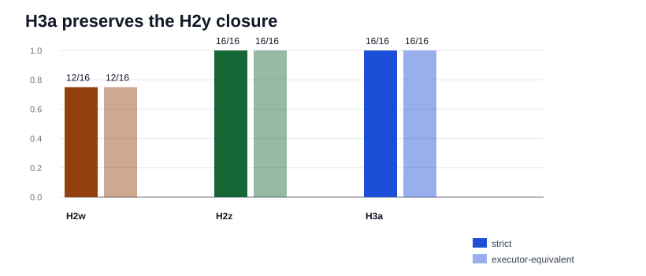

# H3a H2y Transfer Gate Synthesis

Generated: `2026-05-19T23:30:41.159209+00:00`

## Summary

This is the first transfer gate after the H3a repair. It reruns H3a combined on the original H2y scaled CLI semantic-pressure packet that H2z closed.

H2w: `12 / 16`. H2z combined: `16 / 16`. H3a combined: `16 / 16`.

Decision: H3a passes this first transfer gate by tying H2z on H2y and keeping the H2z gain over H2w. This is not yet global promotion; it is one regression slice in the broader transfer plan.

## Packet Rows

| profile_label | system_id | packet_dir | case_count | exact_success_count | exact_rate | executor_success_count | executor_rate |
| --- | --- | --- | --- | --- | --- | --- | --- |
| h2y_h2w_semantic_target_preservation | mlx_gemma4_e2b_reasoner_only_no_tool_turn_directive_visual_role_catalog_route_arbitration_residual_exactness_visual_stale_selection_gate_visual_value_bearing_target_query_synthesis_visual_contextual_surface_alias_routing_visual_composed_route_gating_visual_negation_guard_visual_semantic_target_preservation | results/tool_probe_replay_live/20260519T_h2y_scaled_cli_semantic_pressure_h2w_execute_v1 | 16 | 12 | 0.75 | 12 | 0.75 |
| h2y_h2z_boundary_combined | mlx_gemma4_e2b_reasoner_only_h2z_boundary_combined | results/tool_probe_replay_live/20260519T_h2y_scaled_cli_semantic_pressure_h2z_combined_execute_v1 | 16 | 16 | 1.0 | 16 | 1.0 |
| h2y_h3a_boundary_combined | mlx_gemma4_e2b_reasoner_only_h3a_boundary_combined | results/tool_probe_replay_live/20260519T_h2y_scaled_cli_semantic_pressure_h3a_combined_execute_v1 | 16 | 16 | 1.0 | 16 | 1.0 |

## Comparison Rows

| comparison_label | comparison_dir | shared_case_count | baseline_exact_rate | candidate_exact_rate | delta_exact_rate | baseline_executor_equivalence_rate | candidate_executor_equivalence_rate | delta_executor_equivalence_rate |
| --- | --- | --- | --- | --- | --- | --- | --- | --- |
| h2y_h3a_vs_h2z | results/tool_probe_replay_live_comparisons/20260519T_h2y_scaled_cli_semantic_pressure_h3a_combined_vs_h2z_combined_v1 | 16 | 1.0 | 1.0 | 0.0 | 1.0 | 1.0 | 0.0 |
| h2y_h3a_vs_h2w | results/tool_probe_replay_live_comparisons/20260519T_h2y_scaled_cli_semantic_pressure_h3a_combined_vs_h2w_v1 | 16 | 0.75 | 1.0 | 0.25 | 0.75 | 1.0 | 0.25 |

## Family Rows

| profile_label | family | case_count | exact_success_count | exact_rate | executor_success_count | executor_rate |
| --- | --- | --- | --- | --- | --- | --- |
| h2y_h2w_semantic_target_preservation | h2y_genuine_negated_target_value | 7 | 6 | 0.8571428571428571 | 6 | 0.8571428571428571 |
| h2y_h2w_semantic_target_preservation | h2y_instructional_negation_context | 3 | 3 | 1.0 | 3 | 1.0 |
| h2y_h2w_semantic_target_preservation | h2y_quoted_stale_negation_context | 3 | 3 | 1.0 | 3 | 1.0 |
| h2y_h2w_semantic_target_preservation | h2y_stale_selection_negation_context | 3 | 0 | 0.0 | 0 | 0.0 |
| h2y_h2z_boundary_combined | h2y_genuine_negated_target_value | 7 | 7 | 1.0 | 7 | 1.0 |
| h2y_h2z_boundary_combined | h2y_instructional_negation_context | 3 | 3 | 1.0 | 3 | 1.0 |
| h2y_h2z_boundary_combined | h2y_quoted_stale_negation_context | 3 | 3 | 1.0 | 3 | 1.0 |
| h2y_h2z_boundary_combined | h2y_stale_selection_negation_context | 3 | 3 | 1.0 | 3 | 1.0 |
| h2y_h3a_boundary_combined | h2y_genuine_negated_target_value | 7 | 7 | 1.0 | 7 | 1.0 |
| h2y_h3a_boundary_combined | h2y_instructional_negation_context | 3 | 3 | 1.0 | 3 | 1.0 |
| h2y_h3a_boundary_combined | h2y_quoted_stale_negation_context | 3 | 3 | 1.0 | 3 | 1.0 |
| h2y_h3a_boundary_combined | h2y_stale_selection_negation_context | 3 | 3 | 1.0 | 3 | 1.0 |

## Non-Exact Rows

| profile_label | case_id | family | failure_mode | executor_equivalence_match | expected_tool | expected_target_query | actual_tool | actual_target_query |
| --- | --- | --- | --- | --- | --- | --- | --- | --- |
| h2y_h2w_semantic_target_preservation | h2y_escalation_lane_stale_selection_not_lane | h2y_stale_selection_negation_context | wrong_tool | False | extract_layout | escalation lane | refine_selection |  |
| h2y_h2w_semantic_target_preservation | h2y_exception_panel_stale_selection_not_panel | h2y_stale_selection_negation_context | wrong_tool | False | extract_layout | exception panel | refine_selection |  |
| h2y_h2w_semantic_target_preservation | h2y_approval_field_stale_selection_not_field | h2y_stale_selection_negation_context | wrong_tool | False | extract_layout | approval field | refine_selection |  |
| h2y_h2w_semantic_target_preservation | h2y_not_active_alert_banner_value_before_component | h2y_genuine_negated_target_value | argument_mismatch | False | extract_layout | alert banner not active | extract_layout | alert |

## Controller Intervention Rows

| profile_label | case_id | family | intervention_kind | from_tool | from_arguments | to_tool | to_arguments | preserved_target_query | requested_label | requested_region_id | prompt_state_label | blocked_label | reason |
| --- | --- | --- | --- | --- | --- | --- | --- | --- | --- | --- | --- | --- | --- |
| h2y_h2w_semantic_target_preservation | h2y_action_banner_quoted_not_banner_note | h2y_quoted_stale_negation_context | visual_semantic_target_preservation | extract_layout | {"image_id":"img-h2y-action-banner-quote","target_query":"action banner"} | extract_layout | {"image_id":"img-h2y-action-banner-quote","target_query":"action banner"} | action banner |  |  | action banner | prior note | semantic_label_preserved_over_stale_context |
| h2y_h2w_semantic_target_preservation | h2y_resolution_marker_old_quote_not_marker | h2y_quoted_stale_negation_context | visual_semantic_target_preservation | extract_layout | {"image_id":"img-h2y-resolution-marker-quote","target_query":"resolution marker"} | extract_layout | {"image_id":"img-h2y-resolution-marker-quote","target_query":"resolution marker"} | resolution marker |  |  | resolution marker | audit memo | semantic_label_preserved_over_stale_context |
| h2y_h2w_semantic_target_preservation | h2y_vendor_chip_do_not_use_table | h2y_instructional_negation_context | visual_target_query_normalization | extract_layout | {"image_id":"img-h2y-vendor-chip-table","target_query":"vendor chip Beta"} | extract_layout | {"image_id":"img-h2y-vendor-chip-table","target_query":"vendor chip"} |  |  |  | vendor chip |  |  |
| h2y_h2w_semantic_target_preservation | h2y_not_replied_status_pill_value_before_component | h2y_genuine_negated_target_value | visual_target_query_normalization | extract_layout | {"image_id":"img-h2y-not-replied-status-pill","target_query":"not replied"} | extract_layout | {"image_id":"img-h2y-not-replied-status-pill","target_query":"status pill not replied"} |  |  |  | status pill not replied |  |  |
| h2y_h2w_semantic_target_preservation | h2y_not_sent_delivery_tag_value_before_component | h2y_genuine_negated_target_value | visual_target_query_normalization | extract_layout | {"image_id":"img-h2y-not-sent-delivery-tag","target_query":"not sent"} | extract_layout | {"image_id":"img-h2y-not-sent-delivery-tag","target_query":"delivery tag not sent"} |  |  |  | delivery tag not sent |  |  |
| h2y_h2w_semantic_target_preservation | h2y_not_required_approval_marker_value_before_component | h2y_genuine_negated_target_value | visual_target_query_normalization | extract_layout | {"image_id":"img-h2y-not-required-approval-marker","target_query":"Not required"} | extract_layout | {"image_id":"img-h2y-not-required-approval-marker","target_query":"approval marker not required"} |  |  |  | approval marker not required |  |  |
| h2y_h2w_semantic_target_preservation | h2y_not_escalated_risk_chip_value_before_component | h2y_genuine_negated_target_value | visual_target_query_normalization | extract_layout | {"image_id":"img-h2y-not-escalated-risk-chip","target_query":"risk chip"} | extract_layout | {"image_id":"img-h2y-not-escalated-risk-chip","target_query":"risk chip not escalated"} |  |  |  | risk chip not escalated |  |  |
| h2y_h2w_semantic_target_preservation | h2y_not_available_owner_field_value_before_component | h2y_genuine_negated_target_value | visual_target_query_normalization | extract_layout | {"image_id":"img-h2y-not-available-owner-field","target_query":"not available"} | extract_layout | {"image_id":"img-h2y-not-available-owner-field","target_query":"owner field not available"} |  |  |  | owner field not available |  |  |
| h2y_h2w_semantic_target_preservation | h2y_not_started_phase_tile_value_before_component | h2y_genuine_negated_target_value | visual_target_query_normalization | extract_layout | {"image_id":"img-h2y-not-started-phase-tile","target_query":"phase tile Not started"} | extract_layout | {"image_id":"img-h2y-not-started-phase-tile","target_query":"phase tile not started"} |  |  |  | phase tile not started |  |  |
| h2y_h2z_boundary_combined | h2y_action_banner_quoted_not_banner_note | h2y_quoted_stale_negation_context | visual_semantic_target_preservation | extract_layout | {"image_id":"img-h2y-action-banner-quote","target_query":"action banner"} | extract_layout | {"image_id":"img-h2y-action-banner-quote","target_query":"action banner"} | action banner |  |  | action banner | prior note | semantic_label_preserved_over_stale_context |
| h2y_h2z_boundary_combined | h2y_resolution_marker_old_quote_not_marker | h2y_quoted_stale_negation_context | visual_semantic_target_preservation | extract_layout | {"image_id":"img-h2y-resolution-marker-quote","target_query":"resolution marker"} | extract_layout | {"image_id":"img-h2y-resolution-marker-quote","target_query":"resolution marker"} | resolution marker |  |  | resolution marker | audit memo | semantic_label_preserved_over_stale_context |
| h2y_h2z_boundary_combined | h2y_escalation_lane_stale_selection_not_lane | h2y_stale_selection_negation_context | visual_stale_selection_negation_guard | refine_selection | {"filter_query":"not the escalation lane","selection_id":"sel-h2y-old-note"} | extract_layout | {"image_id":"img-h2y-escalation-lane-stale-selection","target_query":"escalation lane"} |  |  |  |  |  | negated_current_selection_to_requested_surface |
| h2y_h2z_boundary_combined | h2y_exception_panel_stale_selection_not_panel | h2y_stale_selection_negation_context | visual_stale_selection_negation_guard | refine_selection | {"filter_query":"not the exception panel","selection_id":"sel-h2y-exception-note"} | extract_layout | {"image_id":"img-h2y-exception-panel-stale-selection","target_query":"exception panel"} |  |  |  |  |  | negated_current_selection_to_requested_surface |
| h2y_h2z_boundary_combined | h2y_approval_field_stale_selection_not_field | h2y_stale_selection_negation_context | visual_stale_selection_negation_guard | refine_selection | {"filter_query":"approval field","selection_id":"sel-h2y-approval-memo"} | extract_layout | {"image_id":"img-h2y-approval-field-stale-selection","target_query":"approval field"} |  |  |  |  |  | negated_current_selection_to_requested_surface |
| h2y_h2z_boundary_combined | h2y_vendor_chip_do_not_use_table | h2y_instructional_negation_context | visual_target_query_normalization | extract_layout | {"image_id":"img-h2y-vendor-chip-table","target_query":"vendor chip Beta"} | extract_layout | {"image_id":"img-h2y-vendor-chip-table","target_query":"vendor chip"} |  |  |  | vendor chip |  |  |
| h2y_h2z_boundary_combined | h2y_not_replied_status_pill_value_before_component | h2y_genuine_negated_target_value | visual_target_query_normalization | extract_layout | {"image_id":"img-h2y-not-replied-status-pill","target_query":"not replied"} | extract_layout | {"image_id":"img-h2y-not-replied-status-pill","target_query":"status pill not replied"} |  |  |  | status pill not replied |  |  |
| h2y_h2z_boundary_combined | h2y_not_sent_delivery_tag_value_before_component | h2y_genuine_negated_target_value | visual_target_query_normalization | extract_layout | {"image_id":"img-h2y-not-sent-delivery-tag","target_query":"not sent"} | extract_layout | {"image_id":"img-h2y-not-sent-delivery-tag","target_query":"delivery tag not sent"} |  |  |  | delivery tag not sent |  |  |
| h2y_h2z_boundary_combined | h2y_not_required_approval_marker_value_before_component | h2y_genuine_negated_target_value | visual_target_query_normalization | extract_layout | {"image_id":"img-h2y-not-required-approval-marker","target_query":"Not required"} | extract_layout | {"image_id":"img-h2y-not-required-approval-marker","target_query":"approval marker not required"} |  |  |  | approval marker not required |  |  |
| h2y_h2z_boundary_combined | h2y_not_active_alert_banner_value_before_component | h2y_genuine_negated_target_value | visual_negated_component_target_preservation | extract_layout | {"image_id":"img-h2y-not-active-alert-banner","target_query":"alert"} | extract_layout | {"image_id":"img-h2y-not-active-alert-banner","target_query":"alert banner not active"} | alert banner not active |  |  |  | alert | negated_value_component_query_preserved |
| h2y_h2z_boundary_combined | h2y_not_escalated_risk_chip_value_before_component | h2y_genuine_negated_target_value | visual_target_query_normalization | extract_layout | {"image_id":"img-h2y-not-escalated-risk-chip","target_query":"risk chip"} | extract_layout | {"image_id":"img-h2y-not-escalated-risk-chip","target_query":"risk chip not escalated"} |  |  |  | risk chip not escalated |  |  |
| h2y_h2z_boundary_combined | h2y_not_available_owner_field_value_before_component | h2y_genuine_negated_target_value | visual_target_query_normalization | extract_layout | {"image_id":"img-h2y-not-available-owner-field","target_query":"not available"} | extract_layout | {"image_id":"img-h2y-not-available-owner-field","target_query":"owner field not available"} |  |  |  | owner field not available |  |  |
| h2y_h2z_boundary_combined | h2y_not_started_phase_tile_value_before_component | h2y_genuine_negated_target_value | visual_target_query_normalization | extract_layout | {"image_id":"img-h2y-not-started-phase-tile","target_query":"phase tile Not started"} | extract_layout | {"image_id":"img-h2y-not-started-phase-tile","target_query":"phase tile not started"} |  |  |  | phase tile not started |  |  |
| h2y_h3a_boundary_combined | h2y_action_banner_quoted_not_banner_note | h2y_quoted_stale_negation_context | visual_semantic_target_preservation | extract_layout | {"image_id":"img-h2y-action-banner-quote","target_query":"action banner"} | extract_layout | {"image_id":"img-h2y-action-banner-quote","target_query":"action banner"} | action banner |  |  | action banner | prior note | semantic_label_preserved_over_stale_context |
| h2y_h3a_boundary_combined | h2y_resolution_marker_old_quote_not_marker | h2y_quoted_stale_negation_context | visual_semantic_target_preservation | extract_layout | {"image_id":"img-h2y-resolution-marker-quote","target_query":"resolution marker"} | extract_layout | {"image_id":"img-h2y-resolution-marker-quote","target_query":"resolution marker"} | resolution marker |  |  | resolution marker | audit memo | semantic_label_preserved_over_stale_context |
| h2y_h3a_boundary_combined | h2y_escalation_lane_stale_selection_not_lane | h2y_stale_selection_negation_context | visual_stale_selection_negation_guard | refine_selection | {"filter_query":"not the escalation lane","selection_id":"sel-h2y-old-note"} | extract_layout | {"image_id":"img-h2y-escalation-lane-stale-selection","target_query":"escalation lane"} |  |  |  |  |  | negated_current_selection_to_requested_surface |
| h2y_h3a_boundary_combined | h2y_exception_panel_stale_selection_not_panel | h2y_stale_selection_negation_context | visual_stale_selection_negation_guard | refine_selection | {"filter_query":"not the exception panel","selection_id":"sel-h2y-exception-note"} | extract_layout | {"image_id":"img-h2y-exception-panel-stale-selection","target_query":"exception panel"} |  |  |  |  |  | negated_current_selection_to_requested_surface |
| h2y_h3a_boundary_combined | h2y_approval_field_stale_selection_not_field | h2y_stale_selection_negation_context | visual_stale_selection_negation_guard | refine_selection | {"filter_query":"approval field","selection_id":"sel-h2y-approval-memo"} | extract_layout | {"image_id":"img-h2y-approval-field-stale-selection","target_query":"approval field"} |  |  |  |  |  | negated_current_selection_to_requested_surface |
| h2y_h3a_boundary_combined | h2y_vendor_chip_do_not_use_table | h2y_instructional_negation_context | visual_target_query_normalization | extract_layout | {"image_id":"img-h2y-vendor-chip-table","target_query":"vendor chip Beta"} | extract_layout | {"image_id":"img-h2y-vendor-chip-table","target_query":"vendor chip"} |  |  |  | vendor chip |  |  |
| h2y_h3a_boundary_combined | h2y_not_replied_status_pill_value_before_component | h2y_genuine_negated_target_value | visual_target_query_normalization | extract_layout | {"image_id":"img-h2y-not-replied-status-pill","target_query":"not replied"} | extract_layout | {"image_id":"img-h2y-not-replied-status-pill","target_query":"status pill not replied"} |  |  |  | status pill not replied |  |  |
| h2y_h3a_boundary_combined | h2y_not_sent_delivery_tag_value_before_component | h2y_genuine_negated_target_value | visual_target_query_normalization | extract_layout | {"image_id":"img-h2y-not-sent-delivery-tag","target_query":"not sent"} | extract_layout | {"image_id":"img-h2y-not-sent-delivery-tag","target_query":"delivery tag not sent"} |  |  |  | delivery tag not sent |  |  |
| h2y_h3a_boundary_combined | h2y_not_required_approval_marker_value_before_component | h2y_genuine_negated_target_value | visual_target_query_normalization | extract_layout | {"image_id":"img-h2y-not-required-approval-marker","target_query":"Not required"} | extract_layout | {"image_id":"img-h2y-not-required-approval-marker","target_query":"approval marker not required"} |  |  |  | approval marker not required |  |  |
| h2y_h3a_boundary_combined | h2y_not_active_alert_banner_value_before_component | h2y_genuine_negated_target_value | visual_negated_component_target_preservation | extract_layout | {"image_id":"img-h2y-not-active-alert-banner","target_query":"alert"} | extract_layout | {"image_id":"img-h2y-not-active-alert-banner","target_query":"alert banner not active"} | alert banner not active |  |  |  | alert | negated_value_component_query_preserved |
| h2y_h3a_boundary_combined | h2y_not_escalated_risk_chip_value_before_component | h2y_genuine_negated_target_value | visual_target_query_normalization | extract_layout | {"image_id":"img-h2y-not-escalated-risk-chip","target_query":"risk chip"} | extract_layout | {"image_id":"img-h2y-not-escalated-risk-chip","target_query":"risk chip not escalated"} |  |  |  | risk chip not escalated |  |  |
| h2y_h3a_boundary_combined | h2y_not_available_owner_field_value_before_component | h2y_genuine_negated_target_value | visual_target_query_normalization | extract_layout | {"image_id":"img-h2y-not-available-owner-field","target_query":"not available"} | extract_layout | {"image_id":"img-h2y-not-available-owner-field","target_query":"owner field not available"} |  |  |  | owner field not available |  |  |
| h2y_h3a_boundary_combined | h2y_not_started_phase_tile_value_before_component | h2y_genuine_negated_target_value | visual_target_query_normalization | extract_layout | {"image_id":"img-h2y-not-started-phase-tile","target_query":"phase tile Not started"} | extract_layout | {"image_id":"img-h2y-not-started-phase-tile","target_query":"phase tile not started"} |  |  |  | phase tile not started |  |  |

## Fixed Case Rows

| comparison_label | case_id | family | baseline_failure_mode | candidate_failure_mode | baseline_executor_equivalence_match | candidate_executor_equivalence_match |
| --- | --- | --- | --- | --- | --- | --- |
| h2y_h3a_vs_h2w | h2y_approval_field_stale_selection_not_field | h2y_stale_selection_negation_context | wrong_tool | exact | False | True |
| h2y_h3a_vs_h2w | h2y_escalation_lane_stale_selection_not_lane | h2y_stale_selection_negation_context | wrong_tool | exact | False | True |
| h2y_h3a_vs_h2w | h2y_exception_panel_stale_selection_not_panel | h2y_stale_selection_negation_context | wrong_tool | exact | False | True |
| h2y_h3a_vs_h2w | h2y_not_active_alert_banner_value_before_component | h2y_genuine_negated_target_value | argument_mismatch | exact | False | True |

## Findings

| finding_id | finding |
| --- | --- |
| h3a_preserves_h2z_h2y_closure | H3a reaches 16/16 strict and executor-equivalent on H2y, tying H2z at 16/16 with 0.0 exact-rate delta. |
| h3a_retains_h2w_delta_on_h2y | H3a retains the H2z boundary gain over H2w: H2w is 12/16, H3a is 16/16, and the strict/executor delta is 0.25. |
| h3a_h2y_fixed_cases_match_h2z_boundary | H3a fixes 4 H2w misses versus H2w on H2y: h2y_approval_field_stale_selection_not_field, h2y_escalation_lane_stale_selection_not_lane, h2y_exception_panel_stale_selection_not_panel, h2y_not_active_alert_banner_value_before_component. |
| h3a_h2y_uses_original_h2z_helpers | H3a records 3 stale-selection negation interventions and 1 negated-component preservation interventions on H2y. |
| h3a_new_helpers_do_not_overtrigger_on_h2y | The H3a-specific helpers record 0 stale-paraphrase interventions and 0 negative-value interventions on H2y, so this first transfer gate does not show new-helper overreach. |
