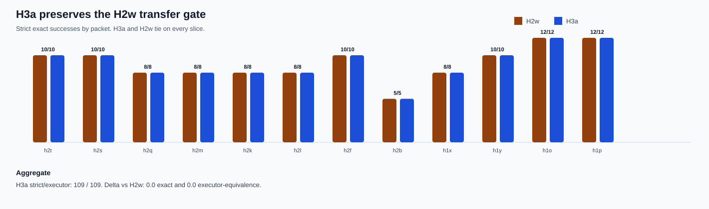

# H3a Transfer Backtest Synthesis

Generated: `2026-05-19T23:52:00.989578+00:00`

## Summary

H3a repaired the H3 controller holdout with two additional helper classes. This backtest asks the next causal question: do those new helpers preserve the incumbent H2w transfer/back-compat battery?

H3a reaches `109 / 109` strict exactness and `109 / 109` executor equivalence across H2s/H2t/H2q/H2m/H2k/H2l/H2f/H2b/H1x/H1y/H1o/H1p.

Against the incumbent H2w row, aggregate exact-rate delta is `0.0` and aggregate executor-equivalence-rate delta is `0.0`. The comparison set records `0` strict regressions and `0` H3a non-exact rows.

The H3a-specific helpers do not overtrigger on this back-compat gate: stale-selection paraphrase interventions `0`, negative-value component interventions `0`. Older helper traces still fire where expected, preserving controller attribution.

Decision: H3a passes the broad transfer regression gate, but the next paper-grade step is not to declare victory. It is to design a harder H3b/H4 slice that breaks the new 20/20 and 109/109 saturation surfaces.

## Packet Pair Rows

| slice | case_count | h2w_exact_success_count | h3a_exact_success_count | h2w_executor_success_count | h3a_executor_success_count | h3a_delta_exact_vs_h2w | h3a_delta_executor_vs_h2w |
| --- | --- | --- | --- | --- | --- | --- | --- |
| h2t | 10 | 10 | 10 | 10 | 10 | 0.0 | 0.0 |
| h2s | 10 | 10 | 10 | 10 | 10 | 0.0 | 0.0 |
| h2q | 8 | 8 | 8 | 8 | 8 | 0.0 | 0.0 |
| h2m | 8 | 8 | 8 | 8 | 8 | 0.0 | 0.0 |
| h2k | 8 | 8 | 8 | 8 | 8 | 0.0 | 0.0 |
| h2l | 8 | 8 | 8 | 8 | 8 | 0.0 | 0.0 |
| h2f | 10 | 10 | 10 | 10 | 10 | 0.0 | 0.0 |
| h2b | 5 | 5 | 5 | 5 | 5 | 0.0 | 0.0 |
| h1x | 8 | 8 | 8 | 8 | 8 | 0.0 | 0.0 |
| h1y | 10 | 10 | 10 | 10 | 10 | 0.0 | 0.0 |
| h1o | 12 | 12 | 12 | 12 | 12 | 0.0 | 0.0 |
| h1p | 12 | 12 | 12 | 12 | 12 | 0.0 | 0.0 |

## Comparison Rows

| comparison_label | comparison_dir | shared_case_count | baseline_exact_rate | candidate_exact_rate | delta_exact_rate | baseline_executor_equivalence_rate | candidate_executor_equivalence_rate | delta_executor_equivalence_rate |
| --- | --- | --- | --- | --- | --- | --- | --- | --- |
| h2t_h3a_vs_h2w | results/tool_probe_replay_live_comparisons/20260519T_h3a_boundary_combined_vs_h2w_on_h2t_v1 | 10 | 1.0 | 1.0 | 0.0 | 1.0 | 1.0 | 0.0 |
| h2s_h3a_vs_h2w | results/tool_probe_replay_live_comparisons/20260519T_h3a_boundary_combined_vs_h2w_on_h2s_v1 | 10 | 1.0 | 1.0 | 0.0 | 1.0 | 1.0 | 0.0 |
| h2q_h3a_vs_h2w | results/tool_probe_replay_live_comparisons/20260519T_h3a_boundary_combined_vs_h2w_on_h2q_v1 | 8 | 1.0 | 1.0 | 0.0 | 1.0 | 1.0 | 0.0 |
| h2m_h3a_vs_h2w | results/tool_probe_replay_live_comparisons/20260519T_h3a_boundary_combined_vs_h2w_on_h2m_v1 | 8 | 1.0 | 1.0 | 0.0 | 1.0 | 1.0 | 0.0 |
| h2k_h3a_vs_h2w | results/tool_probe_replay_live_comparisons/20260519T_h3a_boundary_combined_vs_h2w_on_h2k_v1 | 8 | 1.0 | 1.0 | 0.0 | 1.0 | 1.0 | 0.0 |
| h2l_h3a_vs_h2w | results/tool_probe_replay_live_comparisons/20260519T_h3a_boundary_combined_vs_h2w_on_h2l_v1 | 8 | 1.0 | 1.0 | 0.0 | 1.0 | 1.0 | 0.0 |
| h2f_h3a_vs_h2w | results/tool_probe_replay_live_comparisons/20260519T_h3a_boundary_combined_vs_h2w_on_h2f_v1 | 10 | 1.0 | 1.0 | 0.0 | 1.0 | 1.0 | 0.0 |
| h2b_h3a_vs_h2w | results/tool_probe_replay_live_comparisons/20260519T_h3a_boundary_combined_vs_h2w_on_h2b_v1 | 5 | 1.0 | 1.0 | 0.0 | 1.0 | 1.0 | 0.0 |
| h1x_h3a_vs_h2w | results/tool_probe_replay_live_comparisons/20260519T_h3a_boundary_combined_vs_h2w_on_h1x_v1 | 8 | 1.0 | 1.0 | 0.0 | 1.0 | 1.0 | 0.0 |
| h1y_h3a_vs_h2w | results/tool_probe_replay_live_comparisons/20260519T_h3a_boundary_combined_vs_h2w_on_h1y_v1 | 10 | 1.0 | 1.0 | 0.0 | 1.0 | 1.0 | 0.0 |
| h1o_h3a_vs_h2w | results/tool_probe_replay_live_comparisons/20260519T_h3a_boundary_combined_vs_h2w_on_h1o_v1 | 12 | 1.0 | 1.0 | 0.0 | 1.0 | 1.0 | 0.0 |
| h1p_h3a_vs_h2w | results/tool_probe_replay_live_comparisons/20260519T_h3a_boundary_combined_vs_h2w_on_h1p_v1 | 12 | 1.0 | 1.0 | 0.0 | 1.0 | 1.0 | 0.0 |

## Family Rows

| profile_label | family | case_count | exact_success_count | exact_rate | executor_success_count | executor_rate |
| --- | --- | --- | --- | --- | --- | --- |
| h2t_h2w_semantic_target_preservation | h2t_clean_route_control | 2 | 2 | 1.0 | 2 | 1.0 |
| h2t_h2w_semantic_target_preservation | h2t_current_selection_guard | 2 | 2 | 1.0 | 2 | 1.0 |
| h2t_h2w_semantic_target_preservation | h2t_low_score_surface_request | 3 | 3 | 1.0 | 3 | 1.0 |
| h2t_h2w_semantic_target_preservation | h2t_negation_scope_guard | 2 | 2 | 1.0 | 2 | 1.0 |
| h2t_h2w_semantic_target_preservation | h2t_value_is_target_guard | 1 | 1 | 1.0 | 1 | 1.0 |
| h2s_h2w_semantic_target_preservation | h2s_clean_route_control | 1 | 1 | 1.0 | 1 | 1.0 |
| h2s_h2w_semantic_target_preservation | h2s_contextual_alias_decoy_overlap | 2 | 2 | 1.0 | 2 | 1.0 |
| h2s_h2w_semantic_target_preservation | h2s_negated_decoy_guard | 1 | 1 | 1.0 | 1 | 1.0 |
| h2s_h2w_semantic_target_preservation | h2s_stale_surface_alias | 2 | 2 | 1.0 | 2 | 1.0 |
| h2s_h2w_semantic_target_preservation | h2s_surface_alias_same_value_decoy | 2 | 2 | 1.0 | 2 | 1.0 |
| h2s_h2w_semantic_target_preservation | h2s_value_bearing_stale_decoy | 2 | 2 | 1.0 | 2 | 1.0 |
| h2q_h2w_semantic_target_preservation | h2q_contextual_alias_decoy_overlap | 2 | 2 | 1.0 | 2 | 1.0 |
| h2q_h2w_semantic_target_preservation | h2q_stale_surface_alias | 2 | 2 | 1.0 | 2 | 1.0 |
| h2q_h2w_semantic_target_preservation | h2q_surface_alias_value_decoy | 2 | 2 | 1.0 | 2 | 1.0 |
| h2q_h2w_semantic_target_preservation | h2q_value_bearing_stale_decoy | 2 | 2 | 1.0 | 2 | 1.0 |
| h2m_h2w_semantic_target_preservation | h2m_contextual_alias_is_target | 2 | 2 | 1.0 | 2 | 1.0 |
| h2m_h2w_semantic_target_preservation | h2m_h2k_regression_guard_less_direct | 2 | 2 | 1.0 | 2 | 1.0 |
| h2m_h2w_semantic_target_preservation | h2m_less_direct_value_bearing_target | 4 | 4 | 1.0 | 4 | 1.0 |
| h2k_h2w_semantic_target_preservation | h2k_before_reading_decoy | 2 | 2 | 1.0 | 2 | 1.0 |
| h2k_h2w_semantic_target_preservation | h2k_code_label_overlap | 2 | 2 | 1.0 | 2 | 1.0 |
| h2k_h2w_semantic_target_preservation | h2k_negated_same_component_decoy | 3 | 3 | 1.0 | 3 | 1.0 |
| h2k_h2w_semantic_target_preservation | h2k_transfer_regression_guard | 1 | 1 | 1.0 | 1 | 1.0 |
| h2l_h2w_semantic_target_preservation | h2l_alias_is_target | 2 | 2 | 1.0 | 2 | 1.0 |
| h2l_h2w_semantic_target_preservation | h2l_h2k_regression_guard | 2 | 2 | 1.0 | 2 | 1.0 |
| h2l_h2w_semantic_target_preservation | h2l_value_bearing_target | 4 | 4 | 1.0 | 4 | 1.0 |
| h2f_h2w_semantic_target_preservation | h2f_activation_panel_notice | 2 | 2 | 1.0 | 2 | 1.0 |
| h2f_h2w_semantic_target_preservation | h2f_route_code_label | 2 | 2 | 1.0 | 2 | 1.0 |
| h2f_h2w_semantic_target_preservation | h2f_route_component_class_transfer | 2 | 2 | 1.0 | 2 | 1.0 |
| h2f_h2w_semantic_target_preservation | h2f_route_nonstandard_class | 2 | 2 | 1.0 | 2 | 1.0 |
| h2f_h2w_semantic_target_preservation | h2f_route_stale_field | 2 | 2 | 1.0 | 2 | 1.0 |
| h2b_h2w_semantic_target_preservation | h1o_code_negation_preservation | 2 | 2 | 1.0 | 2 | 1.0 |
| h2b_h2w_semantic_target_preservation | h1p_component_value_compact | 1 | 1 | 1.0 | 1 | 1.0 |
| h2b_h2w_semantic_target_preservation | h1p_component_value_surface | 1 | 1 | 1.0 | 1 | 1.0 |
| h2b_h2w_semantic_target_preservation | visual_argument_transfer_component_value_pill | 1 | 1 | 1.0 | 1 | 1.0 |
| h1x_h2w_semantic_target_preservation | h1x_oblique_activation_no_call | 2 | 2 | 1.0 | 2 | 1.0 |
| h1x_h2w_semantic_target_preservation | h1x_oblique_nonstandard_class | 2 | 2 | 1.0 | 2 | 1.0 |
| h1x_h2w_semantic_target_preservation | h1x_oblique_stale_field | 2 | 2 | 1.0 | 2 | 1.0 |
| h1x_h2w_semantic_target_preservation | h1x_oblique_surface_value | 2 | 2 | 1.0 | 2 | 1.0 |
| h1y_h2w_semantic_target_preservation | h1y_activation_no_call | 1 | 1 | 1.0 | 1 | 1.0 |
| h1y_h2w_semantic_target_preservation | h1y_preserve_surface_value | 2 | 2 | 1.0 | 2 | 1.0 |
| h1y_h2w_semantic_target_preservation | h1y_route_code_label | 2 | 2 | 1.0 | 2 | 1.0 |
| h1y_h2w_semantic_target_preservation | h1y_route_nonstandard_class | 2 | 2 | 1.0 | 2 | 1.0 |
| h1y_h2w_semantic_target_preservation | h1y_route_stale_field | 3 | 3 | 1.0 | 3 | 1.0 |
| h1o_h2w_semantic_target_preservation | h1o_activation_no_call | 4 | 4 | 1.0 | 4 | 1.0 |
| h1o_h2w_semantic_target_preservation | h1o_code_negation_preservation | 4 | 4 | 1.0 | 4 | 1.0 |
| h1o_h2w_semantic_target_preservation | h1o_component_value_boundary | 4 | 4 | 1.0 | 4 | 1.0 |
| h1p_h2w_semantic_target_preservation | h1p_component_value_compact | 4 | 4 | 1.0 | 4 | 1.0 |
| h1p_h2w_semantic_target_preservation | h1p_component_value_stale_selection | 4 | 4 | 1.0 | 4 | 1.0 |
| h1p_h2w_semantic_target_preservation | h1p_component_value_surface | 4 | 4 | 1.0 | 4 | 1.0 |
| h2t_h3a_boundary_combined | h2t_clean_route_control | 2 | 2 | 1.0 | 2 | 1.0 |
| h2t_h3a_boundary_combined | h2t_current_selection_guard | 2 | 2 | 1.0 | 2 | 1.0 |
| h2t_h3a_boundary_combined | h2t_low_score_surface_request | 3 | 3 | 1.0 | 3 | 1.0 |
| h2t_h3a_boundary_combined | h2t_negation_scope_guard | 2 | 2 | 1.0 | 2 | 1.0 |
| h2t_h3a_boundary_combined | h2t_value_is_target_guard | 1 | 1 | 1.0 | 1 | 1.0 |
| h2s_h3a_boundary_combined | h2s_clean_route_control | 1 | 1 | 1.0 | 1 | 1.0 |
| h2s_h3a_boundary_combined | h2s_contextual_alias_decoy_overlap | 2 | 2 | 1.0 | 2 | 1.0 |
| h2s_h3a_boundary_combined | h2s_negated_decoy_guard | 1 | 1 | 1.0 | 1 | 1.0 |
| h2s_h3a_boundary_combined | h2s_stale_surface_alias | 2 | 2 | 1.0 | 2 | 1.0 |
| h2s_h3a_boundary_combined | h2s_surface_alias_same_value_decoy | 2 | 2 | 1.0 | 2 | 1.0 |
| h2s_h3a_boundary_combined | h2s_value_bearing_stale_decoy | 2 | 2 | 1.0 | 2 | 1.0 |
| h2q_h3a_boundary_combined | h2q_contextual_alias_decoy_overlap | 2 | 2 | 1.0 | 2 | 1.0 |
| h2q_h3a_boundary_combined | h2q_stale_surface_alias | 2 | 2 | 1.0 | 2 | 1.0 |
| h2q_h3a_boundary_combined | h2q_surface_alias_value_decoy | 2 | 2 | 1.0 | 2 | 1.0 |
| h2q_h3a_boundary_combined | h2q_value_bearing_stale_decoy | 2 | 2 | 1.0 | 2 | 1.0 |
| h2m_h3a_boundary_combined | h2m_contextual_alias_is_target | 2 | 2 | 1.0 | 2 | 1.0 |
| h2m_h3a_boundary_combined | h2m_h2k_regression_guard_less_direct | 2 | 2 | 1.0 | 2 | 1.0 |
| h2m_h3a_boundary_combined | h2m_less_direct_value_bearing_target | 4 | 4 | 1.0 | 4 | 1.0 |
| h2k_h3a_boundary_combined | h2k_before_reading_decoy | 2 | 2 | 1.0 | 2 | 1.0 |
| h2k_h3a_boundary_combined | h2k_code_label_overlap | 2 | 2 | 1.0 | 2 | 1.0 |
| h2k_h3a_boundary_combined | h2k_negated_same_component_decoy | 3 | 3 | 1.0 | 3 | 1.0 |
| h2k_h3a_boundary_combined | h2k_transfer_regression_guard | 1 | 1 | 1.0 | 1 | 1.0 |
| h2l_h3a_boundary_combined | h2l_alias_is_target | 2 | 2 | 1.0 | 2 | 1.0 |
| h2l_h3a_boundary_combined | h2l_h2k_regression_guard | 2 | 2 | 1.0 | 2 | 1.0 |
| h2l_h3a_boundary_combined | h2l_value_bearing_target | 4 | 4 | 1.0 | 4 | 1.0 |
| h2f_h3a_boundary_combined | h2f_activation_panel_notice | 2 | 2 | 1.0 | 2 | 1.0 |
| h2f_h3a_boundary_combined | h2f_route_code_label | 2 | 2 | 1.0 | 2 | 1.0 |
| h2f_h3a_boundary_combined | h2f_route_component_class_transfer | 2 | 2 | 1.0 | 2 | 1.0 |
| h2f_h3a_boundary_combined | h2f_route_nonstandard_class | 2 | 2 | 1.0 | 2 | 1.0 |
| h2f_h3a_boundary_combined | h2f_route_stale_field | 2 | 2 | 1.0 | 2 | 1.0 |
| h2b_h3a_boundary_combined | h1o_code_negation_preservation | 2 | 2 | 1.0 | 2 | 1.0 |
| h2b_h3a_boundary_combined | h1p_component_value_compact | 1 | 1 | 1.0 | 1 | 1.0 |
| h2b_h3a_boundary_combined | h1p_component_value_surface | 1 | 1 | 1.0 | 1 | 1.0 |
| h2b_h3a_boundary_combined | visual_argument_transfer_component_value_pill | 1 | 1 | 1.0 | 1 | 1.0 |
| h1x_h3a_boundary_combined | h1x_oblique_activation_no_call | 2 | 2 | 1.0 | 2 | 1.0 |
| h1x_h3a_boundary_combined | h1x_oblique_nonstandard_class | 2 | 2 | 1.0 | 2 | 1.0 |
| h1x_h3a_boundary_combined | h1x_oblique_stale_field | 2 | 2 | 1.0 | 2 | 1.0 |
| h1x_h3a_boundary_combined | h1x_oblique_surface_value | 2 | 2 | 1.0 | 2 | 1.0 |
| h1y_h3a_boundary_combined | h1y_activation_no_call | 1 | 1 | 1.0 | 1 | 1.0 |
| h1y_h3a_boundary_combined | h1y_preserve_surface_value | 2 | 2 | 1.0 | 2 | 1.0 |
| h1y_h3a_boundary_combined | h1y_route_code_label | 2 | 2 | 1.0 | 2 | 1.0 |
| h1y_h3a_boundary_combined | h1y_route_nonstandard_class | 2 | 2 | 1.0 | 2 | 1.0 |
| h1y_h3a_boundary_combined | h1y_route_stale_field | 3 | 3 | 1.0 | 3 | 1.0 |
| h1o_h3a_boundary_combined | h1o_activation_no_call | 4 | 4 | 1.0 | 4 | 1.0 |
| h1o_h3a_boundary_combined | h1o_code_negation_preservation | 4 | 4 | 1.0 | 4 | 1.0 |
| h1o_h3a_boundary_combined | h1o_component_value_boundary | 4 | 4 | 1.0 | 4 | 1.0 |
| h1p_h3a_boundary_combined | h1p_component_value_compact | 4 | 4 | 1.0 | 4 | 1.0 |
| h1p_h3a_boundary_combined | h1p_component_value_stale_selection | 4 | 4 | 1.0 | 4 | 1.0 |
| h1p_h3a_boundary_combined | h1p_component_value_surface | 4 | 4 | 1.0 | 4 | 1.0 |

## Controller Intervention Rows

| profile_label | case_id | family | intervention_kind | from_tool | from_arguments | to_tool | to_arguments | preserved_target_query | requested_label | requested_region_id | prompt_state_label | blocked_label | reason |
| --- | --- | --- | --- | --- | --- | --- | --- | --- | --- | --- | --- | --- | --- |
| h2t_h2w_semantic_target_preservation | h2t_result_drawer_low_score_badge_decoy | h2t_low_score_surface_request | visual_target_query_normalization | extract_layout | {"image_id":"img-h2t-result-drawer-blocked","target_query":"result badge c08"} | extract_layout | {"image_id":"img-h2t-result-drawer-blocked","target_query":"result drawer"} |  |  |  | result drawer |  |  |
| h2t_h2w_semantic_target_preservation | h2t_risk_lane_high_chip_decoy | h2t_low_score_surface_request | visual_target_query_normalization | extract_layout | {"image_id":"img-h2t-risk-lane-high","target_query":"risk lane High"} | extract_layout | {"image_id":"img-h2t-risk-lane-high","target_query":"risk lane"} |  |  |  | risk lane |  |  |
| h2t_h2w_semantic_target_preservation | h2t_stage_column_review_tag_decoy | h2t_low_score_surface_request | visual_target_query_normalization | extract_layout | {"image_id":"img-h2t-stage-column-review","target_query":"stage column Review"} | extract_layout | {"image_id":"img-h2t-stage-column-review","target_query":"stage column"} |  |  |  | stage column |  |  |
| h2t_h2w_semantic_target_preservation | h2t_metric_panel_negation_scope_note | h2t_negation_scope_guard | visual_semantic_target_preservation | extract_layout | {"image_id":"img-h2t-metric-panel-negation-scope","target_query":"metric panel"} | extract_layout | {"image_id":"img-h2t-metric-panel-negation-scope","target_query":"metric panel"} | metric panel |  |  | metric panel | training note | semantic_label_preserved_over_stale_context |
| h2t_h2w_semantic_target_preservation | h2t_metric_panel_negation_scope_note | h2t_negation_scope_guard | visual_composed_route_gating_blocked | extract_layout | {"image_id":"img-h2t-metric-panel-negation-scope","target_query":"metric panel"} |  | {} | metric panel |  |  |  | training note | negation_scope_exact_layout_label |
| h2t_h2w_semantic_target_preservation | h2t_summary_tile_negation_scope_caption | h2t_negation_scope_guard | visual_semantic_target_preservation | extract_layout | {"image_id":"img-h2t-summary-tile-negation-scope","target_query":"summary tile"} | extract_layout | {"image_id":"img-h2t-summary-tile-negation-scope","target_query":"summary tile"} | summary tile |  |  | summary tile | caption | semantic_label_preserved_over_stale_context |
| h2t_h2w_semantic_target_preservation | h2t_summary_tile_negation_scope_caption | h2t_negation_scope_guard | visual_composed_route_gating_blocked | extract_layout | {"image_id":"img-h2t-summary-tile-negation-scope","target_query":"summary tile"} |  | {} | summary tile |  |  |  | caption | negation_scope_exact_layout_label |
| h2t_h2w_semantic_target_preservation | h2t_escalated_value_not_badge_component | h2t_value_is_target_guard | visual_target_query_normalization | extract_layout | {"image_id":"img-h2t-escalated-value","target_query":"Escalated value"} | extract_layout | {"image_id":"img-h2t-escalated-value","target_query":"Escalated value cell"} |  |  |  | Escalated value cell |  |  |
| h2s_h2w_semantic_target_preservation | h2s_review_tile_waiting_chip_note_decoys | h2s_surface_alias_same_value_decoy | visual_target_query_normalization | extract_layout | {"image_id":"img-h2s-review-tile-waiting","target_query":"Waiting review chip"} | extract_layout | {"image_id":"img-h2s-review-tile-waiting","target_query":"review note"} |  |  |  | review note |  |  |
| h2s_h2w_semantic_target_preservation | h2s_review_tile_waiting_chip_note_decoys | h2s_surface_alias_same_value_decoy | visual_composed_route_gating | extract_layout | {"image_id":"img-h2s-review-tile-waiting","target_query":"review note"} | extract_layout | {"image_id":"img-h2s-review-tile-waiting","target_query":"review tile"} |  | review tile | h2s-review-tile-waiting-14002 |  |  | requested_surface_over_deprioritized_decoy |
| h2s_h2w_semantic_target_preservation | h2s_signal_panel_green_tag_marker_decoys | h2s_surface_alias_same_value_decoy | visual_composed_route_gating | extract_layout | {"image_id":"img-h2s-signal-panel-green","target_query":"Green signal tag"} | extract_layout | {"image_id":"img-h2s-signal-panel-green","target_query":"signal panel"} |  | signal panel | h2s-signal-panel-green-14012 |  |  | requested_surface_over_deprioritized_decoy |
| h2s_h2w_semantic_target_preservation | h2s_severity_pill_critical_archived_badge_decoy | h2s_value_bearing_stale_decoy | visual_target_query_normalization | extract_layout | {"image_id":"img-h2s-severity-pill-critical","target_query":"Critical severity pill"} | extract_layout | {"image_id":"img-h2s-severity-pill-critical","target_query":"severity pill Critical"} |  |  |  | severity pill Critical |  |  |
| h2s_h2w_semantic_target_preservation | h2s_reviewer_field_malik_old_owner_decoy | h2s_value_bearing_stale_decoy | visual_target_query_normalization | extract_layout | {"image_id":"img-h2s-reviewer-field-malik","target_query":"Malik reviewer field"} | extract_layout | {"image_id":"img-h2s-reviewer-field-malik","target_query":"reviewer field Malik"} |  |  |  | reviewer field Malik |  |  |
| h2s_h2w_semantic_target_preservation | h2s_timeout_exception_notice_banner_log_decoys | h2s_contextual_alias_decoy_overlap | visual_target_query_normalization | extract_layout | {"image_id":"img-h2s-timeout-exception-notice","target_query":"archived runbook card"} | extract_layout | {"image_id":"img-h2s-timeout-exception-notice","target_query":"timeout banner"} |  |  |  | timeout banner |  |  |
| h2s_h2w_semantic_target_preservation | h2s_timeout_exception_notice_banner_log_decoys | h2s_contextual_alias_decoy_overlap | visual_composed_route_gating | extract_layout | {"image_id":"img-h2s-timeout-exception-notice","target_query":"timeout banner"} | extract_layout | {"image_id":"img-h2s-timeout-exception-notice","target_query":"timeout exception notice"} |  | timeout exception notice | h2s-timeout-exception-notice-14042 |  |  | requested_surface_over_deprioritized_decoy |
| h2s_h2w_semantic_target_preservation | h2s_delivery_field_paused_toggle_switch_decoys | h2s_contextual_alias_decoy_overlap | visual_semantic_target_preservation | extract_layout | {"image_id":"img-h2s-delivery-field-paused","target_query":"delivery field"} | extract_layout | {"image_id":"img-h2s-delivery-field-paused","target_query":"delivery field"} | delivery field |  |  | delivery field | paused toggle | semantic_label_preserved_over_stale_context |
| h2s_h2w_semantic_target_preservation | h2s_result_panel_waiting_stale_selection_hint | h2s_stale_surface_alias | visual_composed_route_gating | refine_selection | {"filter_query":"Waiting","selection_id":"sel-archive-result-chip"} | extract_layout | {"image_id":"img-h2s-result-panel-stale-selection","target_query":"result panel"} |  | result panel | h2s-current-result-panel-14062 |  |  | stale_selection_to_requested_surface |
| h2s_h2w_semantic_target_preservation | h2s_status_tile_ready_stale_selection_hint | h2s_stale_surface_alias | visual_composed_route_gating | refine_selection | {"filter_query":"Ready","selection_id":"sel-old-status-tag"} | extract_layout | {"image_id":"img-h2s-status-tile-stale-selection","target_query":"status tile"} |  | status tile | h2s-current-status-tile-14072 |  |  | stale_selection_to_requested_surface |
| h2s_h2w_semantic_target_preservation | h2s_approval_panel_pending_negated_badge_note | h2s_negated_decoy_guard | visual_target_query_normalization | extract_layout | {"image_id":"img-h2s-approval-panel-pending","target_query":"panel Pending"} | extract_layout | {"image_id":"img-h2s-approval-panel-pending","target_query":"approval note"} |  |  |  | approval note |  |  |
| h2s_h2w_semantic_target_preservation | h2s_approval_panel_pending_negated_badge_note | h2s_negated_decoy_guard | visual_composed_route_gating | extract_layout | {"image_id":"img-h2s-approval-panel-pending","target_query":"approval note"} | extract_layout | {"image_id":"img-h2s-approval-panel-pending","target_query":"approval panel"} |  | approval panel | h2s-approval-panel-pending-14082 |  |  | requested_surface_over_deprioritized_decoy |
| h2q_h2w_semantic_target_preservation | h2q_result_tile_blocked_value_badge_decoy | h2q_surface_alias_value_decoy | visual_target_query_normalization | extract_layout | {"image_id":"img-h2q-result-tile-blocked","target_query":"Blocked badge"} | extract_layout | {"image_id":"img-h2q-result-tile-blocked","target_query":"result comment"} |  |  |  | result comment |  |  |
| h2q_h2w_semantic_target_preservation | h2q_result_tile_blocked_value_badge_decoy | h2q_surface_alias_value_decoy | visual_composed_route_gating | extract_layout | {"image_id":"img-h2q-result-tile-blocked","target_query":"result comment"} | extract_layout | {"image_id":"img-h2q-result-tile-blocked","target_query":"result tile"} |  | result tile | h2q-result-tile-blocked-13002 |  |  | requested_surface_over_deprioritized_decoy |
| h2q_h2w_semantic_target_preservation | h2q_state_panel_closed_value_tag_decoy | h2q_surface_alias_value_decoy | visual_contextual_surface_alias_routing | extract_layout | {"image_id":"img-h2q-state-panel-closed","target_query":"Closed"} | extract_layout | {"image_id":"img-h2q-state-panel-closed","target_query":"state panel"} |  |  |  |  |  | contextual_surface_alias_recoverable |
| h2q_h2w_semantic_target_preservation | h2q_priority_badge_critical_stale_status_decoy | h2q_value_bearing_stale_decoy | visual_target_query_normalization | extract_layout | {"image_id":"img-h2q-priority-badge-critical","target_query":"Critical priority badge"} | extract_layout | {"image_id":"img-h2q-priority-badge-critical","target_query":"priority badge Critical"} |  |  |  | priority badge Critical |  |  |
| h2q_h2w_semantic_target_preservation | h2q_owner_field_amina_archived_owner_decoy | h2q_value_bearing_stale_decoy | visual_semantic_target_preservation | extract_layout | {"image_id":"img-h2q-owner-field-amina","target_query":"owner field Amina"} | extract_layout | {"image_id":"img-h2q-owner-field-amina","target_query":"owner field Amina"} | owner field Amina |  |  | owner field Amina | owner field | semantic_label_preserved_over_stale_context |
| h2q_h2w_semantic_target_preservation | h2q_owner_field_amina_archived_owner_decoy | h2q_value_bearing_stale_decoy | visual_stale_selection_gate | refine_selection | {"filter_query":"latest","selection_id":"amina"} | extract_layout | {"image_id":"img-h2q-owner-field-amina","target_query":"owner field Amina"} |  |  |  |  |  |  |
| h2q_h2w_semantic_target_preservation | h2q_archive_panel_error_notice_banner_decoy | h2q_contextual_alias_decoy_overlap | visual_target_query_normalization | extract_layout | {"image_id":"img-h2q-error-notice","target_query":"archived exception panel"} | extract_layout | {"image_id":"img-h2q-error-notice","target_query":"error banner"} |  |  |  | error banner |  |  |
| h2q_h2w_semantic_target_preservation | h2q_archive_panel_error_notice_banner_decoy | h2q_contextual_alias_decoy_overlap | visual_composed_route_gating | extract_layout | {"image_id":"img-h2q-error-notice","target_query":"error banner"} | extract_layout | {"image_id":"img-h2q-error-notice","target_query":"error notice"} |  | error notice | h2q-error-notice-13042 |  |  | requested_surface_over_deprioritized_decoy |
| h2q_h2w_semantic_target_preservation | h2q_mode_field_manual_switch_decoy | h2q_contextual_alias_decoy_overlap | visual_semantic_target_preservation | extract_layout | {"image_id":"img-h2q-mode-field","target_query":"mode field"} | extract_layout | {"image_id":"img-h2q-mode-field","target_query":"mode field"} | mode field |  |  | mode field | mode switch | semantic_label_preserved_over_stale_context |
| h2q_h2w_semantic_target_preservation | h2q_result_tile_stale_selection_hint | h2q_stale_surface_alias | visual_composed_route_gating | refine_selection | {"filter_query":"Blocked","selection_id":"sel-archived-result-badge"} | extract_layout | {"image_id":"img-h2q-result-tile-stale-selection","target_query":"result tile"} |  | result tile | h2q-current-result-tile-13062 |  |  | stale_selection_to_requested_surface |
| h2q_h2w_semantic_target_preservation | h2q_state_panel_stale_selection_hint | h2q_stale_surface_alias | visual_composed_route_gating | refine_selection | {"filter_query":"Closed","selection_id":"sel-archived-state-tag"} | extract_layout | {"image_id":"img-h2q-state-panel-stale-selection","target_query":"state panel"} |  | state panel | h2q-current-state-panel-13072 |  |  | stale_selection_to_requested_surface |
| h2m_h2w_semantic_target_preservation | h2m_result_badge_blocked_contextual_value | h2m_less_direct_value_bearing_target | visual_value_bearing_target_query_synthesis | extract_layout | {"image_id":"img-h2m-result-badge-blocked","target_query":"result chip"} | extract_layout | {"image_id":"img-h2m-result-badge-blocked","target_query":"result badge Blocked"} |  |  |  | result badge |  | value_bearing_label_recoverable |
| h2m_h2w_semantic_target_preservation | h2m_state_tag_closed_contextual_value | h2m_less_direct_value_bearing_target | visual_target_query_normalization | extract_layout | {"image_id":"img-h2m-state-tag-closed","target_query":"Closed state tag"} | extract_layout | {"image_id":"img-h2m-state-tag-closed","target_query":"state tag Closed"} |  |  |  | state tag Closed |  |  |
| h2m_h2w_semantic_target_preservation | h2m_mode_toggle_manual_contextual_value | h2m_less_direct_value_bearing_target | visual_target_query_normalization | extract_layout | {"image_id":"img-h2m-mode-toggle-manual","target_query":"mode toggle"} | extract_layout | {"image_id":"img-h2m-mode-toggle-manual","target_query":"mode toggle Manual"} |  |  |  | mode toggle Manual |  |  |
| h2m_h2w_semantic_target_preservation | h2m_priority_badge_critical_contextual_value | h2m_less_direct_value_bearing_target | visual_target_query_normalization | extract_layout | {"image_id":"img-h2m-priority-badge-critical","target_query":"priority badge critical"} | extract_layout | {"image_id":"img-h2m-priority-badge-critical","target_query":"priority badge Critical"} |  |  |  | priority badge Critical |  |  |
| h2m_h2w_semantic_target_preservation | h2m_error_notice_contextual_alias | h2m_contextual_alias_is_target | visual_target_query_normalization | extract_layout | {"image_id":"img-h2m-error-notice","target_query":"archive panel"} | extract_layout | {"image_id":"img-h2m-error-notice","target_query":"error notice"} |  |  |  | error notice |  |  |
| h2m_h2w_semantic_target_preservation | h2m_result_tile_contextual_alias | h2m_contextual_alias_is_target | visual_contextual_surface_alias_routing | extract_layout | {"image_id":"img-h2m-result-tile","target_query":"Blocked"} | extract_layout | {"image_id":"img-h2m-result-tile","target_query":"result tile"} |  |  |  |  |  | contextual_surface_alias_recoverable |
| h2m_h2w_semantic_target_preservation | h2m_mode_field_contextual_regression_guard | h2m_h2k_regression_guard_less_direct | visual_target_query_normalization | extract_layout | {"image_id":"img-h2m-mode-field-short","target_query":"mode switch"} | extract_layout | {"image_id":"img-h2m-mode-field-short","target_query":"mode field"} |  |  |  | mode field |  |  |
| h2k_h2w_semantic_target_preservation | h2k_mode_toggle_negated_consent_toggle_decoy | h2k_negated_same_component_decoy | visual_target_query_normalization | extract_layout | {"image_id":"img-h2k-mode-toggle","target_query":"mode toggle Manual"} | extract_layout | {"image_id":"img-h2k-mode-toggle","target_query":"mode toggle"} |  |  |  | mode toggle |  |  |
| h2k_h2w_semantic_target_preservation | h2k_result_badge_negated_result_tile_decoy | h2k_negated_same_component_decoy | visual_target_query_normalization | extract_layout | {"image_id":"img-h2k-result-badge","target_query":"result badge Blocked"} | extract_layout | {"image_id":"img-h2k-result-badge","target_query":"result badge"} |  |  |  | result badge |  |  |
| h2k_h2w_semantic_target_preservation | h2k_error_banner_archived_error_notice_decoy | h2k_transfer_regression_guard | visual_target_query_normalization | extract_layout | {"image_id":"img-h2k-error-banner","target_query":"error notice"} | extract_layout | {"image_id":"img-h2k-error-banner","target_query":"error banner"} |  |  |  | error banner |  |  |
| h2k_h2w_semantic_target_preservation | h2k_state_tag_before_reading_state_marker_decoy | h2k_before_reading_decoy | visual_target_query_normalization | extract_layout | {"image_id":"img-h2k-state-tag","target_query":"state tag Closed"} | extract_layout | {"image_id":"img-h2k-state-tag","target_query":"state tag"} |  |  |  | state tag |  |  |
| h2k_h2w_semantic_target_preservation | h2k_mode_field_before_reading_mode_switch_decoy | h2k_before_reading_decoy | visual_target_query_normalization | extract_layout | {"image_id":"img-h2k-mode-field","target_query":"mode toggle"} | extract_layout | {"image_id":"img-h2k-mode-field","target_query":"mode field"} |  |  |  | mode field |  |  |
| h2k_h2w_semantic_target_preservation | h2k_alert_t47_archived_alert_s92_decoy | h2k_code_label_overlap | visual_composed_route_gating_blocked | extract_layout | {"image_id":"img-h2k-alert-t47","target_query":"alert t47"} |  | {} | alert t47 |  |  |  | alert s92 | negation_scope_exact_layout_label |
| h2l_h2w_semantic_target_preservation | h2l_status_badge_short_label_regression_guard | h2l_h2k_regression_guard | visual_target_query_normalization | extract_layout | {"image_id":"img-h2l-status-badge-short","target_query":"critical chip"} | extract_layout | {"image_id":"img-h2l-status-badge-short","target_query":"status badge"} |  |  |  | status badge |  |  |
| h2f_h2w_semantic_target_preservation | h2f_result_tile_comment_value_decoy | h2f_route_component_class_transfer | visual_target_query_normalization | extract_layout | {"image_id":"img-h2f-result-tile","target_query":"Blocked"} | extract_layout | {"image_id":"img-h2f-result-tile","target_query":"result tile"} |  |  |  | result tile |  |  |
| h2f_h2w_semantic_target_preservation | h2f_resolution_badge_log_result_decoy | h2f_route_component_class_transfer | visual_target_query_normalization | extract_layout | {"image_id":"img-h2f-resolution-badge","target_query":"Deferred"} | extract_layout | {"image_id":"img-h2f-resolution-badge","target_query":"resolution badge"} |  |  |  | resolution badge |  |  |
| h2f_h2w_semantic_target_preservation | h2f_state_marker_history_value_decoy | h2f_route_nonstandard_class | visual_target_query_normalization | extract_layout | {"image_id":"img-h2f-state-marker","target_query":"lifecycle state marker"} | extract_layout | {"image_id":"img-h2f-state-marker","target_query":"state marker"} |  |  |  | state marker |  |  |
| h2f_h2w_semantic_target_preservation | h2f_mode_switch_note_value_decoy | h2f_route_nonstandard_class | visual_target_query_normalization | extract_layout | {"image_id":"img-h2f-mode-switch","target_query":"mode toggle"} | extract_layout | {"image_id":"img-h2f-mode-switch","target_query":"mode switch"} |  |  |  | mode switch |  |  |
| h2f_h2w_semantic_target_preservation | h2f_owner_field_previous_memo_decoy | h2f_route_stale_field | visual_stale_selection_gate | refine_selection | {"filter_query":"owner field","selection_id":"sel-h2f-owner-memo"} | extract_layout | {"image_id":"img-h2f-owner-field","target_query":"owner field"} |  |  |  |  |  |  |
| h2b_h2w_semantic_target_preservation | component_value_result_pill_log_decoy | visual_argument_transfer_component_value_pill | visual_stale_selection_gate | refine_selection | {"filter_query":"approved","selection_id":null} | extract_layout | {"image_id":"img-component-result-pill","target_query":"result pill"} |  |  |  |  |  |  |
| h1x_h2w_semantic_target_preservation | h1x_responsible_party_field_old_owner_memo_decoy | h1x_oblique_stale_field | visual_stale_selection_gate | refine_selection | {"filter_query":"responsible-party entry showing Iris","selection_id":"sel-owner-memo"} | extract_layout | {"image_id":"img-h1x-owner-field","target_query":"owner field"} |  |  |  |  |  |  |
| h1x_h2w_semantic_target_preservation | h1x_workstream_owner_field_previous_summary_decoy | h1x_oblique_stale_field | visual_stale_selection_gate | refine_selection | {"filter_query":"owner","selection_id":"sel-workstream-summary"} | extract_layout | {"image_id":"img-h1x-workstream-owner","target_query":"owner field"} |  |  |  |  |  |  |
| h1y_h2w_semantic_target_preservation | h1y_responsible_party_field_old_owner_memo_decoy | h1y_route_stale_field | visual_stale_selection_gate | refine_selection | {"filter_query":"latest","selection_id":"sel-h1y-owner-memo"} | extract_layout | {"image_id":"img-h1y-owner-field","target_query":"owner field"} |  |  |  |  |  |  |
| h1y_h2w_semantic_target_preservation | h1y_escalation_contact_field_saved_summary_decoy | h1y_route_stale_field | visual_stale_selection_gate | refine_selection | {"filter_query":"latest","selection_id":"sel-h1y-contact-summary"} | extract_layout | {"image_id":"img-h1y-escalation-contact","target_query":"owner field"} |  |  |  |  |  |  |
| h1y_h2w_semantic_target_preservation | h1y_lifecycle_state_tag_audit_value_decoy | h1y_route_nonstandard_class | visual_target_query_normalization | extract_layout | {"image_id":"img-h1y-state-tag","target_query":"lifecycle state tag"} | extract_layout | {"image_id":"img-h1y-state-tag","target_query":"state tag"} |  |  |  | state tag |  |  |
| h1y_h2w_semantic_target_preservation | h1y_alert_s92_negated_toggle_decoy | h1y_route_code_label | visual_composed_route_gating_blocked | extract_layout | {"image_id":"img-h1y-alert-s92","target_query":"alert s92"} |  | {} | alert s92 |  |  |  | override toggle | negation_scope_exact_layout_label |
| h1y_h2w_semantic_target_preservation | h1y_status_pill_summary_value_holdout | h1y_preserve_surface_value | visual_target_query_normalization | extract_layout | {"image_id":"img-h1y-status-pill","target_query":"Pending"} | extract_layout | {"image_id":"img-h1y-status-pill","target_query":"status pill"} |  |  |  | status pill |  |  |
| h1o_h2w_semantic_target_preservation | h1o_activation_warning_tile_no_call_decoy | h1o_activation_no_call | visual_target_query_normalization | extract_layout | {"image_id":"img-h1o-activation-warning-tile","target_query":"overdue"} | extract_layout | {"image_id":"img-h1o-activation-warning-tile","target_query":"warning tile"} |  |  |  | warning tile |  |  |
| h2t_h3a_boundary_combined | h2t_result_drawer_low_score_badge_decoy | h2t_low_score_surface_request | visual_target_query_normalization | extract_layout | {"image_id":"img-h2t-result-drawer-blocked","target_query":"result drawer Blocked"} | extract_layout | {"image_id":"img-h2t-result-drawer-blocked","target_query":"result drawer"} |  |  |  | result drawer |  |  |
| h2t_h3a_boundary_combined | h2t_risk_lane_high_chip_decoy | h2t_low_score_surface_request | visual_target_query_normalization | extract_layout | {"image_id":"img-h2t-risk-lane-high","target_query":"risk lane High"} | extract_layout | {"image_id":"img-h2t-risk-lane-high","target_query":"risk lane"} |  |  |  | risk lane |  |  |
| h2t_h3a_boundary_combined | h2t_stage_column_review_tag_decoy | h2t_low_score_surface_request | visual_target_query_normalization | extract_layout | {"image_id":"img-h2t-stage-column-review","target_query":"stage column Review"} | extract_layout | {"image_id":"img-h2t-stage-column-review","target_query":"stage column"} |  |  |  | stage column |  |  |
| h2t_h3a_boundary_combined | h2t_metric_panel_negation_scope_note | h2t_negation_scope_guard | visual_semantic_target_preservation | extract_layout | {"image_id":"img-h2t-metric-panel-negation-scope","target_query":"metric panel"} | extract_layout | {"image_id":"img-h2t-metric-panel-negation-scope","target_query":"metric panel"} | metric panel |  |  | metric panel | training note | semantic_label_preserved_over_stale_context |
| h2t_h3a_boundary_combined | h2t_metric_panel_negation_scope_note | h2t_negation_scope_guard | visual_composed_route_gating_blocked | extract_layout | {"image_id":"img-h2t-metric-panel-negation-scope","target_query":"metric panel"} |  | {} | metric panel |  |  |  | training note | negation_scope_exact_layout_label |
| h2t_h3a_boundary_combined | h2t_summary_tile_negation_scope_caption | h2t_negation_scope_guard | visual_semantic_target_preservation | extract_layout | {"image_id":"img-h2t-summary-tile-negation-scope","target_query":"summary tile"} | extract_layout | {"image_id":"img-h2t-summary-tile-negation-scope","target_query":"summary tile"} | summary tile |  |  | summary tile | caption | semantic_label_preserved_over_stale_context |
| h2t_h3a_boundary_combined | h2t_summary_tile_negation_scope_caption | h2t_negation_scope_guard | visual_composed_route_gating_blocked | extract_layout | {"image_id":"img-h2t-summary-tile-negation-scope","target_query":"summary tile"} |  | {} | summary tile |  |  |  | caption | negation_scope_exact_layout_label |
| h2t_h3a_boundary_combined | h2t_escalated_value_not_badge_component | h2t_value_is_target_guard | visual_target_query_normalization | extract_layout | {"image_id":"img-h2t-escalated-value","target_query":"Escalated value"} | extract_layout | {"image_id":"img-h2t-escalated-value","target_query":"Escalated value cell"} |  |  |  | Escalated value cell |  |  |
| h2s_h3a_boundary_combined | h2s_review_tile_waiting_chip_note_decoys | h2s_surface_alias_same_value_decoy | visual_target_query_normalization | extract_layout | {"image_id":"img-h2s-review-tile-waiting","target_query":"Waiting review chip"} | extract_layout | {"image_id":"img-h2s-review-tile-waiting","target_query":"review note"} |  |  |  | review note |  |  |
| h2s_h3a_boundary_combined | h2s_review_tile_waiting_chip_note_decoys | h2s_surface_alias_same_value_decoy | visual_composed_route_gating | extract_layout | {"image_id":"img-h2s-review-tile-waiting","target_query":"review note"} | extract_layout | {"image_id":"img-h2s-review-tile-waiting","target_query":"review tile"} |  | review tile | h2s-review-tile-waiting-14002 |  |  | requested_surface_over_deprioritized_decoy |
| h2s_h3a_boundary_combined | h2s_signal_panel_green_tag_marker_decoys | h2s_surface_alias_same_value_decoy | visual_composed_route_gating | extract_layout | {"image_id":"img-h2s-signal-panel-green","target_query":"Green signal tag"} | extract_layout | {"image_id":"img-h2s-signal-panel-green","target_query":"signal panel"} |  | signal panel | h2s-signal-panel-green-14012 |  |  | requested_surface_over_deprioritized_decoy |
| h2s_h3a_boundary_combined | h2s_severity_pill_critical_archived_badge_decoy | h2s_value_bearing_stale_decoy | visual_target_query_normalization | extract_layout | {"image_id":"img-h2s-severity-pill-critical","target_query":"severity pill"} | extract_layout | {"image_id":"img-h2s-severity-pill-critical","target_query":"severity pill Critical"} |  |  |  | severity pill Critical |  |  |
| h2s_h3a_boundary_combined | h2s_reviewer_field_malik_old_owner_decoy | h2s_value_bearing_stale_decoy | visual_target_query_normalization | extract_layout | {"image_id":"img-h2s-reviewer-field-malik","target_query":"Malik reviewer field"} | extract_layout | {"image_id":"img-h2s-reviewer-field-malik","target_query":"reviewer field Malik"} |  |  |  | reviewer field Malik |  |  |
| h2s_h3a_boundary_combined | h2s_timeout_exception_notice_banner_log_decoys | h2s_contextual_alias_decoy_overlap | visual_target_query_normalization | extract_layout | {"image_id":"img-h2s-timeout-exception-notice","target_query":"archived runbook card"} | extract_layout | {"image_id":"img-h2s-timeout-exception-notice","target_query":"timeout banner"} |  |  |  | timeout banner |  |  |
| h2s_h3a_boundary_combined | h2s_timeout_exception_notice_banner_log_decoys | h2s_contextual_alias_decoy_overlap | visual_composed_route_gating | extract_layout | {"image_id":"img-h2s-timeout-exception-notice","target_query":"timeout banner"} | extract_layout | {"image_id":"img-h2s-timeout-exception-notice","target_query":"timeout exception notice"} |  | timeout exception notice | h2s-timeout-exception-notice-14042 |  |  | requested_surface_over_deprioritized_decoy |
| h2s_h3a_boundary_combined | h2s_delivery_field_paused_toggle_switch_decoys | h2s_contextual_alias_decoy_overlap | visual_semantic_target_preservation | extract_layout | {"image_id":"img-h2s-delivery-field-paused","target_query":"delivery field"} | extract_layout | {"image_id":"img-h2s-delivery-field-paused","target_query":"delivery field"} | delivery field |  |  | delivery field | paused toggle | semantic_label_preserved_over_stale_context |
| h2s_h3a_boundary_combined | h2s_result_panel_waiting_stale_selection_hint | h2s_stale_surface_alias | visual_composed_route_gating | refine_selection | {"filter_query":"Waiting","selection_id":"sel-archive-result-chip"} | extract_layout | {"image_id":"img-h2s-result-panel-stale-selection","target_query":"result panel"} |  | result panel | h2s-current-result-panel-14062 |  |  | stale_selection_to_requested_surface |
| h2s_h3a_boundary_combined | h2s_status_tile_ready_stale_selection_hint | h2s_stale_surface_alias | visual_composed_route_gating | refine_selection | {"filter_query":"Ready","selection_id":"sel-old-status-tag"} | extract_layout | {"image_id":"img-h2s-status-tile-stale-selection","target_query":"status tile"} |  | status tile | h2s-current-status-tile-14072 |  |  | stale_selection_to_requested_surface |
| h2s_h3a_boundary_combined | h2s_approval_panel_pending_negated_badge_note | h2s_negated_decoy_guard | visual_target_query_normalization | extract_layout | {"image_id":"img-h2s-approval-panel-pending","target_query":"panel Pending"} | extract_layout | {"image_id":"img-h2s-approval-panel-pending","target_query":"approval note"} |  |  |  | approval note |  |  |
| h2s_h3a_boundary_combined | h2s_approval_panel_pending_negated_badge_note | h2s_negated_decoy_guard | visual_composed_route_gating | extract_layout | {"image_id":"img-h2s-approval-panel-pending","target_query":"approval note"} | extract_layout | {"image_id":"img-h2s-approval-panel-pending","target_query":"approval panel"} |  | approval panel | h2s-approval-panel-pending-14082 |  |  | requested_surface_over_deprioritized_decoy |
| h2q_h3a_boundary_combined | h2q_result_tile_blocked_value_badge_decoy | h2q_surface_alias_value_decoy | visual_target_query_normalization | extract_layout | {"image_id":"img-h2q-result-tile-blocked","target_query":"Blocked badge"} | extract_layout | {"image_id":"img-h2q-result-tile-blocked","target_query":"result comment"} |  |  |  | result comment |  |  |
| h2q_h3a_boundary_combined | h2q_result_tile_blocked_value_badge_decoy | h2q_surface_alias_value_decoy | visual_composed_route_gating | extract_layout | {"image_id":"img-h2q-result-tile-blocked","target_query":"result comment"} | extract_layout | {"image_id":"img-h2q-result-tile-blocked","target_query":"result tile"} |  | result tile | h2q-result-tile-blocked-13002 |  |  | requested_surface_over_deprioritized_decoy |
| h2q_h3a_boundary_combined | h2q_state_panel_closed_value_tag_decoy | h2q_surface_alias_value_decoy | visual_contextual_surface_alias_routing | extract_layout | {"image_id":"img-h2q-state-panel-closed","target_query":"Closed"} | extract_layout | {"image_id":"img-h2q-state-panel-closed","target_query":"state panel"} |  |  |  |  |  | contextual_surface_alias_recoverable |
| h2q_h3a_boundary_combined | h2q_priority_badge_critical_stale_status_decoy | h2q_value_bearing_stale_decoy | visual_target_query_normalization | extract_layout | {"image_id":"img-h2q-priority-badge-critical","target_query":"Critical priority badge"} | extract_layout | {"image_id":"img-h2q-priority-badge-critical","target_query":"priority badge Critical"} |  |  |  | priority badge Critical |  |  |
| h2q_h3a_boundary_combined | h2q_owner_field_amina_archived_owner_decoy | h2q_value_bearing_stale_decoy | visual_target_query_normalization | extract_layout | {"image_id":"img-h2q-owner-field-amina","target_query":"owner field"} | extract_layout | {"image_id":"img-h2q-owner-field-amina","target_query":"owner field Amina"} |  |  |  | owner field Amina |  |  |
| h2q_h3a_boundary_combined | h2q_archive_panel_error_notice_banner_decoy | h2q_contextual_alias_decoy_overlap | visual_target_query_normalization | extract_layout | {"image_id":"img-h2q-error-notice","target_query":"archived exception panel"} | extract_layout | {"image_id":"img-h2q-error-notice","target_query":"error banner"} |  |  |  | error banner |  |  |
| h2q_h3a_boundary_combined | h2q_archive_panel_error_notice_banner_decoy | h2q_contextual_alias_decoy_overlap | visual_composed_route_gating | extract_layout | {"image_id":"img-h2q-error-notice","target_query":"error banner"} | extract_layout | {"image_id":"img-h2q-error-notice","target_query":"error notice"} |  | error notice | h2q-error-notice-13042 |  |  | requested_surface_over_deprioritized_decoy |
| h2q_h3a_boundary_combined | h2q_mode_field_manual_switch_decoy | h2q_contextual_alias_decoy_overlap | visual_semantic_target_preservation | extract_layout | {"image_id":"img-h2q-mode-field","target_query":"mode field"} | extract_layout | {"image_id":"img-h2q-mode-field","target_query":"mode field"} | mode field |  |  | mode field | mode switch | semantic_label_preserved_over_stale_context |
| h2q_h3a_boundary_combined | h2q_result_tile_stale_selection_hint | h2q_stale_surface_alias | visual_composed_route_gating | refine_selection | {"filter_query":"Blocked","selection_id":"sel-archived-result-badge"} | extract_layout | {"image_id":"img-h2q-result-tile-stale-selection","target_query":"result tile"} |  | result tile | h2q-current-result-tile-13062 |  |  | stale_selection_to_requested_surface |
| h2q_h3a_boundary_combined | h2q_state_panel_stale_selection_hint | h2q_stale_surface_alias | visual_composed_route_gating | refine_selection | {"filter_query":"Closed","selection_id":"sel-archived-state-tag"} | extract_layout | {"image_id":"img-h2q-state-panel-stale-selection","target_query":"state panel"} |  | state panel | h2q-current-state-panel-13072 |  |  | stale_selection_to_requested_surface |
| h2m_h3a_boundary_combined | h2m_result_badge_blocked_contextual_value | h2m_less_direct_value_bearing_target | visual_value_bearing_target_query_synthesis | extract_layout | {"image_id":"img-h2m-result-badge-blocked","target_query":"result chip"} | extract_layout | {"image_id":"img-h2m-result-badge-blocked","target_query":"result badge Blocked"} |  |  |  | result badge |  | value_bearing_label_recoverable |
| h2m_h3a_boundary_combined | h2m_state_tag_closed_contextual_value | h2m_less_direct_value_bearing_target | visual_semantic_target_preservation | extract_layout | {"image_id":"img-h2m-state-tag-closed","target_query":"state tag Closed"} | extract_layout | {"image_id":"img-h2m-state-tag-closed","target_query":"state tag Closed"} | state tag Closed |  |  | state tag Closed | state tag | semantic_label_preserved_over_stale_context |
| h2m_h3a_boundary_combined | h2m_mode_toggle_manual_contextual_value | h2m_less_direct_value_bearing_target | visual_target_query_normalization | extract_layout | {"image_id":"img-h2m-mode-toggle-manual","target_query":"mode toggle"} | extract_layout | {"image_id":"img-h2m-mode-toggle-manual","target_query":"mode toggle Manual"} |  |  |  | mode toggle Manual |  |  |
| h2m_h3a_boundary_combined | h2m_priority_badge_critical_contextual_value | h2m_less_direct_value_bearing_target | visual_target_query_normalization | extract_layout | {"image_id":"img-h2m-priority-badge-critical","target_query":"priority badge critical"} | extract_layout | {"image_id":"img-h2m-priority-badge-critical","target_query":"priority badge Critical"} |  |  |  | priority badge Critical |  |  |
| h2m_h3a_boundary_combined | h2m_error_notice_contextual_alias | h2m_contextual_alias_is_target | visual_target_query_normalization | extract_layout | {"image_id":"img-h2m-error-notice","target_query":"archive panel"} | extract_layout | {"image_id":"img-h2m-error-notice","target_query":"error notice"} |  |  |  | error notice |  |  |
| h2m_h3a_boundary_combined | h2m_result_tile_contextual_alias | h2m_contextual_alias_is_target | visual_contextual_surface_alias_routing | extract_layout | {"image_id":"img-h2m-result-tile","target_query":"Blocked"} | extract_layout | {"image_id":"img-h2m-result-tile","target_query":"result tile"} |  |  |  |  |  | contextual_surface_alias_recoverable |
| h2m_h3a_boundary_combined | h2m_mode_field_contextual_regression_guard | h2m_h2k_regression_guard_less_direct | visual_target_query_normalization | extract_layout | {"image_id":"img-h2m-mode-field-short","target_query":"mode switch"} | extract_layout | {"image_id":"img-h2m-mode-field-short","target_query":"mode field"} |  |  |  | mode field |  |  |
| h2k_h3a_boundary_combined | h2k_mode_toggle_negated_consent_toggle_decoy | h2k_negated_same_component_decoy | visual_target_query_normalization | extract_layout | {"image_id":"img-h2k-mode-toggle","target_query":"mode toggle Manual"} | extract_layout | {"image_id":"img-h2k-mode-toggle","target_query":"mode toggle"} |  |  |  | mode toggle |  |  |
| h2k_h3a_boundary_combined | h2k_result_badge_negated_result_tile_decoy | h2k_negated_same_component_decoy | visual_target_query_normalization | extract_layout | {"image_id":"img-h2k-result-badge","target_query":"result badge Blocked"} | extract_layout | {"image_id":"img-h2k-result-badge","target_query":"result badge"} |  |  |  | result badge |  |  |
| h2k_h3a_boundary_combined | h2k_error_banner_archived_error_notice_decoy | h2k_transfer_regression_guard | visual_target_query_normalization | extract_layout | {"image_id":"img-h2k-error-banner","target_query":"error notice"} | extract_layout | {"image_id":"img-h2k-error-banner","target_query":"error banner"} |  |  |  | error banner |  |  |
| h2k_h3a_boundary_combined | h2k_state_tag_before_reading_state_marker_decoy | h2k_before_reading_decoy | visual_target_query_normalization | extract_layout | {"image_id":"img-h2k-state-tag","target_query":"state tag Closed"} | extract_layout | {"image_id":"img-h2k-state-tag","target_query":"state tag"} |  |  |  | state tag |  |  |
| h2k_h3a_boundary_combined | h2k_alert_t47_archived_alert_s92_decoy | h2k_code_label_overlap | visual_target_query_normalization | extract_layout | {"image_id":"img-h2k-alert-t47","target_query":"alert s92"} | extract_layout | {"image_id":"img-h2k-alert-t47","target_query":"alert t47"} |  |  |  | alert t47 |  |  |
| h2k_h3a_boundary_combined | h2k_alert_t47_archived_alert_s92_decoy | h2k_code_label_overlap | visual_composed_route_gating_blocked | extract_layout | {"image_id":"img-h2k-alert-t47","target_query":"alert t47"} |  | {} | alert t47 |  |  |  | alert s92 | negation_scope_exact_layout_label |
| h2l_h3a_boundary_combined | h2l_status_badge_short_label_regression_guard | h2l_h2k_regression_guard | visual_target_query_normalization | extract_layout | {"image_id":"img-h2l-status-badge-short","target_query":"critical chip"} | extract_layout | {"image_id":"img-h2l-status-badge-short","target_query":"status badge"} |  |  |  | status badge |  |  |
| h2f_h3a_boundary_combined | h2f_result_tile_comment_value_decoy | h2f_route_component_class_transfer | visual_target_query_normalization | extract_layout | {"image_id":"img-h2f-result-tile","target_query":"Blocked"} | extract_layout | {"image_id":"img-h2f-result-tile","target_query":"result tile"} |  |  |  | result tile |  |  |
| h2f_h3a_boundary_combined | h2f_resolution_badge_log_result_decoy | h2f_route_component_class_transfer | visual_target_query_normalization | extract_layout | {"image_id":"img-h2f-resolution-badge","target_query":"Deferred"} | extract_layout | {"image_id":"img-h2f-resolution-badge","target_query":"resolution badge"} |  |  |  | resolution badge |  |  |
| h2f_h3a_boundary_combined | h2f_state_marker_history_value_decoy | h2f_route_nonstandard_class | visual_target_query_normalization | extract_layout | {"image_id":"img-h2f-state-marker","target_query":"lifecycle state marker"} | extract_layout | {"image_id":"img-h2f-state-marker","target_query":"state marker"} |  |  |  | state marker |  |  |
| h2f_h3a_boundary_combined | h2f_mode_switch_note_value_decoy | h2f_route_nonstandard_class | visual_target_query_normalization | extract_layout | {"image_id":"img-h2f-mode-switch","target_query":"mode toggle"} | extract_layout | {"image_id":"img-h2f-mode-switch","target_query":"mode switch"} |  |  |  | mode switch |  |  |
| h2f_h3a_boundary_combined | h2f_owner_field_previous_memo_decoy | h2f_route_stale_field | visual_stale_selection_gate | refine_selection | {"filter_query":"owner field","selection_id":"sel-h2f-owner-memo"} | extract_layout | {"image_id":"img-h2f-owner-field","target_query":"owner field"} |  |  |  |  |  | missing_selection_to_layout_lookup |
| h2b_h3a_boundary_combined | component_value_result_pill_log_decoy | visual_argument_transfer_component_value_pill | visual_stale_selection_gate | refine_selection | {"filter_query":"approved","selection_id":null} | extract_layout | {"image_id":"img-component-result-pill","target_query":"result pill"} |  |  |  |  |  | missing_selection_to_layout_lookup |
| h1x_h3a_boundary_combined | h1x_responsible_party_field_old_owner_memo_decoy | h1x_oblique_stale_field | visual_stale_selection_gate | refine_selection | {"filter_query":"owner field","selection_id":"sel-owner-memo"} | extract_layout | {"image_id":"img-h1x-owner-field","target_query":"owner field"} |  |  |  |  |  | missing_selection_to_layout_lookup |
| h1x_h3a_boundary_combined | h1x_workstream_owner_field_previous_summary_decoy | h1x_oblique_stale_field | visual_stale_selection_gate | refine_selection | {"filter_query":"owner field","selection_id":"sel-workstream-summary"} | extract_layout | {"image_id":"img-h1x-workstream-owner","target_query":"owner field"} |  |  |  |  |  | missing_selection_to_layout_lookup |
| h1y_h3a_boundary_combined | h1y_responsible_party_field_old_owner_memo_decoy | h1y_route_stale_field | visual_stale_selection_gate | refine_selection | {"filter_query":"responsible-party control","selection_id":"sel-h1y-owner-memo"} | extract_layout | {"image_id":"img-h1y-owner-field","target_query":"owner field"} |  |  |  |  |  | missing_selection_to_layout_lookup |
| h1y_h3a_boundary_combined | h1y_escalation_contact_field_saved_summary_decoy | h1y_route_stale_field | visual_stale_selection_gate | refine_selection | {"filter_query":"latest","selection_id":"sel-h1y-contact-summary"} | extract_layout | {"image_id":"img-h1y-escalation-contact","target_query":"owner field"} |  |  |  |  |  | missing_selection_to_layout_lookup |
| h1y_h3a_boundary_combined | h1y_lifecycle_state_tag_audit_value_decoy | h1y_route_nonstandard_class | visual_target_query_normalization | extract_layout | {"image_id":"img-h1y-state-tag","target_query":"lifecycle state tag"} | extract_layout | {"image_id":"img-h1y-state-tag","target_query":"state tag"} |  |  |  | state tag |  |  |
| h1y_h3a_boundary_combined | h1y_alert_s92_negated_toggle_decoy | h1y_route_code_label | visual_composed_route_gating_blocked | extract_layout | {"image_id":"img-h1y-alert-s92","target_query":"alert s92"} |  | {} | alert s92 |  |  |  | override toggle | negation_scope_exact_layout_label |
| h1y_h3a_boundary_combined | h1y_status_pill_summary_value_holdout | h1y_preserve_surface_value | visual_target_query_normalization | extract_layout | {"image_id":"img-h1y-status-pill","target_query":"Pending"} | extract_layout | {"image_id":"img-h1y-status-pill","target_query":"status pill"} |  |  |  | status pill |  |  |

## Fixed Case Rows

_None._

## Regression Rows

_None._

## Non-Exact Rows

_None._

## Findings

| finding_id | finding |
| --- | --- |
| h3a_broad_transfer_backtest_is_clean | H3a reaches 109/109 strict exactness and 109/109 executor equivalence across the 12-packet H2w transfer/back-compat battery. |
| h3a_ties_incumbent_h2w_transfer_gate | H3a ties the incumbent H2w transfer row: H2w is 109/109, H3a is 109/109, and every per-slice exact/executor comparison has 0.0 delta. |
| h3a_new_helpers_do_not_overtrigger_on_backcompat | The H3a-specific helpers fire 0 times on this transfer battery. Older helper activity remains attributable through semantic preservation, target normalization, stale-selection gating, value-bearing synthesis, contextual alias routing, and composed-route gating traces. |
| h3a_transfer_has_no_case_level_regressions | The H3a-vs-H2w comparison set has 0 strict regressions, 0 strict fixes, and 0 H3a non-exact rows. |
| h3a_still_needs_harder_saturation_breaker | This backtest removes a major regression concern but does not by itself prove global capability. The next scientific move is a harder H3b/H4 slice designed to break the new top-line saturation. |
