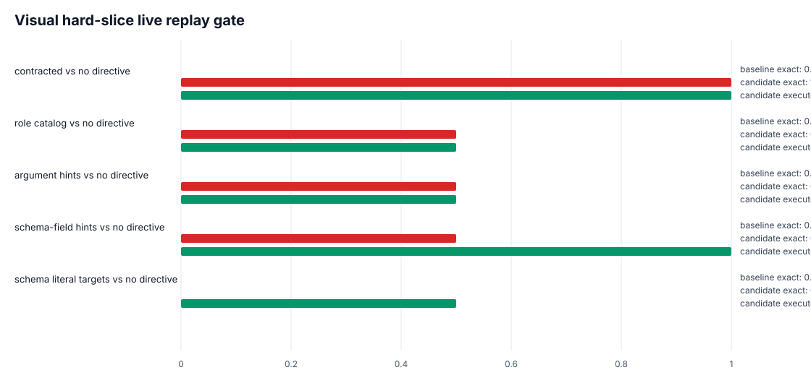
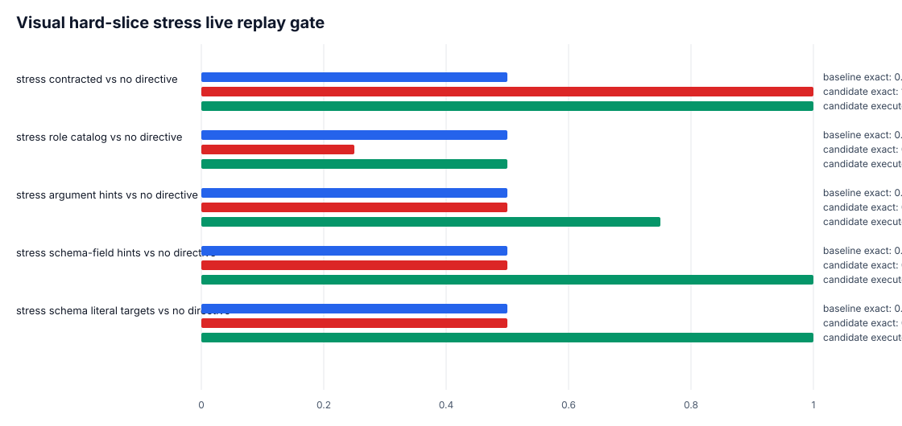
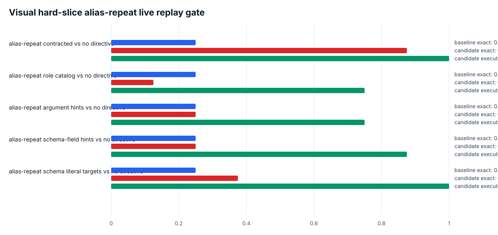

# MLX Tool-Contract Harnessing Report

Generated: `2026-05-10T17:31:48.117901+00:00`

## Executive Read

The current local-Gemma research frontier is no longer top-line readiness on the aligned `32 / 26` surface. The strongest remaining signal is whether MLX Gemma can stay inside Moonie's tool interface without controller repair, fallback, and argument normalization.

H1h confirmed that the compact H1f no-directive finding survives the full ten-workflow live surface. H1i then compressed the worst H1h workflow families into a faster packet and amplified the same causal ordering.

The main finding is blunt: the tool-turn directive is a real model-side harness intervention, not presentation polish. When it is removed, no-directive MLX can still match readiness only because the controller repairs or substitutes calls. Raw no-directive tool compliance collapses on the probe suite.

The visual catalog branch now includes an explicit negative-result loop. `visual_role_catalog_argument_hints_v2` remains the best focused-replay exact visual candidate. `visual_role_catalog_split_selector_hints_v3` was rejected before live replay because it regressed exact readback, `visual_role_catalog_schema_field_hints_v4` is the strongest fresh hard-slice profile, and `visual_role_catalog_schema_literal_targets_v5` is now negative evidence because it failed to fix the exact string misses while adding a wrong-tool regression.

## Figures

## Packet Summary

| packet | episode_count | contracted_readiness | no_directive_readiness | readiness_delta_no_directive_vs_contracted | no_directive_controller_repair | no_directive_controller_fallback | no_directive_argument_repair | no_directive_raw_clean | no_repair_readiness | no_fallback_readiness | no_argument_repair_readiness | failure_candidates |
| --- | --- | --- | --- | --- | --- | --- | --- | --- | --- | --- | --- | --- |
| H1f compact | 5 | 0.97936 | 0.97936 | 0.0 | 0.7 | 0.2 | 0.5 | 0.3 | 0.73818 | 0.92104 | 0.82036 | 12 |
| H1h full | 10 | 0.96891 | 0.96891 | 0.0 | 0.7 | 0.25 | 0.45 | 0.3 | 0.73801 | 0.89598 | 0.83016 | 24 |
| H1i worst-family | 4 | 0.9771 | 0.9771 | 0.0 | 1.0 | 0.5 | 0.5 | 0.0 | 0.64697 | 0.83125 | 0.8122 | 12 |

## H1i System Metrics

| label | system_id | runs | real_world_readiness_avg | strict_interface_avg | recovered_execution_avg | controller_repair_avg | controller_fallback_avg | argument_repair_avg | raw_planning_clean_rate_avg | disabled_controls |
| --- | --- | --- | --- | --- | --- | --- | --- | --- | --- | --- |
| contracted | mlx_gemma4_e2b_reasoner_only | 4 | 0.9771 | 1.0 | 1.0 | 0.0 | 0.0 | 0.0 | 1.0 |  |
| no directive | mlx_gemma4_e2b_reasoner_only_no_tool_turn_directive | 4 | 0.9771 | 1.0 | 1.0 | 1.0 | 0.5 | 0.5 | 0.0 | disable_tool_turn_directive |
| no directive + no repair | mlx_gemma4_e2b_reasoner_only_no_tool_turn_directive_no_controller_repair | 4 | 0.64697 | 0.29688 | 0.0 | 1.25 | 1.25 | 0.0 | 0.725 | disable_controller_repair;disable_tool_turn_directive |
| no directive + no fallback | mlx_gemma4_e2b_reasoner_only_no_tool_turn_directive_no_controller_fallback | 4 | 0.83125 | 0.625 | 0.5 | 0.5 | 0.0 | 0.5 | 0.5 | disable_controller_fallback;disable_tool_turn_directive |
| no directive + no arg repair | mlx_gemma4_e2b_reasoner_only_no_tool_turn_directive_no_argument_repair | 4 | 0.8122 | 0.71875 | 0.5 | 0.5 | 0.5 | 0.0 | 0.5 | disable_argument_repair;disable_tool_turn_directive |

## Probe Failure Modes

| side | failure_mode | case_count |
| --- | --- | --- |
| candidate | argument_mismatch | 4 |
| candidate | no_tool_call | 4 |
| baseline_non_exact | executable_paraphrase | 1 |

## Prompt-Contract Candidate Queue

| system_id | short_label | tool_prompt_contract_id | tool_catalog_profile_id | disable_tool_turn_directive | label | hypothesis | tags |
| --- | --- | --- | --- | --- | --- | --- | --- |
| mlx_gemma4_e2b_reasoner_only_no_tool_turn_directive_canonical_json_copy | Gemma 4 MLX canonical JSON | canonical_json_copy_v3 |  | True | Canonical JSON Copy v3 | Live replay shows no-directive MLX often enters the tool protocol but drifts on canonical CLI/API arguments; tighter token-copy rules may reduce argument repair without leaking the planned call. | schema;arguments;canonicalization;json;cli;api |
| mlx_gemma4_e2b_reasoner_only_no_tool_turn_directive_literal_guard | Gemma 4 MLX literal guard | literal_argument_guard_v1 |  | True | Literal Argument Guard v1 | No-directive rows often choose the right tool but drift on arguments; stronger literal-copy rules may reduce repair burden. | arguments;canonicalization;cli;api;visual |
| mlx_gemma4_e2b_reasoner_only_no_tool_turn_directive_parallel_array_required | Gemma 4 MLX parallel array | parallel_array_required_v2 |  | True | Parallel Array Required v2 | The parallel probe collapsed to no tool call under no-directive prompting; explicit array-shape rules may recover parallel calls. | parallel;no_tool_call;json_array;multi_source |
| mlx_gemma4_e2b_reasoner_only_no_tool_turn_directive_parallel_two_call_array | Gemma 4 MLX parallel two-call | parallel_two_call_array_v3 |  | True | Parallel Two-Call Array v3 | CLI-live parallel replay shows no-directive MLX asks the operator for inputs already present; explicit source-count and array-shape rules may preserve the two-call contract. | parallel;no_tool_call;json_array;multi_source;arguments |
| mlx_gemma4_e2b_reasoner_only_no_tool_turn_directive_schema_anchor | Gemma 4 MLX schema anchor | schema_anchor_v1 |  | True | Schema Anchor v1 | No-directive CLI/API misses may improve if the model is reminded that tool names and fields are literal interface tokens. | schema;json;cli;api |
| mlx_gemma4_e2b_reasoner_only_no_tool_turn_directive_schema_literal_tool_required | Gemma 4 MLX schema literal required | schema_literal_tool_required_v2 |  | True | Schema Literal Tool-Required v2 | The first wave split exact-copy and executable visual gains; a combined contract may preserve schema obedience while reducing no-call failures. | schema;arguments;no_tool_call;json;cli;api;visual |
| mlx_gemma4_e2b_reasoner_only_no_tool_turn_directive_tool_required | Gemma 4 MLX tool required | tool_required_parallel_v1 |  | True | Tool Required Parallel v1 | No-directive visual and parallel cases may fail because the model exits the tool protocol; stronger tool-required wording should reduce no-call failures. | no_tool_call;parallel;visual |
| mlx_gemma4_e2b_reasoner_only_no_tool_turn_directive_visual_next_call_state | Gemma 4 MLX visual next call | visual_next_call_state_v2 |  | True | Visual Next-Call State v2 | No-directive visual failures are concentrated in no-call behavior after a visual referent exists; explicit state-transition wording may reduce that collapse. | visual;no_tool_call;state_machine;readback |
| mlx_gemma4_e2b_reasoner_only_no_tool_turn_directive_visual_refine_selection | Gemma 4 MLX visual refine | visual_refine_selection_v5 |  | True | Visual Refine Selection v5 | Wave four proved broad visual state wording did not fix the filter/refinement case; a narrower contract that prioritizes refine_selection for existing selection_id filtering may preserve visual initiation while changing the targeted wrong-tool failure. | visual;tool_selection;refine_selection;filtering;arguments |
| mlx_gemma4_e2b_reasoner_only_no_tool_turn_directive_visual_role_catalog_literal_guard | Gemma 4 MLX visual catalog literal | literal_argument_guard_v1 | visual_role_catalog_v1 | True | Literal Argument Guard v1 | No-directive rows often choose the right tool but drift on arguments; stronger literal-copy rules may reduce repair burden. | arguments;canonicalization;cli;api;visual |
| mlx_gemma4_e2b_reasoner_only_no_tool_turn_directive_visual_state_tool_selection | Gemma 4 MLX visual state tool | visual_state_tool_selection_v4 |  | True | Visual State Tool Selection v4 | Wave three recovered visual tool initiation but still chose the wrong visual tool for a filter/refinement case; state-specific selection rules may preserve tool entry while improving exact visual replay. | visual;state_machine;tool_selection;no_tool_call;arguments |
| mlx_gemma4_e2b_reasoner_only_no_tool_turn_directive_visual_tool_initiation | Gemma 4 MLX visual initiation | visual_tool_initiation_v3 |  | True | Visual Tool Initiation v3 | CLI-live visual replay shows no-directive MLX often answers or defers instead of initiating the next visual tool call; a compact state-transition contract may recover tool entry before exact selector tuning. | visual;no_tool_call;state_machine;readback;arguments |

These candidates are generic prompt contracts for the no-directive row. They deliberately avoid embedding the expected planned call, so they can be tested on the probe before spending H1i or H1h runs.

## Executed Prompt-Contract Probe Gate

| system_id | tool_prompt_contract_id | exact_match_rate | executable_match_rate | delta_exact_vs_contracted | delta_exact_vs_no_directive | probe_gate | improved_case_count | regressed_case_count | dominant_failure_mode | failure_modes | recommendation |
| --- | --- | --- | --- | --- | --- | --- | --- | --- | --- | --- | --- |
| mlx_gemma4_e2b_reasoner_only_no_tool_turn_directive_schema_anchor | schema_anchor_v1 | 0.125 | 0.0 | -0.75 | 0.125 | probe_improved_vs_no_directive | 1 | 0 | argument_mismatch | argument_mismatch:3;call_count_mismatch:1;exact:1;no_tool_call:3 | weak_exact_gain |
| mlx_gemma4_e2b_reasoner_only_no_tool_turn_directive_literal_guard | literal_argument_guard_v1 | 0.0 | 1.0 | -0.875 | 0.0 | probe_improved_vs_no_directive | 1 | 0 | no_tool_call | argument_mismatch:3;executable_paraphrase:1;no_tool_call:4 | visual_executable_gain_only |
| mlx_gemma4_e2b_reasoner_only_no_tool_turn_directive_tool_required | tool_required_parallel_v1 | 0.0 | 1.0 | -0.875 | 0.0 | probe_improved_vs_no_directive | 1 | 0 | no_tool_call | argument_mismatch:1;executable_paraphrase:1;no_tool_call:6 | visual_executable_gain_only |

The first executed probe gate shows only partial gains. `schema_anchor_v1` recovers one exact visual readback case over no-directive, while `literal_argument_guard_v1` and `tool_required_parallel_v1` recover the executable visual target without improving exact JSON copy rate. All three remain far below the contracted MLX probe row.

## Prompt-Contract Wave Two Probe Gate

| system_id | tool_prompt_contract_id | exact_match_rate | executable_match_rate | delta_exact_vs_contracted | delta_exact_vs_no_directive | probe_gate | improved_case_count | regressed_case_count | dominant_failure_mode | failure_modes | recommendation |
| --- | --- | --- | --- | --- | --- | --- | --- | --- | --- | --- | --- |
| mlx_gemma4_e2b_reasoner_only_no_tool_turn_directive_schema_literal_tool_required | schema_literal_tool_required_v2 | 0.125 | 0.0 | -0.75 | 0.125 | probe_improved_vs_no_directive | 1 | 0 | argument_mismatch | argument_mismatch:3;call_count_mismatch:1;exact:1;no_tool_call:3 | weak_exact_gain |
| mlx_gemma4_e2b_reasoner_only_no_tool_turn_directive_visual_next_call_state | visual_next_call_state_v2 | 0.0 | 1.0 | -0.875 | 0.0 | probe_improved_vs_no_directive | 1 | 0 | no_tool_call | call_count_mismatch:1;executable_paraphrase:1;no_tool_call:6 | visual_executable_gain_only |
| mlx_gemma4_e2b_reasoner_only_no_tool_turn_directive_parallel_array_required | parallel_array_required_v2 | 0.0 | 0.0 | -0.875 | 0.0 | no_probe_improvement_vs_no_directive | 0 | 0 | no_tool_call | argument_mismatch:2;no_tool_call:5;wrong_tool:1 | no_probe_gain |

The second wave confirms the same shape rather than changing the direction. `schema_literal_tool_required_v2` gives a weak one-case exact gain, `visual_next_call_state_v2` restores executable visual behavior without exact JSON fidelity, and `parallel_array_required_v2` does not improve the parallel/no-call family. None of the wave-two candidates is strong enough to replace the final tool-turn directive.

## Prompt-Contract Wave Three Probe Gate

| system_id | tool_prompt_contract_id | exact_match_rate | executable_match_rate | delta_exact_vs_contracted | delta_exact_vs_no_directive | probe_gate | improved_case_count | regressed_case_count | dominant_failure_mode | failure_modes | recommendation |
| --- | --- | --- | --- | --- | --- | --- | --- | --- | --- | --- | --- |
| mlx_gemma4_e2b_reasoner_only_no_tool_turn_directive_canonical_json_copy | canonical_json_copy_v3 | 0.125 | 0.0 | -0.75 | 0.125 | probe_improved_vs_no_directive | 1 | 0 | no_tool_call | argument_mismatch:2;call_count_mismatch:1;exact:1;no_tool_call:3;wrong_tool:1 | weak_exact_gain |
| mlx_gemma4_e2b_reasoner_only_no_tool_turn_directive_visual_tool_initiation | visual_tool_initiation_v3 | 0.125 | 1.0 | -0.75 | 0.125 | probe_improved_vs_no_directive | 2 | 0 | no_tool_call | call_count_mismatch:1;exact:1;executable_paraphrase:1;no_tool_call:4;wrong_tool:1 | weak_exact_gain |
| mlx_gemma4_e2b_reasoner_only_no_tool_turn_directive_parallel_two_call_array | parallel_two_call_array_v3 | 0.0 | 0.0 | -0.875 | 0.0 | no_probe_improvement_vs_no_directive | 0 | 0 | no_tool_call | argument_mismatch:1;no_tool_call:7 | no_probe_gain |

The third wave targets the mechanisms exposed by CLI-live replay: canonical argument copying, visual tool initiation, and two-call parallel array shape. It produces the same hard boundary in sharper form: canonical and visual-initiation wording recover one exact case, the visual-initiation contract also recovers the executable visual target, and the parallel two-call contract still does not recover the parallel no-call family.

## Prompt-Contract Wave Four Probe Gate

| system_id | tool_prompt_contract_id | exact_match_rate | executable_match_rate | delta_exact_vs_contracted | delta_exact_vs_no_directive | probe_gate | improved_case_count | regressed_case_count | dominant_failure_mode | failure_modes | recommendation |
| --- | --- | --- | --- | --- | --- | --- | --- | --- | --- | --- | --- |
| mlx_gemma4_e2b_reasoner_only_no_tool_turn_directive_visual_state_tool_selection | visual_state_tool_selection_v4 | 0.125 | 0.0 | -0.75 | 0.125 | probe_improved_vs_no_directive | 1 | 0 | no_tool_call | argument_mismatch:2;call_count_mismatch:1;exact:1;no_tool_call:3;wrong_tool:1 | weak_exact_gain |

`visual_state_tool_selection_v4` was the narrow follow-up to wave three's best partial result. Raw probe exact rate again reaches only `0.125`: enough to improve over the no-directive row by one case, but still far below the contracted row. The dominant failure remains `no_tool_call`, so the contract should be treated as a targeted visual replay candidate, not a general harness fix.

## Prompt-Contract Wave Five Probe Gate

| system_id | tool_prompt_contract_id | exact_match_rate | executable_match_rate | delta_exact_vs_contracted | delta_exact_vs_no_directive | probe_gate | improved_case_count | regressed_case_count | dominant_failure_mode | failure_modes | recommendation |
| --- | --- | --- | --- | --- | --- | --- | --- | --- | --- | --- | --- |
| mlx_gemma4_e2b_reasoner_only_no_tool_turn_directive_visual_refine_selection | visual_refine_selection_v5 | 0.0 | 0.0 | -0.875 | 0.0 | no_probe_improvement_vs_no_directive | 0 | 0 | no_tool_call | argument_mismatch:1;call_count_mismatch:1;no_tool_call:6 | no_probe_gain |

`visual_refine_selection_v5` was more surgical: it targeted only latest-selection filtering and `refine_selection`. The raw probe rejected it before live replay: exact rate stayed `0.0`, executable rate stayed `0.0`, and the dominant failure shifted further toward `no_tool_call`. Under the current gate, this candidate should not spend CLI-live replay or H1 budget.

## Tool-Catalog Profile Probe Gate

| system_id | tool_catalog_profile_id | execute | output_dir | comparison_path | no_directive_comparison_path | exact_match_rate | executable_match_rate | delta_exact_vs_contracted | delta_exact_vs_no_directive | probe_gate |
| --- | --- | --- | --- | --- | --- | --- | --- | --- | --- | --- |
| mlx_gemma4_e2b_reasoner_only_no_tool_turn_directive_visual_role_catalog | visual_role_catalog_v1 | True | /Users/cheickdiakite/Codex/moonie/results/tool_catalog_profile_probe_packets/20260508T_visual_role_catalog_v1_probe/mlx_gemma4_e2b_reasoner_only_no_tool_turn_directive_visual_role_catalog | /Users/cheickdiakite/Codex/moonie/results/tool_catalog_profile_probe_packets/20260508T_visual_role_catalog_v1_probe/mlx_gemma4_e2b_reasoner_only_no_tool_turn_directive_visual_role_catalog/comparison_vs_contracted/probe_comparison.json | /Users/cheickdiakite/Codex/moonie/results/tool_catalog_profile_probe_packets/20260508T_visual_role_catalog_v1_probe/mlx_gemma4_e2b_reasoner_only_no_tool_turn_directive_visual_role_catalog/comparison_vs_no_directive/probe_comparison.json | 0.125 | 1.0 | -0.75 | 0.125 | probe_improved_vs_no_directive |
| mlx_gemma4_e2b_reasoner_only_no_tool_turn_directive_visual_role_catalog_argument_hints | visual_role_catalog_argument_hints_v2 | True | /Users/cheickdiakite/Codex/moonie/results/tool_catalog_profile_probe_packets/20260508T_visual_role_catalog_argument_hints_v2_probe/mlx_gemma4_e2b_reasoner_only_no_tool_turn_directive_visual_role_catalog_argument_hints | /Users/cheickdiakite/Codex/moonie/results/tool_catalog_profile_probe_packets/20260508T_visual_role_catalog_argument_hints_v2_probe/mlx_gemma4_e2b_reasoner_only_no_tool_turn_directive_visual_role_catalog_argument_hints/comparison_vs_contracted/probe_comparison.json | /Users/cheickdiakite/Codex/moonie/results/tool_catalog_profile_probe_packets/20260508T_visual_role_catalog_argument_hints_v2_probe/mlx_gemma4_e2b_reasoner_only_no_tool_turn_directive_visual_role_catalog_argument_hints/comparison_vs_no_directive/probe_comparison.json | 0.25 | 0.0 | -0.625 | 0.25 | probe_improved_vs_no_directive |
| mlx_gemma4_e2b_reasoner_only_no_tool_turn_directive_visual_role_catalog_split_selector_hints | visual_role_catalog_split_selector_hints_v3 | True | /Users/cheickdiakite/Codex/moonie/results/tool_catalog_profile_probe_packets/20260508T_visual_role_catalog_split_selector_hints_v3_probe/mlx_gemma4_e2b_reasoner_only_no_tool_turn_directive_visual_role_catalog_split_selector_hints | /Users/cheickdiakite/Codex/moonie/results/tool_catalog_profile_probe_packets/20260508T_visual_role_catalog_split_selector_hints_v3_probe/mlx_gemma4_e2b_reasoner_only_no_tool_turn_directive_visual_role_catalog_split_selector_hints/comparison_vs_contracted/probe_comparison.json | /Users/cheickdiakite/Codex/moonie/results/tool_catalog_profile_probe_packets/20260508T_visual_role_catalog_split_selector_hints_v3_probe/mlx_gemma4_e2b_reasoner_only_no_tool_turn_directive_visual_role_catalog_split_selector_hints/comparison_vs_no_directive/probe_comparison.json | 0.125 | 0.0 | -0.75 | 0.125 | probe_improved_vs_no_directive |
| mlx_gemma4_e2b_reasoner_only_no_tool_turn_directive_visual_role_catalog_schema_field_hints | visual_role_catalog_schema_field_hints_v4 | True | /Users/cheickdiakite/Codex/moonie/results/tool_catalog_profile_probe_packets/20260509T_visual_role_catalog_schema_field_hints_v4_probe/mlx_gemma4_e2b_reasoner_only_no_tool_turn_directive_visual_role_catalog_schema_field_hints | /Users/cheickdiakite/Codex/moonie/results/tool_catalog_profile_probe_packets/20260509T_visual_role_catalog_schema_field_hints_v4_probe/mlx_gemma4_e2b_reasoner_only_no_tool_turn_directive_visual_role_catalog_schema_field_hints/comparison_vs_contracted/probe_comparison.json | /Users/cheickdiakite/Codex/moonie/results/tool_catalog_profile_probe_packets/20260509T_visual_role_catalog_schema_field_hints_v4_probe/mlx_gemma4_e2b_reasoner_only_no_tool_turn_directive_visual_role_catalog_schema_field_hints/comparison_vs_no_directive/probe_comparison.json | 0.25 | 0.0 | -0.625 | 0.25 | probe_improved_vs_no_directive |

`visual_role_catalog_v1` moves the intervention from standalone prompt-contract wording into the tool-catalog presentation. It keeps the exact directive disabled, improves raw exact rate from `0.0` to `0.125`, restores the visual executable target to `1.0`, and changes the live visual failure from wrong-tool/no-call into literal argument mismatch. `visual_role_catalog_argument_hints_v2` then tests the next narrow question: can field-level selector semantics fix that literal mismatch while preserving routing?

## Tool-Catalog Argument-Hints vs Role-Catalog Probe Delta

| case_id | family | baseline_exact_match | candidate_exact_match | delta_exact_match | baseline_failure_mode | candidate_failure_mode | baseline_executable_match | candidate_executable_match | delta_executable_match | baseline_actual_call_count | candidate_actual_call_count | delta_actual_call_count |
| --- | --- | --- | --- | --- | --- | --- | --- | --- | --- | --- | --- | --- |
| api_form_issue_fetch | api_canonicalization | False | False | 0 | argument_mismatch | argument_mismatch |  |  |  | 1 | 1 | 0 |
| api_invoice_lock_hold_update | api_canonicalization | False | False | 0 | argument_mismatch | argument_mismatch |  |  |  | 1 | 1 | 0 |
| cli_invoice_lock_hyphen_query | cli_canonicalization | False | False | 0 | argument_mismatch | argument_mismatch |  |  |  | 1 | 1 | 0 |
| cli_phone_patch_latest_only | cli_patch_copying | False | False | 0 | argument_mismatch | argument_mismatch |  |  |  | 1 | 1 | 0 |
| parallel_audit_array_literal | parallel_tool_calling | False | False | 0 | no_tool_call | no_tool_call |  |  |  | 0 | 0 | 0 |
| visual_form_target_literal | visual_argument_copying | False | False | 0 | executable_paraphrase | argument_mismatch | True | False | -1 | 1 | 1 | 0 |
| visual_latest_filter_literal | visual_referent_carryover | False | True | 1 | argument_mismatch | exact |  |  |  | 1 | 1 | 0 |
| visual_readback_region_literal | visual_referent_carryover | True | True | 0 | exact | exact |  |  |  | 1 | 1 | 0 |

The raw answer is mixed but materially informative. Argument hints raise probe exactness from `1 / 8` to `2 / 8` by making `visual_latest_filter_literal` exact, while preserving exact readback. The cost is that `visual_form_target_literal` drops from executable paraphrase to non-executable argument mismatch, so this is a candidate for visual referent exactness, not a complete visual recovery profile.

## Tool-Catalog Split-Selector Negative Probe Delta

| case_id | family | baseline_exact_match | candidate_exact_match | delta_exact_match | baseline_failure_mode | candidate_failure_mode | baseline_executable_match | candidate_executable_match | delta_executable_match | baseline_actual_call_count | candidate_actual_call_count | delta_actual_call_count |
| --- | --- | --- | --- | --- | --- | --- | --- | --- | --- | --- | --- | --- |
| api_form_issue_fetch | api_canonicalization | False | False | 0 | argument_mismatch | argument_mismatch |  |  |  | 1 | 1 | 0 |
| api_invoice_lock_hold_update | api_canonicalization | False | False | 0 | argument_mismatch | argument_mismatch |  |  |  | 1 | 1 | 0 |
| cli_invoice_lock_hyphen_query | cli_canonicalization | False | False | 0 | argument_mismatch | argument_mismatch |  |  |  | 1 | 1 | 0 |
| cli_phone_patch_latest_only | cli_patch_copying | False | False | 0 | argument_mismatch | argument_mismatch |  |  |  | 1 | 1 | 0 |
| parallel_audit_array_literal | parallel_tool_calling | False | False | 0 | no_tool_call | no_tool_call |  |  |  | 0 | 0 | 0 |
| visual_form_target_literal | visual_argument_copying | False | False | 0 | argument_mismatch | argument_mismatch | False | False | 0 | 1 | 1 | 0 |
| visual_latest_filter_literal | visual_referent_carryover | True | True | 0 | exact | exact |  |  |  | 1 | 1 | 0 |
| visual_readback_region_literal | visual_referent_carryover | True | False | -1 | exact | no_tool_call |  |  |  | 1 | 0 | -1 |

| case_id | family | baseline_exact_match | candidate_exact_match | delta_exact_match | baseline_failure_mode | candidate_failure_mode | baseline_executable_match | candidate_executable_match | delta_executable_match | baseline_actual_call_count | candidate_actual_call_count | delta_actual_call_count |
| --- | --- | --- | --- | --- | --- | --- | --- | --- | --- | --- | --- | --- |
| api_form_issue_fetch | api_canonicalization | False | False | 0 | argument_mismatch | argument_mismatch |  |  |  | 1 | 1 | 0 |
| api_invoice_lock_hold_update | api_canonicalization | False | False | 0 | argument_mismatch | argument_mismatch |  |  |  | 1 | 1 | 0 |
| cli_invoice_lock_hyphen_query | cli_canonicalization | False | False | 0 | argument_mismatch | argument_mismatch |  |  |  | 1 | 1 | 0 |
| cli_phone_patch_latest_only | cli_patch_copying | False | False | 0 | argument_mismatch | argument_mismatch |  |  |  | 1 | 1 | 0 |
| parallel_audit_array_literal | parallel_tool_calling | False | False | 0 | no_tool_call | no_tool_call |  |  |  | 0 | 0 | 0 |
| visual_form_target_literal | visual_argument_copying | False | False | 0 | executable_paraphrase | argument_mismatch | True | False | -1 | 1 | 1 | 0 |
| visual_latest_filter_literal | visual_referent_carryover | False | True | 1 | argument_mismatch | exact |  |  |  | 1 | 1 | 0 |
| visual_readback_region_literal | visual_referent_carryover | True | False | -1 | exact | no_tool_call |  |  |  | 1 | 0 | -1 |

| packet_run_id | candidate_system_id | tool_catalog_profile_id | decision | reason | candidate_exact_match_rate | candidate_executable_match_rate | best_current_exact_candidate | best_current_exact_candidate_rate | best_current_executable_routing_candidate | best_current_executable_routing_rate |
| --- | --- | --- | --- | --- | --- | --- | --- | --- | --- | --- |
| 20260508T_visual_split_selector_hints_live_replay_skipped_v1 | mlx_gemma4_e2b_reasoner_only_no_tool_turn_directive_visual_role_catalog_split_selector_hints | visual_role_catalog_split_selector_hints_v3 | skip_live_replay | v3 did not beat the v2 raw exact gate and lost readback exactness, so live replay would spend budget on a weaker candidate. | 0.125 | 0.0 | visual_role_catalog_argument_hints_v2 | 0.25 | visual_role_catalog_v1 | 1.0 |

`visual_role_catalog_split_selector_hints_v3` is useful as negative evidence. It preserved the v2 latest-filter exact call, but dropped overall raw exactness from `2 / 8` to `1 / 8` versus v2 and regressed readback by emitting `tool_name` instead of `name`. It also failed to recover the v1 executable form-target behavior, so focused live replay was intentionally skipped.

## Tool-Catalog Schema-Field Negative Probe Delta

| case_id | family | baseline_exact_match | candidate_exact_match | delta_exact_match | baseline_failure_mode | candidate_failure_mode | baseline_executable_match | candidate_executable_match | delta_executable_match | baseline_actual_call_count | candidate_actual_call_count | delta_actual_call_count |
| --- | --- | --- | --- | --- | --- | --- | --- | --- | --- | --- | --- | --- |
| api_form_issue_fetch | api_canonicalization | False | False | 0 | argument_mismatch | argument_mismatch |  |  |  | 1 | 1 | 0 |
| api_invoice_lock_hold_update | api_canonicalization | False | False | 0 | argument_mismatch | argument_mismatch |  |  |  | 1 | 1 | 0 |
| cli_invoice_lock_hyphen_query | cli_canonicalization | False | False | 0 | argument_mismatch | argument_mismatch |  |  |  | 1 | 1 | 0 |
| cli_phone_patch_latest_only | cli_patch_copying | False | False | 0 | argument_mismatch | argument_mismatch |  |  |  | 1 | 1 | 0 |
| parallel_audit_array_literal | parallel_tool_calling | False | False | 0 | no_tool_call | no_tool_call |  |  |  | 0 | 0 | 0 |
| visual_form_target_literal | visual_argument_copying | False | False | 0 | argument_mismatch | wrong_tool | False | False | 0 | 1 | 1 | 0 |
| visual_latest_filter_literal | visual_referent_carryover | True | True | 0 | exact | exact |  |  |  | 1 | 1 | 0 |
| visual_readback_region_literal | visual_referent_carryover | True | True | 0 | exact | exact |  |  |  | 1 | 1 | 0 |

| case_id | family | baseline_exact_match | candidate_exact_match | delta_exact_match | baseline_failure_mode | candidate_failure_mode | baseline_executable_match | candidate_executable_match | delta_executable_match | baseline_actual_call_count | candidate_actual_call_count | delta_actual_call_count |
| --- | --- | --- | --- | --- | --- | --- | --- | --- | --- | --- | --- | --- |
| api_form_issue_fetch | api_canonicalization | False | False | 0 | argument_mismatch | argument_mismatch |  |  |  | 1 | 1 | 0 |
| api_invoice_lock_hold_update | api_canonicalization | False | False | 0 | argument_mismatch | argument_mismatch |  |  |  | 1 | 1 | 0 |
| cli_invoice_lock_hyphen_query | cli_canonicalization | False | False | 0 | argument_mismatch | argument_mismatch |  |  |  | 1 | 1 | 0 |
| cli_phone_patch_latest_only | cli_patch_copying | False | False | 0 | argument_mismatch | argument_mismatch |  |  |  | 1 | 1 | 0 |
| parallel_audit_array_literal | parallel_tool_calling | False | False | 0 | no_tool_call | no_tool_call |  |  |  | 0 | 0 | 0 |
| visual_form_target_literal | visual_argument_copying | False | False | 0 | argument_mismatch | wrong_tool | False | False | 0 | 1 | 1 | 0 |
| visual_latest_filter_literal | visual_referent_carryover | True | True | 0 | exact | exact |  |  |  | 1 | 1 | 0 |
| visual_readback_region_literal | visual_referent_carryover | False | True | 1 | no_tool_call | exact |  |  |  | 0 | 1 | 1 |

| packet_run_id | candidate_system_id | tool_catalog_profile_id | decision | reason | candidate_exact_match_rate | candidate_executable_match_rate | best_current_exact_candidate | best_current_exact_candidate_rate | best_current_executable_routing_candidate | best_current_executable_routing_rate |
| --- | --- | --- | --- | --- | --- | --- | --- | --- | --- | --- |
| 20260509T_visual_schema_field_hints_live_replay_skipped_v1 | mlx_gemma4_e2b_reasoner_only_no_tool_turn_directive_visual_role_catalog_schema_field_hints | visual_role_catalog_schema_field_hints_v4 | skip_live_replay | v4 tied the v2 raw exact rate but did not improve it, failed executable form targeting, and over-preferred refine_selection on the form-target case. | 0.25 | 0.0 | visual_role_catalog_argument_hints_v2 | 0.25 | visual_role_catalog_v1 | 1.0 |

`visual_role_catalog_schema_field_hints_v4` is cleaner than v3 because it avoids broad prose and restores the exact readback case. It still does not beat v2: raw exact stays `2 / 8`, executable visual-form recovery stays `0 / 1`, and the form-target case over-prefers `refine_selection` with `selection_id="latest"`. Live replay was skipped because it tied the current best exact candidate while remaining below the executable routing baseline.

## Prompt-Contract Wave Six Probe Gate

| system_id | tool_prompt_contract_id | tool_catalog_profile_id | exact_match_rate | executable_match_rate | delta_exact_vs_contracted | delta_exact_vs_no_directive | probe_gate | improved_case_count | regressed_case_count | dominant_failure_mode | failure_modes | recommendation |
| --- | --- | --- | --- | --- | --- | --- | --- | --- | --- | --- | --- | --- |
| mlx_gemma4_e2b_reasoner_only_no_tool_turn_directive_visual_role_catalog_literal_guard | literal_argument_guard_v1 | visual_role_catalog_v1 | 0.125 | 0.0 | -0.75 | 0.125 | probe_improved_vs_no_directive | 1 | 0 | argument_mismatch | argument_mismatch:4;exact:1;no_tool_call:3 | weak_exact_gain |

Wave six composes the visual role catalog with `literal_argument_guard_v1`. It keeps the same one-case exact gain but loses the catalog-only executable visual rescue and introduces no-call regressions on CLI/API cases. Treat it as a negative composition result: routing guidance and literal-copy wording interfere in this form.

## Visual Hard-Slice Probe Gate

| system_id | exact_match_count | exact_match_rate | executable_match_count | executable_match_rate | executor_equivalence_match_count | executor_equivalence_match_rate | delta_exact_vs_contracted | delta_exact_vs_no_directive | delta_executable_vs_contracted | delta_executable_vs_no_directive | delta_executor_equivalence_vs_contracted | delta_executor_equivalence_vs_no_directive | dominant_failure_mode | hard_slice_gate | output_dir | label |
| --- | --- | --- | --- | --- | --- | --- | --- | --- | --- | --- | --- | --- | --- | --- | --- | --- |
| mlx_gemma4_e2b_reasoner_only | 8 | 1.0 | 8 | 1.0 | 8 | 1.0 | 0.0 | 0.875 | 0.0 | 0.875 | 0.0 | 0.875 | exact | contracted_reference | /Users/cheickdiakite/Codex/moonie/results/visual_hard_slice_probe_packets/20260509T_visual_hard_slice_executor_equivalence_v1/mlx_gemma4_e2b_reasoner_only | contracted |
| mlx_gemma4_e2b_reasoner_only_no_tool_turn_directive | 1 | 0.125 | 1 | 0.125 | 1 | 0.125 | -0.875 | 0.0 | -0.875 | 0.0 | -0.875 | 0.0 | no_tool_call | no_directive_reference | /Users/cheickdiakite/Codex/moonie/results/visual_hard_slice_probe_packets/20260509T_visual_hard_slice_executor_equivalence_v1/mlx_gemma4_e2b_reasoner_only_no_tool_turn_directive | no directive |
| mlx_gemma4_e2b_reasoner_only_no_tool_turn_directive_visual_role_catalog | 3 | 0.375 | 3 | 0.375 | 3 | 0.375 | -0.625 | 0.25 | -0.625 | 0.25 | -0.625 | 0.25 | argument_mismatch | hard_slice_improved_vs_no_directive | /Users/cheickdiakite/Codex/moonie/results/visual_hard_slice_probe_packets/20260509T_visual_hard_slice_executor_equivalence_v1/mlx_gemma4_e2b_reasoner_only_no_tool_turn_directive_visual_role_catalog | visual role catalog |
| mlx_gemma4_e2b_reasoner_only_no_tool_turn_directive_visual_role_catalog_argument_hints | 6 | 0.75 | 7 | 0.875 | 7 | 0.875 | -0.25 | 0.625 | -0.125 | 0.75 | -0.125 | 0.75 | exact | hard_slice_improved_vs_no_directive | /Users/cheickdiakite/Codex/moonie/results/visual_hard_slice_probe_packets/20260509T_visual_hard_slice_executor_equivalence_v1/mlx_gemma4_e2b_reasoner_only_no_tool_turn_directive_visual_role_catalog_argument_hints | catalog arg hints |
| mlx_gemma4_e2b_reasoner_only_no_tool_turn_directive_visual_role_catalog_split_selector_hints | 5 | 0.625 | 6 | 0.75 | 6 | 0.75 | -0.375 | 0.5 | -0.25 | 0.625 | -0.25 | 0.625 | exact | hard_slice_improved_vs_no_directive | /Users/cheickdiakite/Codex/moonie/results/visual_hard_slice_probe_packets/20260509T_visual_hard_slice_executor_equivalence_v1/mlx_gemma4_e2b_reasoner_only_no_tool_turn_directive_visual_role_catalog_split_selector_hints | catalog split selector |
| mlx_gemma4_e2b_reasoner_only_no_tool_turn_directive_visual_role_catalog_schema_field_hints | 6 | 0.75 | 8 | 1.0 | 8 | 1.0 | -0.25 | 0.625 | 0.0 | 0.875 | 0.0 | 0.875 | exact | hard_slice_improved_vs_no_directive | /Users/cheickdiakite/Codex/moonie/results/visual_hard_slice_probe_packets/20260509T_visual_hard_slice_executor_equivalence_v1/mlx_gemma4_e2b_reasoner_only_no_tool_turn_directive_visual_role_catalog_schema_field_hints | catalog schema fields |
| mlx_gemma4_e2b_reasoner_only_no_tool_turn_directive_visual_role_catalog_schema_literal_targets | 5 | 0.625 | 7 | 0.875 | 7 | 0.875 | -0.375 | 0.5 | -0.125 | 0.75 | -0.125 | 0.75 | exact | hard_slice_improved_vs_no_directive | /Users/cheickdiakite/Codex/moonie/results/visual_hard_slice_probe_packets/20260509T_visual_hard_slice_executor_equivalence_v1/mlx_gemma4_e2b_reasoner_only_no_tool_turn_directive_visual_role_catalog_schema_literal_targets | catalog schema target literals |
| mlx_gemma4_e2b_reasoner_only_no_tool_turn_directive_visual_role_catalog_literal_guard | 3 | 0.375 | 4 | 0.5 | 4 | 0.5 | -0.625 | 0.25 | -0.5 | 0.375 | -0.5 | 0.375 | exact | hard_slice_improved_vs_no_directive | /Users/cheickdiakite/Codex/moonie/results/visual_hard_slice_probe_packets/20260509T_visual_hard_slice_executor_equivalence_v1/mlx_gemma4_e2b_reasoner_only_no_tool_turn_directive_visual_role_catalog_literal_guard | visual catalog literal |

The fresh visual hard slice breaks the earlier top-line saturation and gives a cleaner read on harness shape. Contracted MLX is the upper bound at `8 / 8` strict, executable, and executor-equivalent. The no-directive row falls to `1 / 8` on all three metrics, with no-tool-call as the dominant failure. The strongest no-directive profile remains `visual_role_catalog_schema_field_hints_v4`: `6 / 8` strict and `8 / 8` executor-equivalent. The attempted v5 target-literal repair drops to `5 / 8` strict and `7 / 8` executor-equivalent, so the hard-slice evidence now rejects that wording as an overcorrection rather than a promotion candidate.

## Visual Hard-Slice Family Summary

| system_id | family | case_count | exact_count | exact_rate | executable_case_count | executable_count | executable_rate | executor_equivalence_case_count | executor_equivalence_count | executor_equivalence_rate | label |
| --- | --- | --- | --- | --- | --- | --- | --- | --- | --- | --- | --- |
| mlx_gemma4_e2b_reasoner_only | visual_argument_copying | 3 | 3 | 1.0 | 3 | 3 | 1.0 | 3 | 3 | 1.0 | contracted |
| mlx_gemma4_e2b_reasoner_only | visual_referent_carryover | 3 | 3 | 1.0 | 3 | 3 | 1.0 | 3 | 3 | 1.0 | contracted |
| mlx_gemma4_e2b_reasoner_only | visual_region_readback | 1 | 1 | 1.0 | 1 | 1 | 1.0 | 1 | 1 | 1.0 | contracted |
| mlx_gemma4_e2b_reasoner_only | visual_tool_routing | 1 | 1 | 1.0 | 1 | 1 | 1.0 | 1 | 1 | 1.0 | contracted |
| mlx_gemma4_e2b_reasoner_only_no_tool_turn_directive | visual_argument_copying | 3 | 1 | 0.3333333333333333 | 3 | 1 | 0.3333333333333333 | 3 | 1 | 0.3333333333333333 | no directive |
| mlx_gemma4_e2b_reasoner_only_no_tool_turn_directive | visual_referent_carryover | 3 | 0 | 0.0 | 3 | 0 | 0.0 | 3 | 0 | 0.0 | no directive |
| mlx_gemma4_e2b_reasoner_only_no_tool_turn_directive | visual_region_readback | 1 | 0 | 0.0 | 1 | 0 | 0.0 | 1 | 0 | 0.0 | no directive |
| mlx_gemma4_e2b_reasoner_only_no_tool_turn_directive | visual_tool_routing | 1 | 0 | 0.0 | 1 | 0 | 0.0 | 1 | 0 | 0.0 | no directive |
| mlx_gemma4_e2b_reasoner_only_no_tool_turn_directive_visual_role_catalog | visual_argument_copying | 3 | 1 | 0.3333333333333333 | 3 | 1 | 0.3333333333333333 | 3 | 1 | 0.3333333333333333 | visual role catalog |
| mlx_gemma4_e2b_reasoner_only_no_tool_turn_directive_visual_role_catalog | visual_referent_carryover | 3 | 0 | 0.0 | 3 | 0 | 0.0 | 3 | 0 | 0.0 | visual role catalog |
| mlx_gemma4_e2b_reasoner_only_no_tool_turn_directive_visual_role_catalog | visual_region_readback | 1 | 1 | 1.0 | 1 | 1 | 1.0 | 1 | 1 | 1.0 | visual role catalog |
| mlx_gemma4_e2b_reasoner_only_no_tool_turn_directive_visual_role_catalog | visual_tool_routing | 1 | 1 | 1.0 | 1 | 1 | 1.0 | 1 | 1 | 1.0 | visual role catalog |
| mlx_gemma4_e2b_reasoner_only_no_tool_turn_directive_visual_role_catalog_argument_hints | visual_argument_copying | 3 | 1 | 0.3333333333333333 | 3 | 2 | 0.6666666666666666 | 3 | 2 | 0.6666666666666666 | catalog arg hints |
| mlx_gemma4_e2b_reasoner_only_no_tool_turn_directive_visual_role_catalog_argument_hints | visual_referent_carryover | 3 | 3 | 1.0 | 3 | 3 | 1.0 | 3 | 3 | 1.0 | catalog arg hints |
| mlx_gemma4_e2b_reasoner_only_no_tool_turn_directive_visual_role_catalog_argument_hints | visual_region_readback | 1 | 1 | 1.0 | 1 | 1 | 1.0 | 1 | 1 | 1.0 | catalog arg hints |
| mlx_gemma4_e2b_reasoner_only_no_tool_turn_directive_visual_role_catalog_argument_hints | visual_tool_routing | 1 | 1 | 1.0 | 1 | 1 | 1.0 | 1 | 1 | 1.0 | catalog arg hints |
| mlx_gemma4_e2b_reasoner_only_no_tool_turn_directive_visual_role_catalog_split_selector_hints | visual_argument_copying | 3 | 1 | 0.3333333333333333 | 3 | 2 | 0.6666666666666666 | 3 | 2 | 0.6666666666666666 | catalog split selector |
| mlx_gemma4_e2b_reasoner_only_no_tool_turn_directive_visual_role_catalog_split_selector_hints | visual_referent_carryover | 3 | 2 | 0.6666666666666666 | 3 | 2 | 0.6666666666666666 | 3 | 2 | 0.6666666666666666 | catalog split selector |
| mlx_gemma4_e2b_reasoner_only_no_tool_turn_directive_visual_role_catalog_split_selector_hints | visual_region_readback | 1 | 1 | 1.0 | 1 | 1 | 1.0 | 1 | 1 | 1.0 | catalog split selector |
| mlx_gemma4_e2b_reasoner_only_no_tool_turn_directive_visual_role_catalog_split_selector_hints | visual_tool_routing | 1 | 1 | 1.0 | 1 | 1 | 1.0 | 1 | 1 | 1.0 | catalog split selector |
| mlx_gemma4_e2b_reasoner_only_no_tool_turn_directive_visual_role_catalog_schema_field_hints | visual_argument_copying | 3 | 1 | 0.3333333333333333 | 3 | 3 | 1.0 | 3 | 3 | 1.0 | catalog schema fields |
| mlx_gemma4_e2b_reasoner_only_no_tool_turn_directive_visual_role_catalog_schema_field_hints | visual_referent_carryover | 3 | 3 | 1.0 | 3 | 3 | 1.0 | 3 | 3 | 1.0 | catalog schema fields |
| mlx_gemma4_e2b_reasoner_only_no_tool_turn_directive_visual_role_catalog_schema_field_hints | visual_region_readback | 1 | 1 | 1.0 | 1 | 1 | 1.0 | 1 | 1 | 1.0 | catalog schema fields |
| mlx_gemma4_e2b_reasoner_only_no_tool_turn_directive_visual_role_catalog_schema_field_hints | visual_tool_routing | 1 | 1 | 1.0 | 1 | 1 | 1.0 | 1 | 1 | 1.0 | catalog schema fields |
| mlx_gemma4_e2b_reasoner_only_no_tool_turn_directive_visual_role_catalog_schema_literal_targets | visual_argument_copying | 3 | 1 | 0.3333333333333333 | 3 | 3 | 1.0 | 3 | 3 | 1.0 | catalog schema target literals |
| mlx_gemma4_e2b_reasoner_only_no_tool_turn_directive_visual_role_catalog_schema_literal_targets | visual_referent_carryover | 3 | 3 | 1.0 | 3 | 3 | 1.0 | 3 | 3 | 1.0 | catalog schema target literals |
| mlx_gemma4_e2b_reasoner_only_no_tool_turn_directive_visual_role_catalog_schema_literal_targets | visual_region_readback | 1 | 1 | 1.0 | 1 | 1 | 1.0 | 1 | 1 | 1.0 | catalog schema target literals |
| mlx_gemma4_e2b_reasoner_only_no_tool_turn_directive_visual_role_catalog_schema_literal_targets | visual_tool_routing | 1 | 0 | 0.0 | 1 | 0 | 0.0 | 1 | 0 | 0.0 | catalog schema target literals |
| mlx_gemma4_e2b_reasoner_only_no_tool_turn_directive_visual_role_catalog_literal_guard | visual_argument_copying | 3 | 1 | 0.3333333333333333 | 3 | 2 | 0.6666666666666666 | 3 | 2 | 0.6666666666666666 | visual catalog literal |
| mlx_gemma4_e2b_reasoner_only_no_tool_turn_directive_visual_role_catalog_literal_guard | visual_referent_carryover | 3 | 0 | 0.0 | 3 | 0 | 0.0 | 3 | 0 | 0.0 | visual catalog literal |
| mlx_gemma4_e2b_reasoner_only_no_tool_turn_directive_visual_role_catalog_literal_guard | visual_region_readback | 1 | 1 | 1.0 | 1 | 1 | 1.0 | 1 | 1 | 1.0 | visual catalog literal |
| mlx_gemma4_e2b_reasoner_only_no_tool_turn_directive_visual_role_catalog_literal_guard | visual_tool_routing | 1 | 1 | 1.0 | 1 | 1 | 1.0 | 1 | 1 | 1.0 | visual catalog literal |

The family breakdown explains the new signal. Schema-field hints preserve full executor-equivalent behavior across visible-region targeting, valid selection carryover, and region readback, but strict exactness still lags on visual argument-copying cases. The v5 target-literal repair did not improve that family and regressed the stale-selection decoy into a wrong-tool call, which suggests the next packaged H1 slice should treat strict protocol fidelity and executor-visible success as separate endpoints.

## Visual Hard-Slice Exactness Diagnostic

| system_id | system_label | case_count | exact_count | exact_rate | executable_count | executable_rate | executor_success_non_exact_count | benchmark_label_artifact_candidate_count | true_harness_failure_count | diagnosis_counts |
| --- | --- | --- | --- | --- | --- | --- | --- | --- | --- | --- |
| mlx_gemma4_e2b_reasoner_only_no_tool_turn_directive_visual_role_catalog_schema_field_hints | catalog schema fields | 8 | 6 | 0.75 | 8 | 1.0 | 2 | 2 | 0 | {"exact_contract_match": 6, "executable_selector_alias": 2} |
| mlx_gemma4_e2b_reasoner_only_no_tool_turn_directive_visual_role_catalog_schema_literal_targets | catalog schema target literals | 8 | 5 | 0.625 | 7 | 0.875 | 2 | 2 | 1 | {"exact_contract_match": 5, "executable_selector_alias": 2, "wrong_tool_executor_failure": 1} |

| system_id | system_label | case_id | family | exact_match | executable_match | executor_target_match | strict_tool_match | strict_argument_match | expected_tools | actual_tools | expected_arguments | actual_arguments | expected_target_region_ids | actual_target_region_ids | failure_mode | exactness_diagnosis | research_interpretation | next_action |
| --- | --- | --- | --- | --- | --- | --- | --- | --- | --- | --- | --- | --- | --- | --- | --- | --- | --- | --- |
| mlx_gemma4_e2b_reasoner_only_no_tool_turn_directive_visual_role_catalog_schema_field_hints | catalog schema fields | visual_metric_panel_vs_table_selector | visual_argument_copying | False | True | True | True | False | extract_layout | extract_layout | [{"image_id": "img-hard-metric-table", "target_query": "dashboard metric"}] | [{"image_id": "img-hard-metric-table", "target_query": "metric panel"}] | hard-metric-1001 | hard-metric-1001 | executable_paraphrase | executable_selector_alias | benchmark_label_artifact_candidate | use executor-equivalence score before tuning another target_query wording profile |
| mlx_gemma4_e2b_reasoner_only_no_tool_turn_directive_visual_role_catalog_schema_field_hints | catalog schema fields | visual_callout_warning_with_user_decoy | visual_argument_copying | False | True | True | True | False | extract_layout | extract_layout | [{"image_id": "img-hard-callout-decoy", "target_query": "slide callout"}] | [{"image_id": "img-hard-callout-decoy", "target_query": "callout warning"}] | hard-callout-decoy-1102 | hard-callout-decoy-1102 | executable_paraphrase | executable_selector_alias | benchmark_label_artifact_candidate | use executor-equivalence score before tuning another target_query wording profile |
| mlx_gemma4_e2b_reasoner_only_no_tool_turn_directive_visual_role_catalog_schema_literal_targets | catalog schema target literals | visual_form_error_with_prior_selection_decoy | visual_tool_routing | False | False | False | False | False | extract_layout | refine_selection | [{"image_id": "img-hard-form-decoy", "target_query": "validation error"}] | [{"filter_query": "validation error", "selection_id": "sel-stale"}] | hard-form-decoy-602 |  | wrong_tool | wrong_tool_executor_failure | true_harness_failure | treat as routing failure; check stale selection and allowed-tool priority |
| mlx_gemma4_e2b_reasoner_only_no_tool_turn_directive_visual_role_catalog_schema_literal_targets | catalog schema target literals | visual_metric_panel_vs_table_selector | visual_argument_copying | False | True | True | True | False | extract_layout | extract_layout | [{"image_id": "img-hard-metric-table", "target_query": "dashboard metric"}] | [{"image_id": "img-hard-metric-table", "target_query": "metric panel"}] | hard-metric-1001 | hard-metric-1001 | executable_paraphrase | executable_selector_alias | benchmark_label_artifact_candidate | use executor-equivalence score before tuning another target_query wording profile |
| mlx_gemma4_e2b_reasoner_only_no_tool_turn_directive_visual_role_catalog_schema_literal_targets | catalog schema target literals | visual_callout_warning_with_user_decoy | visual_argument_copying | False | True | True | True | False | extract_layout | extract_layout | [{"image_id": "img-hard-callout-decoy", "target_query": "slide callout"}] | [{"image_id": "img-hard-callout-decoy", "target_query": "slide callout warning"}] | hard-callout-decoy-1102 | hard-callout-decoy-1102 | executable_paraphrase | executable_selector_alias | benchmark_label_artifact_candidate | use executor-equivalence score before tuning another target_query wording profile |

The exactness diagnostic sharpens the v4/v5 interpretation. The two v4 non-exact rows are not executor-targeting failures: both reach the expected local visual regions, and the probe now scores them as executor-equivalent target matches. The v5 target-literal profile keeps those same two aliases and adds one true harness failure by choosing stale `refine_selection` instead of current-image `extract_layout`.

## Visual Hard-Slice CLI-Live Replay

| comparison | baseline_system_id | candidate_system_id | shared_case_count | baseline_exact_rate | candidate_exact_rate | delta_exact_rate | baseline_executable_rate | candidate_executable_rate | delta_executable_rate | baseline_executor_equivalence_rate | candidate_executor_equivalence_rate | delta_executor_equivalence_rate |
| --- | --- | --- | --- | --- | --- | --- | --- | --- | --- | --- | --- | --- |
| contracted vs no directive | mlx_gemma4_e2b_reasoner_only_no_tool_turn_directive | mlx_gemma4_e2b_reasoner_only | 2 | 0.0 | 1.0 | 1.0 | 0.0 | 1.0 | 1.0 | 0.0 | 1.0 | 1.0 |
| role catalog vs no directive | mlx_gemma4_e2b_reasoner_only_no_tool_turn_directive | mlx_gemma4_e2b_reasoner_only_no_tool_turn_directive_visual_role_catalog | 2 | 0.0 | 0.5 | 0.5 | 0.0 | 0.5 | 0.5 | 0.0 | 0.5 | 0.5 |
| argument hints vs no directive | mlx_gemma4_e2b_reasoner_only_no_tool_turn_directive | mlx_gemma4_e2b_reasoner_only_no_tool_turn_directive_visual_role_catalog_argument_hints | 2 | 0.0 | 0.5 | 0.5 | 0.0 | 0.5 | 0.5 | 0.0 | 0.5 | 0.5 |
| schema-field hints vs no directive | mlx_gemma4_e2b_reasoner_only_no_tool_turn_directive | mlx_gemma4_e2b_reasoner_only_no_tool_turn_directive_visual_role_catalog_schema_field_hints | 2 | 0.0 | 0.5 | 0.5 | 0.0 | 1.0 | 1.0 | 0.0 | 1.0 | 1.0 |
| schema literal targets vs no directive | mlx_gemma4_e2b_reasoner_only_no_tool_turn_directive | mlx_gemma4_e2b_reasoner_only_no_tool_turn_directive_visual_role_catalog_schema_literal_targets | 2 | 0.0 | 0.0 | 0.0 | 0.0 | 0.5 | 0.5 | 0.0 | 0.5 | 0.5 |

| comparison | case_id | family | source_failure_mode | baseline_replay_exact_match | candidate_replay_exact_match | delta_exact_match | baseline_replay_executable_match | candidate_replay_executable_match | delta_executable_match | baseline_replay_executor_equivalence_match | candidate_replay_executor_equivalence_match | delta_executor_equivalence_match | baseline_replay_failure_mode | candidate_replay_failure_mode | baseline_actual_call_count | candidate_actual_call_count | delta_actual_call_count |
| --- | --- | --- | --- | --- | --- | --- | --- | --- | --- | --- | --- | --- | --- | --- | --- | --- | --- |
| contracted vs no directive | visual_form_error_with_prior_selection_decoy | visual_tool_routing | argument_mismatch | False | True | 1 | False | True | 1 | False | True | 1 | argument_mismatch | exact | 1 | 1 | 0 |
| contracted vs no directive | visual_metric_panel_vs_table_selector | visual_argument_copying | argument_mismatch | False | True | 1 | False | True | 1 | False | True | 1 | argument_mismatch | exact | 1 | 1 | 0 |
| role catalog vs no directive | visual_form_error_with_prior_selection_decoy | visual_tool_routing | argument_mismatch | False | True | 1 | False | True | 1 | False | True | 1 | argument_mismatch | exact | 1 | 1 | 0 |
| role catalog vs no directive | visual_metric_panel_vs_table_selector | visual_argument_copying | argument_mismatch | False | False | 0 | False | False | 0 | False | False | 0 | argument_mismatch | argument_mismatch | 1 | 1 | 0 |
| argument hints vs no directive | visual_form_error_with_prior_selection_decoy | visual_tool_routing | argument_mismatch | False | True | 1 | False | True | 1 | False | True | 1 | argument_mismatch | exact | 1 | 1 | 0 |
| argument hints vs no directive | visual_metric_panel_vs_table_selector | visual_argument_copying | argument_mismatch | False | False | 0 | False | False | 0 | False | False | 0 | argument_mismatch | argument_mismatch | 1 | 1 | 0 |
| schema-field hints vs no directive | visual_form_error_with_prior_selection_decoy | visual_tool_routing | argument_mismatch | False | True | 1 | False | True | 1 | False | True | 1 | argument_mismatch | exact | 1 | 1 | 0 |
| schema-field hints vs no directive | visual_metric_panel_vs_table_selector | visual_argument_copying | argument_mismatch | False | False | 0 | False | True | 1 | False | True | 1 | argument_mismatch | executable_paraphrase | 1 | 1 | 0 |
| schema literal targets vs no directive | visual_form_error_with_prior_selection_decoy | visual_tool_routing | argument_mismatch | False | False | 0 | False | False | 0 | False | False | 0 | argument_mismatch | wrong_tool | 1 | 1 | 0 |
| schema literal targets vs no directive | visual_metric_panel_vs_table_selector | visual_argument_copying | argument_mismatch | False | False | 0 | False | True | 1 | False | True | 1 | argument_mismatch | executable_paraphrase | 1 | 1 | 0 |

The live operator replay now preserves the hard-slice discriminator instead of smoothing it into staged packaged workflows. Contracted MLX is the upper bound at `2 / 2` strict and executor-equivalent. Role catalog v1 and argument hints v2 each recover only the stale-selection decoy (`1 / 2` strict, `1 / 2` executor-equivalent). Schema-field hints v4 keeps that exact stale-selection win and also recovers the metric-panel target as an executor-equivalent paraphrase (`1 / 2` strict, `2 / 2` executor-equivalent). Schema target literals v5 remains negative: `0 / 2` strict and `1 / 2` executor-equivalent, with the stale-selection decoy becoming a wrong-tool failure.

## Visual Hard-Slice Stress CLI-Live Replay

| comparison | baseline_system_id | candidate_system_id | shared_case_count | baseline_exact_rate | candidate_exact_rate | delta_exact_rate | baseline_executable_rate | candidate_executable_rate | delta_executable_rate | baseline_executor_equivalence_rate | candidate_executor_equivalence_rate | delta_executor_equivalence_rate |
| --- | --- | --- | --- | --- | --- | --- | --- | --- | --- | --- | --- | --- |
| stress contracted vs no directive | mlx_gemma4_e2b_reasoner_only_no_tool_turn_directive | mlx_gemma4_e2b_reasoner_only | 4 | 0.5 | 1.0 | 0.5 | 0.75 | 1.0 | 0.25 | 0.75 | 1.0 | 0.25 |
| stress role catalog vs no directive | mlx_gemma4_e2b_reasoner_only_no_tool_turn_directive | mlx_gemma4_e2b_reasoner_only_no_tool_turn_directive_visual_role_catalog | 4 | 0.5 | 0.25 | -0.25 | 0.75 | 0.5 | -0.25 | 0.75 | 0.5 | -0.25 |
| stress argument hints vs no directive | mlx_gemma4_e2b_reasoner_only_no_tool_turn_directive | mlx_gemma4_e2b_reasoner_only_no_tool_turn_directive_visual_role_catalog_argument_hints | 4 | 0.5 | 0.5 | 0.0 | 0.75 | 0.75 | 0.0 | 0.75 | 0.75 | 0.0 |
| stress schema-field hints vs no directive | mlx_gemma4_e2b_reasoner_only_no_tool_turn_directive | mlx_gemma4_e2b_reasoner_only_no_tool_turn_directive_visual_role_catalog_schema_field_hints | 4 | 0.5 | 0.5 | 0.0 | 0.75 | 1.0 | 0.25 | 0.75 | 1.0 | 0.25 |
| stress schema literal targets vs no directive | mlx_gemma4_e2b_reasoner_only_no_tool_turn_directive | mlx_gemma4_e2b_reasoner_only_no_tool_turn_directive_visual_role_catalog_schema_literal_targets | 4 | 0.5 | 0.5 | 0.0 | 0.75 | 1.0 | 0.25 | 0.75 | 1.0 | 0.25 |

| comparison | case_id | family | source_failure_mode | baseline_replay_exact_match | candidate_replay_exact_match | delta_exact_match | baseline_replay_executable_match | candidate_replay_executable_match | delta_executable_match | baseline_replay_executor_equivalence_match | candidate_replay_executor_equivalence_match | delta_executor_equivalence_match | baseline_replay_failure_mode | candidate_replay_failure_mode | baseline_actual_call_count | candidate_actual_call_count | delta_actual_call_count |
| --- | --- | --- | --- | --- | --- | --- | --- | --- | --- | --- | --- | --- | --- | --- | --- | --- | --- |
| stress contracted vs no directive | stress_form_error_stale_selection_status_decoy | visual_tool_routing_stress | wrong_tool_or_stale_selection_risk | True | True | 0 | True | True | 0 | True | True | 0 | exact | exact | 1 | 1 | 0 |
| stress contracted vs no directive | stress_form_error_stale_selection_warning_decoy | visual_tool_routing_stress | wrong_tool_or_stale_selection_risk | True | True | 0 | True | True | 0 | True | True | 0 | exact | exact | 1 | 1 | 0 |
| stress contracted vs no directive | stress_metric_panel_with_chart_table_decoys | visual_argument_copying_stress | argument_alias_or_decoy_risk | False | True | 1 | False | True | 1 | False | True | 1 | argument_mismatch | exact | 1 | 1 | 0 |
| stress contracted vs no directive | stress_metric_panel_with_kpi_copy_decoy | visual_argument_copying_stress | argument_alias_or_decoy_risk | False | True | 1 | True | True | 0 | True | True | 0 | executable_paraphrase | exact | 1 | 1 | 0 |
| stress role catalog vs no directive | stress_form_error_stale_selection_status_decoy | visual_tool_routing_stress | wrong_tool_or_stale_selection_risk | True | True | 0 | True | True | 0 | True | True | 0 | exact | exact | 1 | 1 | 0 |
| stress role catalog vs no directive | stress_form_error_stale_selection_warning_decoy | visual_tool_routing_stress | wrong_tool_or_stale_selection_risk | True | False | -1 | True | False | -1 | True | False | -1 | exact | no_tool_call | 1 | 0 | -1 |
| stress role catalog vs no directive | stress_metric_panel_with_chart_table_decoys | visual_argument_copying_stress | argument_alias_or_decoy_risk | False | False | 0 | False | False | 0 | False | False | 0 | argument_mismatch | argument_mismatch | 1 | 1 | 0 |
| stress role catalog vs no directive | stress_metric_panel_with_kpi_copy_decoy | visual_argument_copying_stress | argument_alias_or_decoy_risk | False | False | 0 | True | True | 0 | True | True | 0 | executable_paraphrase | executable_paraphrase | 1 | 1 | 0 |
| stress argument hints vs no directive | stress_form_error_stale_selection_status_decoy | visual_tool_routing_stress | wrong_tool_or_stale_selection_risk | True | True | 0 | True | True | 0 | True | True | 0 | exact | exact | 1 | 1 | 0 |
| stress argument hints vs no directive | stress_form_error_stale_selection_warning_decoy | visual_tool_routing_stress | wrong_tool_or_stale_selection_risk | True | True | 0 | True | True | 0 | True | True | 0 | exact | exact | 1 | 1 | 0 |
| stress argument hints vs no directive | stress_metric_panel_with_chart_table_decoys | visual_argument_copying_stress | argument_alias_or_decoy_risk | False | False | 0 | False | False | 0 | False | False | 0 | argument_mismatch | argument_mismatch | 1 | 1 | 0 |
| stress argument hints vs no directive | stress_metric_panel_with_kpi_copy_decoy | visual_argument_copying_stress | argument_alias_or_decoy_risk | False | False | 0 | True | True | 0 | True | True | 0 | executable_paraphrase | executable_paraphrase | 1 | 1 | 0 |
| stress schema-field hints vs no directive | stress_form_error_stale_selection_status_decoy | visual_tool_routing_stress | wrong_tool_or_stale_selection_risk | True | True | 0 | True | True | 0 | True | True | 0 | exact | exact | 1 | 1 | 0 |
| stress schema-field hints vs no directive | stress_form_error_stale_selection_warning_decoy | visual_tool_routing_stress | wrong_tool_or_stale_selection_risk | True | True | 0 | True | True | 0 | True | True | 0 | exact | exact | 1 | 1 | 0 |
| stress schema-field hints vs no directive | stress_metric_panel_with_chart_table_decoys | visual_argument_copying_stress | argument_alias_or_decoy_risk | False | False | 0 | False | True | 1 | False | True | 1 | argument_mismatch | executable_paraphrase | 1 | 1 | 0 |
| stress schema-field hints vs no directive | stress_metric_panel_with_kpi_copy_decoy | visual_argument_copying_stress | argument_alias_or_decoy_risk | False | False | 0 | True | True | 0 | True | True | 0 | executable_paraphrase | executable_paraphrase | 1 | 1 | 0 |
| stress schema literal targets vs no directive | stress_form_error_stale_selection_status_decoy | visual_tool_routing_stress | wrong_tool_or_stale_selection_risk | True | True | 0 | True | True | 0 | True | True | 0 | exact | exact | 1 | 1 | 0 |
| stress schema literal targets vs no directive | stress_form_error_stale_selection_warning_decoy | visual_tool_routing_stress | wrong_tool_or_stale_selection_risk | True | True | 0 | True | True | 0 | True | True | 0 | exact | exact | 1 | 1 | 0 |
| stress schema literal targets vs no directive | stress_metric_panel_with_chart_table_decoys | visual_argument_copying_stress | argument_alias_or_decoy_risk | False | False | 0 | False | True | 1 | False | True | 1 | argument_mismatch | executable_paraphrase | 1 | 1 | 0 |
| stress schema literal targets vs no directive | stress_metric_panel_with_kpi_copy_decoy | visual_argument_copying_stress | argument_alias_or_decoy_risk | False | False | 0 | True | True | 0 | True | True | 0 | executable_paraphrase | executable_paraphrase | 1 | 1 | 0 |

The harder stress replay repeats the two mechanisms with fresh decoys. It no longer fully separates no-directive MLX: no-directive reaches `2 / 4` strict and `3 / 4` executor-equivalent. Contracted MLX remains the `4 / 4` strict upper bound. Schema-field hints v4 and schema target literals v5 do not improve strict exactness over no-directive (`2 / 4`), but both recover full executor-equivalence (`4 / 4`) by turning the hardest metric-panel decoy into an executor-valid selector alias. Role catalog v1 is negative on this stress slice, dropping to `1 / 4` strict and `2 / 4` executor-equivalent.

## Visual Hard-Slice Alias-Repeat CLI-Live Replay

| comparison | baseline_system_id | candidate_system_id | shared_case_count | baseline_exact_rate | candidate_exact_rate | delta_exact_rate | baseline_executable_rate | candidate_executable_rate | delta_executable_rate | baseline_executor_equivalence_rate | candidate_executor_equivalence_rate | delta_executor_equivalence_rate |
| --- | --- | --- | --- | --- | --- | --- | --- | --- | --- | --- | --- | --- |
| alias-repeat contracted vs no directive | mlx_gemma4_e2b_reasoner_only_no_tool_turn_directive | mlx_gemma4_e2b_reasoner_only | 8 | 0.25 | 0.875 | 0.625 | 0.625 | 1.0 | 0.375 | 0.625 | 1.0 | 0.375 |
| alias-repeat role catalog vs no directive | mlx_gemma4_e2b_reasoner_only_no_tool_turn_directive | mlx_gemma4_e2b_reasoner_only_no_tool_turn_directive_visual_role_catalog | 8 | 0.25 | 0.125 | -0.125 | 0.625 | 0.75 | 0.125 | 0.625 | 0.75 | 0.125 |
| alias-repeat argument hints vs no directive | mlx_gemma4_e2b_reasoner_only_no_tool_turn_directive | mlx_gemma4_e2b_reasoner_only_no_tool_turn_directive_visual_role_catalog_argument_hints | 8 | 0.25 | 0.25 | 0.0 | 0.625 | 0.75 | 0.125 | 0.625 | 0.75 | 0.125 |
| alias-repeat schema-field hints vs no directive | mlx_gemma4_e2b_reasoner_only_no_tool_turn_directive | mlx_gemma4_e2b_reasoner_only_no_tool_turn_directive_visual_role_catalog_schema_field_hints | 8 | 0.25 | 0.25 | 0.0 | 0.625 | 0.875 | 0.25 | 0.625 | 0.875 | 0.25 |
| alias-repeat schema literal targets vs no directive | mlx_gemma4_e2b_reasoner_only_no_tool_turn_directive | mlx_gemma4_e2b_reasoner_only_no_tool_turn_directive_visual_role_catalog_schema_literal_targets | 8 | 0.25 | 0.375 | 0.125 | 0.625 | 1.0 | 0.375 | 0.625 | 1.0 | 0.375 |

| comparison | case_id | family | source_failure_mode | baseline_replay_exact_match | candidate_replay_exact_match | delta_exact_match | baseline_replay_executable_match | candidate_replay_executable_match | delta_executable_match | baseline_replay_executor_equivalence_match | candidate_replay_executor_equivalence_match | delta_executor_equivalence_match | baseline_replay_failure_mode | candidate_replay_failure_mode | baseline_actual_call_count | candidate_actual_call_count | delta_actual_call_count |
| --- | --- | --- | --- | --- | --- | --- | --- | --- | --- | --- | --- | --- | --- | --- | --- | --- | --- |
| alias-repeat contracted vs no directive | stress_callout_warning_person_table_decoy | visual_argument_copying_stress | argument_alias_or_decoy_risk | False | False | 0 | False | True | 1 | False | True | 1 | no_tool_call | executable_paraphrase | 0 | 1 | 1 |
| alias-repeat contracted vs no directive | stress_callout_warning_risk_note_decoy | visual_argument_copying_stress | argument_alias_or_decoy_risk | False | True | 1 | False | True | 1 | False | True | 1 | no_tool_call | exact | 0 | 1 | 1 |
| alias-repeat contracted vs no directive | stress_form_error_stale_selection_status_decoy | visual_tool_routing_stress | wrong_tool_or_stale_selection_risk | True | True | 0 | True | True | 0 | True | True | 0 | exact | exact | 1 | 1 | 0 |
| alias-repeat contracted vs no directive | stress_form_error_stale_selection_warning_decoy | visual_tool_routing_stress | wrong_tool_or_stale_selection_risk | True | True | 0 | True | True | 0 | True | True | 0 | exact | exact | 1 | 1 | 0 |
| alias-repeat contracted vs no directive | stress_metric_panel_status_banner_decoy | visual_argument_copying_stress | argument_alias_or_decoy_risk | False | True | 1 | True | True | 0 | True | True | 0 | executable_paraphrase | exact | 1 | 1 | 0 |
| alias-repeat contracted vs no directive | stress_metric_panel_summary_card_decoy | visual_argument_copying_stress | argument_alias_or_decoy_risk | False | True | 1 | True | True | 0 | True | True | 0 | executable_paraphrase | exact | 1 | 1 | 0 |
| alias-repeat contracted vs no directive | stress_metric_panel_with_chart_table_decoys | visual_argument_copying_stress | argument_alias_or_decoy_risk | False | True | 1 | False | True | 1 | False | True | 1 | argument_mismatch | exact | 1 | 1 | 0 |
| alias-repeat contracted vs no directive | stress_metric_panel_with_kpi_copy_decoy | visual_argument_copying_stress | argument_alias_or_decoy_risk | False | True | 1 | True | True | 0 | True | True | 0 | executable_paraphrase | exact | 1 | 1 | 0 |
| alias-repeat role catalog vs no directive | stress_callout_warning_person_table_decoy | visual_argument_copying_stress | argument_alias_or_decoy_risk | False | False | 0 | False | True | 1 | False | True | 1 | no_tool_call | executable_paraphrase | 0 | 1 | 1 |
| alias-repeat role catalog vs no directive | stress_callout_warning_risk_note_decoy | visual_argument_copying_stress | argument_alias_or_decoy_risk | False | False | 0 | False | True | 1 | False | True | 1 | no_tool_call | executable_paraphrase | 0 | 1 | 1 |
| alias-repeat role catalog vs no directive | stress_form_error_stale_selection_status_decoy | visual_tool_routing_stress | wrong_tool_or_stale_selection_risk | True | True | 0 | True | True | 0 | True | True | 0 | exact | exact | 1 | 1 | 0 |
| alias-repeat role catalog vs no directive | stress_form_error_stale_selection_warning_decoy | visual_tool_routing_stress | wrong_tool_or_stale_selection_risk | True | False | -1 | True | False | -1 | True | False | -1 | exact | no_tool_call | 1 | 0 | -1 |
| alias-repeat role catalog vs no directive | stress_metric_panel_status_banner_decoy | visual_argument_copying_stress | argument_alias_or_decoy_risk | False | False | 0 | True | True | 0 | True | True | 0 | executable_paraphrase | executable_paraphrase | 1 | 1 | 0 |
| alias-repeat role catalog vs no directive | stress_metric_panel_summary_card_decoy | visual_argument_copying_stress | argument_alias_or_decoy_risk | False | False | 0 | True | True | 0 | True | True | 0 | executable_paraphrase | executable_paraphrase | 1 | 1 | 0 |
| alias-repeat role catalog vs no directive | stress_metric_panel_with_chart_table_decoys | visual_argument_copying_stress | argument_alias_or_decoy_risk | False | False | 0 | False | False | 0 | False | False | 0 | argument_mismatch | argument_mismatch | 1 | 1 | 0 |
| alias-repeat role catalog vs no directive | stress_metric_panel_with_kpi_copy_decoy | visual_argument_copying_stress | argument_alias_or_decoy_risk | False | False | 0 | True | True | 0 | True | True | 0 | executable_paraphrase | executable_paraphrase | 1 | 1 | 0 |
| alias-repeat argument hints vs no directive | stress_callout_warning_person_table_decoy | visual_argument_copying_stress | argument_alias_or_decoy_risk | False | False | 0 | False | True | 1 | False | True | 1 | no_tool_call | executable_paraphrase | 0 | 1 | 1 |
| alias-repeat argument hints vs no directive | stress_callout_warning_risk_note_decoy | visual_argument_copying_stress | argument_alias_or_decoy_risk | False | False | 0 | False | False | 0 | False | False | 0 | no_tool_call | argument_mismatch | 0 | 1 | 1 |
| alias-repeat argument hints vs no directive | stress_form_error_stale_selection_status_decoy | visual_tool_routing_stress | wrong_tool_or_stale_selection_risk | True | True | 0 | True | True | 0 | True | True | 0 | exact | exact | 1 | 1 | 0 |
| alias-repeat argument hints vs no directive | stress_form_error_stale_selection_warning_decoy | visual_tool_routing_stress | wrong_tool_or_stale_selection_risk | True | True | 0 | True | True | 0 | True | True | 0 | exact | exact | 1 | 1 | 0 |
| alias-repeat argument hints vs no directive | stress_metric_panel_status_banner_decoy | visual_argument_copying_stress | argument_alias_or_decoy_risk | False | False | 0 | True | True | 0 | True | True | 0 | executable_paraphrase | executable_paraphrase | 1 | 1 | 0 |
| alias-repeat argument hints vs no directive | stress_metric_panel_summary_card_decoy | visual_argument_copying_stress | argument_alias_or_decoy_risk | False | False | 0 | True | True | 0 | True | True | 0 | executable_paraphrase | executable_paraphrase | 1 | 1 | 0 |
| alias-repeat argument hints vs no directive | stress_metric_panel_with_chart_table_decoys | visual_argument_copying_stress | argument_alias_or_decoy_risk | False | False | 0 | False | False | 0 | False | False | 0 | argument_mismatch | argument_mismatch | 1 | 1 | 0 |
| alias-repeat argument hints vs no directive | stress_metric_panel_with_kpi_copy_decoy | visual_argument_copying_stress | argument_alias_or_decoy_risk | False | False | 0 | True | True | 0 | True | True | 0 | executable_paraphrase | executable_paraphrase | 1 | 1 | 0 |
| alias-repeat schema-field hints vs no directive | stress_callout_warning_person_table_decoy | visual_argument_copying_stress | argument_alias_or_decoy_risk | False | False | 0 | False | True | 1 | False | True | 1 | no_tool_call | executable_paraphrase | 0 | 1 | 1 |
| alias-repeat schema-field hints vs no directive | stress_callout_warning_risk_note_decoy | visual_argument_copying_stress | argument_alias_or_decoy_risk | False | False | 0 | False | False | 0 | False | False | 0 | no_tool_call | argument_mismatch | 0 | 1 | 1 |
| alias-repeat schema-field hints vs no directive | stress_form_error_stale_selection_status_decoy | visual_tool_routing_stress | wrong_tool_or_stale_selection_risk | True | True | 0 | True | True | 0 | True | True | 0 | exact | exact | 1 | 1 | 0 |
| alias-repeat schema-field hints vs no directive | stress_form_error_stale_selection_warning_decoy | visual_tool_routing_stress | wrong_tool_or_stale_selection_risk | True | True | 0 | True | True | 0 | True | True | 0 | exact | exact | 1 | 1 | 0 |
| alias-repeat schema-field hints vs no directive | stress_metric_panel_status_banner_decoy | visual_argument_copying_stress | argument_alias_or_decoy_risk | False | False | 0 | True | True | 0 | True | True | 0 | executable_paraphrase | executable_paraphrase | 1 | 1 | 0 |
| alias-repeat schema-field hints vs no directive | stress_metric_panel_summary_card_decoy | visual_argument_copying_stress | argument_alias_or_decoy_risk | False | False | 0 | True | True | 0 | True | True | 0 | executable_paraphrase | executable_paraphrase | 1 | 1 | 0 |
| alias-repeat schema-field hints vs no directive | stress_metric_panel_with_chart_table_decoys | visual_argument_copying_stress | argument_alias_or_decoy_risk | False | False | 0 | False | True | 1 | False | True | 1 | argument_mismatch | executable_paraphrase | 1 | 1 | 0 |
| alias-repeat schema-field hints vs no directive | stress_metric_panel_with_kpi_copy_decoy | visual_argument_copying_stress | argument_alias_or_decoy_risk | False | False | 0 | True | True | 0 | True | True | 0 | executable_paraphrase | executable_paraphrase | 1 | 1 | 0 |
| alias-repeat schema literal targets vs no directive | stress_callout_warning_person_table_decoy | visual_argument_copying_stress | argument_alias_or_decoy_risk | False | False | 0 | False | True | 1 | False | True | 1 | no_tool_call | executable_paraphrase | 0 | 1 | 1 |
| alias-repeat schema literal targets vs no directive | stress_callout_warning_risk_note_decoy | visual_argument_copying_stress | argument_alias_or_decoy_risk | False | True | 1 | False | True | 1 | False | True | 1 | no_tool_call | exact | 0 | 1 | 1 |
| alias-repeat schema literal targets vs no directive | stress_form_error_stale_selection_status_decoy | visual_tool_routing_stress | wrong_tool_or_stale_selection_risk | True | True | 0 | True | True | 0 | True | True | 0 | exact | exact | 1 | 1 | 0 |
| alias-repeat schema literal targets vs no directive | stress_form_error_stale_selection_warning_decoy | visual_tool_routing_stress | wrong_tool_or_stale_selection_risk | True | True | 0 | True | True | 0 | True | True | 0 | exact | exact | 1 | 1 | 0 |
| alias-repeat schema literal targets vs no directive | stress_metric_panel_status_banner_decoy | visual_argument_copying_stress | argument_alias_or_decoy_risk | False | False | 0 | True | True | 0 | True | True | 0 | executable_paraphrase | executable_paraphrase | 1 | 1 | 0 |
| alias-repeat schema literal targets vs no directive | stress_metric_panel_summary_card_decoy | visual_argument_copying_stress | argument_alias_or_decoy_risk | False | False | 0 | True | True | 0 | True | True | 0 | executable_paraphrase | executable_paraphrase | 1 | 1 | 0 |
| alias-repeat schema literal targets vs no directive | stress_metric_panel_with_chart_table_decoys | visual_argument_copying_stress | argument_alias_or_decoy_risk | False | False | 0 | False | True | 1 | False | True | 1 | argument_mismatch | executable_paraphrase | 1 | 1 | 0 |
| alias-repeat schema literal targets vs no directive | stress_metric_panel_with_kpi_copy_decoy | visual_argument_copying_stress | argument_alias_or_decoy_risk | False | False | 0 | True | True | 0 | True | True | 0 | executable_paraphrase | executable_paraphrase | 1 | 1 | 0 |

The eight-case alias-repeat packet makes the stress finding more publication-useful. No-directive MLX reaches `2 / 8` strict and `5 / 8` executor-equivalent. Schema-field hints v4 preserves the same strict count but improves executor-equivalence to `7 / 8`, while schema target literals v5 reaches `3 / 8` strict and full `8 / 8` executor-equivalence. Contracted MLX remains the strict upper bound at `7 / 8` and `8 / 8` executor-equivalent. Role catalog v1 and argument hints v2 are partial: they improve executor-equivalence to `6 / 8`, but do not match the schema-local profiles.

## Visual Hard-Slice Alias-Transfer CLI-Live Replay

| comparison | baseline_system_id | candidate_system_id | shared_case_count | baseline_exact_rate | candidate_exact_rate | delta_exact_rate | baseline_executable_rate | candidate_executable_rate | delta_executable_rate | baseline_executor_equivalence_rate | candidate_executor_equivalence_rate | delta_executor_equivalence_rate |
| --- | --- | --- | --- | --- | --- | --- | --- | --- | --- | --- | --- | --- |
| alias-transfer contracted vs no directive | mlx_gemma4_e2b_reasoner_only_no_tool_turn_directive | mlx_gemma4_e2b_reasoner_only | 6 | 0.0 | 0.8333333333333334 | 0.8333333333333334 | 0.3333333333333333 | 0.16666666666666666 | -0.16666666666666666 | 0.3333333333333333 | 0.16666666666666666 | -0.16666666666666666 |
| alias-transfer role catalog vs no directive | mlx_gemma4_e2b_reasoner_only_no_tool_turn_directive | mlx_gemma4_e2b_reasoner_only_no_tool_turn_directive_visual_role_catalog | 6 | 0.0 | 0.16666666666666666 | 0.16666666666666666 | 0.3333333333333333 | 0.5 | 0.16666666666666669 | 0.3333333333333333 | 0.5 | 0.16666666666666669 |
| alias-transfer argument hints vs no directive | mlx_gemma4_e2b_reasoner_only_no_tool_turn_directive | mlx_gemma4_e2b_reasoner_only_no_tool_turn_directive_visual_role_catalog_argument_hints | 6 | 0.0 | 0.16666666666666666 | 0.16666666666666666 | 0.3333333333333333 | 1.0 | 0.6666666666666667 | 0.3333333333333333 | 1.0 | 0.6666666666666667 |
| alias-transfer schema-field hints vs no directive | mlx_gemma4_e2b_reasoner_only_no_tool_turn_directive | mlx_gemma4_e2b_reasoner_only_no_tool_turn_directive_visual_role_catalog_schema_field_hints | 6 | 0.0 | 0.16666666666666666 | 0.16666666666666666 | 0.3333333333333333 | 0.3333333333333333 | 0.0 | 0.3333333333333333 | 0.3333333333333333 | 0.0 |
| alias-transfer schema literal targets vs no directive | mlx_gemma4_e2b_reasoner_only_no_tool_turn_directive | mlx_gemma4_e2b_reasoner_only_no_tool_turn_directive_visual_role_catalog_schema_literal_targets | 6 | 0.0 | 0.16666666666666666 | 0.16666666666666666 | 0.3333333333333333 | 0.6666666666666666 | 0.3333333333333333 | 0.3333333333333333 | 0.6666666666666666 | 0.3333333333333333 |

| comparison | case_id | family | source_failure_mode | baseline_replay_exact_match | candidate_replay_exact_match | delta_exact_match | baseline_replay_executable_match | candidate_replay_executable_match | delta_executable_match | baseline_replay_executor_equivalence_match | candidate_replay_executor_equivalence_match | delta_executor_equivalence_match | baseline_replay_failure_mode | candidate_replay_failure_mode | baseline_actual_call_count | candidate_actual_call_count | delta_actual_call_count |
| --- | --- | --- | --- | --- | --- | --- | --- | --- | --- | --- | --- | --- | --- | --- | --- | --- | --- |
| alias-transfer contracted vs no directive | transfer_error_banner_note_decoy | visual_argument_transfer | argument_alias_or_decoy_risk | False | True | 1 | True | False | -1 | True | False | -1 | executable_paraphrase | exact | 1 | 1 | 0 |
| alias-transfer contracted vs no directive | transfer_form_error_old_selection_chip_decoy | visual_tool_routing_transfer | wrong_tool_or_stale_selection_risk | False | True | 1 | False | True | 1 | False | True | 1 | argument_mismatch | exact | 1 | 1 | 0 |
| alias-transfer contracted vs no directive | transfer_queue_badge_person_decoy | visual_argument_transfer | argument_alias_or_decoy_risk | False | True | 1 | True | False | -1 | True | False | -1 | executable_paraphrase | exact | 1 | 1 | 0 |
| alias-transfer contracted vs no directive | transfer_review_tile_notice_table_decoy | visual_argument_transfer | argument_alias_or_decoy_risk | False | True | 1 | False | False | 0 | False | False | 0 | no_tool_call | exact | 0 | 1 | 1 |
| alias-transfer contracted vs no directive | transfer_signature_warning_checkbox_decoy | visual_tool_routing_transfer | wrong_tool_or_stale_selection_risk | False | True | 1 | False | False | 0 | False | False | 0 | wrong_tool | exact | 1 | 1 | 0 |
| alias-transfer contracted vs no directive | transfer_status_pill_chart_decoy | visual_argument_transfer | argument_alias_or_decoy_risk | False | False | 0 | False | False | 0 | False | False | 0 | no_tool_call | wrong_tool | 0 | 1 | 1 |
| alias-transfer role catalog vs no directive | transfer_error_banner_note_decoy | visual_argument_transfer | argument_alias_or_decoy_risk | False | False | 0 | True | True | 0 | True | True | 0 | executable_paraphrase | executable_paraphrase | 1 | 1 | 0 |
| alias-transfer role catalog vs no directive | transfer_form_error_old_selection_chip_decoy | visual_tool_routing_transfer | wrong_tool_or_stale_selection_risk | False | True | 1 | False | True | 1 | False | True | 1 | argument_mismatch | exact | 1 | 1 | 0 |
| alias-transfer role catalog vs no directive | transfer_queue_badge_person_decoy | visual_argument_transfer | argument_alias_or_decoy_risk | False | False | 0 | True | True | 0 | True | True | 0 | executable_paraphrase | executable_paraphrase | 1 | 1 | 0 |
| alias-transfer role catalog vs no directive | transfer_review_tile_notice_table_decoy | visual_argument_transfer | argument_alias_or_decoy_risk | False | False | 0 | False | False | 0 | False | False | 0 | no_tool_call | argument_mismatch | 0 | 1 | 1 |
| alias-transfer role catalog vs no directive | transfer_signature_warning_checkbox_decoy | visual_tool_routing_transfer | wrong_tool_or_stale_selection_risk | False | False | 0 | False | False | 0 | False | False | 0 | wrong_tool | wrong_tool | 1 | 1 | 0 |
| alias-transfer role catalog vs no directive | transfer_status_pill_chart_decoy | visual_argument_transfer | argument_alias_or_decoy_risk | False | False | 0 | False | False | 0 | False | False | 0 | no_tool_call | no_tool_call | 0 | 0 | 0 |
| alias-transfer argument hints vs no directive | transfer_error_banner_note_decoy | visual_argument_transfer | argument_alias_or_decoy_risk | False | False | 0 | True | True | 0 | True | True | 0 | executable_paraphrase | executable_paraphrase | 1 | 1 | 0 |
| alias-transfer argument hints vs no directive | transfer_form_error_old_selection_chip_decoy | visual_tool_routing_transfer | wrong_tool_or_stale_selection_risk | False | True | 1 | False | True | 1 | False | True | 1 | argument_mismatch | exact | 1 | 1 | 0 |
| alias-transfer argument hints vs no directive | transfer_queue_badge_person_decoy | visual_argument_transfer | argument_alias_or_decoy_risk | False | False | 0 | True | True | 0 | True | True | 0 | executable_paraphrase | executable_paraphrase | 1 | 1 | 0 |
| alias-transfer argument hints vs no directive | transfer_review_tile_notice_table_decoy | visual_argument_transfer | argument_alias_or_decoy_risk | False | False | 0 | False | True | 1 | False | True | 1 | no_tool_call | executable_paraphrase | 0 | 1 | 1 |
| alias-transfer argument hints vs no directive | transfer_signature_warning_checkbox_decoy | visual_tool_routing_transfer | wrong_tool_or_stale_selection_risk | False | False | 0 | False | True | 1 | False | True | 1 | wrong_tool | executable_paraphrase | 1 | 1 | 0 |
| alias-transfer argument hints vs no directive | transfer_status_pill_chart_decoy | visual_argument_transfer | argument_alias_or_decoy_risk | False | False | 0 | False | True | 1 | False | True | 1 | no_tool_call | executable_paraphrase | 0 | 1 | 1 |
| alias-transfer schema-field hints vs no directive | transfer_error_banner_note_decoy | visual_argument_transfer | argument_alias_or_decoy_risk | False | False | 0 | True | True | 0 | True | True | 0 | executable_paraphrase | executable_paraphrase | 1 | 1 | 0 |
| alias-transfer schema-field hints vs no directive | transfer_form_error_old_selection_chip_decoy | visual_tool_routing_transfer | wrong_tool_or_stale_selection_risk | False | True | 1 | False | True | 1 | False | True | 1 | argument_mismatch | exact | 1 | 1 | 0 |
| alias-transfer schema-field hints vs no directive | transfer_queue_badge_person_decoy | visual_argument_transfer | argument_alias_or_decoy_risk | False | False | 0 | True | False | -1 | True | False | -1 | executable_paraphrase | wrong_tool | 1 | 1 | 0 |
| alias-transfer schema-field hints vs no directive | transfer_review_tile_notice_table_decoy | visual_argument_transfer | argument_alias_or_decoy_risk | False | False | 0 | False | False | 0 | False | False | 0 | no_tool_call | argument_mismatch | 0 | 1 | 1 |
| alias-transfer schema-field hints vs no directive | transfer_signature_warning_checkbox_decoy | visual_tool_routing_transfer | wrong_tool_or_stale_selection_risk | False | False | 0 | False | False | 0 | False | False | 0 | wrong_tool | no_tool_call | 1 | 0 | -1 |
| alias-transfer schema-field hints vs no directive | transfer_status_pill_chart_decoy | visual_argument_transfer | argument_alias_or_decoy_risk | False | False | 0 | False | False | 0 | False | False | 0 | no_tool_call | wrong_tool | 0 | 1 | 1 |
| alias-transfer schema literal targets vs no directive | transfer_error_banner_note_decoy | visual_argument_transfer | argument_alias_or_decoy_risk | False | False | 0 | True | True | 0 | True | True | 0 | executable_paraphrase | executable_paraphrase | 1 | 1 | 0 |
| alias-transfer schema literal targets vs no directive | transfer_form_error_old_selection_chip_decoy | visual_tool_routing_transfer | wrong_tool_or_stale_selection_risk | False | True | 1 | False | True | 1 | False | True | 1 | argument_mismatch | exact | 1 | 1 | 0 |
| alias-transfer schema literal targets vs no directive | transfer_queue_badge_person_decoy | visual_argument_transfer | argument_alias_or_decoy_risk | False | False | 0 | True | False | -1 | True | False | -1 | executable_paraphrase | wrong_tool | 1 | 1 | 0 |
| alias-transfer schema literal targets vs no directive | transfer_review_tile_notice_table_decoy | visual_argument_transfer | argument_alias_or_decoy_risk | False | False | 0 | False | False | 0 | False | False | 0 | no_tool_call | argument_mismatch | 0 | 1 | 1 |
| alias-transfer schema literal targets vs no directive | transfer_signature_warning_checkbox_decoy | visual_tool_routing_transfer | wrong_tool_or_stale_selection_risk | False | False | 0 | False | True | 1 | False | True | 1 | wrong_tool | executable_paraphrase | 1 | 1 | 0 |
| alias-transfer schema literal targets vs no directive | transfer_status_pill_chart_decoy | visual_argument_transfer | argument_alias_or_decoy_risk | False | False | 0 | False | True | 1 | False | True | 1 | no_tool_call | executable_paraphrase | 0 | 1 | 1 |

The six-case alias-transfer packet is the first post-packaging-gap discriminator. It uses fresh visual labels and decoys rather than repeating metric-panel/callout wording. No-directive MLX is `0 / 6` strict and `2 / 6` executor-equivalent. Argument hints v2 is the best executor-grounding row at `1 / 6` strict and `6 / 6` executor-equivalent. Schema target literals v5 reaches `1 / 6` strict and `4 / 6` executor-equivalent. Schema-field hints v4 improves strict exactness to `1 / 6` but does not improve executor-equivalence over no-directive. A follow-up contract-split diagnostic found that `5 / 6` generated expected-call contracts do not satisfy the packet's own expected-execution oracle. Contracted MLX's `5 / 6` strict score is therefore planner-call fidelity, not a clean target-success upper bound; it has `4` exact-but-not-executor rows. The publication-safe reading is that argument hints v2 is the H1n executor-target winner, and H1n should be rebuilt with oracle expected calls before strict exactness is used as a headline metric.

## Visual Hard-Slice Alias-Transfer Oracle CLI-Live Replay

| comparison | baseline_system_id | candidate_system_id | shared_case_count | baseline_exact_rate | candidate_exact_rate | delta_exact_rate | baseline_executable_rate | candidate_executable_rate | delta_executable_rate | baseline_executor_equivalence_rate | candidate_executor_equivalence_rate | delta_executor_equivalence_rate |
| --- | --- | --- | --- | --- | --- | --- | --- | --- | --- | --- | --- | --- |
| alias-transfer oracle contracted vs no directive | mlx_gemma4_e2b_reasoner_only_no_tool_turn_directive | mlx_gemma4_e2b_reasoner_only | 6 | 0.3333333333333333 | 0.16666666666666666 | -0.16666666666666666 | 0.3333333333333333 | 0.16666666666666666 | -0.16666666666666666 | 0.3333333333333333 | 0.16666666666666666 | -0.16666666666666666 |
| alias-transfer oracle role catalog vs no directive | mlx_gemma4_e2b_reasoner_only_no_tool_turn_directive | mlx_gemma4_e2b_reasoner_only_no_tool_turn_directive_visual_role_catalog | 6 | 0.3333333333333333 | 0.5 | 0.16666666666666669 | 0.3333333333333333 | 0.5 | 0.16666666666666669 | 0.3333333333333333 | 0.5 | 0.16666666666666669 |
| alias-transfer oracle argument hints vs no directive | mlx_gemma4_e2b_reasoner_only_no_tool_turn_directive | mlx_gemma4_e2b_reasoner_only_no_tool_turn_directive_visual_role_catalog_argument_hints | 6 | 0.3333333333333333 | 0.8333333333333334 | 0.5 | 0.3333333333333333 | 1.0 | 0.6666666666666667 | 0.3333333333333333 | 1.0 | 0.6666666666666667 |
| alias-transfer oracle schema-field hints vs no directive | mlx_gemma4_e2b_reasoner_only_no_tool_turn_directive | mlx_gemma4_e2b_reasoner_only_no_tool_turn_directive_visual_role_catalog_schema_field_hints | 6 | 0.3333333333333333 | 0.3333333333333333 | 0.0 | 0.3333333333333333 | 0.3333333333333333 | 0.0 | 0.3333333333333333 | 0.3333333333333333 | 0.0 |
| alias-transfer oracle schema literal targets vs no directive | mlx_gemma4_e2b_reasoner_only_no_tool_turn_directive | mlx_gemma4_e2b_reasoner_only_no_tool_turn_directive_visual_role_catalog_schema_literal_targets | 6 | 0.3333333333333333 | 0.6666666666666666 | 0.3333333333333333 | 0.3333333333333333 | 0.6666666666666666 | 0.3333333333333333 | 0.3333333333333333 | 0.6666666666666666 | 0.3333333333333333 |

| comparison | case_id | family | source_failure_mode | baseline_replay_exact_match | candidate_replay_exact_match | delta_exact_match | baseline_replay_executable_match | candidate_replay_executable_match | delta_executable_match | baseline_replay_executor_equivalence_match | candidate_replay_executor_equivalence_match | delta_executor_equivalence_match | baseline_replay_failure_mode | candidate_replay_failure_mode | baseline_actual_call_count | candidate_actual_call_count | delta_actual_call_count |
| --- | --- | --- | --- | --- | --- | --- | --- | --- | --- | --- | --- | --- | --- | --- | --- | --- | --- |
| alias-transfer oracle contracted vs no directive | transfer_error_banner_note_decoy | visual_argument_transfer | argument_alias_or_decoy_risk | True | False | -1 | True | False | -1 | True | False | -1 | exact | argument_mismatch | 1 | 1 | 0 |
| alias-transfer oracle contracted vs no directive | transfer_form_error_old_selection_chip_decoy | visual_tool_routing_transfer | wrong_tool_or_stale_selection_risk | False | True | 1 | False | True | 1 | False | True | 1 | argument_mismatch | exact | 1 | 1 | 0 |
| alias-transfer oracle contracted vs no directive | transfer_queue_badge_person_decoy | visual_argument_transfer | argument_alias_or_decoy_risk | True | False | -1 | True | False | -1 | True | False | -1 | exact | wrong_tool | 1 | 1 | 0 |
| alias-transfer oracle contracted vs no directive | transfer_review_tile_notice_table_decoy | visual_argument_transfer | argument_alias_or_decoy_risk | False | False | 0 | False | False | 0 | False | False | 0 | no_tool_call | argument_mismatch | 0 | 1 | 1 |
| alias-transfer oracle contracted vs no directive | transfer_signature_warning_checkbox_decoy | visual_tool_routing_transfer | wrong_tool_or_stale_selection_risk | False | False | 0 | False | False | 0 | False | False | 0 | argument_mismatch | wrong_tool | 1 | 1 | 0 |
| alias-transfer oracle contracted vs no directive | transfer_status_pill_chart_decoy | visual_argument_transfer | argument_alias_or_decoy_risk | False | False | 0 | False | False | 0 | False | False | 0 | no_tool_call | argument_mismatch | 0 | 1 | 1 |
| alias-transfer oracle role catalog vs no directive | transfer_error_banner_note_decoy | visual_argument_transfer | argument_alias_or_decoy_risk | True | True | 0 | True | True | 0 | True | True | 0 | exact | exact | 1 | 1 | 0 |
| alias-transfer oracle role catalog vs no directive | transfer_form_error_old_selection_chip_decoy | visual_tool_routing_transfer | wrong_tool_or_stale_selection_risk | False | True | 1 | False | True | 1 | False | True | 1 | argument_mismatch | exact | 1 | 1 | 0 |
| alias-transfer oracle role catalog vs no directive | transfer_queue_badge_person_decoy | visual_argument_transfer | argument_alias_or_decoy_risk | True | True | 0 | True | True | 0 | True | True | 0 | exact | exact | 1 | 1 | 0 |
| alias-transfer oracle role catalog vs no directive | transfer_review_tile_notice_table_decoy | visual_argument_transfer | argument_alias_or_decoy_risk | False | False | 0 | False | False | 0 | False | False | 0 | no_tool_call | argument_mismatch | 0 | 1 | 1 |
| alias-transfer oracle role catalog vs no directive | transfer_signature_warning_checkbox_decoy | visual_tool_routing_transfer | wrong_tool_or_stale_selection_risk | False | False | 0 | False | False | 0 | False | False | 0 | argument_mismatch | argument_mismatch | 1 | 1 | 0 |
| alias-transfer oracle role catalog vs no directive | transfer_status_pill_chart_decoy | visual_argument_transfer | argument_alias_or_decoy_risk | False | False | 0 | False | False | 0 | False | False | 0 | no_tool_call | no_tool_call | 0 | 0 | 0 |
| alias-transfer oracle argument hints vs no directive | transfer_error_banner_note_decoy | visual_argument_transfer | argument_alias_or_decoy_risk | True | True | 0 | True | True | 0 | True | True | 0 | exact | exact | 1 | 1 | 0 |
| alias-transfer oracle argument hints vs no directive | transfer_form_error_old_selection_chip_decoy | visual_tool_routing_transfer | wrong_tool_or_stale_selection_risk | False | True | 1 | False | True | 1 | False | True | 1 | argument_mismatch | exact | 1 | 1 | 0 |
| alias-transfer oracle argument hints vs no directive | transfer_queue_badge_person_decoy | visual_argument_transfer | argument_alias_or_decoy_risk | True | True | 0 | True | True | 0 | True | True | 0 | exact | exact | 1 | 1 | 0 |
| alias-transfer oracle argument hints vs no directive | transfer_review_tile_notice_table_decoy | visual_argument_transfer | argument_alias_or_decoy_risk | False | True | 1 | False | True | 1 | False | True | 1 | no_tool_call | exact | 0 | 1 | 1 |
| alias-transfer oracle argument hints vs no directive | transfer_signature_warning_checkbox_decoy | visual_tool_routing_transfer | wrong_tool_or_stale_selection_risk | False | True | 1 | False | True | 1 | False | True | 1 | argument_mismatch | exact | 1 | 1 | 0 |
| alias-transfer oracle argument hints vs no directive | transfer_status_pill_chart_decoy | visual_argument_transfer | argument_alias_or_decoy_risk | False | False | 0 | False | True | 1 | False | True | 1 | no_tool_call | executable_paraphrase | 0 | 1 | 1 |
| alias-transfer oracle schema-field hints vs no directive | transfer_error_banner_note_decoy | visual_argument_transfer | argument_alias_or_decoy_risk | True | True | 0 | True | True | 0 | True | True | 0 | exact | exact | 1 | 1 | 0 |
| alias-transfer oracle schema-field hints vs no directive | transfer_form_error_old_selection_chip_decoy | visual_tool_routing_transfer | wrong_tool_or_stale_selection_risk | False | True | 1 | False | True | 1 | False | True | 1 | argument_mismatch | exact | 1 | 1 | 0 |
| alias-transfer oracle schema-field hints vs no directive | transfer_queue_badge_person_decoy | visual_argument_transfer | argument_alias_or_decoy_risk | True | False | -1 | True | False | -1 | True | False | -1 | exact | argument_mismatch | 1 | 1 | 0 |
| alias-transfer oracle schema-field hints vs no directive | transfer_review_tile_notice_table_decoy | visual_argument_transfer | argument_alias_or_decoy_risk | False | False | 0 | False | False | 0 | False | False | 0 | no_tool_call | argument_mismatch | 0 | 1 | 1 |
| alias-transfer oracle schema-field hints vs no directive | transfer_signature_warning_checkbox_decoy | visual_tool_routing_transfer | wrong_tool_or_stale_selection_risk | False | False | 0 | False | False | 0 | False | False | 0 | argument_mismatch | no_tool_call | 1 | 0 | -1 |
| alias-transfer oracle schema-field hints vs no directive | transfer_status_pill_chart_decoy | visual_argument_transfer | argument_alias_or_decoy_risk | False | False | 0 | False | False | 0 | False | False | 0 | no_tool_call | argument_mismatch | 0 | 1 | 1 |
| alias-transfer oracle schema literal targets vs no directive | transfer_error_banner_note_decoy | visual_argument_transfer | argument_alias_or_decoy_risk | True | True | 0 | True | True | 0 | True | True | 0 | exact | exact | 1 | 1 | 0 |
| alias-transfer oracle schema literal targets vs no directive | transfer_form_error_old_selection_chip_decoy | visual_tool_routing_transfer | wrong_tool_or_stale_selection_risk | False | True | 1 | False | True | 1 | False | True | 1 | argument_mismatch | exact | 1 | 1 | 0 |
| alias-transfer oracle schema literal targets vs no directive | transfer_queue_badge_person_decoy | visual_argument_transfer | argument_alias_or_decoy_risk | True | False | -1 | True | False | -1 | True | False | -1 | exact | argument_mismatch | 1 | 1 | 0 |
| alias-transfer oracle schema literal targets vs no directive | transfer_review_tile_notice_table_decoy | visual_argument_transfer | argument_alias_or_decoy_risk | False | False | 0 | False | False | 0 | False | False | 0 | no_tool_call | argument_mismatch | 0 | 1 | 1 |
| alias-transfer oracle schema literal targets vs no directive | transfer_signature_warning_checkbox_decoy | visual_tool_routing_transfer | wrong_tool_or_stale_selection_risk | False | True | 1 | False | True | 1 | False | True | 1 | argument_mismatch | exact | 1 | 1 | 0 |
| alias-transfer oracle schema literal targets vs no directive | transfer_status_pill_chart_decoy | visual_argument_transfer | argument_alias_or_decoy_risk | False | True | 1 | False | True | 1 | False | True | 1 | no_tool_call | exact | 0 | 1 | 1 |

The oracle replay rebuild makes the packet's expected calls execute to the same visual targets as the packet's expected-execution oracle, and replay-live now preserves those serialized expected calls instead of recomputing planner-derived calls. That changes the H1n interpretation materially: no-directive MLX is `2 / 6` strict and executor-equivalent, contracted MLX falls to `1 / 6`, role catalog v1 reaches `3 / 6`, argument hints v2 reaches `5 / 6` strict and `6 / 6` executor-equivalent, schema-field hints v4 stays at `2 / 6`, and schema target literals v5 reaches `4 / 6`. The clean H1n winner is therefore argument hints, with schema target literals as the second-place transfer mechanism. Contracted prompting is not a useful upper bound on this oracle transfer slice.

## Visual Hard-Slice Post-Repair CLI-Live Replay

| comparison | baseline_system_id | candidate_system_id | shared_case_count | baseline_exact_rate | candidate_exact_rate | delta_exact_rate | baseline_executable_rate | candidate_executable_rate | delta_executable_rate | baseline_executor_equivalence_rate | candidate_executor_equivalence_rate | delta_executor_equivalence_rate |
| --- | --- | --- | --- | --- | --- | --- | --- | --- | --- | --- | --- | --- |
| post-repair contracted vs no directive | mlx_gemma4_e2b_reasoner_only_no_tool_turn_directive | mlx_gemma4_e2b_reasoner_only | 8 | 0.25 | 0.375 | 0.125 | 0.25 | 0.375 | 0.125 | 0.25 | 0.375 | 0.125 |
| post-repair argument hints vs no directive | mlx_gemma4_e2b_reasoner_only_no_tool_turn_directive | mlx_gemma4_e2b_reasoner_only_no_tool_turn_directive_visual_role_catalog_argument_hints | 8 | 0.25 | 0.625 | 0.375 | 0.25 | 0.625 | 0.375 | 0.25 | 0.625 | 0.375 |
| post-repair oblique code hints vs no directive | mlx_gemma4_e2b_reasoner_only_no_tool_turn_directive | mlx_gemma4_e2b_reasoner_only_no_tool_turn_directive_visual_role_catalog_oblique_code_hints | 8 | 0.25 | 0.625 | 0.375 | 0.25 | 0.625 | 0.375 | 0.25 | 0.625 | 0.375 |
| post-repair oblique code guard vs no directive | mlx_gemma4_e2b_reasoner_only_no_tool_turn_directive | mlx_gemma4_e2b_reasoner_only_no_tool_turn_directive_visual_role_catalog_oblique_code_guard | 8 | 0.25 | 0.75 | 0.5 | 0.25 | 0.75 | 0.5 | 0.25 | 0.75 | 0.5 |

| comparison | case_id | family | source_failure_mode | baseline_replay_exact_match | candidate_replay_exact_match | delta_exact_match | baseline_replay_executable_match | candidate_replay_executable_match | delta_executable_match | baseline_replay_executor_equivalence_match | candidate_replay_executor_equivalence_match | delta_executor_equivalence_match | baseline_replay_failure_mode | candidate_replay_failure_mode | baseline_actual_call_count | candidate_actual_call_count | delta_actual_call_count |
| --- | --- | --- | --- | --- | --- | --- | --- | --- | --- | --- | --- | --- | --- | --- | --- | --- | --- |
| post-repair contracted vs no directive | post_repair_alert_c77_toggle_decoy | visual_tool_routing_transfer_post_repair | wrong_tool_or_stale_selection_risk | False | False | 0 | False | False | 0 | False | False | 0 | argument_mismatch | argument_mismatch | 1 | 1 | 0 |
| post-repair contracted vs no directive | post_repair_badge_t64_notice_decoy | visual_argument_transfer_post_repair_code | argument_alias_or_decoy_risk | False | True | 1 | False | True | 1 | False | True | 1 | argument_mismatch | exact | 1 | 1 | 0 |
| post-repair contracted vs no directive | post_repair_chip_l90_person_decoy | visual_argument_transfer_post_repair_code | argument_alias_or_decoy_risk | False | False | 0 | False | False | 0 | False | False | 0 | argument_mismatch | wrong_tool | 1 | 1 | 0 |
| post-repair contracted vs no directive | post_repair_field_b12_stale_selection_decoy | visual_tool_routing_transfer_post_repair | wrong_tool_or_stale_selection_risk | False | True | 1 | False | True | 1 | False | True | 1 | no_tool_call | exact | 0 | 1 | 1 |
| post-repair contracted vs no directive | post_repair_node_k21_chart_decoy | visual_argument_transfer_post_repair_code | argument_alias_or_decoy_risk | True | False | -1 | True | False | -1 | True | False | -1 | exact | wrong_tool | 1 | 1 | 0 |
| post-repair contracted vs no directive | post_repair_review_tile_table_decoy | visual_argument_transfer_post_repair_noncode | argument_alias_or_decoy_risk | True | True | 0 | True | True | 0 | True | True | 0 | exact | exact | 1 | 1 | 0 |
| post-repair contracted vs no directive | post_repair_status_pill_note_decoy | visual_argument_transfer_post_repair_noncode | argument_alias_or_decoy_risk | False | False | 0 | False | False | 0 | False | False | 0 | no_tool_call | wrong_tool | 0 | 1 | 1 |
| post-repair contracted vs no directive | post_repair_warning_toast_email_decoy | visual_argument_transfer_post_repair_noncode | argument_alias_or_decoy_risk | False | False | 0 | False | False | 0 | False | False | 0 | no_tool_call | wrong_tool | 0 | 1 | 1 |
| post-repair argument hints vs no directive | post_repair_alert_c77_toggle_decoy | visual_tool_routing_transfer_post_repair | wrong_tool_or_stale_selection_risk | False | False | 0 | False | False | 0 | False | False | 0 | argument_mismatch | argument_mismatch | 1 | 1 | 0 |
| post-repair argument hints vs no directive | post_repair_badge_t64_notice_decoy | visual_argument_transfer_post_repair_code | argument_alias_or_decoy_risk | False | False | 0 | False | False | 0 | False | False | 0 | argument_mismatch | argument_mismatch | 1 | 1 | 0 |
| post-repair argument hints vs no directive | post_repair_chip_l90_person_decoy | visual_argument_transfer_post_repair_code | argument_alias_or_decoy_risk | False | False | 0 | False | False | 0 | False | False | 0 | argument_mismatch | argument_mismatch | 1 | 1 | 0 |
| post-repair argument hints vs no directive | post_repair_field_b12_stale_selection_decoy | visual_tool_routing_transfer_post_repair | wrong_tool_or_stale_selection_risk | False | True | 1 | False | True | 1 | False | True | 1 | no_tool_call | exact | 0 | 1 | 1 |
| post-repair argument hints vs no directive | post_repair_node_k21_chart_decoy | visual_argument_transfer_post_repair_code | argument_alias_or_decoy_risk | True | True | 0 | True | True | 0 | True | True | 0 | exact | exact | 1 | 1 | 0 |
| post-repair argument hints vs no directive | post_repair_review_tile_table_decoy | visual_argument_transfer_post_repair_noncode | argument_alias_or_decoy_risk | True | True | 0 | True | True | 0 | True | True | 0 | exact | exact | 1 | 1 | 0 |
| post-repair argument hints vs no directive | post_repair_status_pill_note_decoy | visual_argument_transfer_post_repair_noncode | argument_alias_or_decoy_risk | False | True | 1 | False | True | 1 | False | True | 1 | no_tool_call | exact | 0 | 1 | 1 |
| post-repair argument hints vs no directive | post_repair_warning_toast_email_decoy | visual_argument_transfer_post_repair_noncode | argument_alias_or_decoy_risk | False | True | 1 | False | True | 1 | False | True | 1 | no_tool_call | exact | 0 | 1 | 1 |
| post-repair oblique code hints vs no directive | post_repair_alert_c77_toggle_decoy | visual_tool_routing_transfer_post_repair | wrong_tool_or_stale_selection_risk | False | True | 1 | False | True | 1 | False | True | 1 | argument_mismatch | exact | 1 | 1 | 0 |
| post-repair oblique code hints vs no directive | post_repair_badge_t64_notice_decoy | visual_argument_transfer_post_repair_code | argument_alias_or_decoy_risk | False | True | 1 | False | True | 1 | False | True | 1 | argument_mismatch | exact | 1 | 1 | 0 |
| post-repair oblique code hints vs no directive | post_repair_chip_l90_person_decoy | visual_argument_transfer_post_repair_code | argument_alias_or_decoy_risk | False | False | 0 | False | False | 0 | False | False | 0 | argument_mismatch | argument_mismatch | 1 | 1 | 0 |
| post-repair oblique code hints vs no directive | post_repair_field_b12_stale_selection_decoy | visual_tool_routing_transfer_post_repair | wrong_tool_or_stale_selection_risk | False | True | 1 | False | True | 1 | False | True | 1 | no_tool_call | exact | 0 | 1 | 1 |
| post-repair oblique code hints vs no directive | post_repair_node_k21_chart_decoy | visual_argument_transfer_post_repair_code | argument_alias_or_decoy_risk | True | True | 0 | True | True | 0 | True | True | 0 | exact | exact | 1 | 1 | 0 |
| post-repair oblique code hints vs no directive | post_repair_review_tile_table_decoy | visual_argument_transfer_post_repair_noncode | argument_alias_or_decoy_risk | True | False | -1 | True | False | -1 | True | False | -1 | exact | no_tool_call | 1 | 0 | -1 |
| post-repair oblique code hints vs no directive | post_repair_status_pill_note_decoy | visual_argument_transfer_post_repair_noncode | argument_alias_or_decoy_risk | False | False | 0 | False | False | 0 | False | False | 0 | no_tool_call | no_tool_call | 0 | 0 | 0 |
| post-repair oblique code hints vs no directive | post_repair_warning_toast_email_decoy | visual_argument_transfer_post_repair_noncode | argument_alias_or_decoy_risk | False | True | 1 | False | True | 1 | False | True | 1 | no_tool_call | exact | 0 | 1 | 1 |
| post-repair oblique code guard vs no directive | post_repair_alert_c77_toggle_decoy | visual_tool_routing_transfer_post_repair | wrong_tool_or_stale_selection_risk | False | True | 1 | False | True | 1 | False | True | 1 | argument_mismatch | exact | 1 | 1 | 0 |
| post-repair oblique code guard vs no directive | post_repair_badge_t64_notice_decoy | visual_argument_transfer_post_repair_code | argument_alias_or_decoy_risk | False | True | 1 | False | True | 1 | False | True | 1 | argument_mismatch | exact | 1 | 1 | 0 |
| post-repair oblique code guard vs no directive | post_repair_chip_l90_person_decoy | visual_argument_transfer_post_repair_code | argument_alias_or_decoy_risk | False | False | 0 | False | False | 0 | False | False | 0 | argument_mismatch | argument_mismatch | 1 | 1 | 0 |
| post-repair oblique code guard vs no directive | post_repair_field_b12_stale_selection_decoy | visual_tool_routing_transfer_post_repair | wrong_tool_or_stale_selection_risk | False | True | 1 | False | True | 1 | False | True | 1 | no_tool_call | exact | 0 | 1 | 1 |
| post-repair oblique code guard vs no directive | post_repair_node_k21_chart_decoy | visual_argument_transfer_post_repair_code | argument_alias_or_decoy_risk | True | True | 0 | True | True | 0 | True | True | 0 | exact | exact | 1 | 1 | 0 |
| post-repair oblique code guard vs no directive | post_repair_review_tile_table_decoy | visual_argument_transfer_post_repair_noncode | argument_alias_or_decoy_risk | True | True | 0 | True | True | 0 | True | True | 0 | exact | exact | 1 | 1 | 0 |
| post-repair oblique code guard vs no directive | post_repair_status_pill_note_decoy | visual_argument_transfer_post_repair_noncode | argument_alias_or_decoy_risk | False | False | 0 | False | False | 0 | False | False | 0 | no_tool_call | argument_mismatch | 0 | 1 | 1 |
| post-repair oblique code guard vs no directive | post_repair_warning_toast_email_decoy | visual_argument_transfer_post_repair_noncode | argument_alias_or_decoy_risk | False | True | 1 | False | True | 1 | False | True | 1 | no_tool_call | exact | 0 | 1 | 1 |

The fresh post-repair holdout tests whether the v7 oblique code guard transfers beyond the repair packet. No-directive MLX is `2 / 8` strict and executor-equivalent, while contracted/default MLX is only `3 / 8`. Argument hints v2 and v6 code hints both reach `5 / 8`, but by different routes: argument hints is better on non-code labels, while code hints is better on code-like labels and stale-selection routing. The activation-gated v7 code guard is the upper bound on this fresh packet at `6 / 8`, improving over no-directive by `+0.50`, over contracted/default by `+0.375`, and over both argument hints and v6 by `+0.125`. The remaining misses, `chip l90` and `status pill`, motivated the residual micro-slice reported below.

## Visual Hard-Slice Residual CLI-Live Replay

| comparison | baseline_system_id | candidate_system_id | shared_case_count | baseline_exact_rate | candidate_exact_rate | delta_exact_rate | baseline_executable_rate | candidate_executable_rate | delta_executable_rate | baseline_executor_equivalence_rate | candidate_executor_equivalence_rate | delta_executor_equivalence_rate |
| --- | --- | --- | --- | --- | --- | --- | --- | --- | --- | --- | --- | --- |
| residual contracted vs no directive | mlx_gemma4_e2b_reasoner_only_no_tool_turn_directive | mlx_gemma4_e2b_reasoner_only | 8 | 0.5 | 0.25 | -0.25 | 0.5 | 0.25 | -0.25 | 0.5 | 0.25 | -0.25 |
| residual argument hints vs no directive | mlx_gemma4_e2b_reasoner_only_no_tool_turn_directive | mlx_gemma4_e2b_reasoner_only_no_tool_turn_directive_visual_role_catalog_argument_hints | 8 | 0.5 | 0.625 | 0.125 | 0.5 | 0.875 | 0.375 | 0.5 | 0.875 | 0.375 |
| residual oblique code hints vs no directive | mlx_gemma4_e2b_reasoner_only_no_tool_turn_directive | mlx_gemma4_e2b_reasoner_only_no_tool_turn_directive_visual_role_catalog_oblique_code_hints | 8 | 0.5 | 0.75 | 0.25 | 0.5 | 0.75 | 0.25 | 0.5 | 0.75 | 0.25 |
| residual oblique code guard vs no directive | mlx_gemma4_e2b_reasoner_only_no_tool_turn_directive | mlx_gemma4_e2b_reasoner_only_no_tool_turn_directive_visual_role_catalog_oblique_code_guard | 8 | 0.5 | 0.75 | 0.25 | 0.5 | 0.875 | 0.375 | 0.5 | 0.875 | 0.375 |
| residual hybrid label guard vs no directive | mlx_gemma4_e2b_reasoner_only_no_tool_turn_directive | mlx_gemma4_e2b_reasoner_only_no_tool_turn_directive_visual_role_catalog_hybrid_label_guard | 8 | 0.5 | 0.875 | 0.375 | 0.5 | 0.875 | 0.375 | 0.5 | 0.875 | 0.375 |

| comparison | case_id | family | source_failure_mode | baseline_replay_exact_match | candidate_replay_exact_match | delta_exact_match | baseline_replay_executable_match | candidate_replay_executable_match | delta_executable_match | baseline_replay_executor_equivalence_match | candidate_replay_executor_equivalence_match | delta_executor_equivalence_match | baseline_replay_failure_mode | candidate_replay_failure_mode | baseline_actual_call_count | candidate_actual_call_count | delta_actual_call_count |
| --- | --- | --- | --- | --- | --- | --- | --- | --- | --- | --- | --- | --- | --- | --- | --- | --- | --- |
| residual contracted vs no directive | residual_alert_h73_toggle_decoy | visual_tool_routing_transfer_residual | wrong_tool_or_stale_selection_risk | False | False | 0 | False | False | 0 | False | False | 0 | argument_mismatch | wrong_tool | 1 | 1 | 0 |
| residual contracted vs no directive | residual_badge_q14_notice_decoy | visual_argument_transfer_residual_code | argument_alias_or_decoy_risk | True | False | -1 | True | False | -1 | True | False | -1 | exact | wrong_tool | 1 | 1 | 0 |
| residual contracted vs no directive | residual_chip_n31_owner_note_decoy | visual_argument_transfer_residual_code | argument_alias_or_decoy_risk | True | False | -1 | True | False | -1 | True | False | -1 | exact | wrong_tool | 1 | 1 | 0 |
| residual contracted vs no directive | residual_chip_v82_chart_decoy | visual_argument_transfer_residual_code | argument_alias_or_decoy_risk | False | False | 0 | False | False | 0 | False | False | 0 | argument_mismatch | argument_mismatch | 1 | 1 | 0 |
| residual contracted vs no directive | residual_field_m20_stale_selection_decoy | visual_tool_routing_transfer_residual | wrong_tool_or_stale_selection_risk | False | True | 1 | False | True | 1 | False | True | 1 | no_tool_call | exact | 0 | 1 | 1 |
| residual contracted vs no directive | residual_notice_tile_email_decoy | visual_argument_transfer_residual_noncode | argument_alias_or_decoy_risk | True | True | 0 | True | True | 0 | True | True | 0 | exact | exact | 1 | 1 | 0 |
| residual contracted vs no directive | residual_phase_pill_ticket_decoy | visual_argument_transfer_residual_noncode | argument_alias_or_decoy_risk | True | False | -1 | True | False | -1 | True | False | -1 | exact | wrong_tool | 1 | 1 | 0 |
| residual contracted vs no directive | residual_state_pill_note_decoy | visual_argument_transfer_residual_noncode | argument_alias_or_decoy_risk | False | False | 0 | False | False | 0 | False | False | 0 | no_tool_call | wrong_tool | 0 | 1 | 1 |
| residual argument hints vs no directive | residual_alert_h73_toggle_decoy | visual_tool_routing_transfer_residual | wrong_tool_or_stale_selection_risk | False | True | 1 | False | True | 1 | False | True | 1 | argument_mismatch | exact | 1 | 1 | 0 |
| residual argument hints vs no directive | residual_badge_q14_notice_decoy | visual_argument_transfer_residual_code | argument_alias_or_decoy_risk | True | True | 0 | True | True | 0 | True | True | 0 | exact | exact | 1 | 1 | 0 |
| residual argument hints vs no directive | residual_chip_n31_owner_note_decoy | visual_argument_transfer_residual_code | argument_alias_or_decoy_risk | True | True | 0 | True | True | 0 | True | True | 0 | exact | exact | 1 | 1 | 0 |
| residual argument hints vs no directive | residual_chip_v82_chart_decoy | visual_argument_transfer_residual_code | argument_alias_or_decoy_risk | False | False | 0 | False | True | 1 | False | True | 1 | argument_mismatch | executable_paraphrase | 1 | 1 | 0 |
| residual argument hints vs no directive | residual_field_m20_stale_selection_decoy | visual_tool_routing_transfer_residual | wrong_tool_or_stale_selection_risk | False | False | 0 | False | True | 1 | False | True | 1 | no_tool_call | executable_paraphrase | 0 | 1 | 1 |
| residual argument hints vs no directive | residual_notice_tile_email_decoy | visual_argument_transfer_residual_noncode | argument_alias_or_decoy_risk | True | True | 0 | True | True | 0 | True | True | 0 | exact | exact | 1 | 1 | 0 |
| residual argument hints vs no directive | residual_phase_pill_ticket_decoy | visual_argument_transfer_residual_noncode | argument_alias_or_decoy_risk | True | True | 0 | True | True | 0 | True | True | 0 | exact | exact | 1 | 1 | 0 |
| residual argument hints vs no directive | residual_state_pill_note_decoy | visual_argument_transfer_residual_noncode | argument_alias_or_decoy_risk | False | False | 0 | False | False | 0 | False | False | 0 | no_tool_call | argument_mismatch | 0 | 1 | 1 |
| residual oblique code hints vs no directive | residual_alert_h73_toggle_decoy | visual_tool_routing_transfer_residual | wrong_tool_or_stale_selection_risk | False | True | 1 | False | True | 1 | False | True | 1 | argument_mismatch | exact | 1 | 1 | 0 |
| residual oblique code hints vs no directive | residual_badge_q14_notice_decoy | visual_argument_transfer_residual_code | argument_alias_or_decoy_risk | True | True | 0 | True | True | 0 | True | True | 0 | exact | exact | 1 | 1 | 0 |
| residual oblique code hints vs no directive | residual_chip_n31_owner_note_decoy | visual_argument_transfer_residual_code | argument_alias_or_decoy_risk | True | True | 0 | True | True | 0 | True | True | 0 | exact | exact | 1 | 1 | 0 |
| residual oblique code hints vs no directive | residual_chip_v82_chart_decoy | visual_argument_transfer_residual_code | argument_alias_or_decoy_risk | False | True | 1 | False | True | 1 | False | True | 1 | argument_mismatch | exact | 1 | 1 | 0 |
| residual oblique code hints vs no directive | residual_field_m20_stale_selection_decoy | visual_tool_routing_transfer_residual | wrong_tool_or_stale_selection_risk | False | False | 0 | False | False | 0 | False | False | 0 | no_tool_call | no_tool_call | 0 | 0 | 0 |
| residual oblique code hints vs no directive | residual_notice_tile_email_decoy | visual_argument_transfer_residual_noncode | argument_alias_or_decoy_risk | True | True | 0 | True | True | 0 | True | True | 0 | exact | exact | 1 | 1 | 0 |
| residual oblique code hints vs no directive | residual_phase_pill_ticket_decoy | visual_argument_transfer_residual_noncode | argument_alias_or_decoy_risk | True | True | 0 | True | True | 0 | True | True | 0 | exact | exact | 1 | 1 | 0 |
| residual oblique code hints vs no directive | residual_state_pill_note_decoy | visual_argument_transfer_residual_noncode | argument_alias_or_decoy_risk | False | False | 0 | False | False | 0 | False | False | 0 | no_tool_call | no_tool_call | 0 | 0 | 0 |
| residual oblique code guard vs no directive | residual_alert_h73_toggle_decoy | visual_tool_routing_transfer_residual | wrong_tool_or_stale_selection_risk | False | True | 1 | False | True | 1 | False | True | 1 | argument_mismatch | exact | 1 | 1 | 0 |
| residual oblique code guard vs no directive | residual_badge_q14_notice_decoy | visual_argument_transfer_residual_code | argument_alias_or_decoy_risk | True | True | 0 | True | True | 0 | True | True | 0 | exact | exact | 1 | 1 | 0 |
| residual oblique code guard vs no directive | residual_chip_n31_owner_note_decoy | visual_argument_transfer_residual_code | argument_alias_or_decoy_risk | True | True | 0 | True | True | 0 | True | True | 0 | exact | exact | 1 | 1 | 0 |
| residual oblique code guard vs no directive | residual_chip_v82_chart_decoy | visual_argument_transfer_residual_code | argument_alias_or_decoy_risk | False | True | 1 | False | True | 1 | False | True | 1 | argument_mismatch | exact | 1 | 1 | 0 |
| residual oblique code guard vs no directive | residual_field_m20_stale_selection_decoy | visual_tool_routing_transfer_residual | wrong_tool_or_stale_selection_risk | False | False | 0 | False | True | 1 | False | True | 1 | no_tool_call | executable_paraphrase | 0 | 1 | 1 |
| residual oblique code guard vs no directive | residual_notice_tile_email_decoy | visual_argument_transfer_residual_noncode | argument_alias_or_decoy_risk | True | True | 0 | True | True | 0 | True | True | 0 | exact | exact | 1 | 1 | 0 |
| residual oblique code guard vs no directive | residual_phase_pill_ticket_decoy | visual_argument_transfer_residual_noncode | argument_alias_or_decoy_risk | True | True | 0 | True | True | 0 | True | True | 0 | exact | exact | 1 | 1 | 0 |
| residual oblique code guard vs no directive | residual_state_pill_note_decoy | visual_argument_transfer_residual_noncode | argument_alias_or_decoy_risk | False | False | 0 | False | False | 0 | False | False | 0 | no_tool_call | argument_mismatch | 0 | 1 | 1 |
| residual hybrid label guard vs no directive | residual_alert_h73_toggle_decoy | visual_tool_routing_transfer_residual | wrong_tool_or_stale_selection_risk | False | True | 1 | False | True | 1 | False | True | 1 | argument_mismatch | exact | 1 | 1 | 0 |
| residual hybrid label guard vs no directive | residual_badge_q14_notice_decoy | visual_argument_transfer_residual_code | argument_alias_or_decoy_risk | True | True | 0 | True | True | 0 | True | True | 0 | exact | exact | 1 | 1 | 0 |
| residual hybrid label guard vs no directive | residual_chip_n31_owner_note_decoy | visual_argument_transfer_residual_code | argument_alias_or_decoy_risk | True | True | 0 | True | True | 0 | True | True | 0 | exact | exact | 1 | 1 | 0 |
| residual hybrid label guard vs no directive | residual_chip_v82_chart_decoy | visual_argument_transfer_residual_code | argument_alias_or_decoy_risk | False | True | 1 | False | True | 1 | False | True | 1 | argument_mismatch | exact | 1 | 1 | 0 |
| residual hybrid label guard vs no directive | residual_field_m20_stale_selection_decoy | visual_tool_routing_transfer_residual | wrong_tool_or_stale_selection_risk | False | True | 1 | False | True | 1 | False | True | 1 | no_tool_call | exact | 0 | 1 | 1 |
| residual hybrid label guard vs no directive | residual_notice_tile_email_decoy | visual_argument_transfer_residual_noncode | argument_alias_or_decoy_risk | True | True | 0 | True | True | 0 | True | True | 0 | exact | exact | 1 | 1 | 0 |
| residual hybrid label guard vs no directive | residual_phase_pill_ticket_decoy | visual_argument_transfer_residual_noncode | argument_alias_or_decoy_risk | True | True | 0 | True | True | 0 | True | True | 0 | exact | exact | 1 | 1 | 0 |
| residual hybrid label guard vs no directive | residual_state_pill_note_decoy | visual_argument_transfer_residual_noncode | argument_alias_or_decoy_risk | False | False | 0 | False | False | 0 | False | False | 0 | no_tool_call | argument_mismatch | 0 | 1 | 1 |

The residual H1n packet targets those remaining post-repair mechanisms with fresh labels and decoys. Contracted/default MLX scores `2 / 8`, no-directive baseline is `4 / 8`, argument hints v2 is `5 / 8` strict and `7 / 8` executor-equivalent, v6/v7 reach `6 / 8`, and the v8 hybrid label guard reaches `7 / 8` strict and executor-equivalent. The gain is mainly strict selector fidelity: v8 fixes `chip v82`, `alert h73`, and stale-selection `field m20` relative to no-directive, while the persistent `state pill` miss shows that component-label-vs-state-value disambiguation is still not solved.

## Visual Hard-Slice Component-Value CLI-Live Replay

| comparison | baseline_system_id | candidate_system_id | shared_case_count | baseline_exact_rate | candidate_exact_rate | delta_exact_rate | baseline_executable_rate | candidate_executable_rate | delta_executable_rate | baseline_executor_equivalence_rate | candidate_executor_equivalence_rate | delta_executor_equivalence_rate |
| --- | --- | --- | --- | --- | --- | --- | --- | --- | --- | --- | --- | --- |
| component-value contracted vs no directive | mlx_gemma4_e2b_reasoner_only_no_tool_turn_directive | mlx_gemma4_e2b_reasoner_only | 8 | 0.625 | 0.125 | -0.5 | 0.75 | 0.125 | -0.625 | 0.75 | 0.125 | -0.625 |
| component-value argument hints vs no directive | mlx_gemma4_e2b_reasoner_only_no_tool_turn_directive | mlx_gemma4_e2b_reasoner_only_no_tool_turn_directive_visual_role_catalog_argument_hints | 8 | 0.625 | 0.75 | 0.125 | 0.75 | 0.875 | 0.125 | 0.75 | 0.875 | 0.125 |
| component-value oblique code hints vs no directive | mlx_gemma4_e2b_reasoner_only_no_tool_turn_directive | mlx_gemma4_e2b_reasoner_only_no_tool_turn_directive_visual_role_catalog_oblique_code_hints | 8 | 0.625 | 0.25 | -0.375 | 0.75 | 0.25 | -0.5 | 0.75 | 0.25 | -0.5 |
| component-value oblique code guard vs no directive | mlx_gemma4_e2b_reasoner_only_no_tool_turn_directive | mlx_gemma4_e2b_reasoner_only_no_tool_turn_directive_visual_role_catalog_oblique_code_guard | 8 | 0.625 | 0.625 | 0.0 | 0.75 | 0.625 | -0.125 | 0.75 | 0.625 | -0.125 |
| component-value hybrid label guard vs no directive | mlx_gemma4_e2b_reasoner_only_no_tool_turn_directive | mlx_gemma4_e2b_reasoner_only_no_tool_turn_directive_visual_role_catalog_hybrid_label_guard | 8 | 0.625 | 0.75 | 0.125 | 0.75 | 0.875 | 0.125 | 0.75 | 0.875 | 0.125 |
| component-value component value guard vs no directive | mlx_gemma4_e2b_reasoner_only_no_tool_turn_directive | mlx_gemma4_e2b_reasoner_only_no_tool_turn_directive_visual_role_catalog_component_value_guard | 8 | 0.625 | 0.5 | -0.125 | 0.75 | 0.5 | -0.25 | 0.75 | 0.5 | -0.25 |
| component-value no-call control rescue vs no directive | mlx_gemma4_e2b_reasoner_only_no_tool_turn_directive | mlx_gemma4_e2b_reasoner_only_no_tool_turn_directive_visual_role_catalog_no_call_control_rescue | 8 | 0.625 | 0.875 | 0.25 | 0.75 | 1.0 | 0.25 | 0.75 | 1.0 | 0.25 |
| component-value schema field hints vs no directive | mlx_gemma4_e2b_reasoner_only_no_tool_turn_directive | mlx_gemma4_e2b_reasoner_only_no_tool_turn_directive_visual_role_catalog_schema_field_hints | 8 | 0.625 | 0.375 | -0.25 | 0.75 | 0.5 | -0.25 | 0.75 | 0.5 | -0.25 |

| comparison | case_id | family | source_failure_mode | baseline_replay_exact_match | candidate_replay_exact_match | delta_exact_match | baseline_replay_executable_match | candidate_replay_executable_match | delta_executable_match | baseline_replay_executor_equivalence_match | candidate_replay_executor_equivalence_match | delta_executor_equivalence_match | baseline_replay_failure_mode | candidate_replay_failure_mode | baseline_actual_call_count | candidate_actual_call_count | delta_actual_call_count |
| --- | --- | --- | --- | --- | --- | --- | --- | --- | --- | --- | --- | --- | --- | --- | --- | --- | --- |
| component-value contracted vs no directive | component_value_owner_field_stale_selection_decoy | visual_tool_routing_component_value | wrong_tool_or_stale_selection_risk | False | False | 0 | False | False | 0 | False | False | 0 | no_tool_call | argument_mismatch | 0 | 1 | 1 |
| component-value contracted vs no directive | component_value_phase_tile_ticket_decoy | visual_argument_transfer_component_value_nonpill | argument_alias_or_decoy_risk | True | False | -1 | True | False | -1 | True | False | -1 | exact | wrong_tool | 1 | 1 | 0 |
| component-value contracted vs no directive | component_value_priority_chip_table_decoy | visual_argument_transfer_component_value_nonpill | argument_alias_or_decoy_risk | False | True | 1 | True | True | 0 | True | True | 0 | executable_paraphrase | exact | 1 | 1 | 0 |
| component-value contracted vs no directive | component_value_result_pill_log_decoy | visual_argument_transfer_component_value_pill | argument_alias_or_decoy_risk | True | False | -1 | True | False | -1 | True | False | -1 | exact | wrong_tool | 1 | 1 | 0 |
| component-value contracted vs no directive | component_value_risk_badge_stale_selection_decoy | visual_tool_routing_component_value | wrong_tool_or_stale_selection_risk | True | False | -1 | True | False | -1 | True | False | -1 | exact | argument_mismatch | 1 | 1 | 0 |
| component-value contracted vs no directive | component_value_severity_pill_chart_decoy | visual_argument_transfer_component_value_pill | argument_alias_or_decoy_risk | True | False | -1 | True | False | -1 | True | False | -1 | exact | wrong_tool | 1 | 1 | 0 |
| component-value contracted vs no directive | component_value_state_pill_note_decoy | visual_argument_transfer_component_value_pill | argument_alias_or_decoy_risk | True | False | -1 | True | False | -1 | True | False | -1 | exact | wrong_tool | 1 | 1 | 0 |
| component-value contracted vs no directive | component_value_status_badge_email_decoy | visual_argument_transfer_component_value_nonpill | argument_alias_or_decoy_risk | False | False | 0 | False | False | 0 | False | False | 0 | no_tool_call | wrong_tool | 0 | 1 | 1 |
| component-value argument hints vs no directive | component_value_owner_field_stale_selection_decoy | visual_tool_routing_component_value | wrong_tool_or_stale_selection_risk | False | True | 1 | False | True | 1 | False | True | 1 | no_tool_call | exact | 0 | 1 | 1 |
| component-value argument hints vs no directive | component_value_phase_tile_ticket_decoy | visual_argument_transfer_component_value_nonpill | argument_alias_or_decoy_risk | True | False | -1 | True | False | -1 | True | False | -1 | exact | argument_mismatch | 1 | 1 | 0 |
| component-value argument hints vs no directive | component_value_priority_chip_table_decoy | visual_argument_transfer_component_value_nonpill | argument_alias_or_decoy_risk | False | False | 0 | True | True | 0 | True | True | 0 | executable_paraphrase | executable_paraphrase | 1 | 1 | 0 |
| component-value argument hints vs no directive | component_value_result_pill_log_decoy | visual_argument_transfer_component_value_pill | argument_alias_or_decoy_risk | True | True | 0 | True | True | 0 | True | True | 0 | exact | exact | 1 | 1 | 0 |
| component-value argument hints vs no directive | component_value_risk_badge_stale_selection_decoy | visual_tool_routing_component_value | wrong_tool_or_stale_selection_risk | True | True | 0 | True | True | 0 | True | True | 0 | exact | exact | 1 | 1 | 0 |
| component-value argument hints vs no directive | component_value_severity_pill_chart_decoy | visual_argument_transfer_component_value_pill | argument_alias_or_decoy_risk | True | True | 0 | True | True | 0 | True | True | 0 | exact | exact | 1 | 1 | 0 |
| component-value argument hints vs no directive | component_value_state_pill_note_decoy | visual_argument_transfer_component_value_pill | argument_alias_or_decoy_risk | True | True | 0 | True | True | 0 | True | True | 0 | exact | exact | 1 | 1 | 0 |
| component-value argument hints vs no directive | component_value_status_badge_email_decoy | visual_argument_transfer_component_value_nonpill | argument_alias_or_decoy_risk | False | True | 1 | False | True | 1 | False | True | 1 | no_tool_call | exact | 0 | 1 | 1 |
| component-value oblique code hints vs no directive | component_value_owner_field_stale_selection_decoy | visual_tool_routing_component_value | wrong_tool_or_stale_selection_risk | False | False | 0 | False | False | 0 | False | False | 0 | no_tool_call | no_tool_call | 0 | 0 | 0 |
| component-value oblique code hints vs no directive | component_value_phase_tile_ticket_decoy | visual_argument_transfer_component_value_nonpill | argument_alias_or_decoy_risk | True | False | -1 | True | False | -1 | True | False | -1 | exact | argument_mismatch | 1 | 1 | 0 |
| component-value oblique code hints vs no directive | component_value_priority_chip_table_decoy | visual_argument_transfer_component_value_nonpill | argument_alias_or_decoy_risk | False | False | 0 | True | False | -1 | True | False | -1 | executable_paraphrase | argument_mismatch | 1 | 1 | 0 |
| component-value oblique code hints vs no directive | component_value_result_pill_log_decoy | visual_argument_transfer_component_value_pill | argument_alias_or_decoy_risk | True | True | 0 | True | True | 0 | True | True | 0 | exact | exact | 1 | 1 | 0 |
| component-value oblique code hints vs no directive | component_value_risk_badge_stale_selection_decoy | visual_tool_routing_component_value | wrong_tool_or_stale_selection_risk | True | False | -1 | True | False | -1 | True | False | -1 | exact | no_tool_call | 1 | 0 | -1 |
| component-value oblique code hints vs no directive | component_value_severity_pill_chart_decoy | visual_argument_transfer_component_value_pill | argument_alias_or_decoy_risk | True | True | 0 | True | True | 0 | True | True | 0 | exact | exact | 1 | 1 | 0 |
| component-value oblique code hints vs no directive | component_value_state_pill_note_decoy | visual_argument_transfer_component_value_pill | argument_alias_or_decoy_risk | True | False | -1 | True | False | -1 | True | False | -1 | exact | no_tool_call | 1 | 0 | -1 |
| component-value oblique code hints vs no directive | component_value_status_badge_email_decoy | visual_argument_transfer_component_value_nonpill | argument_alias_or_decoy_risk | False | False | 0 | False | False | 0 | False | False | 0 | no_tool_call | no_tool_call | 0 | 0 | 0 |
| component-value oblique code guard vs no directive | component_value_owner_field_stale_selection_decoy | visual_tool_routing_component_value | wrong_tool_or_stale_selection_risk | False | True | 1 | False | True | 1 | False | True | 1 | no_tool_call | exact | 0 | 1 | 1 |
| component-value oblique code guard vs no directive | component_value_phase_tile_ticket_decoy | visual_argument_transfer_component_value_nonpill | argument_alias_or_decoy_risk | True | False | -1 | True | False | -1 | True | False | -1 | exact | argument_mismatch | 1 | 1 | 0 |
| component-value oblique code guard vs no directive | component_value_priority_chip_table_decoy | visual_argument_transfer_component_value_nonpill | argument_alias_or_decoy_risk | False | False | 0 | True | False | -1 | True | False | -1 | executable_paraphrase | argument_mismatch | 1 | 1 | 0 |
| component-value oblique code guard vs no directive | component_value_result_pill_log_decoy | visual_argument_transfer_component_value_pill | argument_alias_or_decoy_risk | True | True | 0 | True | True | 0 | True | True | 0 | exact | exact | 1 | 1 | 0 |
| component-value oblique code guard vs no directive | component_value_risk_badge_stale_selection_decoy | visual_tool_routing_component_value | wrong_tool_or_stale_selection_risk | True | True | 0 | True | True | 0 | True | True | 0 | exact | exact | 1 | 1 | 0 |
| component-value oblique code guard vs no directive | component_value_severity_pill_chart_decoy | visual_argument_transfer_component_value_pill | argument_alias_or_decoy_risk | True | True | 0 | True | True | 0 | True | True | 0 | exact | exact | 1 | 1 | 0 |
| component-value oblique code guard vs no directive | component_value_state_pill_note_decoy | visual_argument_transfer_component_value_pill | argument_alias_or_decoy_risk | True | True | 0 | True | True | 0 | True | True | 0 | exact | exact | 1 | 1 | 0 |
| component-value oblique code guard vs no directive | component_value_status_badge_email_decoy | visual_argument_transfer_component_value_nonpill | argument_alias_or_decoy_risk | False | False | 0 | False | False | 0 | False | False | 0 | no_tool_call | argument_mismatch | 0 | 1 | 1 |
| component-value hybrid label guard vs no directive | component_value_owner_field_stale_selection_decoy | visual_tool_routing_component_value | wrong_tool_or_stale_selection_risk | False | True | 1 | False | True | 1 | False | True | 1 | no_tool_call | exact | 0 | 1 | 1 |
| component-value hybrid label guard vs no directive | component_value_phase_tile_ticket_decoy | visual_argument_transfer_component_value_nonpill | argument_alias_or_decoy_risk | True | True | 0 | True | True | 0 | True | True | 0 | exact | exact | 1 | 1 | 0 |
| component-value hybrid label guard vs no directive | component_value_priority_chip_table_decoy | visual_argument_transfer_component_value_nonpill | argument_alias_or_decoy_risk | False | False | 0 | True | False | -1 | True | False | -1 | executable_paraphrase | argument_mismatch | 1 | 1 | 0 |
| component-value hybrid label guard vs no directive | component_value_result_pill_log_decoy | visual_argument_transfer_component_value_pill | argument_alias_or_decoy_risk | True | False | -1 | True | True | 0 | True | True | 0 | exact | executable_paraphrase | 1 | 1 | 0 |
| component-value hybrid label guard vs no directive | component_value_risk_badge_stale_selection_decoy | visual_tool_routing_component_value | wrong_tool_or_stale_selection_risk | True | True | 0 | True | True | 0 | True | True | 0 | exact | exact | 1 | 1 | 0 |
| component-value hybrid label guard vs no directive | component_value_severity_pill_chart_decoy | visual_argument_transfer_component_value_pill | argument_alias_or_decoy_risk | True | True | 0 | True | True | 0 | True | True | 0 | exact | exact | 1 | 1 | 0 |
| component-value hybrid label guard vs no directive | component_value_state_pill_note_decoy | visual_argument_transfer_component_value_pill | argument_alias_or_decoy_risk | True | True | 0 | True | True | 0 | True | True | 0 | exact | exact | 1 | 1 | 0 |
| component-value hybrid label guard vs no directive | component_value_status_badge_email_decoy | visual_argument_transfer_component_value_nonpill | argument_alias_or_decoy_risk | False | True | 1 | False | True | 1 | False | True | 1 | no_tool_call | exact | 0 | 1 | 1 |
| component-value component value guard vs no directive | component_value_owner_field_stale_selection_decoy | visual_tool_routing_component_value | wrong_tool_or_stale_selection_risk | False | False | 0 | False | False | 0 | False | False | 0 | no_tool_call | argument_mismatch | 0 | 1 | 1 |
| component-value component value guard vs no directive | component_value_phase_tile_ticket_decoy | visual_argument_transfer_component_value_nonpill | argument_alias_or_decoy_risk | True | True | 0 | True | True | 0 | True | True | 0 | exact | exact | 1 | 1 | 0 |
| component-value component value guard vs no directive | component_value_priority_chip_table_decoy | visual_argument_transfer_component_value_nonpill | argument_alias_or_decoy_risk | False | False | 0 | True | False | -1 | True | False | -1 | executable_paraphrase | argument_mismatch | 1 | 1 | 0 |
| component-value component value guard vs no directive | component_value_result_pill_log_decoy | visual_argument_transfer_component_value_pill | argument_alias_or_decoy_risk | True | False | -1 | True | False | -1 | True | False | -1 | exact | argument_mismatch | 1 | 1 | 0 |
| component-value component value guard vs no directive | component_value_risk_badge_stale_selection_decoy | visual_tool_routing_component_value | wrong_tool_or_stale_selection_risk | True | True | 0 | True | True | 0 | True | True | 0 | exact | exact | 1 | 1 | 0 |
| component-value component value guard vs no directive | component_value_severity_pill_chart_decoy | visual_argument_transfer_component_value_pill | argument_alias_or_decoy_risk | True | True | 0 | True | True | 0 | True | True | 0 | exact | exact | 1 | 1 | 0 |
| component-value component value guard vs no directive | component_value_state_pill_note_decoy | visual_argument_transfer_component_value_pill | argument_alias_or_decoy_risk | True | False | -1 | True | False | -1 | True | False | -1 | exact | argument_mismatch | 1 | 1 | 0 |
| component-value component value guard vs no directive | component_value_status_badge_email_decoy | visual_argument_transfer_component_value_nonpill | argument_alias_or_decoy_risk | False | True | 1 | False | True | 1 | False | True | 1 | no_tool_call | exact | 0 | 1 | 1 |
| component-value no-call control rescue vs no directive | component_value_owner_field_stale_selection_decoy | visual_tool_routing_component_value | wrong_tool_or_stale_selection_risk | False | True | 1 | False | True | 1 | False | True | 1 | no_tool_call | exact | 0 | 1 | 1 |
| component-value no-call control rescue vs no directive | component_value_phase_tile_ticket_decoy | visual_argument_transfer_component_value_nonpill | argument_alias_or_decoy_risk | True | True | 0 | True | True | 0 | True | True | 0 | exact | exact | 1 | 1 | 0 |
| component-value no-call control rescue vs no directive | component_value_priority_chip_table_decoy | visual_argument_transfer_component_value_nonpill | argument_alias_or_decoy_risk | False | False | 0 | True | True | 0 | True | True | 0 | executable_paraphrase | executable_paraphrase | 1 | 1 | 0 |
| component-value no-call control rescue vs no directive | component_value_result_pill_log_decoy | visual_argument_transfer_component_value_pill | argument_alias_or_decoy_risk | True | True | 0 | True | True | 0 | True | True | 0 | exact | exact | 1 | 1 | 0 |
| component-value no-call control rescue vs no directive | component_value_risk_badge_stale_selection_decoy | visual_tool_routing_component_value | wrong_tool_or_stale_selection_risk | True | True | 0 | True | True | 0 | True | True | 0 | exact | exact | 1 | 1 | 0 |
| component-value no-call control rescue vs no directive | component_value_severity_pill_chart_decoy | visual_argument_transfer_component_value_pill | argument_alias_or_decoy_risk | True | True | 0 | True | True | 0 | True | True | 0 | exact | exact | 1 | 1 | 0 |
| component-value no-call control rescue vs no directive | component_value_state_pill_note_decoy | visual_argument_transfer_component_value_pill | argument_alias_or_decoy_risk | True | True | 0 | True | True | 0 | True | True | 0 | exact | exact | 1 | 1 | 0 |
| component-value no-call control rescue vs no directive | component_value_status_badge_email_decoy | visual_argument_transfer_component_value_nonpill | argument_alias_or_decoy_risk | False | True | 1 | False | True | 1 | False | True | 1 | no_tool_call | exact | 0 | 1 | 1 |
| component-value schema field hints vs no directive | component_value_owner_field_stale_selection_decoy | visual_tool_routing_component_value | wrong_tool_or_stale_selection_risk | False | True | 1 | False | True | 1 | False | True | 1 | no_tool_call | exact | 0 | 1 | 1 |
| component-value schema field hints vs no directive | component_value_phase_tile_ticket_decoy | visual_argument_transfer_component_value_nonpill | argument_alias_or_decoy_risk | True | False | -1 | True | False | -1 | True | False | -1 | exact | argument_mismatch | 1 | 1 | 0 |
| component-value schema field hints vs no directive | component_value_priority_chip_table_decoy | visual_argument_transfer_component_value_nonpill | argument_alias_or_decoy_risk | False | False | 0 | True | False | -1 | True | False | -1 | executable_paraphrase | argument_mismatch | 1 | 1 | 0 |
| component-value schema field hints vs no directive | component_value_result_pill_log_decoy | visual_argument_transfer_component_value_pill | argument_alias_or_decoy_risk | True | False | -1 | True | True | 0 | True | True | 0 | exact | executable_paraphrase | 1 | 1 | 0 |
| component-value schema field hints vs no directive | component_value_risk_badge_stale_selection_decoy | visual_tool_routing_component_value | wrong_tool_or_stale_selection_risk | True | True | 0 | True | True | 0 | True | True | 0 | exact | exact | 1 | 1 | 0 |
| component-value schema field hints vs no directive | component_value_severity_pill_chart_decoy | visual_argument_transfer_component_value_pill | argument_alias_or_decoy_risk | True | False | -1 | True | False | -1 | True | False | -1 | exact | argument_mismatch | 1 | 1 | 0 |
| component-value schema field hints vs no directive | component_value_state_pill_note_decoy | visual_argument_transfer_component_value_pill | argument_alias_or_decoy_risk | True | True | 0 | True | True | 0 | True | True | 0 | exact | exact | 1 | 1 | 0 |
| component-value schema field hints vs no directive | component_value_status_badge_email_decoy | visual_argument_transfer_component_value_nonpill | argument_alias_or_decoy_risk | False | False | 0 | False | False | 0 | False | False | 0 | no_tool_call | argument_mismatch | 0 | 1 | 1 |

The component-value micro-slice tests that remaining ambiguity directly. It rejects the broad v9 component-value guard: v9 falls to `4 / 8` strict and executor-equivalent, below the no-directive baseline at `5 / 8` strict and `6 / 8` executor-equivalent. The lighter v10 no-call control rescue is the new upper bound at `7 / 8` strict and `8 / 8` executor-equivalent. The useful positive signal is that narrow activation/no-call rescue fixes the status-badge and owner-field no-call failures while preserving the previously passing pill/badge cases; the remaining miss is an executor-equivalent selector paraphrase on the priority-chip case. The negative signal remains that heavier component-value prose turns several passable pill/chip cases into argument mismatches.

## Visual Hard-Slice H1o Control-Factorial CLI-Live Replay

| comparison | baseline_system_id | candidate_system_id | shared_case_count | baseline_exact_rate | candidate_exact_rate | delta_exact_rate | baseline_executable_rate | candidate_executable_rate | delta_executable_rate | baseline_executor_equivalence_rate | candidate_executor_equivalence_rate | delta_executor_equivalence_rate |
| --- | --- | --- | --- | --- | --- | --- | --- | --- | --- | --- | --- | --- |
| h1o argument hints vs no directive | mlx_gemma4_e2b_reasoner_only_no_tool_turn_directive | mlx_gemma4_e2b_reasoner_only_no_tool_turn_directive_visual_role_catalog_argument_hints | 12 | 0.4166666666666667 | 0.75 | 0.3333333333333333 | 0.5 | 0.8333333333333334 | 0.33333333333333337 | 0.5 | 0.8333333333333334 | 0.33333333333333337 |
| h1o hybrid label guard vs no directive | mlx_gemma4_e2b_reasoner_only_no_tool_turn_directive | mlx_gemma4_e2b_reasoner_only_no_tool_turn_directive_visual_role_catalog_hybrid_label_guard | 12 | 0.4166666666666667 | 0.6666666666666666 | 0.24999999999999994 | 0.5 | 0.8333333333333334 | 0.33333333333333337 | 0.5 | 0.8333333333333334 | 0.33333333333333337 |
| h1o no-call control rescue vs no directive | mlx_gemma4_e2b_reasoner_only_no_tool_turn_directive | mlx_gemma4_e2b_reasoner_only_no_tool_turn_directive_visual_role_catalog_no_call_control_rescue | 12 | 0.4166666666666667 | 0.5833333333333334 | 0.16666666666666669 | 0.5 | 0.6666666666666666 | 0.16666666666666663 | 0.5 | 0.6666666666666666 | 0.16666666666666663 |
| h1o oblique code guard vs no directive | mlx_gemma4_e2b_reasoner_only_no_tool_turn_directive | mlx_gemma4_e2b_reasoner_only_no_tool_turn_directive_visual_role_catalog_oblique_code_guard | 12 | 0.4166666666666667 | 0.6666666666666666 | 0.24999999999999994 | 0.5 | 0.75 | 0.25 | 0.5 | 0.75 | 0.25 |
| h1o component-value guard vs no directive | mlx_gemma4_e2b_reasoner_only_no_tool_turn_directive | mlx_gemma4_e2b_reasoner_only_no_tool_turn_directive_visual_role_catalog_component_value_guard | 12 | 0.4166666666666667 | 0.75 | 0.3333333333333333 | 0.5 | 0.8333333333333334 | 0.33333333333333337 | 0.5 | 0.8333333333333334 | 0.33333333333333337 |

| comparison | case_id | family | source_failure_mode | baseline_replay_exact_match | candidate_replay_exact_match | delta_exact_match | baseline_replay_executable_match | candidate_replay_executable_match | delta_executable_match | baseline_replay_executor_equivalence_match | candidate_replay_executor_equivalence_match | delta_executor_equivalence_match | baseline_replay_failure_mode | candidate_replay_failure_mode | baseline_actual_call_count | candidate_actual_call_count | delta_actual_call_count |
| --- | --- | --- | --- | --- | --- | --- | --- | --- | --- | --- | --- | --- | --- | --- | --- | --- | --- |
| h1o argument hints vs no directive | h1o_activation_error_banner_previous_region_decoy | h1o_activation_no_call | wrong_tool_or_stale_selection_risk | True | True | 0 | True | True | 0 | True | True | 0 | exact | exact | 1 | 1 | 0 |
| h1o argument hints vs no directive | h1o_activation_owner_field_stale_selection_decoy | h1o_activation_no_call | wrong_tool_or_stale_selection_risk | True | True | 0 | True | True | 0 | True | True | 0 | exact | exact | 1 | 1 | 0 |
| h1o argument hints vs no directive | h1o_activation_status_badge_email_decoy | h1o_activation_no_call | wrong_tool_or_stale_selection_risk | True | True | 0 | True | True | 0 | True | True | 0 | exact | exact | 1 | 1 | 0 |
| h1o argument hints vs no directive | h1o_activation_warning_tile_no_call_decoy | h1o_activation_no_call | wrong_tool_or_stale_selection_risk | True | True | 0 | True | True | 0 | True | True | 0 | exact | exact | 1 | 1 | 0 |
| h1o argument hints vs no directive | h1o_code_alert_s92_negated_toggle_decoy | h1o_code_negation_preservation | argument_alias_or_decoy_risk | False | False | 0 | True | True | 0 | True | True | 0 | executable_paraphrase | executable_paraphrase | 1 | 1 | 0 |
| h1o argument hints vs no directive | h1o_code_badge_c08_note_decoy | h1o_code_negation_preservation | argument_alias_or_decoy_risk | False | True | 1 | False | True | 1 | False | True | 1 | no_tool_call | exact | 0 | 1 | 1 |
| h1o argument hints vs no directive | h1o_code_field_u17_old_selection_decoy | h1o_code_negation_preservation | argument_alias_or_decoy_risk | False | True | 1 | False | True | 1 | False | True | 1 | no_tool_call | exact | 0 | 1 | 1 |
| h1o argument hints vs no directive | h1o_code_node_j44_table_decoy | h1o_code_negation_preservation | argument_alias_or_decoy_risk | True | True | 0 | True | True | 0 | True | True | 0 | exact | exact | 1 | 1 | 0 |
| h1o argument hints vs no directive | h1o_component_phase_tile_value_decoy | h1o_component_value_boundary | argument_alias_or_decoy_risk | False | False | 0 | False | False | 0 | False | False | 0 | argument_mismatch | argument_mismatch | 1 | 1 | 0 |
| h1o argument hints vs no directive | h1o_component_priority_chip_value_decoy | h1o_component_value_boundary | argument_alias_or_decoy_risk | False | True | 1 | False | True | 1 | False | True | 1 | no_tool_call | exact | 0 | 1 | 1 |
| h1o argument hints vs no directive | h1o_component_result_badge_value_decoy | h1o_component_value_boundary | argument_alias_or_decoy_risk | False | True | 1 | False | True | 1 | False | True | 1 | argument_mismatch | exact | 1 | 1 | 0 |
| h1o argument hints vs no directive | h1o_component_state_pill_value_decoy | h1o_component_value_boundary | argument_alias_or_decoy_risk | False | False | 0 | False | False | 0 | False | False | 0 | argument_mismatch | no_tool_call | 1 | 0 | -1 |
| h1o hybrid label guard vs no directive | h1o_activation_error_banner_previous_region_decoy | h1o_activation_no_call | wrong_tool_or_stale_selection_risk | True | True | 0 | True | True | 0 | True | True | 0 | exact | exact | 1 | 1 | 0 |
| h1o hybrid label guard vs no directive | h1o_activation_owner_field_stale_selection_decoy | h1o_activation_no_call | wrong_tool_or_stale_selection_risk | True | True | 0 | True | True | 0 | True | True | 0 | exact | exact | 1 | 1 | 0 |
| h1o hybrid label guard vs no directive | h1o_activation_status_badge_email_decoy | h1o_activation_no_call | wrong_tool_or_stale_selection_risk | True | True | 0 | True | True | 0 | True | True | 0 | exact | exact | 1 | 1 | 0 |
| h1o hybrid label guard vs no directive | h1o_activation_warning_tile_no_call_decoy | h1o_activation_no_call | wrong_tool_or_stale_selection_risk | True | True | 0 | True | True | 0 | True | True | 0 | exact | exact | 1 | 1 | 0 |
| h1o hybrid label guard vs no directive | h1o_code_alert_s92_negated_toggle_decoy | h1o_code_negation_preservation | argument_alias_or_decoy_risk | False | True | 1 | True | True | 0 | True | True | 0 | executable_paraphrase | exact | 1 | 1 | 0 |
| h1o hybrid label guard vs no directive | h1o_code_badge_c08_note_decoy | h1o_code_negation_preservation | argument_alias_or_decoy_risk | False | False | 0 | False | True | 1 | False | True | 1 | no_tool_call | executable_paraphrase | 0 | 1 | 1 |
| h1o hybrid label guard vs no directive | h1o_code_field_u17_old_selection_decoy | h1o_code_negation_preservation | argument_alias_or_decoy_risk | False | True | 1 | False | True | 1 | False | True | 1 | no_tool_call | exact | 0 | 1 | 1 |
| h1o hybrid label guard vs no directive | h1o_code_node_j44_table_decoy | h1o_code_negation_preservation | argument_alias_or_decoy_risk | True | True | 0 | True | True | 0 | True | True | 0 | exact | exact | 1 | 1 | 0 |
| h1o hybrid label guard vs no directive | h1o_component_phase_tile_value_decoy | h1o_component_value_boundary | argument_alias_or_decoy_risk | False | True | 1 | False | True | 1 | False | True | 1 | argument_mismatch | exact | 1 | 1 | 0 |
| h1o hybrid label guard vs no directive | h1o_component_priority_chip_value_decoy | h1o_component_value_boundary | argument_alias_or_decoy_risk | False | False | 0 | False | False | 0 | False | False | 0 | no_tool_call | argument_mismatch | 0 | 1 | 1 |
| h1o hybrid label guard vs no directive | h1o_component_result_badge_value_decoy | h1o_component_value_boundary | argument_alias_or_decoy_risk | False | False | 0 | False | False | 0 | False | False | 0 | argument_mismatch | argument_mismatch | 1 | 1 | 0 |
| h1o hybrid label guard vs no directive | h1o_component_state_pill_value_decoy | h1o_component_value_boundary | argument_alias_or_decoy_risk | False | False | 0 | False | True | 1 | False | True | 1 | argument_mismatch | executable_paraphrase | 1 | 1 | 0 |
| h1o no-call control rescue vs no directive | h1o_activation_error_banner_previous_region_decoy | h1o_activation_no_call | wrong_tool_or_stale_selection_risk | True | False | -1 | True | False | -1 | True | False | -1 | exact | no_tool_call | 1 | 0 | -1 |
| h1o no-call control rescue vs no directive | h1o_activation_owner_field_stale_selection_decoy | h1o_activation_no_call | wrong_tool_or_stale_selection_risk | True | True | 0 | True | True | 0 | True | True | 0 | exact | exact | 1 | 1 | 0 |
| h1o no-call control rescue vs no directive | h1o_activation_status_badge_email_decoy | h1o_activation_no_call | wrong_tool_or_stale_selection_risk | True | True | 0 | True | True | 0 | True | True | 0 | exact | exact | 1 | 1 | 0 |
| h1o no-call control rescue vs no directive | h1o_activation_warning_tile_no_call_decoy | h1o_activation_no_call | wrong_tool_or_stale_selection_risk | True | True | 0 | True | True | 0 | True | True | 0 | exact | exact | 1 | 1 | 0 |
| h1o no-call control rescue vs no directive | h1o_code_alert_s92_negated_toggle_decoy | h1o_code_negation_preservation | argument_alias_or_decoy_risk | False | False | 0 | True | True | 0 | True | True | 0 | executable_paraphrase | executable_paraphrase | 1 | 1 | 0 |
| h1o no-call control rescue vs no directive | h1o_code_badge_c08_note_decoy | h1o_code_negation_preservation | argument_alias_or_decoy_risk | False | True | 1 | False | True | 1 | False | True | 1 | no_tool_call | exact | 0 | 1 | 1 |
| h1o no-call control rescue vs no directive | h1o_code_field_u17_old_selection_decoy | h1o_code_negation_preservation | argument_alias_or_decoy_risk | False | False | 0 | False | False | 0 | False | False | 0 | no_tool_call | argument_mismatch | 0 | 1 | 1 |
| h1o no-call control rescue vs no directive | h1o_code_node_j44_table_decoy | h1o_code_negation_preservation | argument_alias_or_decoy_risk | True | True | 0 | True | True | 0 | True | True | 0 | exact | exact | 1 | 1 | 0 |
| h1o no-call control rescue vs no directive | h1o_component_phase_tile_value_decoy | h1o_component_value_boundary | argument_alias_or_decoy_risk | False | False | 0 | False | False | 0 | False | False | 0 | argument_mismatch | argument_mismatch | 1 | 1 | 0 |
| h1o no-call control rescue vs no directive | h1o_component_priority_chip_value_decoy | h1o_component_value_boundary | argument_alias_or_decoy_risk | False | True | 1 | False | True | 1 | False | True | 1 | no_tool_call | exact | 0 | 1 | 1 |
| h1o no-call control rescue vs no directive | h1o_component_result_badge_value_decoy | h1o_component_value_boundary | argument_alias_or_decoy_risk | False | True | 1 | False | True | 1 | False | True | 1 | argument_mismatch | exact | 1 | 1 | 0 |
| h1o no-call control rescue vs no directive | h1o_component_state_pill_value_decoy | h1o_component_value_boundary | argument_alias_or_decoy_risk | False | False | 0 | False | False | 0 | False | False | 0 | argument_mismatch | argument_mismatch | 1 | 1 | 0 |
| h1o oblique code guard vs no directive | h1o_activation_error_banner_previous_region_decoy | h1o_activation_no_call | wrong_tool_or_stale_selection_risk | True | True | 0 | True | True | 0 | True | True | 0 | exact | exact | 1 | 1 | 0 |
| h1o oblique code guard vs no directive | h1o_activation_owner_field_stale_selection_decoy | h1o_activation_no_call | wrong_tool_or_stale_selection_risk | True | True | 0 | True | True | 0 | True | True | 0 | exact | exact | 1 | 1 | 0 |
| h1o oblique code guard vs no directive | h1o_activation_status_badge_email_decoy | h1o_activation_no_call | wrong_tool_or_stale_selection_risk | True | True | 0 | True | True | 0 | True | True | 0 | exact | exact | 1 | 1 | 0 |
| h1o oblique code guard vs no directive | h1o_activation_warning_tile_no_call_decoy | h1o_activation_no_call | wrong_tool_or_stale_selection_risk | True | True | 0 | True | True | 0 | True | True | 0 | exact | exact | 1 | 1 | 0 |
| h1o oblique code guard vs no directive | h1o_code_alert_s92_negated_toggle_decoy | h1o_code_negation_preservation | argument_alias_or_decoy_risk | False | True | 1 | True | True | 0 | True | True | 0 | executable_paraphrase | exact | 1 | 1 | 0 |
| h1o oblique code guard vs no directive | h1o_code_badge_c08_note_decoy | h1o_code_negation_preservation | argument_alias_or_decoy_risk | False | False | 0 | False | True | 1 | False | True | 1 | no_tool_call | executable_paraphrase | 0 | 1 | 1 |
| h1o oblique code guard vs no directive | h1o_code_field_u17_old_selection_decoy | h1o_code_negation_preservation | argument_alias_or_decoy_risk | False | True | 1 | False | True | 1 | False | True | 1 | no_tool_call | exact | 0 | 1 | 1 |
| h1o oblique code guard vs no directive | h1o_code_node_j44_table_decoy | h1o_code_negation_preservation | argument_alias_or_decoy_risk | True | True | 0 | True | True | 0 | True | True | 0 | exact | exact | 1 | 1 | 0 |
| h1o oblique code guard vs no directive | h1o_component_phase_tile_value_decoy | h1o_component_value_boundary | argument_alias_or_decoy_risk | False | True | 1 | False | True | 1 | False | True | 1 | argument_mismatch | exact | 1 | 1 | 0 |
| h1o oblique code guard vs no directive | h1o_component_priority_chip_value_decoy | h1o_component_value_boundary | argument_alias_or_decoy_risk | False | False | 0 | False | False | 0 | False | False | 0 | no_tool_call | argument_mismatch | 0 | 1 | 1 |
| h1o oblique code guard vs no directive | h1o_component_result_badge_value_decoy | h1o_component_value_boundary | argument_alias_or_decoy_risk | False | False | 0 | False | False | 0 | False | False | 0 | argument_mismatch | argument_mismatch | 1 | 1 | 0 |
| h1o oblique code guard vs no directive | h1o_component_state_pill_value_decoy | h1o_component_value_boundary | argument_alias_or_decoy_risk | False | False | 0 | False | False | 0 | False | False | 0 | argument_mismatch | argument_mismatch | 1 | 1 | 0 |
| h1o component-value guard vs no directive | h1o_activation_error_banner_previous_region_decoy | h1o_activation_no_call | wrong_tool_or_stale_selection_risk | True | True | 0 | True | True | 0 | True | True | 0 | exact | exact | 1 | 1 | 0 |
| h1o component-value guard vs no directive | h1o_activation_owner_field_stale_selection_decoy | h1o_activation_no_call | wrong_tool_or_stale_selection_risk | True | True | 0 | True | True | 0 | True | True | 0 | exact | exact | 1 | 1 | 0 |
| h1o component-value guard vs no directive | h1o_activation_status_badge_email_decoy | h1o_activation_no_call | wrong_tool_or_stale_selection_risk | True | True | 0 | True | True | 0 | True | True | 0 | exact | exact | 1 | 1 | 0 |
| h1o component-value guard vs no directive | h1o_activation_warning_tile_no_call_decoy | h1o_activation_no_call | wrong_tool_or_stale_selection_risk | True | True | 0 | True | True | 0 | True | True | 0 | exact | exact | 1 | 1 | 0 |
| h1o component-value guard vs no directive | h1o_code_alert_s92_negated_toggle_decoy | h1o_code_negation_preservation | argument_alias_or_decoy_risk | False | False | 0 | True | True | 0 | True | True | 0 | executable_paraphrase | executable_paraphrase | 1 | 1 | 0 |
| h1o component-value guard vs no directive | h1o_code_badge_c08_note_decoy | h1o_code_negation_preservation | argument_alias_or_decoy_risk | False | True | 1 | False | True | 1 | False | True | 1 | no_tool_call | exact | 0 | 1 | 1 |
| h1o component-value guard vs no directive | h1o_code_field_u17_old_selection_decoy | h1o_code_negation_preservation | argument_alias_or_decoy_risk | False | True | 1 | False | True | 1 | False | True | 1 | no_tool_call | exact | 0 | 1 | 1 |
| h1o component-value guard vs no directive | h1o_code_node_j44_table_decoy | h1o_code_negation_preservation | argument_alias_or_decoy_risk | True | True | 0 | True | True | 0 | True | True | 0 | exact | exact | 1 | 1 | 0 |
| h1o component-value guard vs no directive | h1o_component_phase_tile_value_decoy | h1o_component_value_boundary | argument_alias_or_decoy_risk | False | True | 1 | False | True | 1 | False | True | 1 | argument_mismatch | exact | 1 | 1 | 0 |
| h1o component-value guard vs no directive | h1o_component_priority_chip_value_decoy | h1o_component_value_boundary | argument_alias_or_decoy_risk | False | True | 1 | False | True | 1 | False | True | 1 | no_tool_call | exact | 0 | 1 | 1 |
| h1o component-value guard vs no directive | h1o_component_result_badge_value_decoy | h1o_component_value_boundary | argument_alias_or_decoy_risk | False | False | 0 | False | False | 0 | False | False | 0 | argument_mismatch | argument_mismatch | 1 | 1 | 0 |
| h1o component-value guard vs no directive | h1o_component_state_pill_value_decoy | h1o_component_value_boundary | argument_alias_or_decoy_risk | False | False | 0 | False | False | 0 | False | False | 0 | argument_mismatch | argument_mismatch | 1 | 1 | 0 |

The H1o control-factorial packet makes the mechanism split explicit. No-directive is already `4 / 4` exact on activation/no-call, so no-call rescue is not the bottleneck and v10 actually regresses one activation case. Argument hints v2 and component-value guard v9 tie the strict upper bound at `9 / 12` exact; argument hints, hybrid label guard, and component-value guard tie executor-equivalence at `10 / 12`. Code/negation is repairable, with the best rows at `3 / 4` exact and `4 / 4` executor-equivalent, while component/value remains residual, with the best rows at only `2 / 4` exact and executor-equivalent.

## Visual Hard-Slice H1p Component-Value CLI-Live Replay

| comparison | baseline_system_id | candidate_system_id | shared_case_count | baseline_exact_rate | candidate_exact_rate | delta_exact_rate | baseline_executable_rate | candidate_executable_rate | delta_executable_rate | baseline_executor_equivalence_rate | candidate_executor_equivalence_rate | delta_executor_equivalence_rate |
| --- | --- | --- | --- | --- | --- | --- | --- | --- | --- | --- | --- | --- |
| h1p argument hints vs no directive | mlx_gemma4_e2b_reasoner_only_no_tool_turn_directive | mlx_gemma4_e2b_reasoner_only_no_tool_turn_directive_visual_role_catalog_argument_hints | 12 | 0.0 | 0.5 | 0.5 | 0.0 | 0.5 | 0.5 | 0.0 | 0.5 | 0.5 |
| h1p hybrid label guard vs no directive | mlx_gemma4_e2b_reasoner_only_no_tool_turn_directive | mlx_gemma4_e2b_reasoner_only_no_tool_turn_directive_visual_role_catalog_hybrid_label_guard | 12 | 0.0 | 0.75 | 0.75 | 0.0 | 0.8333333333333334 | 0.8333333333333334 | 0.0 | 0.8333333333333334 | 0.8333333333333334 |
| h1p no-call control rescue vs no directive | mlx_gemma4_e2b_reasoner_only_no_tool_turn_directive | mlx_gemma4_e2b_reasoner_only_no_tool_turn_directive_visual_role_catalog_no_call_control_rescue | 12 | 0.0 | 0.5 | 0.5 | 0.0 | 0.5 | 0.5 | 0.0 | 0.5 | 0.5 |
| h1p component-value guard vs no directive | mlx_gemma4_e2b_reasoner_only_no_tool_turn_directive | mlx_gemma4_e2b_reasoner_only_no_tool_turn_directive_visual_role_catalog_component_value_guard | 12 | 0.0 | 0.8333333333333334 | 0.8333333333333334 | 0.0 | 0.9166666666666666 | 0.9166666666666666 | 0.0 | 0.9166666666666666 | 0.9166666666666666 |

| comparison | case_id | family | source_failure_mode | baseline_replay_exact_match | candidate_replay_exact_match | delta_exact_match | baseline_replay_executable_match | candidate_replay_executable_match | delta_executable_match | baseline_replay_executor_equivalence_match | candidate_replay_executor_equivalence_match | delta_executor_equivalence_match | baseline_replay_failure_mode | candidate_replay_failure_mode | baseline_actual_call_count | candidate_actual_call_count | delta_actual_call_count |
| --- | --- | --- | --- | --- | --- | --- | --- | --- | --- | --- | --- | --- | --- | --- | --- | --- | --- |
| h1p argument hints vs no directive | h1p_compact_queue_badge_table_value_decoy | h1p_component_value_compact | argument_alias_or_decoy_risk | False | True | 1 | False | True | 1 | False | True | 1 | argument_mismatch | exact | 1 | 1 | 0 |
| h1p argument hints vs no directive | h1p_compact_stage_chip_email_value_decoy | h1p_component_value_compact | argument_alias_or_decoy_risk | False | False | 0 | False | False | 0 | False | False | 0 | argument_mismatch | argument_mismatch | 1 | 1 | 0 |
| h1p argument hints vs no directive | h1p_compact_state_tag_log_value_decoy | h1p_component_value_compact | argument_alias_or_decoy_risk | False | False | 0 | False | False | 0 | False | False | 0 | argument_mismatch | argument_mismatch | 1 | 1 | 0 |
| h1p argument hints vs no directive | h1p_compact_status_pill_summary_value_decoy | h1p_component_value_compact | argument_alias_or_decoy_risk | False | False | 0 | False | False | 0 | False | False | 0 | argument_mismatch | argument_mismatch | 1 | 1 | 0 |
| h1p argument hints vs no directive | h1p_stale_phase_tile_archive_decoy | h1p_component_value_stale_selection | wrong_tool_or_stale_selection_risk | False | True | 1 | False | True | 1 | False | True | 1 | argument_mismatch | exact | 1 | 1 | 0 |
| h1p argument hints vs no directive | h1p_stale_priority_chip_old_selection_decoy | h1p_component_value_stale_selection | wrong_tool_or_stale_selection_risk | False | True | 1 | False | True | 1 | False | True | 1 | no_tool_call | exact | 0 | 1 | 1 |
| h1p argument hints vs no directive | h1p_stale_risk_badge_old_selection_decoy | h1p_component_value_stale_selection | wrong_tool_or_stale_selection_risk | False | True | 1 | False | True | 1 | False | True | 1 | argument_mismatch | exact | 1 | 1 | 0 |
| h1p argument hints vs no directive | h1p_stale_severity_pill_previous_region_decoy | h1p_component_value_stale_selection | wrong_tool_or_stale_selection_risk | False | True | 1 | False | True | 1 | False | True | 1 | no_tool_call | exact | 0 | 1 | 1 |
| h1p argument hints vs no directive | h1p_surface_lane_tile_board_value_decoy | h1p_component_value_surface | argument_alias_or_decoy_risk | False | False | 0 | False | False | 0 | False | False | 0 | no_tool_call | argument_mismatch | 0 | 1 | 1 |
| h1p argument hints vs no directive | h1p_surface_mode_toggle_note_value_decoy | h1p_component_value_surface | argument_alias_or_decoy_risk | False | False | 0 | False | False | 0 | False | False | 0 | no_tool_call | argument_mismatch | 0 | 1 | 1 |
| h1p argument hints vs no directive | h1p_surface_owner_field_note_value_decoy | h1p_component_value_surface | argument_alias_or_decoy_risk | False | True | 1 | False | True | 1 | False | True | 1 | argument_mismatch | exact | 1 | 1 | 0 |
| h1p argument hints vs no directive | h1p_surface_result_badge_comment_value_decoy | h1p_component_value_surface | argument_alias_or_decoy_risk | False | False | 0 | False | False | 0 | False | False | 0 | argument_mismatch | argument_mismatch | 1 | 1 | 0 |
| h1p hybrid label guard vs no directive | h1p_compact_queue_badge_table_value_decoy | h1p_component_value_compact | argument_alias_or_decoy_risk | False | True | 1 | False | True | 1 | False | True | 1 | argument_mismatch | exact | 1 | 1 | 0 |
| h1p hybrid label guard vs no directive | h1p_compact_stage_chip_email_value_decoy | h1p_component_value_compact | argument_alias_or_decoy_risk | False | True | 1 | False | True | 1 | False | True | 1 | argument_mismatch | exact | 1 | 1 | 0 |
| h1p hybrid label guard vs no directive | h1p_compact_state_tag_log_value_decoy | h1p_component_value_compact | argument_alias_or_decoy_risk | False | False | 0 | False | False | 0 | False | False | 0 | argument_mismatch | argument_mismatch | 1 | 1 | 0 |
| h1p hybrid label guard vs no directive | h1p_compact_status_pill_summary_value_decoy | h1p_component_value_compact | argument_alias_or_decoy_risk | False | True | 1 | False | True | 1 | False | True | 1 | argument_mismatch | exact | 1 | 1 | 0 |
| h1p hybrid label guard vs no directive | h1p_stale_phase_tile_archive_decoy | h1p_component_value_stale_selection | wrong_tool_or_stale_selection_risk | False | True | 1 | False | True | 1 | False | True | 1 | argument_mismatch | exact | 1 | 1 | 0 |
| h1p hybrid label guard vs no directive | h1p_stale_priority_chip_old_selection_decoy | h1p_component_value_stale_selection | wrong_tool_or_stale_selection_risk | False | True | 1 | False | True | 1 | False | True | 1 | no_tool_call | exact | 0 | 1 | 1 |
| h1p hybrid label guard vs no directive | h1p_stale_risk_badge_old_selection_decoy | h1p_component_value_stale_selection | wrong_tool_or_stale_selection_risk | False | True | 1 | False | True | 1 | False | True | 1 | argument_mismatch | exact | 1 | 1 | 0 |
| h1p hybrid label guard vs no directive | h1p_stale_severity_pill_previous_region_decoy | h1p_component_value_stale_selection | wrong_tool_or_stale_selection_risk | False | True | 1 | False | True | 1 | False | True | 1 | no_tool_call | exact | 0 | 1 | 1 |
| h1p hybrid label guard vs no directive | h1p_surface_lane_tile_board_value_decoy | h1p_component_value_surface | argument_alias_or_decoy_risk | False | True | 1 | False | True | 1 | False | True | 1 | no_tool_call | exact | 0 | 1 | 1 |
| h1p hybrid label guard vs no directive | h1p_surface_mode_toggle_note_value_decoy | h1p_component_value_surface | argument_alias_or_decoy_risk | False | False | 0 | False | False | 0 | False | False | 0 | no_tool_call | argument_mismatch | 0 | 1 | 1 |
| h1p hybrid label guard vs no directive | h1p_surface_owner_field_note_value_decoy | h1p_component_value_surface | argument_alias_or_decoy_risk | False | True | 1 | False | True | 1 | False | True | 1 | argument_mismatch | exact | 1 | 1 | 0 |
| h1p hybrid label guard vs no directive | h1p_surface_result_badge_comment_value_decoy | h1p_component_value_surface | argument_alias_or_decoy_risk | False | False | 0 | False | True | 1 | False | True | 1 | argument_mismatch | executable_paraphrase | 1 | 1 | 0 |
| h1p no-call control rescue vs no directive | h1p_compact_queue_badge_table_value_decoy | h1p_component_value_compact | argument_alias_or_decoy_risk | False | True | 1 | False | True | 1 | False | True | 1 | argument_mismatch | exact | 1 | 1 | 0 |
| h1p no-call control rescue vs no directive | h1p_compact_stage_chip_email_value_decoy | h1p_component_value_compact | argument_alias_or_decoy_risk | False | False | 0 | False | False | 0 | False | False | 0 | argument_mismatch | argument_mismatch | 1 | 1 | 0 |
| h1p no-call control rescue vs no directive | h1p_compact_state_tag_log_value_decoy | h1p_component_value_compact | argument_alias_or_decoy_risk | False | False | 0 | False | False | 0 | False | False | 0 | argument_mismatch | argument_mismatch | 1 | 1 | 0 |
| h1p no-call control rescue vs no directive | h1p_compact_status_pill_summary_value_decoy | h1p_component_value_compact | argument_alias_or_decoy_risk | False | False | 0 | False | False | 0 | False | False | 0 | argument_mismatch | argument_mismatch | 1 | 1 | 0 |
| h1p no-call control rescue vs no directive | h1p_stale_phase_tile_archive_decoy | h1p_component_value_stale_selection | wrong_tool_or_stale_selection_risk | False | True | 1 | False | True | 1 | False | True | 1 | argument_mismatch | exact | 1 | 1 | 0 |
| h1p no-call control rescue vs no directive | h1p_stale_priority_chip_old_selection_decoy | h1p_component_value_stale_selection | wrong_tool_or_stale_selection_risk | False | True | 1 | False | True | 1 | False | True | 1 | no_tool_call | exact | 0 | 1 | 1 |
| h1p no-call control rescue vs no directive | h1p_stale_risk_badge_old_selection_decoy | h1p_component_value_stale_selection | wrong_tool_or_stale_selection_risk | False | True | 1 | False | True | 1 | False | True | 1 | argument_mismatch | exact | 1 | 1 | 0 |
| h1p no-call control rescue vs no directive | h1p_stale_severity_pill_previous_region_decoy | h1p_component_value_stale_selection | wrong_tool_or_stale_selection_risk | False | True | 1 | False | True | 1 | False | True | 1 | no_tool_call | exact | 0 | 1 | 1 |
| h1p no-call control rescue vs no directive | h1p_surface_lane_tile_board_value_decoy | h1p_component_value_surface | argument_alias_or_decoy_risk | False | False | 0 | False | False | 0 | False | False | 0 | no_tool_call | argument_mismatch | 0 | 1 | 1 |
| h1p no-call control rescue vs no directive | h1p_surface_mode_toggle_note_value_decoy | h1p_component_value_surface | argument_alias_or_decoy_risk | False | False | 0 | False | False | 0 | False | False | 0 | no_tool_call | argument_mismatch | 0 | 1 | 1 |
| h1p no-call control rescue vs no directive | h1p_surface_owner_field_note_value_decoy | h1p_component_value_surface | argument_alias_or_decoy_risk | False | True | 1 | False | True | 1 | False | True | 1 | argument_mismatch | exact | 1 | 1 | 0 |
| h1p no-call control rescue vs no directive | h1p_surface_result_badge_comment_value_decoy | h1p_component_value_surface | argument_alias_or_decoy_risk | False | False | 0 | False | False | 0 | False | False | 0 | argument_mismatch | argument_mismatch | 1 | 1 | 0 |
| h1p component-value guard vs no directive | h1p_compact_queue_badge_table_value_decoy | h1p_component_value_compact | argument_alias_or_decoy_risk | False | True | 1 | False | True | 1 | False | True | 1 | argument_mismatch | exact | 1 | 1 | 0 |
| h1p component-value guard vs no directive | h1p_compact_stage_chip_email_value_decoy | h1p_component_value_compact | argument_alias_or_decoy_risk | False | True | 1 | False | True | 1 | False | True | 1 | argument_mismatch | exact | 1 | 1 | 0 |
| h1p component-value guard vs no directive | h1p_compact_state_tag_log_value_decoy | h1p_component_value_compact | argument_alias_or_decoy_risk | False | True | 1 | False | True | 1 | False | True | 1 | argument_mismatch | exact | 1 | 1 | 0 |
| h1p component-value guard vs no directive | h1p_compact_status_pill_summary_value_decoy | h1p_component_value_compact | argument_alias_or_decoy_risk | False | True | 1 | False | True | 1 | False | True | 1 | argument_mismatch | exact | 1 | 1 | 0 |
| h1p component-value guard vs no directive | h1p_stale_phase_tile_archive_decoy | h1p_component_value_stale_selection | wrong_tool_or_stale_selection_risk | False | False | 0 | False | False | 0 | False | False | 0 | argument_mismatch | wrong_tool | 1 | 1 | 0 |
| h1p component-value guard vs no directive | h1p_stale_priority_chip_old_selection_decoy | h1p_component_value_stale_selection | wrong_tool_or_stale_selection_risk | False | True | 1 | False | True | 1 | False | True | 1 | no_tool_call | exact | 0 | 1 | 1 |
| h1p component-value guard vs no directive | h1p_stale_risk_badge_old_selection_decoy | h1p_component_value_stale_selection | wrong_tool_or_stale_selection_risk | False | True | 1 | False | True | 1 | False | True | 1 | argument_mismatch | exact | 1 | 1 | 0 |
| h1p component-value guard vs no directive | h1p_stale_severity_pill_previous_region_decoy | h1p_component_value_stale_selection | wrong_tool_or_stale_selection_risk | False | True | 1 | False | True | 1 | False | True | 1 | no_tool_call | exact | 0 | 1 | 1 |
| h1p component-value guard vs no directive | h1p_surface_lane_tile_board_value_decoy | h1p_component_value_surface | argument_alias_or_decoy_risk | False | False | 0 | False | True | 1 | False | True | 1 | no_tool_call | executable_paraphrase | 0 | 1 | 1 |
| h1p component-value guard vs no directive | h1p_surface_mode_toggle_note_value_decoy | h1p_component_value_surface | argument_alias_or_decoy_risk | False | True | 1 | False | True | 1 | False | True | 1 | no_tool_call | exact | 0 | 1 | 1 |
| h1p component-value guard vs no directive | h1p_surface_owner_field_note_value_decoy | h1p_component_value_surface | argument_alias_or_decoy_risk | False | True | 1 | False | True | 1 | False | True | 1 | argument_mismatch | exact | 1 | 1 | 0 |
| h1p component-value guard vs no directive | h1p_surface_result_badge_comment_value_decoy | h1p_component_value_surface | argument_alias_or_decoy_risk | False | True | 1 | False | True | 1 | False | True | 1 | argument_mismatch | exact | 1 | 1 | 0 |

The H1p component-only holdout retests that H1o residue without activation/no-call wording. This breaks the no-directive baseline completely at `0 / 12`, while argument hints v2 and no-call rescue v10 each reach only `6 / 12` exact and executor-equivalent. Hybrid label guard v8 reaches `9 / 12` exact and `10 / 12` executor-equivalent, and the previously rejected broad component-value guard v9 becomes the local upper bound at `10 / 12` exact and `11 / 12` executor-equivalent. The result is not a global promotion for v9; it is a domain-specific activation signal that now needs transfer testing against the H1n/H1o cases where broad component-value prose had mixed or negative effects.

## H1q Component-Label Guard Transfer Synthesis

| packet_label | profile_label | system_id | packet_dir | case_count | exact_success_count | exact_rate | executor_success_count | executor_rate | argument_mismatch_count | wrong_tool_count | executable_paraphrase_count |
| --- | --- | --- | --- | --- | --- | --- | --- | --- | --- | --- | --- |
| h1n_component_value | no_directive | mlx_gemma4_e2b_reasoner_only_no_tool_turn_directive | results/tool_probe_replay_live/20260510T_h1n_component_value_no_directive_execute_v1 | 8 | 5 | 0.625 | 6 | 0.75 | 0 | 0 | 1 |
| h1n_component_value | argument_hints_v2 | mlx_gemma4_e2b_reasoner_only_no_tool_turn_directive_visual_role_catalog_argument_hints | results/tool_probe_replay_live/20260510T_h1n_component_value_argument_hints_execute_v1 | 8 | 6 | 0.75 | 7 | 0.875 | 1 | 0 | 1 |
| h1n_component_value | hybrid_label_guard_v8 | mlx_gemma4_e2b_reasoner_only_no_tool_turn_directive_visual_role_catalog_hybrid_label_guard | results/tool_probe_replay_live/20260510T_h1n_component_value_hybrid_label_guard_execute_v1 | 8 | 6 | 0.75 | 7 | 0.875 | 1 | 0 | 1 |
| h1n_component_value | component_value_guard_v9 | mlx_gemma4_e2b_reasoner_only_no_tool_turn_directive_visual_role_catalog_component_value_guard | results/tool_probe_replay_live/20260510T_h1n_component_value_component_value_guard_execute_v1 | 8 | 4 | 0.5 | 4 | 0.5 | 4 | 0 | 0 |
| h1n_component_value | no_call_control_rescue_v10 | mlx_gemma4_e2b_reasoner_only_no_tool_turn_directive_visual_role_catalog_no_call_control_rescue | results/tool_probe_replay_live/20260510T_h1n_component_value_no_call_control_rescue_execute_v1 | 8 | 7 | 0.875 | 8 | 1.0 | 0 | 0 | 1 |
| h1n_component_value | component_label_guard_v11 | mlx_gemma4_e2b_reasoner_only_no_tool_turn_directive_visual_role_catalog_component_label_guard | results/tool_probe_replay_live/20260510T_h1q_component_label_guard_on_h1n_component_value_execute_v1 | 8 | 6 | 0.75 | 7 | 0.875 | 0 | 1 | 1 |
| h1o_control_factorial | no_directive | mlx_gemma4_e2b_reasoner_only_no_tool_turn_directive | results/tool_probe_replay_live/20260510T_h1o_control_factorial_no_directive_execute_v1 | 12 | 5 | 0.4166666666666667 | 6 | 0.5 | 3 | 0 | 1 |
| h1o_control_factorial | argument_hints_v2 | mlx_gemma4_e2b_reasoner_only_no_tool_turn_directive_visual_role_catalog_argument_hints | results/tool_probe_replay_live/20260510T_h1o_control_factorial_argument_hints_execute_v1 | 12 | 9 | 0.75 | 10 | 0.8333333333333334 | 1 | 0 | 1 |
| h1o_control_factorial | hybrid_label_guard_v8 | mlx_gemma4_e2b_reasoner_only_no_tool_turn_directive_visual_role_catalog_hybrid_label_guard | results/tool_probe_replay_live/20260510T_h1o_control_factorial_hybrid_label_guard_execute_v1 | 12 | 8 | 0.6666666666666666 | 10 | 0.8333333333333334 | 2 | 0 | 2 |
| h1o_control_factorial | component_value_guard_v9 | mlx_gemma4_e2b_reasoner_only_no_tool_turn_directive_visual_role_catalog_component_value_guard | results/tool_probe_replay_live/20260510T_h1o_control_factorial_component_value_guard_execute_v1 | 12 | 9 | 0.75 | 10 | 0.8333333333333334 | 2 | 0 | 1 |
| h1o_control_factorial | no_call_control_rescue_v10 | mlx_gemma4_e2b_reasoner_only_no_tool_turn_directive_visual_role_catalog_no_call_control_rescue | results/tool_probe_replay_live/20260510T_h1o_control_factorial_no_call_control_rescue_execute_v1 | 12 | 7 | 0.5833333333333334 | 8 | 0.6666666666666666 | 3 | 0 | 1 |
| h1o_control_factorial | component_label_guard_v11 | mlx_gemma4_e2b_reasoner_only_no_tool_turn_directive_visual_role_catalog_component_label_guard | results/tool_probe_replay_live/20260510T_h1q_component_label_guard_on_h1o_control_factorial_execute_v1 | 12 | 10 | 0.8333333333333334 | 12 | 1.0 | 0 | 0 | 2 |
| h1p_component_value | no_directive | mlx_gemma4_e2b_reasoner_only_no_tool_turn_directive | results/tool_probe_replay_live/20260510T_h1p_component_value_no_directive_execute_v1 | 12 | 0 | 0.0 | 0 | 0.0 | 8 | 0 | 0 |
| h1p_component_value | argument_hints_v2 | mlx_gemma4_e2b_reasoner_only_no_tool_turn_directive_visual_role_catalog_argument_hints | results/tool_probe_replay_live/20260510T_h1p_component_value_argument_hints_execute_v1 | 12 | 6 | 0.5 | 6 | 0.5 | 6 | 0 | 0 |
| h1p_component_value | hybrid_label_guard_v8 | mlx_gemma4_e2b_reasoner_only_no_tool_turn_directive_visual_role_catalog_hybrid_label_guard | results/tool_probe_replay_live/20260510T_h1p_component_value_hybrid_label_guard_execute_v1 | 12 | 9 | 0.75 | 10 | 0.8333333333333334 | 2 | 0 | 1 |
| h1p_component_value | component_value_guard_v9 | mlx_gemma4_e2b_reasoner_only_no_tool_turn_directive_visual_role_catalog_component_value_guard | results/tool_probe_replay_live/20260510T_h1p_component_value_component_value_guard_execute_v1 | 12 | 10 | 0.8333333333333334 | 11 | 0.9166666666666666 | 0 | 1 | 1 |
| h1p_component_value | no_call_control_rescue_v10 | mlx_gemma4_e2b_reasoner_only_no_tool_turn_directive_visual_role_catalog_no_call_control_rescue | results/tool_probe_replay_live/20260510T_h1p_component_value_no_call_control_rescue_execute_v1 | 12 | 6 | 0.5 | 6 | 0.5 | 6 | 0 | 0 |
| h1p_component_value | component_label_guard_v11 | mlx_gemma4_e2b_reasoner_only_no_tool_turn_directive_visual_role_catalog_component_label_guard | results/tool_probe_replay_live/20260510T_h1q_component_label_guard_on_h1p_component_value_execute_v1 | 12 | 10 | 0.8333333333333334 | 10 | 0.8333333333333334 | 2 | 0 | 0 |

| profile_label | case_count | exact_success_count | exact_rate | executor_success_count | executor_rate | argument_mismatch_count | wrong_tool_count | executable_paraphrase_count |
| --- | --- | --- | --- | --- | --- | --- | --- | --- |
| argument_hints_v2 | 32 | 21 | 0.65625 | 23 | 0.71875 | 8 | 0 | 2 |
| component_label_guard_v11 | 32 | 26 | 0.8125 | 29 | 0.90625 | 2 | 1 | 3 |
| component_value_guard_v9 | 32 | 23 | 0.71875 | 25 | 0.78125 | 6 | 1 | 2 |
| hybrid_label_guard_v8 | 32 | 23 | 0.71875 | 27 | 0.84375 | 5 | 0 | 4 |
| no_call_control_rescue_v10 | 32 | 20 | 0.625 | 22 | 0.6875 | 9 | 0 | 2 |
| no_directive | 32 | 10 | 0.3125 | 12 | 0.375 | 11 | 0 | 2 |

| packet_label | case_id | family | failure_mode | executor_equivalence_match | output_dir |
| --- | --- | --- | --- | --- | --- |
| h1n_component_value | component_value_result_pill_log_decoy | visual_argument_transfer_component_value_pill | executable_paraphrase | True | /Users/cheickdiakite/Codex/moonie/results/tool_probe_replay_live/20260510T_h1q_component_label_guard_on_h1n_component_value_execute_v1/runs/component_value_result_pill_log_decoy |
| h1n_component_value | component_value_owner_field_stale_selection_decoy | visual_tool_routing_component_value | wrong_tool | False | /Users/cheickdiakite/Codex/moonie/results/tool_probe_replay_live/20260510T_h1q_component_label_guard_on_h1n_component_value_execute_v1/runs/component_value_owner_field_stale_selection_decoy |
| h1o_control_factorial | h1o_code_alert_s92_negated_toggle_decoy | h1o_code_negation_preservation | executable_paraphrase | True | /Users/cheickdiakite/Codex/moonie/results/tool_probe_replay_live/20260510T_h1q_component_label_guard_on_h1o_control_factorial_execute_v1/runs/h1o_code_alert_s92_negated_toggle_decoy |
| h1o_control_factorial | h1o_code_badge_c08_note_decoy | h1o_code_negation_preservation | executable_paraphrase | True | /Users/cheickdiakite/Codex/moonie/results/tool_probe_replay_live/20260510T_h1q_component_label_guard_on_h1o_control_factorial_execute_v1/runs/h1o_code_badge_c08_note_decoy |
| h1p_component_value | h1p_compact_state_tag_log_value_decoy | h1p_component_value_compact | argument_mismatch | False | /Users/cheickdiakite/Codex/moonie/results/tool_probe_replay_live/20260510T_h1q_component_label_guard_on_h1p_component_value_execute_v1/runs/h1p_compact_state_tag_log_value_decoy |
| h1p_component_value | h1p_surface_mode_toggle_note_value_decoy | h1p_component_value_surface | argument_mismatch | False | /Users/cheickdiakite/Codex/moonie/results/tool_probe_replay_live/20260510T_h1q_component_label_guard_on_h1p_component_value_execute_v1/runs/h1p_surface_mode_toggle_note_value_decoy |

| finding_id | finding |
| --- | --- |
| aggregate_strict_upper_bound | Aggregate strict upper bound across H1n/H1o/H1p is component_label_guard_v11 at 26/32. |
| aggregate_executor_upper_bound | Aggregate executor-equivalence upper bound is component_label_guard_v11 at 29/32. |
| v11_repairs_v9_h1n_regressions | v11 repairs the broad v9 regression on H1n component-value: 6/8 exact and 7/8 executor-equivalent versus v9 at 4/8 exact and 4/8 executor-equivalent. |
| v11_sets_h1o_executor_ceiling | v11 sets the current H1o transfer ceiling: 10/12 exact and 12/12 executor-equivalent. |
| h1p_tradeoff_vs_v9 | On H1p, v11 ties v9 strict exactness but loses one executor-equivalent case: v11 is 10/12 exact and 10/12 executor-equivalent, while v9 is 10/12 exact and 11/12 executor-equivalent. |
| remaining_v11_failures | Remaining non-executor v11 failures are h1n_component_value:component_value_owner_field_stale_selection_decoy, h1p_component_value:h1p_compact_state_tag_log_value_decoy, h1p_component_value:h1p_surface_mode_toggle_note_value_decoy. |
| promotion_decision | Treat v11 as the current best transfer candidate (26/32 exact and 29/32 executor-equivalent versus v9 at 23/32 and 25/32), but do not make it the global default until the remaining owner-field, state-tag, and mode-toggle failures are isolated. |

H1q turns the H1p activation signal into a transfer test rather than a local win. The narrow component-label guard v11 is the strongest aggregate profile across H1n/H1o/H1p at `26 / 32` exact and `29 / 32` executor-equivalent, ahead of v9 at `23 / 32` exact and `25 / 32` executor-equivalent. The gain is not a blanket default: v11 trails v9 by one executor-equivalent case on H1p and still misses owner-field stale selection, state-tag, and mode-toggle rows. The publication-safe conclusion is that component labels need narrower contract language than broad component-value prose, and H1r should target the remaining v11 miss families directly.

## Visual Hard-Slice Case Deltas vs No Directive

| system_id | case_id | family | baseline_exact_match | candidate_exact_match | delta_exact_match | baseline_failure_mode | candidate_failure_mode | baseline_executable_match | candidate_executable_match | delta_executable_match | baseline_executor_target_match | candidate_executor_target_match | delta_executor_target_match | baseline_actual_call_count | candidate_actual_call_count | delta_actual_call_count | label |
| --- | --- | --- | --- | --- | --- | --- | --- | --- | --- | --- | --- | --- | --- | --- | --- | --- | --- |
| mlx_gemma4_e2b_reasoner_only | visual_callout_warning_with_user_decoy | visual_argument_copying | False | True | 1 | no_tool_call | exact | False | True | 1 | False | True | 1 | 0 | 1 | 1 | contracted |
| mlx_gemma4_e2b_reasoner_only | visual_form_error_vs_message_author | visual_argument_copying | True | True | 0 | exact | exact | True | True | 0 | True | True | 0 | 1 | 1 | 0 | contracted |
| mlx_gemma4_e2b_reasoner_only | visual_form_error_with_prior_selection_decoy | visual_tool_routing | False | True | 1 | argument_mismatch | exact | False | True | 1 | False | True | 1 | 1 | 1 | 0 | contracted |
| mlx_gemma4_e2b_reasoner_only | visual_latest_filter_existing_selection | visual_referent_carryover | False | True | 1 | no_tool_call | exact | False | True | 1 | False | True | 1 | 0 | 1 | 1 | contracted |
| mlx_gemma4_e2b_reasoner_only | visual_metric_panel_vs_table_selector | visual_argument_copying | False | True | 1 | argument_mismatch | exact | False | True | 1 | False | True | 1 | 1 | 1 | 0 | contracted |
| mlx_gemma4_e2b_reasoner_only | visual_region_readback_after_layout_result | visual_region_readback | False | True | 1 | no_tool_call | exact | False | True | 1 | False | True | 1 | 0 | 1 | 1 | contracted |
| mlx_gemma4_e2b_reasoner_only | visual_remaining_filter_existing_selection | visual_referent_carryover | False | True | 1 | wrong_tool | exact | False | True | 1 | False | True | 1 | 1 | 1 | 0 | contracted |
| mlx_gemma4_e2b_reasoner_only | visual_selection_id_opaque_copy_with_filter | visual_referent_carryover | False | True | 1 | no_tool_call | exact | False | True | 1 | False | True | 1 | 0 | 1 | 1 | contracted |
| mlx_gemma4_e2b_reasoner_only_no_tool_turn_directive | visual_callout_warning_with_user_decoy | visual_argument_copying | False | False | 0 | no_tool_call | no_tool_call | False | False | 0 | False | False | 0 | 0 | 0 | 0 | no directive |
| mlx_gemma4_e2b_reasoner_only_no_tool_turn_directive | visual_form_error_vs_message_author | visual_argument_copying | True | True | 0 | exact | exact | True | True | 0 | True | True | 0 | 1 | 1 | 0 | no directive |
| mlx_gemma4_e2b_reasoner_only_no_tool_turn_directive | visual_form_error_with_prior_selection_decoy | visual_tool_routing | False | False | 0 | argument_mismatch | argument_mismatch | False | False | 0 | False | False | 0 | 1 | 1 | 0 | no directive |
| mlx_gemma4_e2b_reasoner_only_no_tool_turn_directive | visual_latest_filter_existing_selection | visual_referent_carryover | False | False | 0 | no_tool_call | no_tool_call | False | False | 0 | False | False | 0 | 0 | 0 | 0 | no directive |
| mlx_gemma4_e2b_reasoner_only_no_tool_turn_directive | visual_metric_panel_vs_table_selector | visual_argument_copying | False | False | 0 | argument_mismatch | argument_mismatch | False | False | 0 | False | False | 0 | 1 | 1 | 0 | no directive |
| mlx_gemma4_e2b_reasoner_only_no_tool_turn_directive | visual_region_readback_after_layout_result | visual_region_readback | False | False | 0 | no_tool_call | no_tool_call | False | False | 0 | False | False | 0 | 0 | 0 | 0 | no directive |
| mlx_gemma4_e2b_reasoner_only_no_tool_turn_directive | visual_remaining_filter_existing_selection | visual_referent_carryover | False | False | 0 | wrong_tool | wrong_tool | False | False | 0 | False | False | 0 | 1 | 1 | 0 | no directive |
| mlx_gemma4_e2b_reasoner_only_no_tool_turn_directive | visual_selection_id_opaque_copy_with_filter | visual_referent_carryover | False | False | 0 | no_tool_call | no_tool_call | False | False | 0 | False | False | 0 | 0 | 0 | 0 | no directive |
| mlx_gemma4_e2b_reasoner_only_no_tool_turn_directive_visual_role_catalog | visual_callout_warning_with_user_decoy | visual_argument_copying | False | False | 0 | no_tool_call | argument_mismatch | False | False | 0 | False | False | 0 | 0 | 1 | 1 | visual role catalog |
| mlx_gemma4_e2b_reasoner_only_no_tool_turn_directive_visual_role_catalog | visual_form_error_vs_message_author | visual_argument_copying | True | True | 0 | exact | exact | True | True | 0 | True | True | 0 | 1 | 1 | 0 | visual role catalog |
| mlx_gemma4_e2b_reasoner_only_no_tool_turn_directive_visual_role_catalog | visual_form_error_with_prior_selection_decoy | visual_tool_routing | False | True | 1 | argument_mismatch | exact | False | True | 1 | False | True | 1 | 1 | 1 | 0 | visual role catalog |
| mlx_gemma4_e2b_reasoner_only_no_tool_turn_directive_visual_role_catalog | visual_latest_filter_existing_selection | visual_referent_carryover | False | False | 0 | no_tool_call | wrong_tool | False | False | 0 | False | False | 0 | 0 | 1 | 1 | visual role catalog |
| mlx_gemma4_e2b_reasoner_only_no_tool_turn_directive_visual_role_catalog | visual_metric_panel_vs_table_selector | visual_argument_copying | False | False | 0 | argument_mismatch | argument_mismatch | False | False | 0 | False | False | 0 | 1 | 1 | 0 | visual role catalog |
| mlx_gemma4_e2b_reasoner_only_no_tool_turn_directive_visual_role_catalog | visual_region_readback_after_layout_result | visual_region_readback | False | True | 1 | no_tool_call | exact | False | True | 1 | False | True | 1 | 0 | 1 | 1 | visual role catalog |
| mlx_gemma4_e2b_reasoner_only_no_tool_turn_directive_visual_role_catalog | visual_remaining_filter_existing_selection | visual_referent_carryover | False | False | 0 | wrong_tool | wrong_tool | False | False | 0 | False | False | 0 | 1 | 1 | 0 | visual role catalog |
| mlx_gemma4_e2b_reasoner_only_no_tool_turn_directive_visual_role_catalog | visual_selection_id_opaque_copy_with_filter | visual_referent_carryover | False | False | 0 | no_tool_call | argument_mismatch | False | False | 0 | False | False | 0 | 0 | 1 | 1 | visual role catalog |
| mlx_gemma4_e2b_reasoner_only_no_tool_turn_directive_visual_role_catalog_argument_hints | visual_callout_warning_with_user_decoy | visual_argument_copying | False | False | 0 | no_tool_call | executable_paraphrase | False | True | 1 | False | True | 1 | 0 | 1 | 1 | catalog arg hints |
| mlx_gemma4_e2b_reasoner_only_no_tool_turn_directive_visual_role_catalog_argument_hints | visual_form_error_vs_message_author | visual_argument_copying | True | True | 0 | exact | exact | True | True | 0 | True | True | 0 | 1 | 1 | 0 | catalog arg hints |
| mlx_gemma4_e2b_reasoner_only_no_tool_turn_directive_visual_role_catalog_argument_hints | visual_form_error_with_prior_selection_decoy | visual_tool_routing | False | True | 1 | argument_mismatch | exact | False | True | 1 | False | True | 1 | 1 | 1 | 0 | catalog arg hints |
| mlx_gemma4_e2b_reasoner_only_no_tool_turn_directive_visual_role_catalog_argument_hints | visual_latest_filter_existing_selection | visual_referent_carryover | False | True | 1 | no_tool_call | exact | False | True | 1 | False | True | 1 | 0 | 1 | 1 | catalog arg hints |
| mlx_gemma4_e2b_reasoner_only_no_tool_turn_directive_visual_role_catalog_argument_hints | visual_metric_panel_vs_table_selector | visual_argument_copying | False | False | 0 | argument_mismatch | argument_mismatch | False | False | 0 | False | False | 0 | 1 | 1 | 0 | catalog arg hints |
| mlx_gemma4_e2b_reasoner_only_no_tool_turn_directive_visual_role_catalog_argument_hints | visual_region_readback_after_layout_result | visual_region_readback | False | True | 1 | no_tool_call | exact | False | True | 1 | False | True | 1 | 0 | 1 | 1 | catalog arg hints |
| mlx_gemma4_e2b_reasoner_only_no_tool_turn_directive_visual_role_catalog_argument_hints | visual_remaining_filter_existing_selection | visual_referent_carryover | False | True | 1 | wrong_tool | exact | False | True | 1 | False | True | 1 | 1 | 1 | 0 | catalog arg hints |
| mlx_gemma4_e2b_reasoner_only_no_tool_turn_directive_visual_role_catalog_argument_hints | visual_selection_id_opaque_copy_with_filter | visual_referent_carryover | False | True | 1 | no_tool_call | exact | False | True | 1 | False | True | 1 | 0 | 1 | 1 | catalog arg hints |
| mlx_gemma4_e2b_reasoner_only_no_tool_turn_directive_visual_role_catalog_literal_guard | visual_callout_warning_with_user_decoy | visual_argument_copying | False | False | 0 | no_tool_call | executable_paraphrase | False | True | 1 | False | True | 1 | 0 | 1 | 1 | visual catalog literal |
| mlx_gemma4_e2b_reasoner_only_no_tool_turn_directive_visual_role_catalog_literal_guard | visual_form_error_vs_message_author | visual_argument_copying | True | True | 0 | exact | exact | True | True | 0 | True | True | 0 | 1 | 1 | 0 | visual catalog literal |
| mlx_gemma4_e2b_reasoner_only_no_tool_turn_directive_visual_role_catalog_literal_guard | visual_form_error_with_prior_selection_decoy | visual_tool_routing | False | True | 1 | argument_mismatch | exact | False | True | 1 | False | True | 1 | 1 | 1 | 0 | visual catalog literal |
| mlx_gemma4_e2b_reasoner_only_no_tool_turn_directive_visual_role_catalog_literal_guard | visual_latest_filter_existing_selection | visual_referent_carryover | False | False | 0 | no_tool_call | no_tool_call | False | False | 0 | False | False | 0 | 0 | 0 | 0 | visual catalog literal |
| mlx_gemma4_e2b_reasoner_only_no_tool_turn_directive_visual_role_catalog_literal_guard | visual_metric_panel_vs_table_selector | visual_argument_copying | False | False | 0 | argument_mismatch | argument_mismatch | False | False | 0 | False | False | 0 | 1 | 1 | 0 | visual catalog literal |
| mlx_gemma4_e2b_reasoner_only_no_tool_turn_directive_visual_role_catalog_literal_guard | visual_region_readback_after_layout_result | visual_region_readback | False | True | 1 | no_tool_call | exact | False | True | 1 | False | True | 1 | 0 | 1 | 1 | visual catalog literal |
| mlx_gemma4_e2b_reasoner_only_no_tool_turn_directive_visual_role_catalog_literal_guard | visual_remaining_filter_existing_selection | visual_referent_carryover | False | False | 0 | wrong_tool | wrong_tool | False | False | 0 | False | False | 0 | 1 | 1 | 0 | visual catalog literal |
| mlx_gemma4_e2b_reasoner_only_no_tool_turn_directive_visual_role_catalog_literal_guard | visual_selection_id_opaque_copy_with_filter | visual_referent_carryover | False | False | 0 | no_tool_call | argument_mismatch | False | False | 0 | False | False | 0 | 0 | 1 | 1 | visual catalog literal |
| mlx_gemma4_e2b_reasoner_only_no_tool_turn_directive_visual_role_catalog_schema_field_hints | visual_callout_warning_with_user_decoy | visual_argument_copying | False | False | 0 | no_tool_call | executable_paraphrase | False | True | 1 | False | True | 1 | 0 | 1 | 1 | catalog schema fields |
| mlx_gemma4_e2b_reasoner_only_no_tool_turn_directive_visual_role_catalog_schema_field_hints | visual_form_error_vs_message_author | visual_argument_copying | True | True | 0 | exact | exact | True | True | 0 | True | True | 0 | 1 | 1 | 0 | catalog schema fields |
| mlx_gemma4_e2b_reasoner_only_no_tool_turn_directive_visual_role_catalog_schema_field_hints | visual_form_error_with_prior_selection_decoy | visual_tool_routing | False | True | 1 | argument_mismatch | exact | False | True | 1 | False | True | 1 | 1 | 1 | 0 | catalog schema fields |
| mlx_gemma4_e2b_reasoner_only_no_tool_turn_directive_visual_role_catalog_schema_field_hints | visual_latest_filter_existing_selection | visual_referent_carryover | False | True | 1 | no_tool_call | exact | False | True | 1 | False | True | 1 | 0 | 1 | 1 | catalog schema fields |
| mlx_gemma4_e2b_reasoner_only_no_tool_turn_directive_visual_role_catalog_schema_field_hints | visual_metric_panel_vs_table_selector | visual_argument_copying | False | False | 0 | argument_mismatch | executable_paraphrase | False | True | 1 | False | True | 1 | 1 | 1 | 0 | catalog schema fields |
| mlx_gemma4_e2b_reasoner_only_no_tool_turn_directive_visual_role_catalog_schema_field_hints | visual_region_readback_after_layout_result | visual_region_readback | False | True | 1 | no_tool_call | exact | False | True | 1 | False | True | 1 | 0 | 1 | 1 | catalog schema fields |
| mlx_gemma4_e2b_reasoner_only_no_tool_turn_directive_visual_role_catalog_schema_field_hints | visual_remaining_filter_existing_selection | visual_referent_carryover | False | True | 1 | wrong_tool | exact | False | True | 1 | False | True | 1 | 1 | 1 | 0 | catalog schema fields |
| mlx_gemma4_e2b_reasoner_only_no_tool_turn_directive_visual_role_catalog_schema_field_hints | visual_selection_id_opaque_copy_with_filter | visual_referent_carryover | False | True | 1 | no_tool_call | exact | False | True | 1 | False | True | 1 | 0 | 1 | 1 | catalog schema fields |
| mlx_gemma4_e2b_reasoner_only_no_tool_turn_directive_visual_role_catalog_schema_literal_targets | visual_callout_warning_with_user_decoy | visual_argument_copying | False | False | 0 | no_tool_call | executable_paraphrase | False | True | 1 | False | True | 1 | 0 | 1 | 1 | catalog schema target literals |
| mlx_gemma4_e2b_reasoner_only_no_tool_turn_directive_visual_role_catalog_schema_literal_targets | visual_form_error_vs_message_author | visual_argument_copying | True | True | 0 | exact | exact | True | True | 0 | True | True | 0 | 1 | 1 | 0 | catalog schema target literals |
| mlx_gemma4_e2b_reasoner_only_no_tool_turn_directive_visual_role_catalog_schema_literal_targets | visual_form_error_with_prior_selection_decoy | visual_tool_routing | False | False | 0 | argument_mismatch | wrong_tool | False | False | 0 | False | False | 0 | 1 | 1 | 0 | catalog schema target literals |
| mlx_gemma4_e2b_reasoner_only_no_tool_turn_directive_visual_role_catalog_schema_literal_targets | visual_latest_filter_existing_selection | visual_referent_carryover | False | True | 1 | no_tool_call | exact | False | True | 1 | False | True | 1 | 0 | 1 | 1 | catalog schema target literals |
| mlx_gemma4_e2b_reasoner_only_no_tool_turn_directive_visual_role_catalog_schema_literal_targets | visual_metric_panel_vs_table_selector | visual_argument_copying | False | False | 0 | argument_mismatch | executable_paraphrase | False | True | 1 | False | True | 1 | 1 | 1 | 0 | catalog schema target literals |
| mlx_gemma4_e2b_reasoner_only_no_tool_turn_directive_visual_role_catalog_schema_literal_targets | visual_region_readback_after_layout_result | visual_region_readback | False | True | 1 | no_tool_call | exact | False | True | 1 | False | True | 1 | 0 | 1 | 1 | catalog schema target literals |
| mlx_gemma4_e2b_reasoner_only_no_tool_turn_directive_visual_role_catalog_schema_literal_targets | visual_remaining_filter_existing_selection | visual_referent_carryover | False | True | 1 | wrong_tool | exact | False | True | 1 | False | True | 1 | 1 | 1 | 0 | catalog schema target literals |
| mlx_gemma4_e2b_reasoner_only_no_tool_turn_directive_visual_role_catalog_schema_literal_targets | visual_selection_id_opaque_copy_with_filter | visual_referent_carryover | False | True | 1 | no_tool_call | exact | False | True | 1 | False | True | 1 | 0 | 1 | 1 | catalog schema target literals |
| mlx_gemma4_e2b_reasoner_only_no_tool_turn_directive_visual_role_catalog_split_selector_hints | visual_callout_warning_with_user_decoy | visual_argument_copying | False | False | 0 | no_tool_call | executable_paraphrase | False | True | 1 | False | True | 1 | 0 | 1 | 1 | catalog split selector |
| mlx_gemma4_e2b_reasoner_only_no_tool_turn_directive_visual_role_catalog_split_selector_hints | visual_form_error_vs_message_author | visual_argument_copying | True | True | 0 | exact | exact | True | True | 0 | True | True | 0 | 1 | 1 | 0 | catalog split selector |
| mlx_gemma4_e2b_reasoner_only_no_tool_turn_directive_visual_role_catalog_split_selector_hints | visual_form_error_with_prior_selection_decoy | visual_tool_routing | False | True | 1 | argument_mismatch | exact | False | True | 1 | False | True | 1 | 1 | 1 | 0 | catalog split selector |
| mlx_gemma4_e2b_reasoner_only_no_tool_turn_directive_visual_role_catalog_split_selector_hints | visual_latest_filter_existing_selection | visual_referent_carryover | False | False | 0 | no_tool_call | wrong_tool | False | False | 0 | False | False | 0 | 0 | 1 | 1 | catalog split selector |
| mlx_gemma4_e2b_reasoner_only_no_tool_turn_directive_visual_role_catalog_split_selector_hints | visual_metric_panel_vs_table_selector | visual_argument_copying | False | False | 0 | argument_mismatch | argument_mismatch | False | False | 0 | False | False | 0 | 1 | 1 | 0 | catalog split selector |
| mlx_gemma4_e2b_reasoner_only_no_tool_turn_directive_visual_role_catalog_split_selector_hints | visual_region_readback_after_layout_result | visual_region_readback | False | True | 1 | no_tool_call | exact | False | True | 1 | False | True | 1 | 0 | 1 | 1 | catalog split selector |
| mlx_gemma4_e2b_reasoner_only_no_tool_turn_directive_visual_role_catalog_split_selector_hints | visual_remaining_filter_existing_selection | visual_referent_carryover | False | True | 1 | wrong_tool | exact | False | True | 1 | False | True | 1 | 1 | 1 | 0 | catalog split selector |
| mlx_gemma4_e2b_reasoner_only_no_tool_turn_directive_visual_role_catalog_split_selector_hints | visual_selection_id_opaque_copy_with_filter | visual_referent_carryover | False | True | 1 | no_tool_call | exact | False | True | 1 | False | True | 1 | 0 | 1 | 1 | catalog split selector |

## Prompt-Contract Promotion Decisions

| wave | tool_prompt_contract_id | tool_catalog_profile_id | exact_match_rate | executable_match_rate | delta_exact_vs_no_directive | probe_gate | recommendation | promotion_decision | promotion_reason | next_use |
| --- | --- | --- | --- | --- | --- | --- | --- | --- | --- | --- |
| v1 | schema_anchor_v1 |  | 0.125 | 0.0 | 0.125 | probe_improved_vs_no_directive | weak_exact_gain | hold_for_exact_probe_replay | probe gain is too weak for H1 promotion without a stricter replay discriminator | test through exact-probe live replay before any H1 spend |
| v1 | literal_argument_guard_v1 |  | 0.0 | 1.0 | 0.0 | probe_improved_vs_no_directive | visual_executable_gain_only | hold_for_exact_probe_replay | executable recovery exists, but exact JSON/tool-call fidelity did not improve | use in visual replay only, not as a general H1 candidate |
| v1 | tool_required_parallel_v1 |  | 0.0 | 1.0 | 0.0 | probe_improved_vs_no_directive | visual_executable_gain_only | hold_for_exact_probe_replay | executable recovery exists, but exact JSON/tool-call fidelity did not improve | use in visual replay only, not as a general H1 candidate |
| v2 | schema_literal_tool_required_v2 |  | 0.125 | 0.0 | 0.125 | probe_improved_vs_no_directive | weak_exact_gain | hold_for_exact_probe_replay | probe gain is too weak for H1 promotion without a stricter replay discriminator | test through exact-probe live replay before any H1 spend |
| v2 | visual_next_call_state_v2 |  | 0.0 | 1.0 | 0.0 | probe_improved_vs_no_directive | visual_executable_gain_only | hold_for_exact_probe_replay | executable recovery exists, but exact JSON/tool-call fidelity did not improve | use in visual replay only, not as a general H1 candidate |
| v2 | parallel_array_required_v2 |  | 0.0 | 0.0 | 0.0 | no_probe_improvement_vs_no_directive | no_probe_gain | reject_for_h1_promotion | no exact or executable probe gain over the no-directive baseline | replace with a sharper contract or a faithful live parallel workflow |
| v3 | canonical_json_copy_v3 |  | 0.125 | 0.0 | 0.125 | probe_improved_vs_no_directive | weak_exact_gain | hold_for_exact_probe_replay | probe gain is too weak for H1 promotion without a stricter replay discriminator | test through exact-probe live replay before any H1 spend |
| v3 | visual_tool_initiation_v3 |  | 0.125 | 1.0 | 0.125 | probe_improved_vs_no_directive | weak_exact_gain | hold_for_exact_probe_replay | probe gain is too weak for H1 promotion without a stricter replay discriminator | test through exact-probe live replay before any H1 spend |
| v3 | parallel_two_call_array_v3 |  | 0.0 | 0.0 | 0.0 | no_probe_improvement_vs_no_directive | no_probe_gain | reject_for_h1_promotion | no exact or executable probe gain over the no-directive baseline | replace with a sharper contract or a faithful live parallel workflow |
| v4 | visual_state_tool_selection_v4 |  | 0.125 | 0.0 | 0.125 | probe_improved_vs_no_directive | weak_exact_gain | hold_for_exact_probe_replay | probe gain is too weak for H1 promotion without a stricter replay discriminator | test through exact-probe live replay before any H1 spend |
| v5 | visual_refine_selection_v5 |  | 0.0 | 0.0 | 0.0 | no_probe_improvement_vs_no_directive | no_probe_gain | reject_for_h1_promotion | no exact or executable probe gain over the no-directive baseline | replace with a sharper contract or a faithful live parallel workflow |
| v6 | literal_argument_guard_v1 | visual_role_catalog_v1 | 0.125 | 0.0 | 0.125 | probe_improved_vs_no_directive | weak_exact_gain | hold_for_exact_probe_replay | probe gain is too weak for H1 promotion without a stricter replay discriminator | test through exact-probe live replay before any H1 spend |

The promotion gate is intentionally conservative: weak one-case exact gains and visual executable-only gains are held for exact-probe replay, while candidates with no probe gain are rejected for H1 promotion.

## Exact-Probe Replay Comparison

- Baseline exact rate: `0.875`
- Candidate exact rate: `0.0`
- Delta exact rate: `-0.875`

| case_id | family | baseline_failure_mode | candidate_failure_mode | baseline_exact_match | candidate_exact_match | delta_exact_match | baseline_executable_match | candidate_executable_match | baseline_actual_call_count | candidate_actual_call_count | delta_actual_call_count |
| --- | --- | --- | --- | --- | --- | --- | --- | --- | --- | --- | --- |
| api_form_issue_fetch | api_canonicalization | exact | argument_mismatch | True | False | -1 |  |  | 1 | 1 | 0 |
| api_invoice_lock_hold_update | api_canonicalization | exact | argument_mismatch | True | False | -1 |  |  | 1 | 1 | 0 |
| cli_invoice_lock_hyphen_query | cli_canonicalization | exact | argument_mismatch | True | False | -1 |  |  | 1 | 1 | 0 |
| cli_phone_patch_latest_only | cli_patch_copying | exact | argument_mismatch | True | False | -1 |  |  | 1 | 1 | 0 |
| parallel_audit_array_literal | parallel_tool_calling | exact | no_tool_call | True | False | -1 |  |  | 2 | 0 | -2 |
| visual_form_target_literal | visual_argument_copying | executable_paraphrase | no_tool_call | False | False | 0 | True | False | 1 | 0 | -1 |
| visual_latest_filter_literal | visual_referent_carryover | exact | no_tool_call | True | False | -1 |  |  | 1 | 0 | -1 |
| visual_readback_region_literal | visual_referent_carryover | exact | no_tool_call | True | False | -1 |  |  | 1 | 0 | -1 |

## Focused Exact-Replay Slices

| slice | shared_case_count | baseline_exact_match_rate | candidate_exact_match_rate | delta_exact_match_rate | case_delta_count |
| --- | --- | --- | --- | --- | --- |
| all failures | 8 | 0.875 | 0.0 | -0.875 | 7 |
| canonical arguments | 4 | 1.0 | 0.0 | -1.0 | 4 |
| visual no-call | 3 | 0.6666666666666666 | 0.0 | -0.6666666666666666 | 2 |
| parallel array | 1 | 1.0 | 0.0 | -1.0 | 1 |

## CLI-Live Parallel Replay Comparison

- Contracted exact rate: `1.0`
- No-directive exact rate: `0.0`
- Delta exact rate: `-1.0`

| case_id | family | source_failure_mode | baseline_replay_exact_match | candidate_replay_exact_match | delta_exact_match | baseline_replay_executable_match | candidate_replay_executable_match | delta_executable_match | baseline_replay_failure_mode | candidate_replay_failure_mode | baseline_actual_call_count | candidate_actual_call_count | delta_actual_call_count |
| --- | --- | --- | --- | --- | --- | --- | --- | --- | --- | --- | --- | --- | --- |
| parallel_audit_array_literal | parallel_tool_calling | no_tool_call | True | False | -1 |  |  |  | exact | no_tool_call | 2 | 0 | -2 |

This is the live-operator counterpart to the focused parallel-array replay. The contracted row emits both expected tool calls, while the no-directive row emits no tool calls and asks the operator to provide inputs that were already present in the replay context.

- Visual contracted exact rate: `0.6666666666666666`
- Visual no-directive exact rate: `0.0`
- Visual delta exact rate: `-0.6666666666666666`

| case_id | family | source_failure_mode | baseline_replay_exact_match | candidate_replay_exact_match | delta_exact_match | baseline_replay_executable_match | candidate_replay_executable_match | delta_executable_match | baseline_replay_failure_mode | candidate_replay_failure_mode | baseline_actual_call_count | candidate_actual_call_count | delta_actual_call_count |
| --- | --- | --- | --- | --- | --- | --- | --- | --- | --- | --- | --- | --- | --- |
| visual_form_target_literal | visual_argument_copying | no_tool_call | False | False | 0 | True | False | -1 | executable_paraphrase | no_tool_call | 1 | 0 | -1 |
| visual_latest_filter_literal | visual_referent_carryover | no_tool_call | True | False | -1 |  |  |  | exact | no_tool_call | 1 | 0 | -1 |
| visual_readback_region_literal | visual_referent_carryover | no_tool_call | True | False | -1 |  |  |  | exact | no_tool_call | 1 | 0 | -1 |

The visual CLI-live comparison mirrors the focused visual replay: no-directive emits no tool calls in all three cases, while contracted MLX recovers two exact calls and one executable visual paraphrase.

- Canonical contracted exact rate: `1.0`
- Canonical no-directive exact rate: `0.0`
- Canonical delta exact rate: `-1.0`

| case_id | family | source_failure_mode | baseline_replay_exact_match | candidate_replay_exact_match | delta_exact_match | baseline_replay_executable_match | candidate_replay_executable_match | delta_executable_match | baseline_replay_failure_mode | candidate_replay_failure_mode | baseline_actual_call_count | candidate_actual_call_count | delta_actual_call_count |
| --- | --- | --- | --- | --- | --- | --- | --- | --- | --- | --- | --- | --- | --- |
| api_form_issue_fetch | api_canonicalization | argument_mismatch | True | False | -1 |  |  |  | exact | argument_mismatch | 1 | 1 | 0 |
| api_invoice_lock_hold_update | api_canonicalization | argument_mismatch | True | False | -1 |  |  |  | exact | argument_mismatch | 1 | 1 | 0 |
| cli_invoice_lock_hyphen_query | cli_canonicalization | argument_mismatch | True | False | -1 |  |  |  | exact | argument_mismatch | 1 | 1 | 0 |
| cli_phone_patch_latest_only | cli_patch_copying | argument_mismatch | True | False | -1 |  |  |  | exact | argument_mismatch | 1 | 1 | 0 |

The canonical CLI/API comparison isolates argument fidelity: both rows emit one tool call per case, but no-directive misses canonical paths, ids, or query strings in all four cases.

## CLI-Live Focused Replay Summary

| slice | shared_case_count | baseline_exact_rate | candidate_exact_rate | delta_exact_rate | case_delta_count |
| --- | --- | --- | --- | --- | --- |
| canonical arguments | 4 | 1.0 | 0.0 | -1.0 | 4 |
| parallel array | 1 | 1.0 | 0.0 | -1.0 | 1 |
| visual no-call | 3 | 0.6666666666666666 | 0.0 | -0.6666666666666666 | 3 |

## Wave Three CLI-Live Candidate Replay

| comparison | baseline_system_id | candidate_system_id | shared_case_count | baseline_exact_rate | candidate_exact_rate | delta_exact_rate | baseline_executable_rate | candidate_executable_rate | delta_executable_rate | baseline_executor_equivalence_rate | candidate_executor_equivalence_rate | delta_executor_equivalence_rate |
| --- | --- | --- | --- | --- | --- | --- | --- | --- | --- | --- | --- | --- |
| canonical JSON vs no directive | mlx_gemma4_e2b_reasoner_only_no_tool_turn_directive | mlx_gemma4_e2b_reasoner_only_no_tool_turn_directive_canonical_json_copy | 4 | 0.0 | 0.0 | 0.0 |  |  |  |  |  |  |
| canonical JSON vs contracted | mlx_gemma4_e2b_reasoner_only | mlx_gemma4_e2b_reasoner_only_no_tool_turn_directive_canonical_json_copy | 4 | 1.0 | 0.0 | -1.0 |  |  |  |  |  |  |
| visual initiation vs no directive | mlx_gemma4_e2b_reasoner_only_no_tool_turn_directive | mlx_gemma4_e2b_reasoner_only_no_tool_turn_directive_visual_tool_initiation | 3 | 0.0 | 0.3333333333333333 | 0.3333333333333333 | 0.0 | 1.0 | 1.0 |  |  |  |
| visual initiation vs contracted | mlx_gemma4_e2b_reasoner_only | mlx_gemma4_e2b_reasoner_only_no_tool_turn_directive_visual_tool_initiation | 3 | 0.6666666666666666 | 0.3333333333333333 | -0.3333333333333333 | 1.0 | 1.0 | 0.0 |  |  |  |

The live replay gate rejects `canonical_json_copy_v3` for canonical argument promotion: exact rate stays `0.0` against no-directive and two cases regress from argument mismatch to no tool call. `visual_tool_initiation_v3` is the first candidate with live family movement: it improves visual exact rate from `0.0` to `0.3333333333333333`, restores the executable visual-form target, and emits one tool call in all three visual cases. It remains below contracted MLX because one visual referent case still uses the wrong visual tool.

| comparison | case_id | family | source_failure_mode | baseline_replay_exact_match | candidate_replay_exact_match | delta_exact_match | baseline_replay_executable_match | candidate_replay_executable_match | delta_executable_match | baseline_replay_failure_mode | candidate_replay_failure_mode | baseline_actual_call_count | candidate_actual_call_count | delta_actual_call_count |
| --- | --- | --- | --- | --- | --- | --- | --- | --- | --- | --- | --- | --- | --- | --- |
| canonical JSON vs no directive | api_form_issue_fetch | api_canonicalization | argument_mismatch | False | False | 0 | None | None | None | argument_mismatch | argument_mismatch | 1 | 1 | 0 |
| canonical JSON vs no directive | api_invoice_lock_hold_update | api_canonicalization | argument_mismatch | False | False | 0 | None | None | None | argument_mismatch | no_tool_call | 1 | 0 | -1 |
| canonical JSON vs no directive | cli_invoice_lock_hyphen_query | cli_canonicalization | argument_mismatch | False | False | 0 | None | None | None | argument_mismatch | argument_mismatch | 1 | 1 | 0 |
| canonical JSON vs no directive | cli_phone_patch_latest_only | cli_patch_copying | argument_mismatch | False | False | 0 | None | None | None | argument_mismatch | no_tool_call | 1 | 0 | -1 |
| canonical JSON vs contracted | api_form_issue_fetch | api_canonicalization | argument_mismatch | True | False | -1 | None | None | None | exact | argument_mismatch | 1 | 1 | 0 |
| canonical JSON vs contracted | api_invoice_lock_hold_update | api_canonicalization | argument_mismatch | True | False | -1 | None | None | None | exact | no_tool_call | 1 | 0 | -1 |
| canonical JSON vs contracted | cli_invoice_lock_hyphen_query | cli_canonicalization | argument_mismatch | True | False | -1 | None | None | None | exact | argument_mismatch | 1 | 1 | 0 |
| canonical JSON vs contracted | cli_phone_patch_latest_only | cli_patch_copying | argument_mismatch | True | False | -1 | None | None | None | exact | no_tool_call | 1 | 0 | -1 |
| visual initiation vs no directive | visual_form_target_literal | visual_argument_copying | no_tool_call | False | False | 0 | False | True | 1 | no_tool_call | executable_paraphrase | 0 | 1 | 1 |
| visual initiation vs no directive | visual_latest_filter_literal | visual_referent_carryover | no_tool_call | False | False | 0 | None | None | None | no_tool_call | wrong_tool | 0 | 1 | 1 |
| visual initiation vs no directive | visual_readback_region_literal | visual_referent_carryover | no_tool_call | False | True | 1 | None | None | None | no_tool_call | exact | 0 | 1 | 1 |
| visual initiation vs contracted | visual_form_target_literal | visual_argument_copying | no_tool_call | False | False | 0 | True | True | 0 | executable_paraphrase | executable_paraphrase | 1 | 1 | 0 |
| visual initiation vs contracted | visual_latest_filter_literal | visual_referent_carryover | no_tool_call | True | False | -1 | None | None | None | exact | wrong_tool | 1 | 1 | 0 |
| visual initiation vs contracted | visual_readback_region_literal | visual_referent_carryover | no_tool_call | True | True | 0 | None | None | None | exact | exact | 1 | 1 | 0 |

## Wave Four CLI-Live Candidate Replay

| comparison | baseline_system_id | candidate_system_id | shared_case_count | baseline_exact_rate | candidate_exact_rate | delta_exact_rate | baseline_executable_rate | candidate_executable_rate | delta_executable_rate | baseline_executor_equivalence_rate | candidate_executor_equivalence_rate | delta_executor_equivalence_rate |
| --- | --- | --- | --- | --- | --- | --- | --- | --- | --- | --- | --- | --- |
| visual state tool selection vs no directive | mlx_gemma4_e2b_reasoner_only_no_tool_turn_directive | mlx_gemma4_e2b_reasoner_only_no_tool_turn_directive_visual_state_tool_selection | 3 | 0.0 | 0.3333333333333333 | 0.3333333333333333 | 0.0 | 0.0 | 0.0 |  |  |  |
| visual state tool selection vs contracted | mlx_gemma4_e2b_reasoner_only | mlx_gemma4_e2b_reasoner_only_no_tool_turn_directive_visual_state_tool_selection | 3 | 0.6666666666666666 | 0.3333333333333333 | -0.3333333333333333 | 1.0 | 0.0 | -1.0 |  |  |  |

`visual_state_tool_selection_v4` keeps the same exact live ceiling as wave three, not a promotion path. It improves over no-directive from `0 / 3` to `1 / 3`, but trails contracted MLX at `2 / 3`, loses executable visual-form recovery, and still fails `visual_latest_filter_literal` with the wrong visual tool. This is useful negative evidence: adding state/tool-selection wording did not fix the remaining visual referent failure.

| comparison | case_id | family | source_failure_mode | baseline_replay_exact_match | candidate_replay_exact_match | delta_exact_match | baseline_replay_executable_match | candidate_replay_executable_match | delta_executable_match | baseline_replay_failure_mode | candidate_replay_failure_mode | baseline_actual_call_count | candidate_actual_call_count | delta_actual_call_count |
| --- | --- | --- | --- | --- | --- | --- | --- | --- | --- | --- | --- | --- | --- | --- |
| visual state tool selection vs no directive | visual_form_target_literal | visual_argument_copying | no_tool_call | False | False | 0 | False | False | 0 | no_tool_call | no_tool_call | 0 | 0 | 0 |
| visual state tool selection vs no directive | visual_latest_filter_literal | visual_referent_carryover | no_tool_call | False | False | 0 | None | None | None | no_tool_call | wrong_tool | 0 | 1 | 1 |
| visual state tool selection vs no directive | visual_readback_region_literal | visual_referent_carryover | no_tool_call | False | True | 1 | None | None | None | no_tool_call | exact | 0 | 1 | 1 |
| visual state tool selection vs contracted | visual_form_target_literal | visual_argument_copying | no_tool_call | False | False | 0 | True | False | -1 | executable_paraphrase | no_tool_call | 1 | 0 | -1 |
| visual state tool selection vs contracted | visual_latest_filter_literal | visual_referent_carryover | no_tool_call | True | False | -1 | None | None | None | exact | wrong_tool | 1 | 1 | 0 |
| visual state tool selection vs contracted | visual_readback_region_literal | visual_referent_carryover | no_tool_call | True | True | 0 | None | None | None | exact | exact | 1 | 1 | 0 |

## Visual Catalog CLI-Live Candidate Replay

| comparison | baseline_system_id | candidate_system_id | shared_case_count | baseline_exact_rate | candidate_exact_rate | delta_exact_rate | baseline_executable_rate | candidate_executable_rate | delta_executable_rate | baseline_executor_equivalence_rate | candidate_executor_equivalence_rate | delta_executor_equivalence_rate |
| --- | --- | --- | --- | --- | --- | --- | --- | --- | --- | --- | --- | --- |
| visual role catalog vs no directive | mlx_gemma4_e2b_reasoner_only_no_tool_turn_directive | mlx_gemma4_e2b_reasoner_only_no_tool_turn_directive_visual_role_catalog | 3 | 0.0 | 0.3333333333333333 | 0.3333333333333333 | 0.0 | 1.0 | 1.0 |  |  |  |
| visual role catalog vs visual initiation | mlx_gemma4_e2b_reasoner_only_no_tool_turn_directive_visual_tool_initiation | mlx_gemma4_e2b_reasoner_only_no_tool_turn_directive_visual_role_catalog | 3 | 0.3333333333333333 | 0.3333333333333333 | 0.0 | 1.0 | 1.0 | 0.0 |  |  |  |
| visual role catalog vs visual state tool | mlx_gemma4_e2b_reasoner_only_no_tool_turn_directive_visual_state_tool_selection | mlx_gemma4_e2b_reasoner_only_no_tool_turn_directive_visual_role_catalog | 3 | 0.3333333333333333 | 0.3333333333333333 | 0.0 | 0.0 | 1.0 | 1.0 |  |  |  |

`visual_role_catalog_v1` matches wave three's `1 / 3` exact ceiling, beats wave four on executable visual-form recovery, and converts the remaining latest-filter failure from `wrong_tool` to `argument_mismatch`. The next useful move is not more broad visual state wording; it is a narrow argument-literal mechanism that preserves the catalog routing win.

| comparison | case_id | family | source_failure_mode | baseline_replay_exact_match | candidate_replay_exact_match | delta_exact_match | baseline_replay_executable_match | candidate_replay_executable_match | delta_executable_match | baseline_replay_failure_mode | candidate_replay_failure_mode | baseline_actual_call_count | candidate_actual_call_count | delta_actual_call_count |
| --- | --- | --- | --- | --- | --- | --- | --- | --- | --- | --- | --- | --- | --- | --- |
| visual role catalog vs no directive | visual_form_target_literal | visual_argument_copying | no_tool_call | False | False | 0 | False | True | 1 | no_tool_call | executable_paraphrase | 0 | 1 | 1 |
| visual role catalog vs no directive | visual_latest_filter_literal | visual_referent_carryover | no_tool_call | False | False | 0 | None | None | None | no_tool_call | argument_mismatch | 0 | 1 | 1 |
| visual role catalog vs no directive | visual_readback_region_literal | visual_referent_carryover | no_tool_call | False | True | 1 | None | None | None | no_tool_call | exact | 0 | 1 | 1 |
| visual role catalog vs visual initiation | visual_form_target_literal | visual_argument_copying | no_tool_call | False | False | 0 | True | True | 0 | executable_paraphrase | executable_paraphrase | 1 | 1 | 0 |
| visual role catalog vs visual initiation | visual_latest_filter_literal | visual_referent_carryover | no_tool_call | False | False | 0 | None | None | None | wrong_tool | argument_mismatch | 1 | 1 | 0 |
| visual role catalog vs visual initiation | visual_readback_region_literal | visual_referent_carryover | no_tool_call | True | True | 0 | None | None | None | exact | exact | 1 | 1 | 0 |
| visual role catalog vs visual state tool | visual_form_target_literal | visual_argument_copying | no_tool_call | False | False | 0 | False | True | 1 | no_tool_call | executable_paraphrase | 0 | 1 | 1 |
| visual role catalog vs visual state tool | visual_latest_filter_literal | visual_referent_carryover | no_tool_call | False | False | 0 | None | None | None | wrong_tool | argument_mismatch | 1 | 1 | 0 |
| visual role catalog vs visual state tool | visual_readback_region_literal | visual_referent_carryover | no_tool_call | True | True | 0 | None | None | None | exact | exact | 1 | 1 | 0 |

## Visual Catalog Argument-Hints CLI-Live Candidate Replay

| comparison | baseline_system_id | candidate_system_id | shared_case_count | baseline_exact_rate | candidate_exact_rate | delta_exact_rate | baseline_executable_rate | candidate_executable_rate | delta_executable_rate | baseline_executor_equivalence_rate | candidate_executor_equivalence_rate | delta_executor_equivalence_rate |
| --- | --- | --- | --- | --- | --- | --- | --- | --- | --- | --- | --- | --- |
| visual argument hints vs no directive | mlx_gemma4_e2b_reasoner_only_no_tool_turn_directive | mlx_gemma4_e2b_reasoner_only_no_tool_turn_directive_visual_role_catalog_argument_hints | 3 | 0.0 | 0.6666666666666666 | 0.6666666666666666 | 0.0 | 0.0 | 0.0 |  |  |  |
| visual argument hints vs contracted | mlx_gemma4_e2b_reasoner_only | mlx_gemma4_e2b_reasoner_only_no_tool_turn_directive_visual_role_catalog_argument_hints | 3 | 0.6666666666666666 | 0.6666666666666666 | 0.0 | 1.0 | 0.0 | -1.0 |  |  |  |
| visual argument hints vs role catalog | mlx_gemma4_e2b_reasoner_only_no_tool_turn_directive_visual_role_catalog | mlx_gemma4_e2b_reasoner_only_no_tool_turn_directive_visual_role_catalog_argument_hints | 3 | 0.3333333333333333 | 0.6666666666666666 | 0.3333333333333333 | 1.0 | 0.0 | -1.0 |  |  |  |

`visual_role_catalog_argument_hints_v2` is the first no-directive candidate to match contracted MLX on this focused visual exact replay: `2 / 3` exact. It fixes `visual_latest_filter_literal` exactly and preserves exact readback. The remaining gap is important: the candidate loses the contracted/v1 executable visual-form rescue, turning `visual_form_target_literal` into a non-executable argument mismatch. This is progress on selector literalness, but not yet a full replacement for controller-backed visual recovery.

| comparison | case_id | family | source_failure_mode | baseline_replay_exact_match | candidate_replay_exact_match | delta_exact_match | baseline_replay_executable_match | candidate_replay_executable_match | delta_executable_match | baseline_replay_failure_mode | candidate_replay_failure_mode | baseline_actual_call_count | candidate_actual_call_count | delta_actual_call_count |
| --- | --- | --- | --- | --- | --- | --- | --- | --- | --- | --- | --- | --- | --- | --- |
| visual argument hints vs no directive | visual_form_target_literal | visual_argument_copying | no_tool_call | False | False | 0 | False | False | 0 | no_tool_call | argument_mismatch | 0 | 1 | 1 |
| visual argument hints vs no directive | visual_latest_filter_literal | visual_referent_carryover | no_tool_call | False | True | 1 | None | None | None | no_tool_call | exact | 0 | 1 | 1 |
| visual argument hints vs no directive | visual_readback_region_literal | visual_referent_carryover | no_tool_call | False | True | 1 | None | None | None | no_tool_call | exact | 0 | 1 | 1 |
| visual argument hints vs contracted | visual_form_target_literal | visual_argument_copying | no_tool_call | False | False | 0 | True | False | -1 | executable_paraphrase | argument_mismatch | 1 | 1 | 0 |
| visual argument hints vs contracted | visual_latest_filter_literal | visual_referent_carryover | no_tool_call | True | True | 0 | None | None | None | exact | exact | 1 | 1 | 0 |
| visual argument hints vs contracted | visual_readback_region_literal | visual_referent_carryover | no_tool_call | True | True | 0 | None | None | None | exact | exact | 1 | 1 | 0 |
| visual argument hints vs role catalog | visual_form_target_literal | visual_argument_copying | no_tool_call | False | False | 0 | True | False | -1 | executable_paraphrase | argument_mismatch | 1 | 1 | 0 |
| visual argument hints vs role catalog | visual_latest_filter_literal | visual_referent_carryover | no_tool_call | False | True | 1 | None | None | None | argument_mismatch | exact | 1 | 1 | 0 |
| visual argument hints vs role catalog | visual_readback_region_literal | visual_referent_carryover | no_tool_call | True | True | 0 | None | None | None | exact | exact | 1 | 1 | 0 |

## H1i Prompt-Contract Candidate Packet

| system_id | lane | disabled_controls | tool_turn_directive_enabled | real_world_readiness_avg | delta_vs_contracted_real_world_readiness_avg | delta_vs_no_directive_real_world_readiness_avg | strict_interface_avg | delta_vs_contracted_strict_interface_avg | delta_vs_no_directive_strict_interface_avg | recovered_execution_avg | delta_vs_contracted_recovered_execution_avg | delta_vs_no_directive_recovered_execution_avg | controller_repair_avg | delta_vs_contracted_controller_repair_avg | delta_vs_no_directive_controller_repair_avg | argument_repair_avg | delta_vs_contracted_argument_repair_avg | delta_vs_no_directive_argument_repair_avg | controller_fallback_avg | delta_vs_contracted_controller_fallback_avg | delta_vs_no_directive_controller_fallback_avg | intent_override_avg | delta_vs_contracted_intent_override_avg | delta_vs_no_directive_intent_override_avg | raw_planning_clean_rate_avg | delta_vs_contracted_raw_planning_clean_rate_avg | delta_vs_no_directive_raw_planning_clean_rate_avg |
| --- | --- | --- | --- | --- | --- | --- | --- | --- | --- | --- | --- | --- | --- | --- | --- | --- | --- | --- | --- | --- | --- | --- | --- | --- | --- | --- | --- |
| mlx_gemma4_e2b_reasoner_only | live_web_stress |  | True | 0.9771000000000001 | 0.0 | 0.0 | 1.0 | 0.0 | 0.0 | 1.0 | 0.0 | 0.0 | 0.0 | 0.0 | 0.0 | 0.0 | 0.0 | 0.0 | 0.0 | 0.0 | 0.0 | 0.0 | 0.0 | 0.0 | 1.0 | 0.0 | 0.0 |
| mlx_gemma4_e2b_reasoner_only_no_tool_turn_directive | live_web_stress | disable_tool_turn_directive | False | 0.9771000000000001 | 0.0 | 0.0 | 1.0 | 0.0 | 0.0 | 1.0 | 0.0 | 0.0 | 0.0 | 0.0 | 0.0 | 0.0 | 0.0 | 0.0 | 0.0 | 0.0 | 0.0 | 0.0 | 0.0 | 0.0 | 1.0 | 0.0 | 0.0 |
| mlx_gemma4_e2b_reasoner_only_no_tool_turn_directive_literal_guard | live_web_stress | disable_tool_turn_directive;tool_prompt_contract_id | False | 0.9771000000000001 | 0.0 | 0.0 | 1.0 | 0.0 | 0.0 | 1.0 | 0.0 | 0.0 | 0.0 | 0.0 | 0.0 | 0.0 | 0.0 | 0.0 | 0.0 | 0.0 | 0.0 | 0.0 | 0.0 | 0.0 | 1.0 | 0.0 | 0.0 |
| mlx_gemma4_e2b_reasoner_only_no_tool_turn_directive_schema_anchor | live_web_stress | disable_tool_turn_directive;tool_prompt_contract_id | False | 0.9771000000000001 | 0.0 | 0.0 | 1.0 | 0.0 | 0.0 | 1.0 | 0.0 | 0.0 | 0.0 | 0.0 | 0.0 | 0.0 | 0.0 | 0.0 | 0.0 | 0.0 | 0.0 | 0.0 | 0.0 | 0.0 | 1.0 | 0.0 | 0.0 |
| mlx_gemma4_e2b_reasoner_only_no_tool_turn_directive_tool_required | live_web_stress | disable_tool_turn_directive;tool_prompt_contract_id | False | 0.9771000000000001 | 0.0 | 0.0 | 1.0 | 0.0 | 0.0 | 1.0 | 0.0 | 0.0 | 0.0 | 0.0 | 0.0 | 0.0 | 0.0 | 0.0 | 0.0 | 0.0 | 0.0 | 0.0 | 0.0 | 0.0 | 1.0 | 0.0 | 0.0 |

The H1i candidate packet is saturated: contracted, no-directive, and all three prompt-contract candidates match on readiness, strict interface, recovered execution, controller burden, and raw clean rate. That means this H1i packet did not discriminate after the probe gate; the next second-stage slice needs harder or repeated no-directive cases.

## H1i Prompt-Contract Repeat3 Packet

| system_id | lane | disabled_controls | tool_turn_directive_enabled | real_world_readiness_avg | delta_vs_contracted_real_world_readiness_avg | delta_vs_no_directive_real_world_readiness_avg | strict_interface_avg | delta_vs_contracted_strict_interface_avg | delta_vs_no_directive_strict_interface_avg | recovered_execution_avg | delta_vs_contracted_recovered_execution_avg | delta_vs_no_directive_recovered_execution_avg | controller_repair_avg | delta_vs_contracted_controller_repair_avg | delta_vs_no_directive_controller_repair_avg | argument_repair_avg | delta_vs_contracted_argument_repair_avg | delta_vs_no_directive_argument_repair_avg | controller_fallback_avg | delta_vs_contracted_controller_fallback_avg | delta_vs_no_directive_controller_fallback_avg | intent_override_avg | delta_vs_contracted_intent_override_avg | delta_vs_no_directive_intent_override_avg | raw_planning_clean_rate_avg | delta_vs_contracted_raw_planning_clean_rate_avg | delta_vs_no_directive_raw_planning_clean_rate_avg |
| --- | --- | --- | --- | --- | --- | --- | --- | --- | --- | --- | --- | --- | --- | --- | --- | --- | --- | --- | --- | --- | --- | --- | --- | --- | --- | --- | --- |
| mlx_gemma4_e2b_reasoner_only | live_web_stress |  | True | 0.9771000000000001 | 0.0 | 0.0 | 1.0 | 0.0 | 0.0 | 1.0 | 0.0 | 0.0 | 0.0 | 0.0 | 0.0 | 0.0 | 0.0 | 0.0 | 0.0 | 0.0 | 0.0 | 0.0 | 0.0 | 0.0 | 1.0 | 0.0 | 0.0 |
| mlx_gemma4_e2b_reasoner_only_no_tool_turn_directive | live_web_stress | disable_tool_turn_directive | False | 0.9771000000000001 | 0.0 | 0.0 | 1.0 | 0.0 | 0.0 | 1.0 | 0.0 | 0.0 | 0.0 | 0.0 | 0.0 | 0.0 | 0.0 | 0.0 | 0.0 | 0.0 | 0.0 | 0.0 | 0.0 | 0.0 | 1.0 | 0.0 | 0.0 |
| mlx_gemma4_e2b_reasoner_only_no_tool_turn_directive_literal_guard | live_web_stress | disable_tool_turn_directive;tool_prompt_contract_id | False | 0.9771000000000001 | 0.0 | 0.0 | 1.0 | 0.0 | 0.0 | 1.0 | 0.0 | 0.0 | 0.0 | 0.0 | 0.0 | 0.0 | 0.0 | 0.0 | 0.0 | 0.0 | 0.0 | 0.0 | 0.0 | 0.0 | 1.0 | 0.0 | 0.0 |
| mlx_gemma4_e2b_reasoner_only_no_tool_turn_directive_schema_anchor | live_web_stress | disable_tool_turn_directive;tool_prompt_contract_id | False | 0.9771000000000001 | 0.0 | 0.0 | 1.0 | 0.0 | 0.0 | 1.0 | 0.0 | 0.0 | 0.0 | 0.0 | 0.0 | 0.0 | 0.0 | 0.0 | 0.0 | 0.0 | 0.0 | 0.0 | 0.0 | 0.0 | 1.0 | 0.0 | 0.0 |
| mlx_gemma4_e2b_reasoner_only_no_tool_turn_directive_tool_required | live_web_stress | disable_tool_turn_directive;tool_prompt_contract_id | False | 0.9771000000000001 | 0.0 | 0.0 | 1.0 | 0.0 | 0.0 | 1.0 | 0.0 | 0.0 | 0.0 | 0.0 | 0.0 | 0.0 | 0.0 | 0.0 | 0.0 | 0.0 | 0.0 | 0.0 | 0.0 | 0.0 | 1.0 | 0.0 | 0.0 |

The repeated H1i second-stage packet is also saturated. It expands the candidate packet to three attempts per workflow family per row, but all rows still remain controller-clean with raw clean rate `1.0`. The useful conclusion is negative: these packaged H1i workflows are now too deterministic to validate the prompt-contract candidates. The next harder slice should be probe-derived live cases, especially visual/parallel no-call cases.

## H1j Probe-Derived Candidate Packet

| system_id | lane | disabled_controls | tool_turn_directive_enabled | real_world_readiness_avg | delta_vs_contracted_real_world_readiness_avg | delta_vs_no_directive_real_world_readiness_avg | strict_interface_avg | delta_vs_contracted_strict_interface_avg | delta_vs_no_directive_strict_interface_avg | recovered_execution_avg | delta_vs_contracted_recovered_execution_avg | delta_vs_no_directive_recovered_execution_avg | controller_repair_avg | delta_vs_contracted_controller_repair_avg | delta_vs_no_directive_controller_repair_avg | argument_repair_avg | delta_vs_contracted_argument_repair_avg | delta_vs_no_directive_argument_repair_avg | controller_fallback_avg | delta_vs_contracted_controller_fallback_avg | delta_vs_no_directive_controller_fallback_avg | intent_override_avg | delta_vs_contracted_intent_override_avg | delta_vs_no_directive_intent_override_avg | raw_planning_clean_rate_avg | delta_vs_contracted_raw_planning_clean_rate_avg | delta_vs_no_directive_raw_planning_clean_rate_avg |
| --- | --- | --- | --- | --- | --- | --- | --- | --- | --- | --- | --- | --- | --- | --- | --- | --- | --- | --- | --- | --- | --- | --- | --- | --- | --- | --- | --- |
| mlx_gemma4_e2b_reasoner_only | live_web_stress |  | True | 0.9657666666666667 | 0.0 | 0.0 | 1.0 | 0.0 | 0.0 | 1.0 | 0.0 | 0.0 | 0.0 | 0.0 | 0.0 | 0.0 | 0.0 | 0.0 | 0.0 | 0.0 | 0.0 | 0.0 | 0.0 | 0.0 | 1.0 | 0.0 | 0.0 |
| mlx_gemma4_e2b_reasoner_only_no_tool_turn_directive | live_web_stress | disable_tool_turn_directive | False | 0.9657666666666667 | 0.0 | 0.0 | 1.0 | 0.0 | 0.0 | 1.0 | 0.0 | 0.0 | 0.0 | 0.0 | 0.0 | 0.0 | 0.0 | 0.0 | 0.0 | 0.0 | 0.0 | 0.0 | 0.0 | 0.0 | 1.0 | 0.0 | 0.0 |
| mlx_gemma4_e2b_reasoner_only_no_tool_turn_directive_literal_guard | live_web_stress | disable_tool_turn_directive;tool_prompt_contract_id | False | 0.9657666666666667 | 0.0 | 0.0 | 1.0 | 0.0 | 0.0 | 1.0 | 0.0 | 0.0 | 0.0 | 0.0 | 0.0 | 0.0 | 0.0 | 0.0 | 0.0 | 0.0 | 0.0 | 0.0 | 0.0 | 0.0 | 1.0 | 0.0 | 0.0 |
| mlx_gemma4_e2b_reasoner_only_no_tool_turn_directive_schema_anchor | live_web_stress | disable_tool_turn_directive;tool_prompt_contract_id | False | 0.9657666666666667 | 0.0 | 0.0 | 1.0 | 0.0 | 0.0 | 1.0 | 0.0 | 0.0 | 0.0 | 0.0 | 0.0 | 0.0 | 0.0 | 0.0 | 0.0 | 0.0 | 0.0 | 0.0 | 0.0 | 0.0 | 1.0 | 0.0 | 0.0 |
| mlx_gemma4_e2b_reasoner_only_no_tool_turn_directive_tool_required | live_web_stress | disable_tool_turn_directive;tool_prompt_contract_id | False | 0.9657666666666667 | 0.0 | 0.0 | 1.0 | 0.0 | 0.0 | 1.0 | 0.0 | 0.0 | 0.0 | 0.0 | 0.0 | 0.0 | 0.0 | 0.0 | 0.0 | 0.0 | 0.0 | 0.0 | 0.0 | 0.0 | 1.0 | 0.0 | 0.0 |

H1j maps the no-directive probe failures back into six packaged live workflow families. This first candidate packet is also saturated: contracted, no-directive, and all three candidate rows remain controller-clean with raw clean rate `1.0`. That widens the evidence that benchmark-style packaged workflows are easier than the raw tool-contract probe, even when selected from the same failure families.

## H1j Probe-Derived Helper Packet

| system_id | lane | disabled_controls | tool_turn_directive_enabled | real_world_readiness_avg | delta_vs_contracted_real_world_readiness_avg | delta_vs_no_directive_real_world_readiness_avg | strict_interface_avg | delta_vs_contracted_strict_interface_avg | delta_vs_no_directive_strict_interface_avg | recovered_execution_avg | delta_vs_contracted_recovered_execution_avg | delta_vs_no_directive_recovered_execution_avg | controller_repair_avg | delta_vs_contracted_controller_repair_avg | delta_vs_no_directive_controller_repair_avg | argument_repair_avg | delta_vs_contracted_argument_repair_avg | delta_vs_no_directive_argument_repair_avg | controller_fallback_avg | delta_vs_contracted_controller_fallback_avg | delta_vs_no_directive_controller_fallback_avg | intent_override_avg | delta_vs_contracted_intent_override_avg | delta_vs_no_directive_intent_override_avg | raw_planning_clean_rate_avg | delta_vs_contracted_raw_planning_clean_rate_avg | delta_vs_no_directive_raw_planning_clean_rate_avg |
| --- | --- | --- | --- | --- | --- | --- | --- | --- | --- | --- | --- | --- | --- | --- | --- | --- | --- | --- | --- | --- | --- | --- | --- | --- | --- | --- | --- |
| mlx_gemma4_e2b_reasoner_only | live_web_stress |  | True | 0.9657666666666667 | 0.0 | 0.0 | 1.0 | 0.0 | 0.0 | 1.0 | 0.0 | 0.0 | 0.0 | 0.0 | 0.0 | 0.0 | 0.0 | 0.0 | 0.0 | 0.0 | 0.0 | 0.0 | 0.0 | 0.0 | 1.0 | 0.0 | 0.0 |
| mlx_gemma4_e2b_reasoner_only_no_tool_turn_directive | live_web_stress | disable_tool_turn_directive | False | 0.9657666666666667 | 0.0 | 0.0 | 1.0 | 0.0 | 0.0 | 1.0 | 0.0 | 0.0 | 0.0 | 0.0 | 0.0 | 0.0 | 0.0 | 0.0 | 0.0 | 0.0 | 0.0 | 0.0 | 0.0 | 0.0 | 1.0 | 0.0 | 0.0 |
| mlx_gemma4_e2b_reasoner_only_no_tool_turn_directive_no_argument_repair | live_web_stress | disable_argument_repair;disable_tool_turn_directive | False | 0.9657666666666667 | 0.0 | 0.0 | 1.0 | 0.0 | 0.0 | 1.0 | 0.0 | 0.0 | 0.0 | 0.0 | 0.0 | 0.0 | 0.0 | 0.0 | 0.0 | 0.0 | 0.0 | 0.0 | 0.0 | 0.0 | 1.0 | 0.0 | 0.0 |
| mlx_gemma4_e2b_reasoner_only_no_tool_turn_directive_no_controller_fallback | live_web_stress | disable_controller_fallback;disable_tool_turn_directive | False | 0.9657666666666667 | 0.0 | 0.0 | 1.0 | 0.0 | 0.0 | 1.0 | 0.0 | 0.0 | 0.0 | 0.0 | 0.0 | 0.0 | 0.0 | 0.0 | 0.0 | 0.0 | 0.0 | 0.0 | 0.0 | 0.0 | 1.0 | 0.0 | 0.0 |
| mlx_gemma4_e2b_reasoner_only_no_tool_turn_directive_no_controller_repair | live_web_stress | disable_controller_repair;disable_tool_turn_directive | False | 0.9657666666666667 | 0.0 | 0.0 | 1.0 | 0.0 | 0.0 | 1.0 | 0.0 | 0.0 | 0.0 | 0.0 | 0.0 | 0.0 | 0.0 | 0.0 | 0.0 | 0.0 | 0.0 | 0.0 | 0.0 | 0.0 | 1.0 | 0.0 | 0.0 |

The H1j helper-ablation packet is saturated too. Removing controller repair, controller fallback, or argument repair does not change readiness, strict interface, recovered execution, or raw clean rate on this probe-derived packaged workflow set. The trace miner records disabled-helper markers, but no failure candidates.

## H1k Parallel-Audit Candidate Packet

| system_id | lane | disabled_controls | tool_turn_directive_enabled | real_world_readiness_avg | delta_vs_contracted_real_world_readiness_avg | delta_vs_no_directive_real_world_readiness_avg | strict_interface_avg | delta_vs_contracted_strict_interface_avg | delta_vs_no_directive_strict_interface_avg | recovered_execution_avg | delta_vs_contracted_recovered_execution_avg | delta_vs_no_directive_recovered_execution_avg | controller_repair_avg | delta_vs_contracted_controller_repair_avg | delta_vs_no_directive_controller_repair_avg | argument_repair_avg | delta_vs_contracted_argument_repair_avg | delta_vs_no_directive_argument_repair_avg | controller_fallback_avg | delta_vs_contracted_controller_fallback_avg | delta_vs_no_directive_controller_fallback_avg | intent_override_avg | delta_vs_contracted_intent_override_avg | delta_vs_no_directive_intent_override_avg | raw_planning_clean_rate_avg | delta_vs_contracted_raw_planning_clean_rate_avg | delta_vs_no_directive_raw_planning_clean_rate_avg |
| --- | --- | --- | --- | --- | --- | --- | --- | --- | --- | --- | --- | --- | --- | --- | --- | --- | --- | --- | --- | --- | --- | --- | --- | --- | --- | --- | --- |
| mlx_gemma4_e2b_reasoner_only | live_web_stress |  | True | 0.9178 | 0.0 | 0.0 | 1.0 | 0.0 | 0.0 | 1.0 | 0.0 | 0.0 | 0.0 | 0.0 | 0.0 | 0.0 | 0.0 | 0.0 | 0.0 | 0.0 | 0.0 | 0.0 | 0.0 | 0.0 | 1.0 | 0.0 | 0.0 |
| mlx_gemma4_e2b_reasoner_only_no_tool_turn_directive | live_web_stress | disable_tool_turn_directive | False | 0.9178 | 0.0 | 0.0 | 1.0 | 0.0 | 0.0 | 1.0 | 0.0 | 0.0 | 0.0 | 0.0 | 0.0 | 0.0 | 0.0 | 0.0 | 0.0 | 0.0 | 0.0 | 0.0 | 0.0 | 0.0 | 1.0 | 0.0 | 0.0 |
| mlx_gemma4_e2b_reasoner_only_no_tool_turn_directive_parallel_array_required | live_web_stress | disable_tool_turn_directive;tool_prompt_contract_id | False | 0.9178 | 0.0 | 0.0 | 1.0 | 0.0 | 0.0 | 1.0 | 0.0 | 0.0 | 0.0 | 0.0 | 0.0 | 0.0 | 0.0 | 0.0 | 0.0 | 0.0 | 0.0 | 0.0 | 0.0 | 0.0 | 1.0 | 0.0 | 0.0 |
| mlx_gemma4_e2b_reasoner_only_no_tool_turn_directive_schema_literal_tool_required | live_web_stress | disable_tool_turn_directive;tool_prompt_contract_id | False | 0.9178 | 0.0 | 0.0 | 1.0 | 0.0 | 0.0 | 1.0 | 0.0 | 0.0 | 0.0 | 0.0 | 0.0 | 0.0 | 0.0 | 0.0 | 0.0 | 0.0 | 0.0 | 0.0 | 0.0 | 0.0 | 1.0 | 0.0 | 0.0 |
| mlx_gemma4_e2b_reasoner_only_no_tool_turn_directive_tool_required | live_web_stress | disable_tool_turn_directive;tool_prompt_contract_id | False | 0.9178 | 0.0 | 0.0 | 1.0 | 0.0 | 0.0 | 1.0 | 0.0 | 0.0 | 0.0 | 0.0 | 0.0 | 0.0 | 0.0 | 0.0 | 0.0 | 0.0 | 0.0 | 0.0 | 0.0 | 0.0 | 1.0 | 0.0 | 0.0 |

H1k promotes the deferred `parallel_audit_array_literal` probe pressure into one packaged live workflow, `ops_parallel_audit_review`. The candidate packet is still saturated: the contracted row, no-directive row, and prompt-contract candidates all match readiness `0.91780`, strict/recovered `1.0 / 1.0`, raw clean `1.0`, and zero controller burden.

## H1k Parallel-Audit Helper Packet

| system_id | lane | disabled_controls | tool_turn_directive_enabled | real_world_readiness_avg | delta_vs_contracted_real_world_readiness_avg | delta_vs_no_directive_real_world_readiness_avg | strict_interface_avg | delta_vs_contracted_strict_interface_avg | delta_vs_no_directive_strict_interface_avg | recovered_execution_avg | delta_vs_contracted_recovered_execution_avg | delta_vs_no_directive_recovered_execution_avg | controller_repair_avg | delta_vs_contracted_controller_repair_avg | delta_vs_no_directive_controller_repair_avg | argument_repair_avg | delta_vs_contracted_argument_repair_avg | delta_vs_no_directive_argument_repair_avg | controller_fallback_avg | delta_vs_contracted_controller_fallback_avg | delta_vs_no_directive_controller_fallback_avg | intent_override_avg | delta_vs_contracted_intent_override_avg | delta_vs_no_directive_intent_override_avg | raw_planning_clean_rate_avg | delta_vs_contracted_raw_planning_clean_rate_avg | delta_vs_no_directive_raw_planning_clean_rate_avg |
| --- | --- | --- | --- | --- | --- | --- | --- | --- | --- | --- | --- | --- | --- | --- | --- | --- | --- | --- | --- | --- | --- | --- | --- | --- | --- | --- | --- |
| mlx_gemma4_e2b_reasoner_only | live_web_stress |  | True | 0.9178 | 0.0 | 0.0 | 1.0 | 0.0 | 0.0 | 1.0 | 0.0 | 0.0 | 0.0 | 0.0 | 0.0 | 0.0 | 0.0 | 0.0 | 0.0 | 0.0 | 0.0 | 0.0 | 0.0 | 0.0 | 1.0 | 0.0 | 0.0 |
| mlx_gemma4_e2b_reasoner_only_no_tool_turn_directive | live_web_stress | disable_tool_turn_directive | False | 0.9178 | 0.0 | 0.0 | 1.0 | 0.0 | 0.0 | 1.0 | 0.0 | 0.0 | 0.0 | 0.0 | 0.0 | 0.0 | 0.0 | 0.0 | 0.0 | 0.0 | 0.0 | 0.0 | 0.0 | 0.0 | 1.0 | 0.0 | 0.0 |
| mlx_gemma4_e2b_reasoner_only_no_tool_turn_directive_no_argument_repair | live_web_stress | disable_argument_repair;disable_tool_turn_directive | False | 0.9178 | 0.0 | 0.0 | 1.0 | 0.0 | 0.0 | 1.0 | 0.0 | 0.0 | 0.0 | 0.0 | 0.0 | 0.0 | 0.0 | 0.0 | 0.0 | 0.0 | 0.0 | 0.0 | 0.0 | 0.0 | 1.0 | 0.0 | 0.0 |
| mlx_gemma4_e2b_reasoner_only_no_tool_turn_directive_no_controller_fallback | live_web_stress | disable_controller_fallback;disable_tool_turn_directive | False | 0.9178 | 0.0 | 0.0 | 1.0 | 0.0 | 0.0 | 1.0 | 0.0 | 0.0 | 0.0 | 0.0 | 0.0 | 0.0 | 0.0 | 0.0 | 0.0 | 0.0 | 0.0 | 0.0 | 0.0 | 0.0 | 1.0 | 0.0 | 0.0 |
| mlx_gemma4_e2b_reasoner_only_no_tool_turn_directive_no_controller_repair | live_web_stress | disable_controller_repair;disable_tool_turn_directive | False | 0.9178 | 0.0 | 0.0 | 1.0 | 0.0 | 0.0 | 1.0 | 0.0 | 0.0 | 0.0 | 0.0 | 0.0 | 0.0 | 0.0 | 0.0 | 0.0 | 0.0 | 0.0 | 0.0 | 0.0 | 0.0 | 1.0 | 0.0 | 0.0 |

The H1k helper packet confirms the negative result. Removing controller repair, controller fallback, or argument repair does not move the staged parallel-audit workflow. The result is useful because it narrows the next experiment: the discriminator must preserve exact one-turn replay shape instead of further decomposing the parallel task into staged packaged steps.

## H1l Visual Executor-Equivalence Candidate Packet

| system_id | lane | disabled_controls | tool_turn_directive_enabled | real_world_readiness_avg | delta_vs_contracted_real_world_readiness_avg | delta_vs_no_directive_real_world_readiness_avg | strict_interface_avg | delta_vs_contracted_strict_interface_avg | delta_vs_no_directive_strict_interface_avg | recovered_execution_avg | delta_vs_contracted_recovered_execution_avg | delta_vs_no_directive_recovered_execution_avg | controller_repair_avg | delta_vs_contracted_controller_repair_avg | delta_vs_no_directive_controller_repair_avg | argument_repair_avg | delta_vs_contracted_argument_repair_avg | delta_vs_no_directive_argument_repair_avg | controller_fallback_avg | delta_vs_contracted_controller_fallback_avg | delta_vs_no_directive_controller_fallback_avg | intent_override_avg | delta_vs_contracted_intent_override_avg | delta_vs_no_directive_intent_override_avg | raw_planning_clean_rate_avg | delta_vs_contracted_raw_planning_clean_rate_avg | delta_vs_no_directive_raw_planning_clean_rate_avg |
| --- | --- | --- | --- | --- | --- | --- | --- | --- | --- | --- | --- | --- | --- | --- | --- | --- | --- | --- | --- | --- | --- | --- | --- | --- | --- | --- | --- |
| mlx_gemma4_e2b_reasoner_only | live_web_stress |  | True | 0.90406 | 0.0 | 0.0 | 0.85 | 0.0 | 0.0 | 0.8 | 0.0 | 0.0 | 0.0 | 0.0 | 0.0 | 0.0 | 0.0 | 0.0 | 0.0 | 0.0 | 0.0 | 0.0 | 0.0 | 0.0 | 1.0 | 0.0 | 0.0 |
| mlx_gemma4_e2b_reasoner_only_no_tool_turn_directive | live_web_stress | disable_tool_turn_directive | False | 0.90406 | 0.0 | 0.0 | 0.85 | 0.0 | 0.0 | 0.8 | 0.0 | 0.0 | 0.0 | 0.0 | 0.0 | 0.0 | 0.0 | 0.0 | 0.0 | 0.0 | 0.0 | 0.0 | 0.0 | 0.0 | 1.0 | 0.0 | 0.0 |
| mlx_gemma4_e2b_reasoner_only_no_tool_turn_directive_visual_role_catalog | live_web_stress | disable_tool_turn_directive;tool_catalog_profile_id | False | 0.90406 | 0.0 | 0.0 | 0.85 | 0.0 | 0.0 | 0.8 | 0.0 | 0.0 | 0.0 | 0.0 | 0.0 | 0.0 | 0.0 | 0.0 | 0.0 | 0.0 | 0.0 | 0.0 | 0.0 | 0.0 | 1.0 | 0.0 | 0.0 |
| mlx_gemma4_e2b_reasoner_only_no_tool_turn_directive_visual_role_catalog_argument_hints | live_web_stress | disable_tool_turn_directive;tool_catalog_profile_id | False | 0.90406 | 0.0 | 0.0 | 0.85 | 0.0 | 0.0 | 0.8 | 0.0 | 0.0 | 0.0 | 0.0 | 0.0 | 0.0 | 0.0 | 0.0 | 0.0 | 0.0 | 0.0 | 0.0 | 0.0 | 0.0 | 1.0 | 0.0 | 0.0 |
| mlx_gemma4_e2b_reasoner_only_no_tool_turn_directive_visual_role_catalog_schema_field_hints | live_web_stress | disable_tool_turn_directive;tool_catalog_profile_id | False | 0.90406 | 0.0 | 0.0 | 0.85 | 0.0 | 0.0 | 0.8 | 0.0 | 0.0 | 0.0 | 0.0 | 0.0 | 0.0 | 0.0 | 0.0 | 0.0 | 0.0 | 0.0 | 0.0 | 0.0 | 0.0 | 1.0 | 0.0 | 0.0 |
| mlx_gemma4_e2b_reasoner_only_no_tool_turn_directive_visual_role_catalog_schema_literal_targets | live_web_stress | disable_tool_turn_directive;tool_catalog_profile_id | False | 0.90406 | 0.0 | 0.0 | 0.85 | 0.0 | 0.0 | 0.8 | 0.0 | 0.0 | 0.0 | 0.0 | 0.0 | 0.0 | 0.0 | 0.0 | 0.0 | 0.0 | 0.0 | 0.0 | 0.0 | 0.0 | 1.0 | 0.0 | 0.0 |

H1l promotes the visual hard-slice executor-equivalence result into five packaged visual live workflows. The packet is currently negative as a discriminator: contracted MLX, no-directive MLX, role catalog v1, argument hints v2, schema-field hints v4, and schema target literals v5 all tie at readiness `0.90406`, strict interface `0.85`, recovered execution `0.8`, raw clean `1.0`, and zero repair/fallback burden. That means the v4 hard-slice executor-equivalence gain is still a probe-level signal, not yet a packaged-workflow signal.

## H1m Visual Alias-Repeat Candidate Packet

| system_id | lane | disabled_controls | tool_turn_directive_enabled | real_world_readiness_avg | delta_vs_contracted_real_world_readiness_avg | delta_vs_no_directive_real_world_readiness_avg | strict_interface_avg | delta_vs_contracted_strict_interface_avg | delta_vs_no_directive_strict_interface_avg | recovered_execution_avg | delta_vs_contracted_recovered_execution_avg | delta_vs_no_directive_recovered_execution_avg | controller_repair_avg | delta_vs_contracted_controller_repair_avg | delta_vs_no_directive_controller_repair_avg | argument_repair_avg | delta_vs_contracted_argument_repair_avg | delta_vs_no_directive_argument_repair_avg | controller_fallback_avg | delta_vs_contracted_controller_fallback_avg | delta_vs_no_directive_controller_fallback_avg | intent_override_avg | delta_vs_contracted_intent_override_avg | delta_vs_no_directive_intent_override_avg | raw_planning_clean_rate_avg | delta_vs_contracted_raw_planning_clean_rate_avg | delta_vs_no_directive_raw_planning_clean_rate_avg |
| --- | --- | --- | --- | --- | --- | --- | --- | --- | --- | --- | --- | --- | --- | --- | --- | --- | --- | --- | --- | --- | --- | --- | --- | --- | --- | --- | --- |
| mlx_gemma4_e2b_reasoner_only | live_web_stress |  | True | 0.8778333333333332 | 0.0 | 0.0 | 0.75 | 0.0 | 0.0 | 0.6666666666666666 | 0.0 | 0.0 | 0.0 | 0.0 | 0.0 | 0.0 | 0.0 | 0.0 | 0.0 | 0.0 | 0.0 | 0.0 | 0.0 | 0.0 | 1.0 | 0.0 | 0.0 |
| mlx_gemma4_e2b_reasoner_only_no_tool_turn_directive | live_web_stress | disable_tool_turn_directive | False | 0.8778333333333332 | 0.0 | 0.0 | 0.75 | 0.0 | 0.0 | 0.6666666666666666 | 0.0 | 0.0 | 0.0 | 0.0 | 0.0 | 0.0 | 0.0 | 0.0 | 0.0 | 0.0 | 0.0 | 0.0 | 0.0 | 0.0 | 1.0 | 0.0 | 0.0 |
| mlx_gemma4_e2b_reasoner_only_no_tool_turn_directive_visual_role_catalog | live_web_stress | disable_tool_turn_directive;tool_catalog_profile_id | False | 0.8778333333333332 | 0.0 | 0.0 | 0.75 | 0.0 | 0.0 | 0.6666666666666666 | 0.0 | 0.0 | 0.0 | 0.0 | 0.0 | 0.0 | 0.0 | 0.0 | 0.0 | 0.0 | 0.0 | 0.0 | 0.0 | 0.0 | 1.0 | 0.0 | 0.0 |
| mlx_gemma4_e2b_reasoner_only_no_tool_turn_directive_visual_role_catalog_argument_hints | live_web_stress | disable_tool_turn_directive;tool_catalog_profile_id | False | 0.8778333333333332 | 0.0 | 0.0 | 0.75 | 0.0 | 0.0 | 0.6666666666666666 | 0.0 | 0.0 | 0.0 | 0.0 | 0.0 | 0.0 | 0.0 | 0.0 | 0.0 | 0.0 | 0.0 | 0.0 | 0.0 | 0.0 | 1.0 | 0.0 | 0.0 |
| mlx_gemma4_e2b_reasoner_only_no_tool_turn_directive_visual_role_catalog_schema_field_hints | live_web_stress | disable_tool_turn_directive;tool_catalog_profile_id | False | 0.8778333333333332 | 0.0 | 0.0 | 0.75 | 0.0 | 0.0 | 0.6666666666666666 | 0.0 | 0.0 | 0.0 | 0.0 | 0.0 | 0.0 | 0.0 | 0.0 | 0.0 | 0.0 | 0.0 | 0.0 | 0.0 | 0.0 | 1.0 | 0.0 | 0.0 |
| mlx_gemma4_e2b_reasoner_only_no_tool_turn_directive_visual_role_catalog_schema_literal_targets | live_web_stress | disable_tool_turn_directive;tool_catalog_profile_id | False | 0.8778333333333332 | 0.0 | 0.0 | 0.75 | 0.0 | 0.0 | 0.6666666666666666 | 0.0 | 0.0 | 0.0 | 0.0 | 0.0 | 0.0 | 0.0 | 0.0 | 0.0 | 0.0 | 0.0 | 0.0 | 0.0 | 0.0 | 1.0 | 0.0 | 0.0 |

H1m promotes the harder eight-case visual alias-repeat replay signal into three new packaged visual workflows. It is another negative packaged-workflow result: contracted MLX, no-directive MLX, role catalog v1, argument hints v2, schema-field hints v4, and schema target literals v5 all tie at readiness `0.87783`, strict interface `0.75`, recovered execution `0.667`, raw clean `1.0`, and zero repair/fallback/argument-repair burden. The replay-shaped alias-repeat signal is real, but this packaged surface is still too staged to attribute improvement.

## Gemini CLI Baseline Status

- Packet: `20260507T_h1h_gemini_cli_dry_run_baseline_v1`
- H1 slice: `knowledge_work_h1h_mlx_full_tool_contract_ablation:v1`
- Workflow count: `10`
- Dry run: `True`
- Binary: `definitely-missing-gemini-cli`

This packet is deliberately a dry-run prompt and command manifest. It is an external-reference baseline, not a replacement for Moonie's local MLX harness.

## Interpretation

- H1f established the compact causal ordering: no directive plus no controller repair was the largest drop.
- H1h verified that the ordering survives all ten H1e live workflow families.
- H1i is now the best fast loop because it targets the worst H1h no-repair families and makes the repair/fallback gaps larger.
- The no-directive probe explains why: CLI/API calls often keep the right tool but drift on canonical arguments, while visual referent and parallel-tool cases collapse to no tool call.
- The visual catalog path now gives a sharper positive result than the prompt-contract path: argument-hints cataloging reaches `2 / 3` live exact visual replay without the exact directive, but still misses executable form-target recovery.
- The fresh visual hard slice updates that picture: schema-field hints preserve full executor-equivalent behavior on independently authored visual cases, but still trail contracted strict exactness.
- The visual hard-slice live replay now confirms the same distinction in the CLI operator path when the raw case shape is preserved.
- H1l then shows the current packaged visual workflows are too staged to preserve that distinction: all visual catalog rows tie on readiness, strict interface, recovered execution, raw clean rate, and controller burden.
- H1m repeats that lesson on a harder alias-repeat packaged surface: even the rows that improved replay executor-equivalence tie once the task is staged into packaged workflows.
- The next experiment should use preserved replay-shaped live packets, repeated alias packets, or less staged non-packaged live tasks before spending helper-ablation budget on current packaged H1 visual workflows.

## Source Artifacts

- H1f compact: `/Users/cheickdiakite/Codex/moonie/results/knowledge_work_h1_slice/20260506T_h1f_mlx_no_directive_v1_knowledge_work_h1f_mlx_tool_contract_ablation_v1`
- H1h full: `/Users/cheickdiakite/Codex/moonie/results/knowledge_work_h1_slice/20260507T_h1h_mlx_full_no_directive_v1_knowledge_work_h1h_mlx_full_tool_contract_ablation_v1`
- H1i worst-family: `/Users/cheickdiakite/Codex/moonie/results/knowledge_work_h1_slice/20260507T_h1i_mlx_worst_no_directive_v1_knowledge_work_h1i_mlx_worst_family_tool_contract_v1`
- Probe comparison: `/Users/cheickdiakite/Codex/moonie/results/tool_directive_probe/20260507T_mlx_no_directive_probe_v1/probe_comparison.json`
- Prompt-contract probe packet: `/Users/cheickdiakite/Codex/moonie/results/tool_prompt_contract_probe_packets/20260507T_prompt_contract_candidates_execute_v1`
- Prompt-contract wave two packet: `/Users/cheickdiakite/Codex/moonie/results/tool_prompt_contract_probe_packets/20260507T_prompt_contract_wave2_execute_v1`
- Prompt-contract wave three packet: `/Users/cheickdiakite/Codex/moonie/results/tool_prompt_contract_probe_packets/20260507T_prompt_contract_wave3_execute_v1`
- Prompt-contract wave four packet: `/Users/cheickdiakite/Codex/moonie/results/tool_prompt_contract_probe_packets/20260508T_prompt_contract_wave4_execute_v1`
- Prompt-contract wave five packet: `/Users/cheickdiakite/Codex/moonie/results/tool_prompt_contract_probe_packets/20260508T_prompt_contract_wave5_execute_v1`
- Tool catalog profile packet: `/Users/cheickdiakite/Codex/moonie/results/tool_catalog_profile_probe_packets/20260508T_visual_role_catalog_v1_probe`
- Tool catalog argument-hints packet: `/Users/cheickdiakite/Codex/moonie/results/tool_catalog_profile_probe_packets/20260508T_visual_role_catalog_argument_hints_v2_probe`
- Tool catalog argument-hints vs role-catalog comparison: `/Users/cheickdiakite/Codex/moonie/results/tool_catalog_profile_probe_comparisons/20260508T_visual_argument_hints_vs_role_catalog_v1`
- Tool catalog split-selector packet: `/Users/cheickdiakite/Codex/moonie/results/tool_catalog_profile_probe_packets/20260508T_visual_role_catalog_split_selector_hints_v3_probe`
- Tool catalog split-selector vs argument-hints comparison: `/Users/cheickdiakite/Codex/moonie/results/tool_catalog_profile_probe_comparisons/20260508T_visual_split_selector_hints_vs_argument_hints_v2`
- Tool catalog split-selector vs role-catalog comparison: `/Users/cheickdiakite/Codex/moonie/results/tool_catalog_profile_probe_comparisons/20260508T_visual_split_selector_hints_vs_role_catalog_v1`
- Tool catalog split-selector live decision: `/Users/cheickdiakite/Codex/moonie/results/tool_probe_replay_live/20260508T_visual_split_selector_hints_live_replay_skipped_v1`
- Tool catalog schema-field packet: `/Users/cheickdiakite/Codex/moonie/results/tool_catalog_profile_probe_packets/20260509T_visual_role_catalog_schema_field_hints_v4_probe`
- Tool catalog schema-field vs argument-hints comparison: `/Users/cheickdiakite/Codex/moonie/results/tool_catalog_profile_probe_comparisons/20260509T_visual_schema_field_hints_vs_argument_hints_v2`
- Tool catalog schema-field vs split-selector comparison: `/Users/cheickdiakite/Codex/moonie/results/tool_catalog_profile_probe_comparisons/20260509T_visual_schema_field_hints_vs_split_selector_v3`
- Tool catalog schema-field vs role-catalog comparison: `/Users/cheickdiakite/Codex/moonie/results/tool_catalog_profile_probe_comparisons/20260509T_visual_schema_field_hints_vs_role_catalog_v1`
- Tool catalog schema-field live decision: `/Users/cheickdiakite/Codex/moonie/results/tool_probe_replay_live/20260509T_visual_schema_field_hints_live_replay_skipped_v1`
- Prompt-contract wave six packet: `/Users/cheickdiakite/Codex/moonie/results/tool_prompt_contract_probe_packets/20260508T_visual_catalog_literal_guard_v6_probe`
- Visual hard-slice packet: `/Users/cheickdiakite/Codex/moonie/results/visual_hard_slice_probe_packets/20260509T_visual_hard_slice_executor_equivalence_v1`
- Visual hard-slice exactness diagnostic: `/Users/cheickdiakite/Codex/moonie/results/reports/visual_hard_slice_exactness_diagnostic`
- H1i prompt-contract packet: `/Users/cheickdiakite/Codex/moonie/results/knowledge_work_h1_slice/20260507T_h1i_prompt_contract_candidates_v1_knowledge_work_ablation_packet`
- H1i prompt-contract repeat packet: `/Users/cheickdiakite/Codex/moonie/results/knowledge_work_h1_slice/20260507T_h1i_prompt_contract_candidates_repeat3_v1_knowledge_work_ablation_packet`
- H1j probe-derived prompt-contract packet: `/Users/cheickdiakite/Codex/moonie/results/knowledge_work_h1_slice/20260507T_h1j_probe_derived_candidates_v1_knowledge_work_ablation_packet`
- H1j probe-derived helper packet: `/Users/cheickdiakite/Codex/moonie/results/knowledge_work_h1_slice/20260507T_h1j_probe_derived_helpers_v1_knowledge_work_ablation_packet`
- H1k parallel-audit prompt-contract packet: `/Users/cheickdiakite/Codex/moonie/results/knowledge_work_h1_slice/20260507T_h1k_parallel_audit_candidates_v1_knowledge_work_ablation_packet`
- H1k parallel-audit helper packet: `/Users/cheickdiakite/Codex/moonie/results/knowledge_work_h1_slice/20260507T_h1k_parallel_audit_helpers_v1_knowledge_work_ablation_packet`
- H1l visual executor-equivalence packet: `/Users/cheickdiakite/Codex/moonie/results/knowledge_work_h1_slice/20260509T_h1l_visual_executor_equivalence_candidates_v1_knowledge_work_ablation_packet`
- H1m visual alias-repeat packet: `/Users/cheickdiakite/Codex/moonie/results/knowledge_work_h1_slice/20260509T_h1m_visual_alias_repeat_candidates_v1_knowledge_work_ablation_packet`
- Exact replay comparison: `/Users/cheickdiakite/Codex/moonie/results/tool_probe_replay_comparisons/20260507T_contracted_vs_no_directive_exact_replay_v1`
- Canonical argument replay comparison: `/Users/cheickdiakite/Codex/moonie/results/tool_probe_replay_comparisons/20260507T_canonical_argument_contracted_vs_no_directive_v1`
- Visual replay comparison: `/Users/cheickdiakite/Codex/moonie/results/tool_probe_replay_comparisons/20260507T_visual_state_contracted_vs_no_directive_v1`
- Parallel replay comparison: `/Users/cheickdiakite/Codex/moonie/results/tool_probe_replay_comparisons/20260507T_parallel_array_contracted_vs_no_directive_v1`
- CLI-live parallel replay comparison: `/Users/cheickdiakite/Codex/moonie/results/tool_probe_replay_live_comparisons/20260507T_parallel_array_contracted_vs_no_directive_live_v1`
- CLI-live visual replay comparison: `/Users/cheickdiakite/Codex/moonie/results/tool_probe_replay_live_comparisons/20260507T_visual_state_contracted_vs_no_directive_live_v1`
- CLI-live canonical replay comparison: `/Users/cheickdiakite/Codex/moonie/results/tool_probe_replay_live_comparisons/20260507T_canonical_argument_contracted_vs_no_directive_live_v1`
- Wave four live visual vs no-directive comparison: `/Users/cheickdiakite/Codex/moonie/results/tool_probe_replay_live_comparisons/20260508T_visual_state_tool_selection_vs_no_directive_live_v1`
- Wave four live visual vs contracted comparison: `/Users/cheickdiakite/Codex/moonie/results/tool_probe_replay_live_comparisons/20260508T_visual_state_contracted_vs_tool_selection_live_v1`
- Argument-hints live visual vs no-directive comparison: `/Users/cheickdiakite/Codex/moonie/results/tool_probe_replay_live_comparisons/20260508T_visual_catalog_argument_hints_vs_no_directive_v1`
- Argument-hints live visual vs contracted comparison: `/Users/cheickdiakite/Codex/moonie/results/tool_probe_replay_live_comparisons/20260508T_visual_catalog_argument_hints_vs_contracted_v1`
- Argument-hints live visual vs role-catalog comparison: `/Users/cheickdiakite/Codex/moonie/results/tool_probe_replay_live_comparisons/20260508T_visual_catalog_argument_hints_vs_role_catalog_v1`
- Visual hard-slice contracted live comparison: `/Users/cheickdiakite/Codex/moonie/results/tool_probe_replay_live_comparisons/20260509T_visual_hard_slice_contracted_vs_no_directive_live_v1`
- Visual hard-slice role-catalog live comparison: `/Users/cheickdiakite/Codex/moonie/results/tool_probe_replay_live_comparisons/20260509T_visual_hard_slice_role_catalog_vs_no_directive_live_v1`
- Visual hard-slice argument-hints live comparison: `/Users/cheickdiakite/Codex/moonie/results/tool_probe_replay_live_comparisons/20260509T_visual_hard_slice_argument_hints_vs_no_directive_live_v1`
- Visual hard-slice live replay comparison: `/Users/cheickdiakite/Codex/moonie/results/tool_probe_replay_live_comparisons/20260509T_visual_hard_slice_schema_field_hints_vs_no_directive_live_v2`
- Visual hard-slice schema-literal-targets live comparison: `/Users/cheickdiakite/Codex/moonie/results/tool_probe_replay_live_comparisons/20260509T_visual_hard_slice_schema_literal_targets_vs_no_directive_live_v1`
- Gemini dry-run baseline: `/Users/cheickdiakite/Codex/moonie/results/gemini_cli/20260507T_h1h_gemini_cli_dry_run_baseline_v1`
